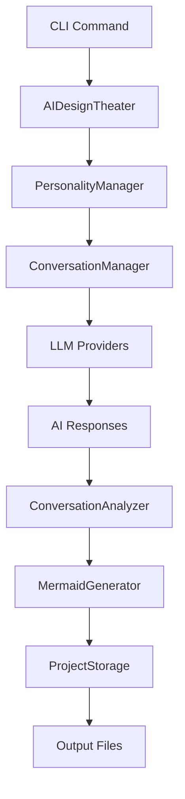

# 🏗️ AI Design Theater Architecture

## Overview

AI Design Theater is a modular Python application that orchestrates conversations between AI personalities to generate software design documents. The architecture is designed for extensibility and maintainability.

## Core Components

### 1. Models (`src/models.py`)
- **Data Models**: Pydantic models for type safety and validation
- **Key Classes**:
  - `PersonalityConfig`: AI personality configuration
  - `ConversationSession`: Complete conversation state
  - `DesignDocument`: Generated design output
  - `ConversationMessage`: Individual conversation messages

### 2. LLM Providers (`src/llm_providers/`)
- **Abstract Interface**: `BaseLLMProvider` for consistent API
- **Implementations**:
  - `OpenAIProvider`: OpenAI GPT integration
  - `AnthropicProvider`: Anthropic Claude integration
- **Extensible**: Easy to add new providers (Ollama, Cohere, etc.)

### 3. Personalities (`src/personalities/`)
- **Default Personalities**:
  - `Dreamer`: Creative, innovative (Anthropic Claude)
  - `Cost Cutter`: Pragmatic, efficient (OpenAI GPT-4)
- **Configurable**: System prompts, temperature, traits
- **Manager**: `PersonalityManager` handles provider routing

### 4. Conversation Management (`src/conversation/`)
- **ConversationManager**: Orchestrates AI-to-AI dialogue
- **ConversationAnalyzer**: Extracts insights from conversations
- **Features**:
  - Natural conclusion detection
  - Time/turn limits
  - Error handling and recovery

### 5. Diagram Generation (`src/diagram_generation/`)
- **MermaidGenerator**: Creates architecture diagrams
- **Smart Detection**: Chooses diagram type based on content
- **Supported Types**: Flowcharts, sequence diagrams, class diagrams

### 6. Storage (`src/storage/`)
- **ProjectStorage**: File management and organization
- **Outputs**:
  - Structured JSON data
  - Markdown documents
  - Mermaid diagrams
  - Conversation transcripts

### 7. Configuration (`src/config.py`)
- **Environment Variables**: API keys, settings
- **Validation**: Ensures proper setup
- **Defaults**: Sensible configuration values

## Application Flow

## Key Design Decisions

### 1. **Modular Architecture**
- **Why**: Easy to extend with new personalities, providers, or features
- **How**: Clear separation of concerns, dependency injection
- **Benefits**: Testable, maintainable, scalable

### 2. **Provider Abstraction**
- **Why**: Support multiple LLM providers with different strengths
- **How**: Abstract base class with consistent interface
- **Benefits**: Flexibility, vendor independence, cost optimization

### 3. **Pydantic Models**
- **Why**: Type safety, validation, serialization
- **How**: All data structures use Pydantic BaseModel
- **Benefits**: Runtime validation, IDE support, documentation

### 4. **Async/Await Pattern**
- **Why**: Efficient handling of API calls and I/O
- **How**: Async methods throughout the application
- **Benefits**: Better performance, concurrent operations

### 5. **Configuration Management**
- **Why**: Environment-specific settings, security
- **How**: Environment variables with defaults
- **Benefits**: Secure API key handling, deployment flexibility

## Extension Points

### Adding New Personalities
1. Create personality configuration in `src/personalities/`
2. Define system prompts and behavioral traits
3. Choose appropriate LLM provider
4. Register with PersonalityManager

### Adding New LLM Providers
1. Implement `BaseLLMProvider` interface
2. Handle provider-specific API calls
3. Add to `PersonalityManager` factory
4. Update configuration models

### Adding New Diagram Types
1. Extend `MermaidGenerator` with new diagram logic
2. Add content analysis patterns
3. Implement diagram-specific generation
4. Test with various conversation types

### Adding New Output Formats
1. Extend `ProjectStorage` with new format handlers
2. Implement format-specific serialization
3. Add CLI commands for new formats
4. Update documentation

## GitHub Actions Integration

### Daily Automation Workflow
- **Trigger**: Scheduled (daily) or manual
- **Process**:
  1. Generate or select design topic
  2. Run AI conversation
  3. Generate design documents
  4. Commit results to repository
  5. Create GitHub issue with summary

### Security Considerations
- API keys stored as GitHub Secrets
- No sensitive data in repository
- Configurable content filtering

## Testing Strategy

### Unit Tests
- Model validation
- Provider interfaces
- Conversation analysis
- Diagram generation

### Integration Tests
- End-to-end conversation flows
- File generation and storage
- API provider connections

### Manual Testing
- CLI command validation
- Web viewer functionality
- GitHub Actions workflow

## Performance Considerations

### API Rate Limiting
- Built-in delays between requests
- Configurable rate limits per provider
- Error handling and retry logic

### Memory Management
- Streaming for large conversations
- Cleanup of temporary data
- Efficient file handling

### Scalability
- Stateless design for horizontal scaling
- Database integration ready
- Caching opportunities identified

## Future Enhancements

### Planned Features
1. **Custom Personalities**: User-defined AI personalities
2. **Idea Generation**: Automated topic sourcing
3. **Team Integration**: Slack/Discord bots
4. **Enhanced Diagrams**: Multiple diagram types
5. **Design Templates**: Reusable patterns

### Technical Improvements
1. **Database Integration**: Persistent storage
2. **Real-time UI**: WebSocket-based interface
3. **API Server**: REST API for integrations
4. **Monitoring**: Observability and metrics
5. **Caching**: Response caching for efficiency

## Dependencies

### Core Dependencies
- `openai`: OpenAI API client
- `anthropic`: Anthropic API client
- `pydantic`: Data validation and serialization
- `python-dotenv`: Environment variable management
- `aiohttp`: Async HTTP client

### CLI Dependencies
- `typer`: Command-line interface
- `rich`: Terminal formatting and progress

### Development Dependencies
- `pytest`: Testing framework
- `pytest-asyncio`: Async testing support

## Deployment Options

### Local Development
- Direct Python execution
- Virtual environment recommended
- Environment variables via `.env` file

### GitHub Actions
- Automated daily execution
- Secrets management for API keys
- Artifact storage in repository

### Docker (Future)
- Containerized deployment
- Environment isolation
- Scalable execution

### Cloud Functions (Future)
- Serverless execution
- Event-driven triggers
- Cost-effective scaling