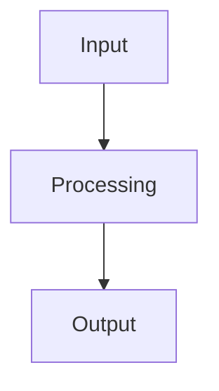

# 📚 AI Design Theater Project Index

A consolidated directory of all generated design sessions. Each entry links to its project folder and includes a quick diagram preview (raw Mermaid) and creation timestamp extracted from the design document.

> This file can be regenerated automatically by the daily workflow to stay current.

## Projects

### 2025-08-08 — Design a simple todo app
- Folder: `projects/20250808_185029_Design_a_simple_todo_app`
- Design: [DESIGN.md](projects/20250808_185029_Design_a_simple_todo_app/DESIGN.md) | Diagram: [diagram.mmd](projects/20250808_185029_Design_a_simple_todo_app/diagram.mmd) | Conversation: [conversation.md](projects/20250808_185029_Design_a_simple_todo_app/conversation.md)

### 2025-08-08 — Design a simple calculator app
- Folder: `projects/20250808_185145_Design_a_simple_calculator_app`
- Design: [DESIGN.md](projects/20250808_185145_Design_a_simple_calculator_app/DESIGN.md) | Diagram: [diagram.mmd](projects/20250808_185145_Design_a_simple_calculator_app/diagram.mmd) | Conversation: [conversation.md](projects/20250808_185145_Design_a_simple_calculator_app/conversation.md)

---

### Automation Notes
- The daily workflow can be extended to regenerate this file after each run.
- To update README's Latest Daily Design section, a small script in the workflow can replace the placeholder block.

