# 📚 AI Design Theater Project Index

Automatically generated list of all projects.

### 2025-08-09 04:41:38.368271 — Design a secure multi-tenant SaaS platform
- Folder: `projects/20250809_044030_Design_a_secure_multi-tenant_SaaS_platform`
- Design: [DESIGN.md](projects/20250809_044030_Design_a_secure_multi-tenant_SaaS_platform/DESIGN.md) | Diagram: [diagram.mmd](projects/20250809_044030_Design_a_secure_multi-tenant_SaaS_platform/diagram.mmd) | Conversation: [conversation.md](projects/20250809_044030_Design_a_secure_multi-tenant_SaaS_platform/conversation.md)
```mermaidsequenceDiagram
    participant User
    participant System
    participant Database

    User->>+System: Request
    System->>+Database: Query
    Database-->>-System: Response
    System-->>-User: Result
```

### 2025-08-09 04:46:32.218098 — Build a real-time chat application with encryption
- Folder: `projects/20250809_044526_Build_a_real-time_chat_application_with_encryption`
- Design: [DESIGN.md](projects/20250809_044526_Build_a_real-time_chat_application_with_encryption/DESIGN.md) | Diagram: [diagram.mmd](projects/20250809_044526_Build_a_real-time_chat_application_with_encryption/diagram.mmd) | Conversation: [conversation.md](projects/20250809_044526_Build_a_real-time_chat_application_with_encryption/conversation.md)
```mermaidflowchart TD
    A1[Start]
    A2[Process]
    A3{Decision}
    A4[End]
    A1 --> A2
    A2 --> A3
    A3 --> A4
```

### 2025-08-09 05:02:27.083418 — Design a distributed caching system
- Folder: `projects/20250809_050122_Design_a_distributed_caching_system`
- Design: [DESIGN.md](projects/20250809_050122_Design_a_distributed_caching_system/DESIGN.md) | Diagram: [diagram.mmd](projects/20250809_050122_Design_a_distributed_caching_system/diagram.mmd) | Conversation: [conversation.md](projects/20250809_050122_Design_a_distributed_caching_system/conversation.md)
```mermaidflowchart TD
    A1[Start]
    A2[Process]
    A3{Decision}
    A4[End]
    A1 --> A2
    A2 --> A3
    A3 --> A4
```

### 2025-08-09 05:08:28.318125 — Design a content delivery network architecture
- Folder: `projects/20250809_050726_Design_a_content_delivery_network_architecture`
- Design: [DESIGN.md](projects/20250809_050726_Design_a_content_delivery_network_architecture/DESIGN.md) | Diagram: [diagram.mmd](projects/20250809_050726_Design_a_content_delivery_network_architecture/diagram.mmd) | SVG: [diagram.svg](projects/20250809_050726_Design_a_content_delivery_network_architecture/diagram.svg) | PNG: [diagram.png](projects/20250809_050726_Design_a_content_delivery_network_architecture/diagram.png) | Conversation: [conversation.md](projects/20250809_050726_Design_a_content_delivery_network_architecture/conversation.md)
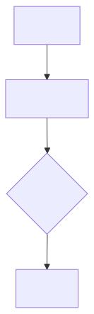


### 2025-08-09 09:07:57.383672 — Design a secure multi-tenant SaaS platform
- Folder: `projects/20250809_090644_Design_a_secure_multi-tenant_SaaS_platform`
- Design: [DESIGN.md](projects/20250809_090644_Design_a_secure_multi-tenant_SaaS_platform/DESIGN.md) | Diagram: [diagram.mmd](projects/20250809_090644_Design_a_secure_multi-tenant_SaaS_platform/diagram.mmd) | SVG: [diagram.svg](projects/20250809_090644_Design_a_secure_multi-tenant_SaaS_platform/diagram.svg) | PNG: [diagram.png](projects/20250809_090644_Design_a_secure_multi-tenant_SaaS_platform/diagram.png) | Conversation: [conversation.md](projects/20250809_090644_Design_a_secure_multi-tenant_SaaS_platform/conversation.md)


### 2025-08-10 09:07:46.078485 — Create a real-time fraud detection system
- Folder: `projects/20250810_090638_Create_a_real-time_fraud_detection_system`
- Design: [DESIGN.md](projects/20250810_090638_Create_a_real-time_fraud_detection_system/DESIGN.md) | Diagram: [diagram.mmd](projects/20250810_090638_Create_a_real-time_fraud_detection_system/diagram.mmd) | SVG: [diagram.svg](projects/20250810_090638_Create_a_real-time_fraud_detection_system/diagram.svg) | PNG: [diagram.png](projects/20250810_090638_Create_a_real-time_fraud_detection_system/diagram.png) | Conversation: [conversation.md](projects/20250810_090638_Create_a_real-time_fraud_detection_system/conversation.md)
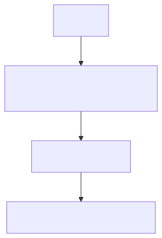


### 2025-08-11 09:11:05.856146 — Design a distributed caching system
- Folder: `projects/20250811_090951_Design_a_distributed_caching_system`
- Design: [DESIGN.md](projects/20250811_090951_Design_a_distributed_caching_system/DESIGN.md) | Diagram: [diagram.mmd](projects/20250811_090951_Design_a_distributed_caching_system/diagram.mmd) | SVG: [diagram.svg](projects/20250811_090951_Design_a_distributed_caching_system/diagram.svg) | PNG: [diagram.png](projects/20250811_090951_Design_a_distributed_caching_system/diagram.png) | Conversation: [conversation.md](projects/20250811_090951_Design_a_distributed_caching_system/conversation.md)


### 2025-08-12 09:09:17.249841 — Build a GraphQL API gateway
- Folder: `projects/20250812_090814_Build_a_GraphQL_API_gateway`
- Design: [DESIGN.md](projects/20250812_090814_Build_a_GraphQL_API_gateway/DESIGN.md) | Diagram: [diagram.mmd](projects/20250812_090814_Build_a_GraphQL_API_gateway/diagram.mmd) | SVG: [diagram.svg](projects/20250812_090814_Build_a_GraphQL_API_gateway/diagram.svg) | PNG: [diagram.png](projects/20250812_090814_Build_a_GraphQL_API_gateway/diagram.png) | Conversation: [conversation.md](projects/20250812_090814_Build_a_GraphQL_API_gateway/conversation.md)


### 2025-08-12 23:15:44.213205 — Test diagram generation
- Folder: `projects/20250812_231536_Test_diagram_generation`
- Design: [DESIGN.md](projects/20250812_231536_Test_diagram_generation/DESIGN.md) | Diagram: [diagram.mmd](projects/20250812_231536_Test_diagram_generation/diagram.mmd) | Conversation: [conversation.md](projects/20250812_231536_Test_diagram_generation/conversation.md)
```mermaidgraph TB

    %% Professional Software Architecture Styling
    classDef userInterface fill:#e1f5fe,stroke:#01579b,stroke-width:2px,color:#000
    classDef apiLayer fill:#f3e5f5,stroke:#4a148c,stroke-width:2px,color:#000
    classDef service fill:#e8f5e8,stroke:#1b5e20,stroke-width:2px,color:#000
    classDef database fill:#fff3e0,stroke:#e65100,stroke-width:2px,color:#000
    classDef cache fill:#fce4ec,stroke:#880e4f,stroke-width:2px,color:#000
    classDef external fill:#f1f8e9,stroke:#33691e,stroke-width:2px,color:#000

    lb1((Load Balancer - NGINX))
    api_gateway[API Gateway - Kong]
    test_diagram_service[Test Diagram Generation Service - Spring Boot]
    user_service[User Management Service - Node.js]
    notification_service[Notification Service - RabbitMQ]
    database[(User Data Database - PostgreSQL)]
    cache{{(Cache Layer - Redis)}}
    message_queue[[Message Queue - Kafka]]
    external_api[[External Diagram API - REST]]

    lb1 -->|HTTP request| api_gateway
    api_gateway -->|HTTP request| user_service
    api_gateway -->|HTTP request| test_diagram_service
    user_service -->|SQL query| database
    test_diagram_service -->|HTTP request| external_api
    test_diagram_service -->|Message| notification_service
    notification_service -->|Publish message| message_queue
    message_queue -->|Consume message| user_service
    user_service -->|Cache user data| cache
    cache -->|Retrieve cached data| user_service

    class lb1 userInterface
    class api_gateway apiLayer
    class test_diagram_service service
    class user_service service
    class notification_service service
    class database database
    class cache cache
    class message_queue external
    class external_api external
```

### 2025-08-13 03:40:42.585714 — Create a real-time collaborative code editor
- Folder: `projects/20250813_034007_Create_a_real-time_collaborative_code_editor`
- Design: [DESIGN.md](projects/20250813_034007_Create_a_real-time_collaborative_code_editor/DESIGN.md) | Diagram: [diagram.mmd](projects/20250813_034007_Create_a_real-time_collaborative_code_editor/diagram.mmd) | SVG: [diagram.svg](projects/20250813_034007_Create_a_real-time_collaborative_code_editor/diagram.svg) | PNG: [diagram.png](projects/20250813_034007_Create_a_real-time_collaborative_code_editor/diagram.png) | Conversation: [conversation.md](projects/20250813_034007_Create_a_real-time_collaborative_code_editor/conversation.md)
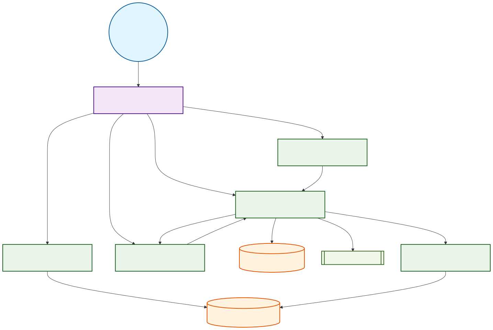


### 2025-08-13 04:25:46.804999 — Build a real-time chat application with encryption
- Folder: `projects/20250813_042429_Build_a_real-time_chat_application_with_encryption`
- Design: [DESIGN.md](projects/20250813_042429_Build_a_real-time_chat_application_with_encryption/DESIGN.md) | Diagram: [diagram.mmd](projects/20250813_042429_Build_a_real-time_chat_application_with_encryption/diagram.mmd) | SVG: [diagram.svg](projects/20250813_042429_Build_a_real-time_chat_application_with_encryption/diagram.svg) | PNG: [diagram.png](projects/20250813_042429_Build_a_real-time_chat_application_with_encryption/diagram.png) | Conversation: [conversation.md](projects/20250813_042429_Build_a_real-time_chat_application_with_encryption/conversation.md)
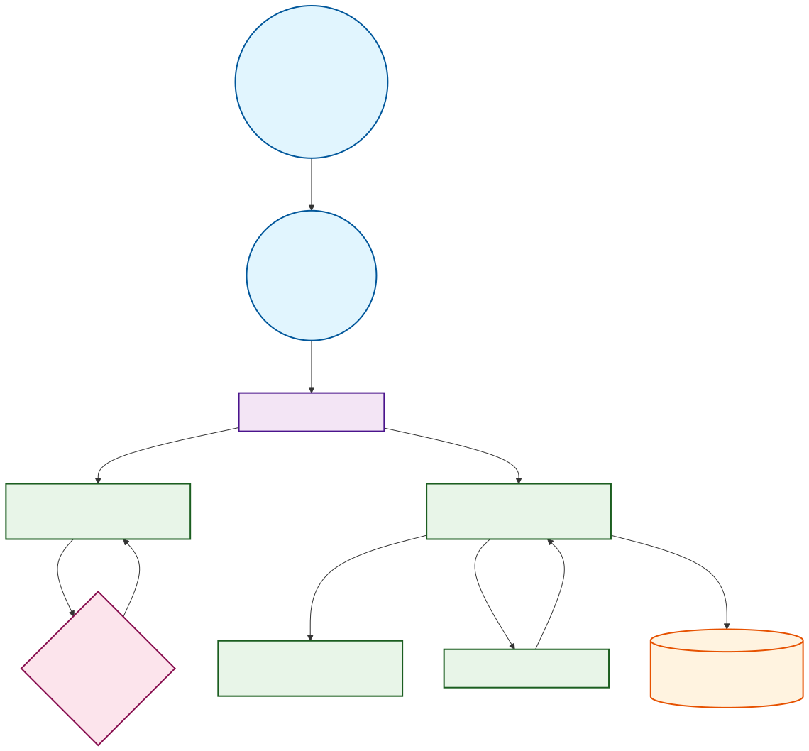


### 2025-08-13 04:38:40.453919 — Design a distributed caching system
- Folder: `projects/20250813_043804_Design_a_distributed_caching_system`
- Design: [DESIGN.md](projects/20250813_043804_Design_a_distributed_caching_system/DESIGN.md) | Diagram: [diagram.mmd](projects/20250813_043804_Design_a_distributed_caching_system/diagram.mmd) | SVG: [diagram.svg](projects/20250813_043804_Design_a_distributed_caching_system/diagram.svg) | PNG: [diagram.png](projects/20250813_043804_Design_a_distributed_caching_system/diagram.png) | Conversation: [conversation.md](projects/20250813_043804_Design_a_distributed_caching_system/conversation.md)
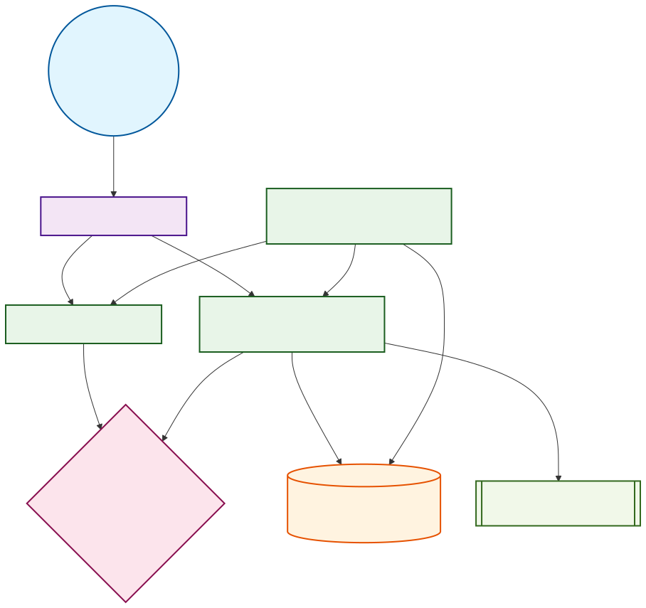


### 2025-08-13 09:09:09.734740 — Design a secure multi-tenant SaaS platform
- Folder: `projects/20250813_090833_Design_a_secure_multi-tenant_SaaS_platform`
- Design: [DESIGN.md](projects/20250813_090833_Design_a_secure_multi-tenant_SaaS_platform/DESIGN.md) | Diagram: [diagram.mmd](projects/20250813_090833_Design_a_secure_multi-tenant_SaaS_platform/diagram.mmd) | SVG: [diagram.svg](projects/20250813_090833_Design_a_secure_multi-tenant_SaaS_platform/diagram.svg) | PNG: [diagram.png](projects/20250813_090833_Design_a_secure_multi-tenant_SaaS_platform/diagram.png) | Conversation: [conversation.md](projects/20250813_090833_Design_a_secure_multi-tenant_SaaS_platform/conversation.md)
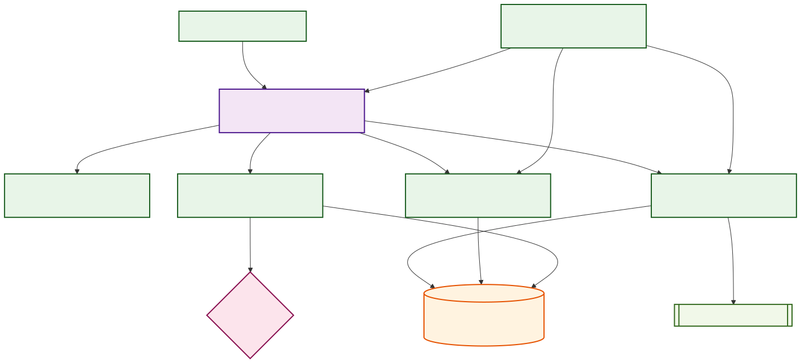


### 2025-08-14 09:09:25.384490 — Design a distributed caching system
- Folder: `projects/20250814_090838_Design_a_distributed_caching_system`
- Design: [DESIGN.md](projects/20250814_090838_Design_a_distributed_caching_system/DESIGN.md) | Diagram: [diagram.mmd](projects/20250814_090838_Design_a_distributed_caching_system/diagram.mmd) | SVG: [diagram.svg](projects/20250814_090838_Design_a_distributed_caching_system/diagram.svg) | PNG: [diagram.png](projects/20250814_090838_Design_a_distributed_caching_system/diagram.png) | Conversation: [conversation.md](projects/20250814_090838_Design_a_distributed_caching_system/conversation.md)
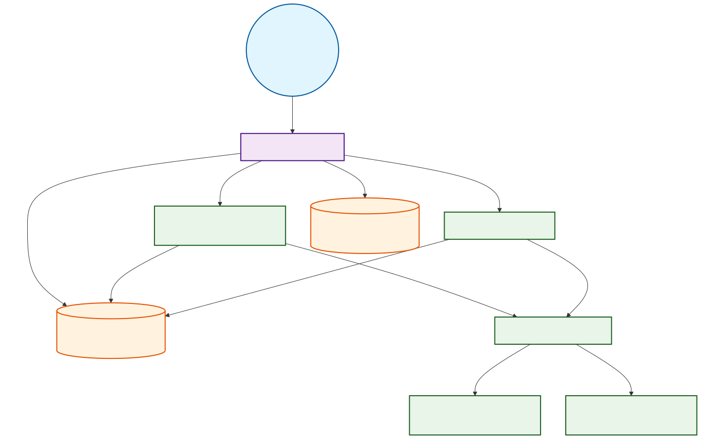


### 2025-08-15 09:07:46.930533 — Create a real-time collaborative code editor
- Folder: `projects/20250815_090658_Create_a_real-time_collaborative_code_editor`
- Design: [DESIGN.md](projects/20250815_090658_Create_a_real-time_collaborative_code_editor/DESIGN.md) | Diagram: [diagram.mmd](projects/20250815_090658_Create_a_real-time_collaborative_code_editor/diagram.mmd) | SVG: [diagram.svg](projects/20250815_090658_Create_a_real-time_collaborative_code_editor/diagram.svg) | PNG: [diagram.png](projects/20250815_090658_Create_a_real-time_collaborative_code_editor/diagram.png) | Conversation: [conversation.md](projects/20250815_090658_Create_a_real-time_collaborative_code_editor/conversation.md)
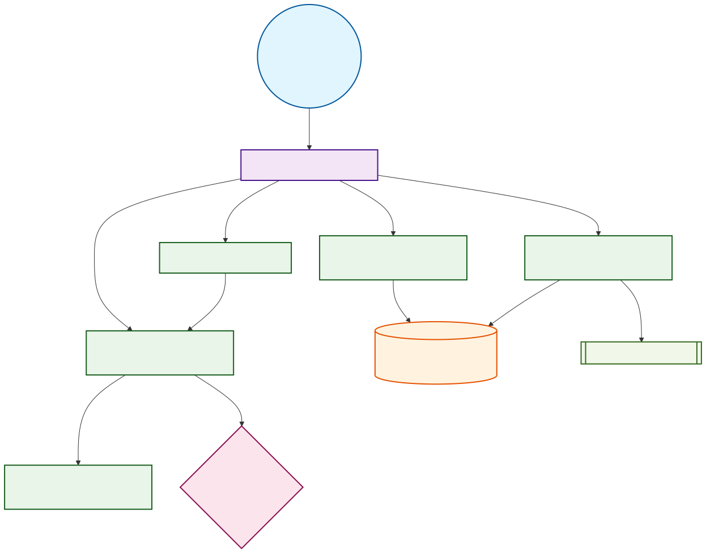


### 2025-08-16 09:07:07.870956 — Design a microservices monitoring platform
- Folder: `projects/20250816_090635_Design_a_microservices_monitoring_platform`
- Design: [DESIGN.md](projects/20250816_090635_Design_a_microservices_monitoring_platform/DESIGN.md) | Diagram: [diagram.mmd](projects/20250816_090635_Design_a_microservices_monitoring_platform/diagram.mmd) | SVG: [diagram.svg](projects/20250816_090635_Design_a_microservices_monitoring_platform/diagram.svg) | PNG: [diagram.png](projects/20250816_090635_Design_a_microservices_monitoring_platform/diagram.png) | Conversation: [conversation.md](projects/20250816_090635_Design_a_microservices_monitoring_platform/conversation.md)
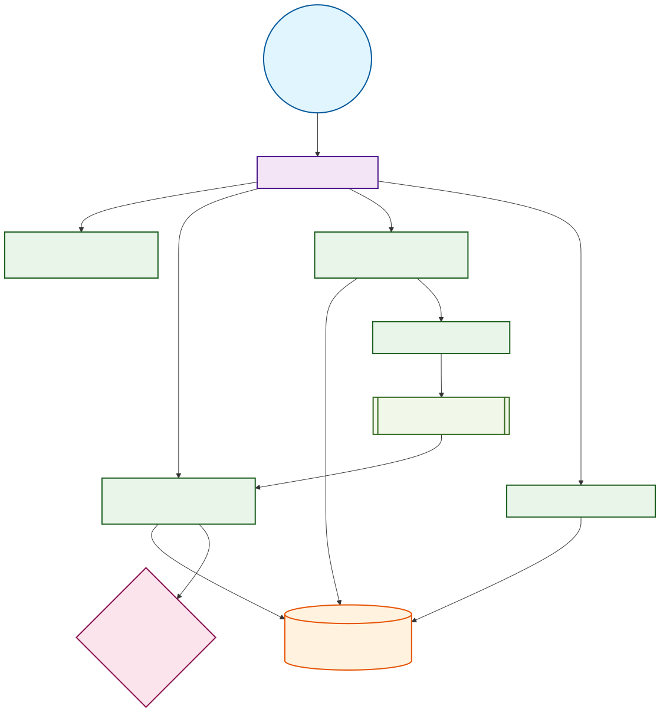


### 2025-08-17 00:10:05.840225 — Design a secure multi-tenant SaaS platform
- Folder: `projects/20250817_000923_Design_a_secure_multi-tenant_SaaS_platform`
- Design: [DESIGN.md](projects/20250817_000923_Design_a_secure_multi-tenant_SaaS_platform/DESIGN.md) | Diagram: [diagram.mmd](projects/20250817_000923_Design_a_secure_multi-tenant_SaaS_platform/diagram.mmd) | SVG: [diagram.svg](projects/20250817_000923_Design_a_secure_multi-tenant_SaaS_platform/diagram.svg) | PNG: [diagram.png](projects/20250817_000923_Design_a_secure_multi-tenant_SaaS_platform/diagram.png) | Conversation: [conversation.md](projects/20250817_000923_Design_a_secure_multi-tenant_SaaS_platform/conversation.md)


### 2025-08-17 09:07:11.416009 — Design a distributed caching system
- Folder: `projects/20250817_090627_Design_a_distributed_caching_system`
- Design: [DESIGN.md](projects/20250817_090627_Design_a_distributed_caching_system/DESIGN.md) | Diagram: [diagram.mmd](projects/20250817_090627_Design_a_distributed_caching_system/diagram.mmd) | SVG: [diagram.svg](projects/20250817_090627_Design_a_distributed_caching_system/diagram.svg) | PNG: [diagram.png](projects/20250817_090627_Design_a_distributed_caching_system/diagram.png) | Conversation: [conversation.md](projects/20250817_090627_Design_a_distributed_caching_system/conversation.md)
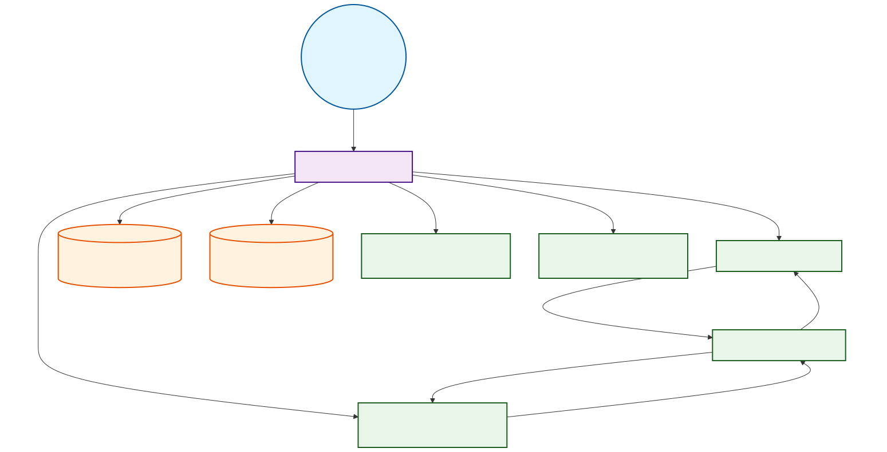


### 2025-08-18 09:11:11.925086 — Design a microservices monitoring platform
- Folder: `projects/20250818_090944_Design_a_microservices_monitoring_platform`
- Design: [DESIGN.md](projects/20250818_090944_Design_a_microservices_monitoring_platform/DESIGN.md) | Diagram: [diagram.mmd](projects/20250818_090944_Design_a_microservices_monitoring_platform/diagram.mmd) | SVG: [diagram.svg](projects/20250818_090944_Design_a_microservices_monitoring_platform/diagram.svg) | PNG: [diagram.png](projects/20250818_090944_Design_a_microservices_monitoring_platform/diagram.png) | Conversation: [conversation.md](projects/20250818_090944_Design_a_microservices_monitoring_platform/conversation.md)
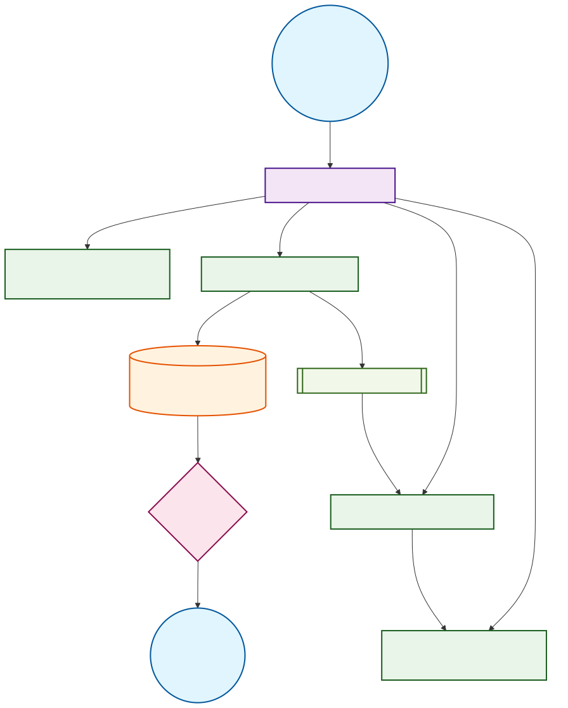


### 2025-08-19 09:08:03.510180 — Design a distributed caching system
- Folder: `projects/20250819_090707_Design_a_distributed_caching_system`
- Design: [DESIGN.md](projects/20250819_090707_Design_a_distributed_caching_system/DESIGN.md) | Diagram: [diagram.mmd](projects/20250819_090707_Design_a_distributed_caching_system/diagram.mmd) | SVG: [diagram.svg](projects/20250819_090707_Design_a_distributed_caching_system/diagram.svg) | PNG: [diagram.png](projects/20250819_090707_Design_a_distributed_caching_system/diagram.png) | Conversation: [conversation.md](projects/20250819_090707_Design_a_distributed_caching_system/conversation.md)
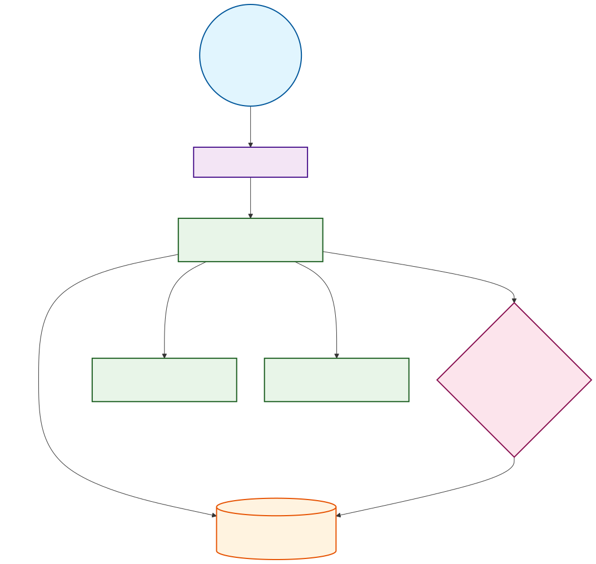


### 2025-08-20 09:08:25.649429 — Design a content delivery network architecture
- Folder: `projects/20250820_090741_Design_a_content_delivery_network_architecture`
- Design: [DESIGN.md](projects/20250820_090741_Design_a_content_delivery_network_architecture/DESIGN.md) | Diagram: [diagram.mmd](projects/20250820_090741_Design_a_content_delivery_network_architecture/diagram.mmd) | SVG: [diagram.svg](projects/20250820_090741_Design_a_content_delivery_network_architecture/diagram.svg) | PNG: [diagram.png](projects/20250820_090741_Design_a_content_delivery_network_architecture/diagram.png) | Conversation: [conversation.md](projects/20250820_090741_Design_a_content_delivery_network_architecture/conversation.md)
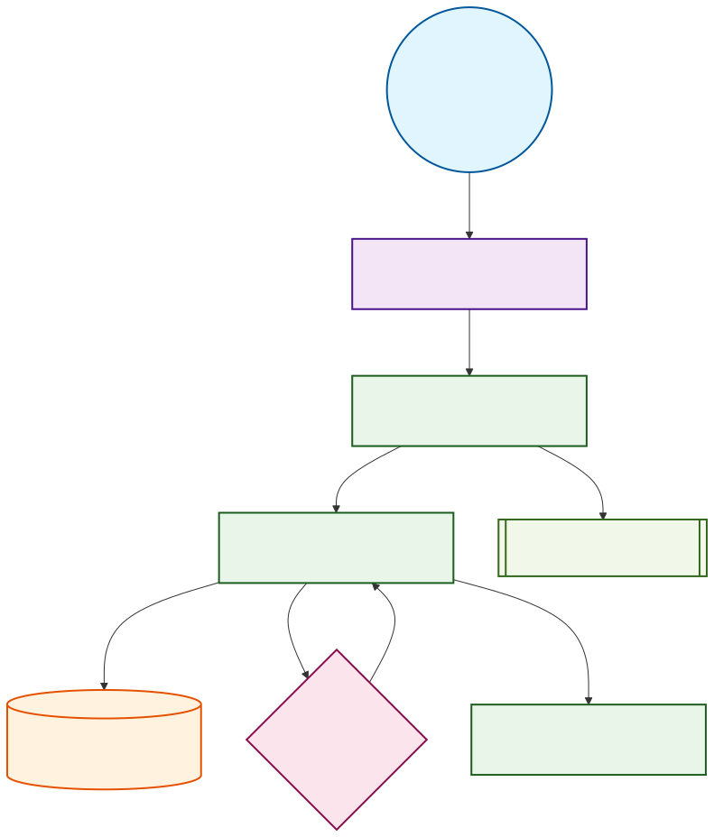


### 2025-08-21 09:08:27.356792 — Build a real-time chat application with encryption
- Folder: `projects/20250821_090748_Build_a_real-time_chat_application_with_encryption`
- Design: [DESIGN.md](projects/20250821_090748_Build_a_real-time_chat_application_with_encryption/DESIGN.md) | Diagram: [diagram.mmd](projects/20250821_090748_Build_a_real-time_chat_application_with_encryption/diagram.mmd) | SVG: [diagram.svg](projects/20250821_090748_Build_a_real-time_chat_application_with_encryption/diagram.svg) | PNG: [diagram.png](projects/20250821_090748_Build_a_real-time_chat_application_with_encryption/diagram.png) | Conversation: [conversation.md](projects/20250821_090748_Build_a_real-time_chat_application_with_encryption/conversation.md)
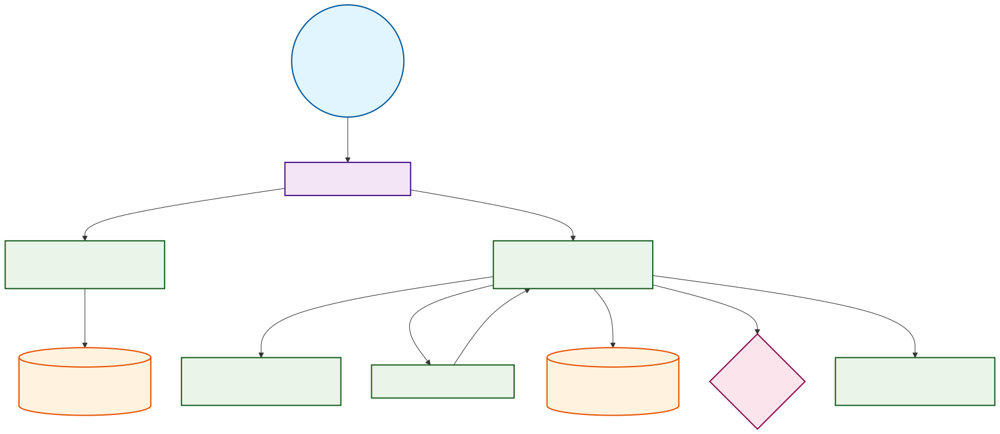


### 2025-08-22 09:07:58.536799 — Create a real-time fraud detection system
- Folder: `projects/20250822_090715_Create_a_real-time_fraud_detection_system`
- Design: [DESIGN.md](projects/20250822_090715_Create_a_real-time_fraud_detection_system/DESIGN.md) | Diagram: [diagram.mmd](projects/20250822_090715_Create_a_real-time_fraud_detection_system/diagram.mmd) | SVG: [diagram.svg](projects/20250822_090715_Create_a_real-time_fraud_detection_system/diagram.svg) | PNG: [diagram.png](projects/20250822_090715_Create_a_real-time_fraud_detection_system/diagram.png) | Conversation: [conversation.md](projects/20250822_090715_Create_a_real-time_fraud_detection_system/conversation.md)
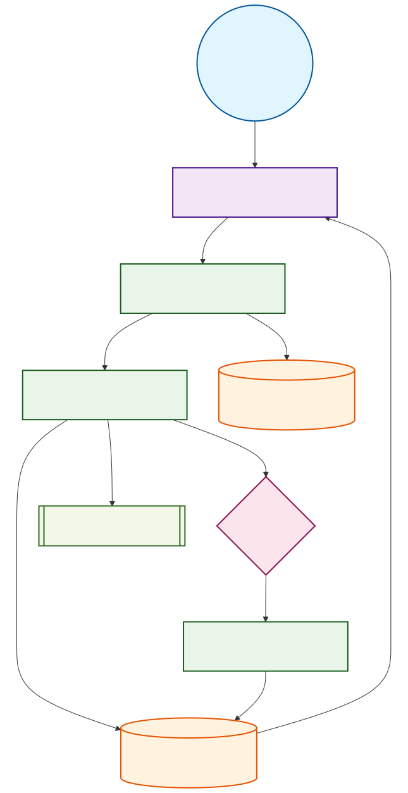


### 2025-08-23 09:06:43.567394 — Design a container orchestration strategy
- Folder: `projects/20250823_090605_Design_a_container_orchestration_strategy`
- Design: [DESIGN.md](projects/20250823_090605_Design_a_container_orchestration_strategy/DESIGN.md) | Diagram: [diagram.mmd](projects/20250823_090605_Design_a_container_orchestration_strategy/diagram.mmd) | SVG: [diagram.svg](projects/20250823_090605_Design_a_container_orchestration_strategy/diagram.svg) | PNG: [diagram.png](projects/20250823_090605_Design_a_container_orchestration_strategy/diagram.png) | Conversation: [conversation.md](projects/20250823_090605_Design_a_container_orchestration_strategy/conversation.md)
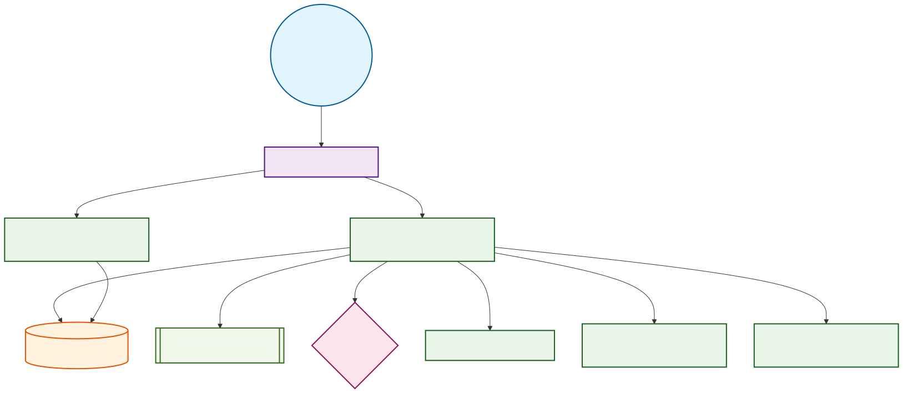


### 2025-08-24 09:07:28.179155 — Design a microservices monitoring platform
- Folder: `projects/20250824_090618_Design_a_microservices_monitoring_platform`
- Design: [DESIGN.md](projects/20250824_090618_Design_a_microservices_monitoring_platform/DESIGN.md) | Diagram: [diagram.mmd](projects/20250824_090618_Design_a_microservices_monitoring_platform/diagram.mmd) | SVG: [diagram.svg](projects/20250824_090618_Design_a_microservices_monitoring_platform/diagram.svg) | PNG: [diagram.png](projects/20250824_090618_Design_a_microservices_monitoring_platform/diagram.png) | Conversation: [conversation.md](projects/20250824_090618_Design_a_microservices_monitoring_platform/conversation.md)
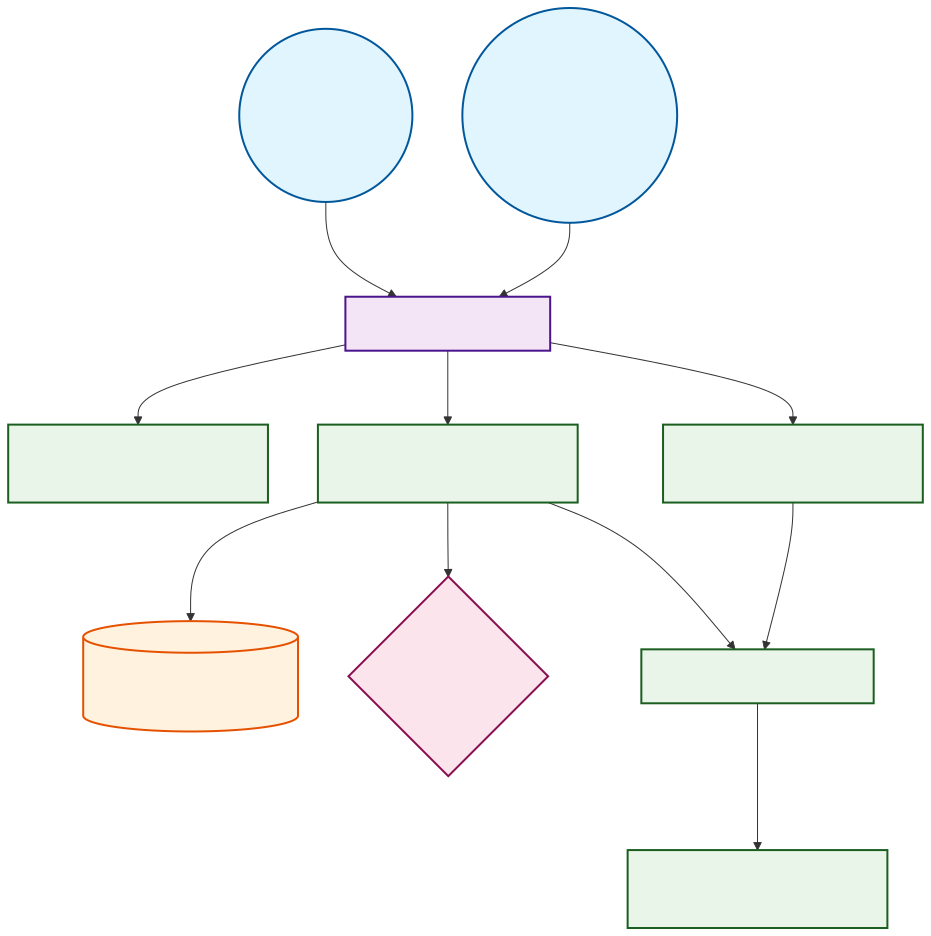


### 2025-08-25 09:08:44.636512 — Design a content delivery network architecture
- Folder: `projects/20250825_090752_Design_a_content_delivery_network_architecture`
- Design: [DESIGN.md](projects/20250825_090752_Design_a_content_delivery_network_architecture/DESIGN.md) | Diagram: [diagram.mmd](projects/20250825_090752_Design_a_content_delivery_network_architecture/diagram.mmd) | SVG: [diagram.svg](projects/20250825_090752_Design_a_content_delivery_network_architecture/diagram.svg) | PNG: [diagram.png](projects/20250825_090752_Design_a_content_delivery_network_architecture/diagram.png) | Conversation: [conversation.md](projects/20250825_090752_Design_a_content_delivery_network_architecture/conversation.md)
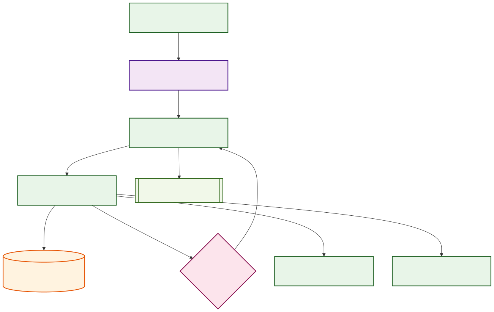


### 2025-08-27 09:07:59.563818 — Design a secure multi-tenant SaaS platform
- Folder: `projects/20250827_090705_Design_a_secure_multi-tenant_SaaS_platform`
- Design: [DESIGN.md](projects/20250827_090705_Design_a_secure_multi-tenant_SaaS_platform/DESIGN.md) | Diagram: [diagram.mmd](projects/20250827_090705_Design_a_secure_multi-tenant_SaaS_platform/diagram.mmd) | SVG: [diagram.svg](projects/20250827_090705_Design_a_secure_multi-tenant_SaaS_platform/diagram.svg) | PNG: [diagram.png](projects/20250827_090705_Design_a_secure_multi-tenant_SaaS_platform/diagram.png) | Conversation: [conversation.md](projects/20250827_090705_Design_a_secure_multi-tenant_SaaS_platform/conversation.md)
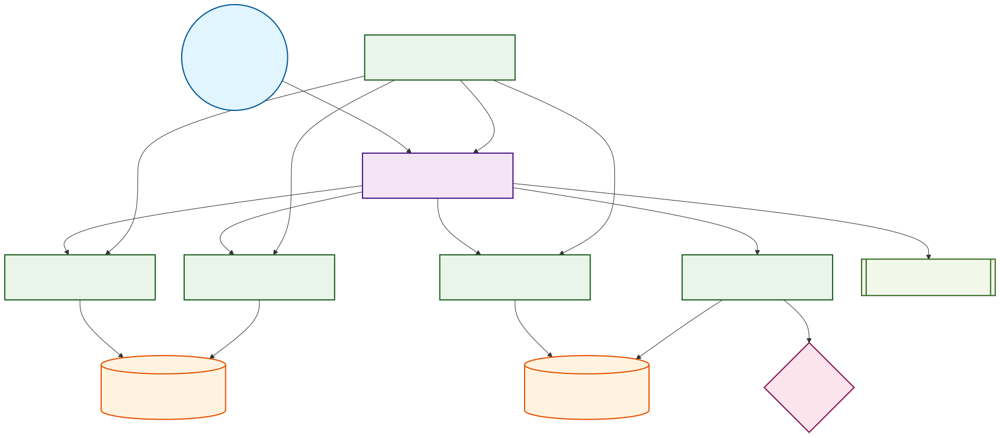


### 2025-08-28 09:08:25.797488 — Create a progressive web app for offline functiona
- Folder: `projects/20250828_090708_Create_a_progressive_web_app_for_offline_functiona`
- Design: [DESIGN.md](projects/20250828_090708_Create_a_progressive_web_app_for_offline_functiona/DESIGN.md) | Diagram: [diagram.mmd](projects/20250828_090708_Create_a_progressive_web_app_for_offline_functiona/diagram.mmd) | SVG: [diagram.svg](projects/20250828_090708_Create_a_progressive_web_app_for_offline_functiona/diagram.svg) | PNG: [diagram.png](projects/20250828_090708_Create_a_progressive_web_app_for_offline_functiona/diagram.png) | Conversation: [conversation.md](projects/20250828_090708_Create_a_progressive_web_app_for_offline_functiona/conversation.md)
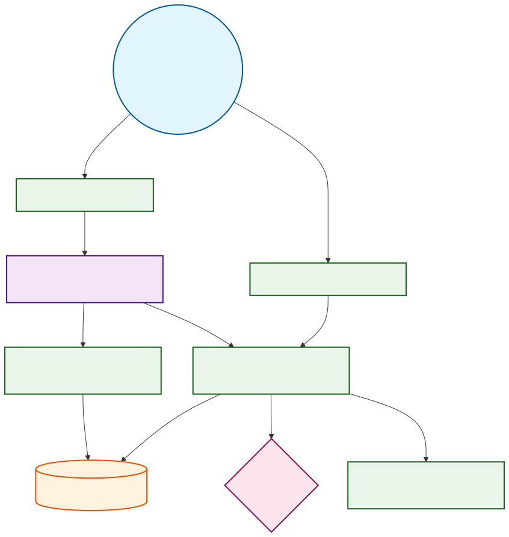


### 2025-08-29 09:08:06.852797 — Create a real-time collaborative code editor
- Folder: `projects/20250829_090700_Create_a_real-time_collaborative_code_editor`
- Design: [DESIGN.md](projects/20250829_090700_Create_a_real-time_collaborative_code_editor/DESIGN.md) | Diagram: [diagram.mmd](projects/20250829_090700_Create_a_real-time_collaborative_code_editor/diagram.mmd) | SVG: [diagram.svg](projects/20250829_090700_Create_a_real-time_collaborative_code_editor/diagram.svg) | PNG: [diagram.png](projects/20250829_090700_Create_a_real-time_collaborative_code_editor/diagram.png) | Conversation: [conversation.md](projects/20250829_090700_Create_a_real-time_collaborative_code_editor/conversation.md)
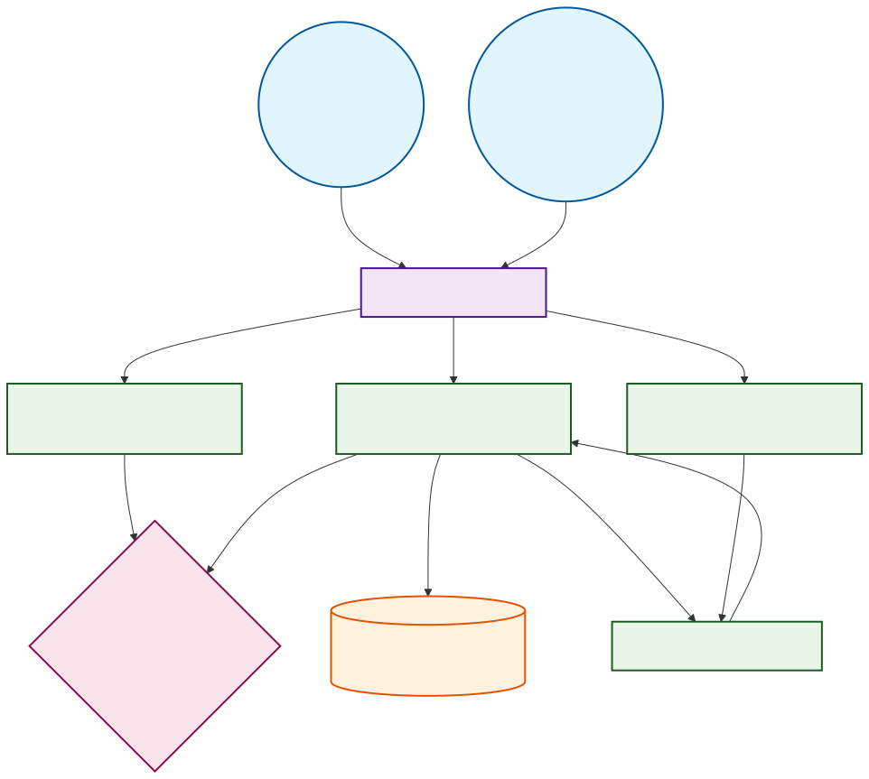


### 2025-08-30 09:07:46.518368 — Design a distributed caching system
- Folder: `projects/20250830_090629_Design_a_distributed_caching_system`
- Design: [DESIGN.md](projects/20250830_090629_Design_a_distributed_caching_system/DESIGN.md) | Diagram: [diagram.mmd](projects/20250830_090629_Design_a_distributed_caching_system/diagram.mmd) | SVG: [diagram.svg](projects/20250830_090629_Design_a_distributed_caching_system/diagram.svg) | PNG: [diagram.png](projects/20250830_090629_Design_a_distributed_caching_system/diagram.png) | Conversation: [conversation.md](projects/20250830_090629_Design_a_distributed_caching_system/conversation.md)
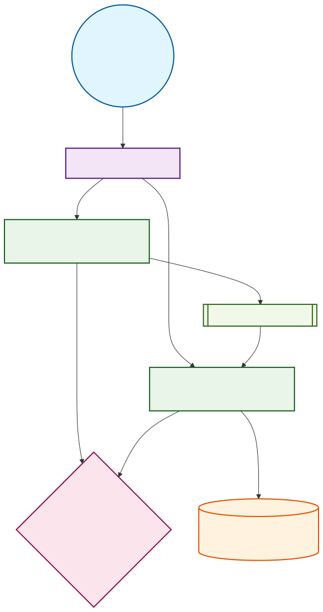


### 2025-08-31 09:07:12.900402 — Create a real-time fraud detection system
- Folder: `projects/20250831_090557_Create_a_real-time_fraud_detection_system`
- Design: [DESIGN.md](projects/20250831_090557_Create_a_real-time_fraud_detection_system/DESIGN.md) | Diagram: [diagram.mmd](projects/20250831_090557_Create_a_real-time_fraud_detection_system/diagram.mmd) | SVG: [diagram.svg](projects/20250831_090557_Create_a_real-time_fraud_detection_system/diagram.svg) | PNG: [diagram.png](projects/20250831_090557_Create_a_real-time_fraud_detection_system/diagram.png) | Conversation: [conversation.md](projects/20250831_090557_Create_a_real-time_fraud_detection_system/conversation.md)
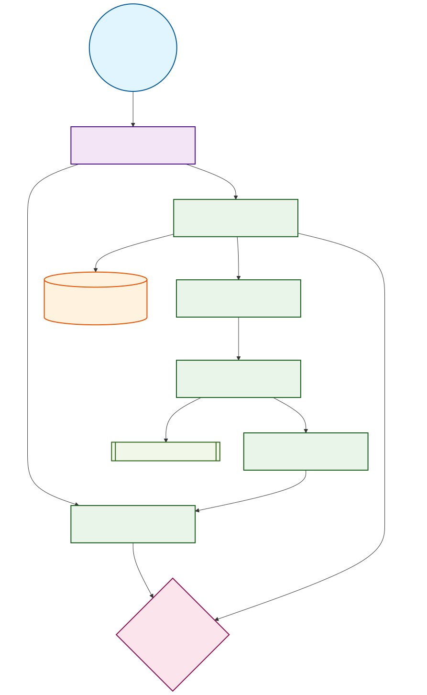


### 2025-09-01 09:09:58.349575 — Design a distributed caching system
- Folder: `projects/20250901_090829_Design_a_distributed_caching_system`
- Design: [DESIGN.md](projects/20250901_090829_Design_a_distributed_caching_system/DESIGN.md) | Diagram: [diagram.mmd](projects/20250901_090829_Design_a_distributed_caching_system/diagram.mmd) | SVG: [diagram.svg](projects/20250901_090829_Design_a_distributed_caching_system/diagram.svg) | PNG: [diagram.png](projects/20250901_090829_Design_a_distributed_caching_system/diagram.png) | Conversation: [conversation.md](projects/20250901_090829_Design_a_distributed_caching_system/conversation.md)
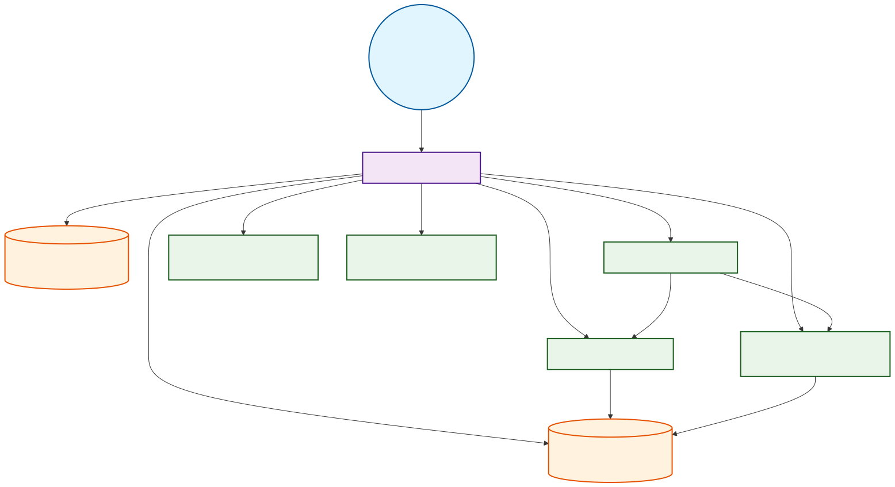


### 2025-09-02 09:08:56.582952 — Build a GraphQL API gateway
- Folder: `projects/20250902_090736_Build_a_GraphQL_API_gateway`
- Design: [DESIGN.md](projects/20250902_090736_Build_a_GraphQL_API_gateway/DESIGN.md) | Diagram: [diagram.mmd](projects/20250902_090736_Build_a_GraphQL_API_gateway/diagram.mmd) | SVG: [diagram.svg](projects/20250902_090736_Build_a_GraphQL_API_gateway/diagram.svg) | PNG: [diagram.png](projects/20250902_090736_Build_a_GraphQL_API_gateway/diagram.png) | Conversation: [conversation.md](projects/20250902_090736_Build_a_GraphQL_API_gateway/conversation.md)
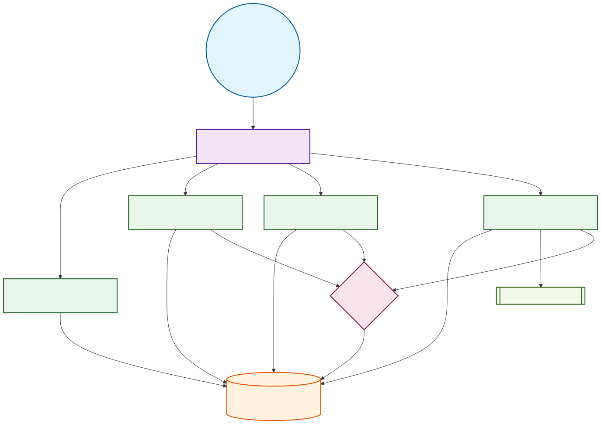


### 2025-09-03 09:08:12.289698 — Design a distributed caching system
- Folder: `projects/20250903_090644_Design_a_distributed_caching_system`
- Design: [DESIGN.md](projects/20250903_090644_Design_a_distributed_caching_system/DESIGN.md) | Diagram: [diagram.mmd](projects/20250903_090644_Design_a_distributed_caching_system/diagram.mmd) | SVG: [diagram.svg](projects/20250903_090644_Design_a_distributed_caching_system/diagram.svg) | PNG: [diagram.png](projects/20250903_090644_Design_a_distributed_caching_system/diagram.png) | Conversation: [conversation.md](projects/20250903_090644_Design_a_distributed_caching_system/conversation.md)
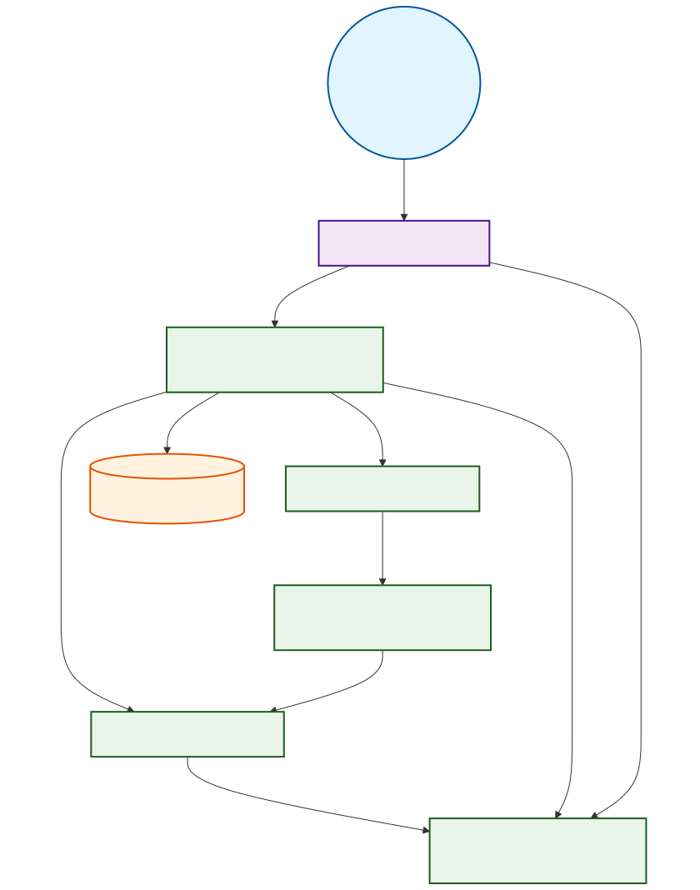


### 2025-09-04 09:07:36.300031 — Create a real-time collaborative code editor
- Folder: `projects/20250904_090650_Create_a_real-time_collaborative_code_editor`
- Design: [DESIGN.md](projects/20250904_090650_Create_a_real-time_collaborative_code_editor/DESIGN.md) | Diagram: [diagram.mmd](projects/20250904_090650_Create_a_real-time_collaborative_code_editor/diagram.mmd) | SVG: [diagram.svg](projects/20250904_090650_Create_a_real-time_collaborative_code_editor/diagram.svg) | PNG: [diagram.png](projects/20250904_090650_Create_a_real-time_collaborative_code_editor/diagram.png) | Conversation: [conversation.md](projects/20250904_090650_Create_a_real-time_collaborative_code_editor/conversation.md)
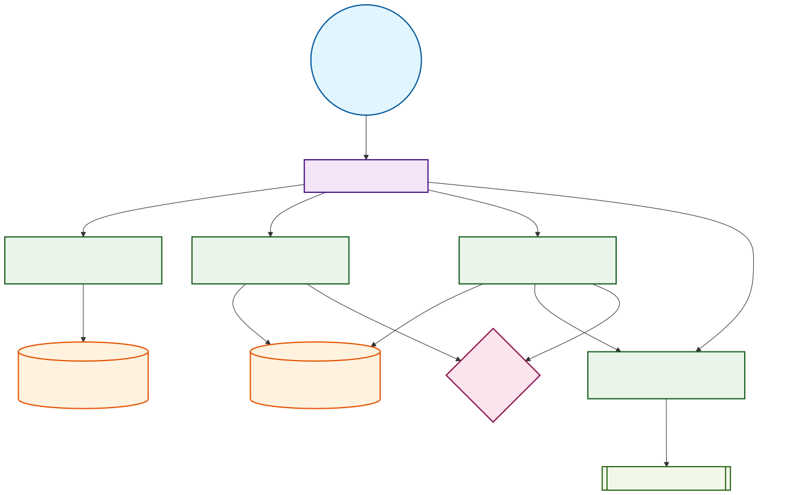


### 2025-09-05 09:08:28.244412 — Build a serverless image processing pipeline
- Folder: `projects/20250905_090704_Build_a_serverless_image_processing_pipeline`
- Design: [DESIGN.md](projects/20250905_090704_Build_a_serverless_image_processing_pipeline/DESIGN.md) | Diagram: [diagram.mmd](projects/20250905_090704_Build_a_serverless_image_processing_pipeline/diagram.mmd) | SVG: [diagram.svg](projects/20250905_090704_Build_a_serverless_image_processing_pipeline/diagram.svg) | PNG: [diagram.png](projects/20250905_090704_Build_a_serverless_image_processing_pipeline/diagram.png) | Conversation: [conversation.md](projects/20250905_090704_Build_a_serverless_image_processing_pipeline/conversation.md)
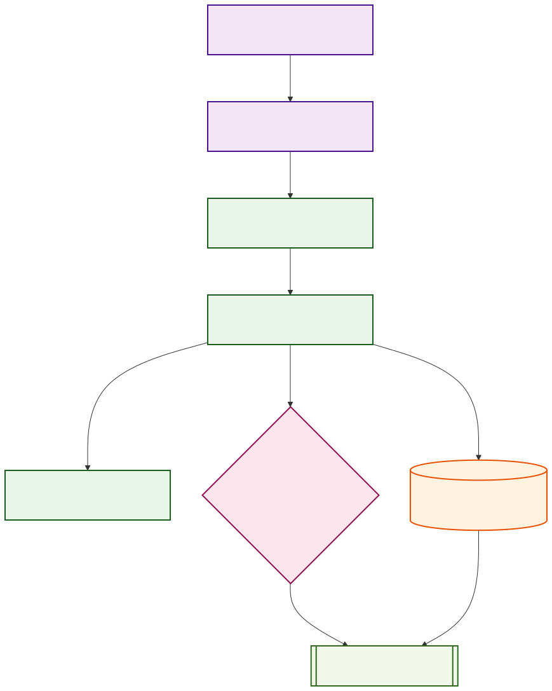


### 2025-09-06 09:06:42.461099 — Design a microservices monitoring platform
- Folder: `projects/20250906_090609_Design_a_microservices_monitoring_platform`
- Design: [DESIGN.md](projects/20250906_090609_Design_a_microservices_monitoring_platform/DESIGN.md) | Diagram: [diagram.mmd](projects/20250906_090609_Design_a_microservices_monitoring_platform/diagram.mmd) | SVG: [diagram.svg](projects/20250906_090609_Design_a_microservices_monitoring_platform/diagram.svg) | PNG: [diagram.png](projects/20250906_090609_Design_a_microservices_monitoring_platform/diagram.png) | Conversation: [conversation.md](projects/20250906_090609_Design_a_microservices_monitoring_platform/conversation.md)


### 2025-09-07 09:06:59.917648 — Design a secure multi-tenant SaaS platform
- Folder: `projects/20250907_090623_Design_a_secure_multi-tenant_SaaS_platform`
- Design: [DESIGN.md](projects/20250907_090623_Design_a_secure_multi-tenant_SaaS_platform/DESIGN.md) | Diagram: [diagram.mmd](projects/20250907_090623_Design_a_secure_multi-tenant_SaaS_platform/diagram.mmd) | SVG: [diagram.svg](projects/20250907_090623_Design_a_secure_multi-tenant_SaaS_platform/diagram.svg) | PNG: [diagram.png](projects/20250907_090623_Design_a_secure_multi-tenant_SaaS_platform/diagram.png) | Conversation: [conversation.md](projects/20250907_090623_Design_a_secure_multi-tenant_SaaS_platform/conversation.md)
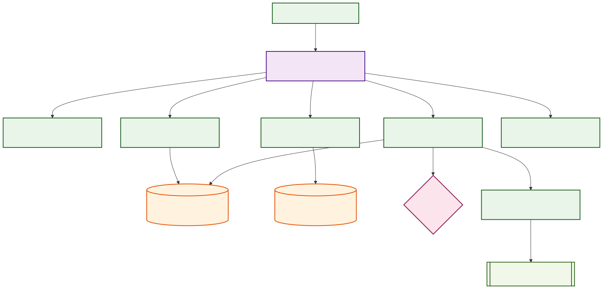
