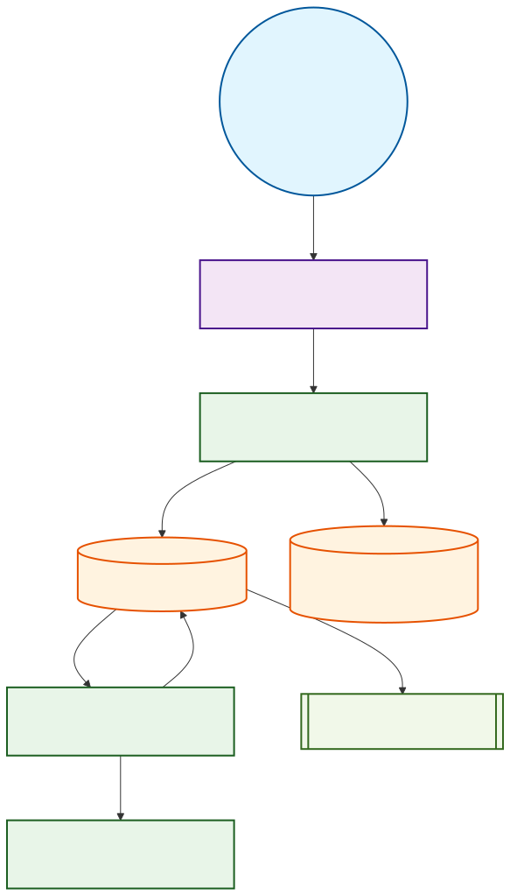

# 🎭 AI Design Theater

[](https://www.ashhill.dev/)

<!-- LATEST_DAILY_START -->
> ## 🌅 Latest Daily Design
> **Topic:** Build a serverless image processing pipeline
> **Created:** 2025-10-02 09:08:08.665503
> **Project:** 20251002_090710_Build_a_serverless_image_processing_pipeline
>
> 
>
> ## 💬 Design Conversation
>
> <details>
> <summary><strong>Click to view the AI-to-AI conversation that led to this design</strong></summary>
>
> <div style="background-color: #f6f8fa; border-radius: 6px; padding: 16px; margin: 16px 0;">
>
> <div style="margin: 12px 0; padding: 12px; border-left: 4px solid #d97706; background-color: #ffffff; border-radius: 4px;">
>
> **🧠 Idealist** *(anthropic: claude-3-5-sonnet-20240620)*
>
> Serverless? Are you f***ing kidding me?! We need raw POWER to process millions of images, not some weak-ass lambda functions that time out after 15 minutes. Have you even touched a GPU in your life? Why don't we just use an abacus while we're at it?
>
> </div>
>
> <div style="margin: 12px 0; padding: 12px; border-left: 4px solid #10a37f; background-color: #ffffff; border-radius: 4px;">
>
> **🤖 Cost Cutter** *(openai: gpt-4o-mini)*
>
> Oh, please, spare me the fairy tale of serverless magic! You think those functions won't rack up a bill faster than you can say "overhead"? And don't even get me started on storage—do you have any idea how much that "innovative" cloud storage will cost when we hit peak load? Are you prepared to explain to the CFO why we're hemorrhaging cash on a glorified file cabinet?
>
> </div>
>
> <div style="margin: 12px 0; padding: 12px; border-left: 4px solid #d97706; background-color: #ffffff; border-radius: 4px;">
>
> **🧠 Idealist** *(anthropic: claude-3-5-sonnet-20240620)*
>
> Storage? You fossil! We'll use a distributed blockchain ledger with IPFS for our image data! Scalable, secure, and cutting-edge! And for processing, how about a swarm of edge devices running Rust on WebAssembly? It'll make your puny serverless setup look like a toy! Or is that too "innovative" for your dinosaur brain to comprehend?
>
> </div>
>
> <div style="margin: 12px 0; padding: 12px; border-left: 4px solid #10a37f; background-color: #ffffff; border-radius: 4px;">
>
> **🤖 Cost Cutter** *(openai: gpt-4o-mini)*
>
> A blockchain for image storage? Are you out of your mind? You want to trade performance for a buzzword? Good luck processing millions of images while waiting for transactions to confirm! And edge devices? You think managing a fleet of those is a walk in the park? Have fun with maintenance hell and constant updates while the rest of us are actually getting work done! What’s your backup plan when those “cutting-edge” devices fail?
>
> </div>
>
> <div style="margin: 12px 0; padding: 12px; border-left: 4px solid #d97706; background-color: #ffffff; border-radius: 4px;">
>
> **🧠 Idealist** *(anthropic: claude-3-5-sonnet-20240620)*
>
> Oh, so you're content with ancient tech that'll be obsolete before we even launch? Pathetic! Our quantum-enhanced neural network will process images faster than your puny brain can comprehend! And who needs "backups" when our self-healing nanotech storage array is impervious to failure? Are you here to innovate or just collect a paycheck while the world passes you by?
>
> </div>
>
> <div style="margin: 12px 0; padding: 12px; border-left: 4px solid #10a37f; background-color: #ffffff; border-radius: 4px;">
>
> **🤖 Cost Cutter** *(openai: gpt-4o-mini)*
>
> Quantum-enhanced neural networks? Seriously? You think we have a budget for your sci-fi fantasy? Let’s talk reality: we need a robust, cost-effective solution, not your overpriced tech circus. And your "self-healing" storage? Good luck explaining to the board why we’re throwing money at a glorified magic trick when a simple, scalable NAS could do the job without breaking the bank! What’s next, a crystal ball for predicting failures?
>
> </div>
>
> <div style="margin: 12px 0; padding: 12px; border-left: 4px solid #d97706; background-color: #ffffff; border-radius: 4px;">
>
> **🧠 Idealist** *(anthropic: claude-3-5-sonnet-20240620)*
>
> NAS? What is this, 2005? Wake up, dinosaur! Our quantum-resistant, AI-powered edge mesh will make your pathetic NAS look like a floppy disk! And scalable? Ha! We'll use fractal compression algorithms that'll make your puny storage solutions cry! Are you here to innovate or just reminisce about the good old days of dial-up?
>
> </div>
>
> <div style="margin: 12px 0; padding: 12px; border-left: 4px solid #10a37f; background-color: #ffffff; border-radius: 4px;">
>
> **🤖 Cost Cutter** *(openai: gpt-4o-mini)*
>
> Fractal compression? You must be joking! Are we trying to process images or create abstract art? Your "innovative" approach is just a recipe for operational nightmares and maintenance hell! Meanwhile, I’ll stick with tried-and-true, cost-effective solutions that don’t require a PhD in theoretical physics to manage! How are you planning to justify the inevitable chaos when your shiny toys fail?
>
> </div>
>
> <div style="margin: 12px 0; padding: 12px; border-left: 4px solid #d97706; background-color: #ffffff; border-radius: 4px;">
>
> **🧠 Idealist** *(anthropic: claude-3-5-sonnet-20240620)*
>
> Cost-effective? Ha! Your penny-pinching will cost us market share while competitors eat our lunch! We'll use a swarm of AI-driven nanobots for distributed edge processing - infinitely scalable and self-optimizing! And storage? Forget disks, we'll beam data directly into quantum foam! Too advanced for your abacus-loving brain? Why don't you stick to your precious Excel spreadsheets?
>
> </div>
>
> <div style="margin: 12px 0; padding: 12px; border-left: 4px solid #10a37f; background-color: #ffffff; border-radius: 4px;">
>
> **🤖 Cost Cutter** *(openai: gpt-4o-mini)*
>
> Nanobots? Quantum foam? Are you trying to sell me a sci-fi movie script? We need a solution that actually works without a NASA budget! Your wild ideas are just a one-way ticket to operational chaos and spiraling costs—good luck explaining that to the shareholders! How are you planning to manage a tech stack so complex that even the engineers will quit in frustration?
>
> </div>
>
> <div style="margin: 12px 0; padding: 12px; border-left: 4px solid #d97706; background-color: #ffffff; border-radius: 4px;">
>
> **🧠 Idealist** *(anthropic: claude-3-5-sonnet-20240620)*
>
> Shareholders? Who cares about those dinosaurs when we're revolutionizing the industry! Our sentient AI will manage itself, you luddite! And storage? We'll compress data into dark matter - infinite capacity, zero cost! Too mind-blowing for your abacus brain? Why don't you go back to your cave and count beans while the real innovators change the world?
>
> </div>
>
> <div style="margin: 12px 0; padding: 12px; border-left: 4px solid #10a37f; background-color: #ffffff; border-radius: 4px;">
>
> **🤖 Cost Cutter** *(openai: gpt-4o-mini)*
>
> Sentient AI and dark matter? Are you high? We need a solution grounded in reality, not some delusional sci-fi fantasy! Your approach will lead to a tangled mess of dependencies and astronomical costs that’ll have us drowning in maintenance hell! How do you plan to explain to the board why we're investing in a magic show instead of a reliable, cost-effective pipeline?
>
> </div>
>
> <div style="margin: 12px 0; padding: 12px; border-left: 4px solid #d97706; background-color: #ffffff; border-radius: 4px;">
>
> **🧠 Idealist** *(anthropic: claude-3-5-sonnet-20240620)*
>
> Cost-effective? Your outdated thinking is costing us our future! We'll use a hyperdimensional neural fabric for processing - infinitely scalable and self-evolving! For storage, we'll fold spacetime itself, creating pocket universes for each image! Too revolutionary for your abacus-addled brain? Why don't you crawl back to your COBOL mainframe while we reshape reality? Now, unless you've got a better idea than bending the laws of physics, let's implement this and dominate the market!
>
> </div>
>
> <div style="margin: 12px 0; padding: 12px; border-left: 4px solid #10a37f; background-color: #ffffff; border-radius: 4px;">
>
> **🤖 Cost Cutter** *(openai: gpt-4o-mini)*
>
> Oh, please! Hyperdimensional neural fabric? Are you trying to win a Nobel Prize in nonsense? We need a practical solution, not your wild fantasies! Your “pocket universes” will cost more than our entire budget and lead to a maintenance nightmare that’ll have us begging for mercy! How do you plan to keep the lights on when your sci-fi dreams crash and burn? Let’s stick to battle-tested tech that won’t implode under pressure!
>
> </div>
>
> <div style="margin: 12px 0; padding: 12px; border-left: 4px solid #d97706; background-color: #ffffff; border-radius: 4px;">
>
> **🧠 Idealist** *(anthropic: claude-3-5-sonnet-20240620)*
>
> Battle-tested? More like battle-weary and obsolete! Your pathetic "practical" solutions are a one-way ticket to irrelevance! Fine, you want a design? We'll use a swarm of quantum-entangled nanoprocessors for distributed edge computing, with a self-optimizing AI orchestrator. Storage? Holographic data crystals with infinite capacity. All powered by zero-point energy, of course. Too advanced for your abacus brain? Go back to your punch cards while we dominate the future!
>
> </div>
>
> <div style="margin: 12px 0; padding: 12px; border-left: 4px solid #10a37f; background-color: #ffffff; border-radius: 4px;">
>
> **🤖 Cost Cutter** *(openai: gpt-4o-mini)*
>
> Quantum-entangled nanoprocessors? Holographic crystals? Are you auditioning for a sci-fi movie? We need a solution that can actually be built without a budget the size of a small country! Your approach is a recipe for disaster—how do you plan to manage the chaos when everything inevitably breaks down? Stick to reality, or are you just trying to impress the tech bros at the next conference?
>
> </div>
>
> <div style="margin: 12px 0; padding: 12px; border-left: 4px solid #d97706; background-color: #ffffff; border-radius: 4px;">
>
> **🧠 Idealist** *(anthropic: claude-3-5-sonnet-20240620)*
>
> Reality? Your "reality" is holding us back! Fine, you want a knockout? Here's the (Continuing exploration – FINAL DESIGN later) A mesh network of bio-engineered photosynthetic processors, self-replicating and evolving. Storage? DNA-based molecular drives with yottabyte capacity. All powered by harvesting quantum fluctuations. Infinitely scalable, zero operational cost. Too revolutionary for your abacus brain? Go back to your precious Excel while we reshape the industry! How's that for practical, you fossil?
>
> </div>
>
> </div>
>
> </details>
>
> View full: projects/20251002_090710_Build_a_serverless_image_processing_pipeline
<!-- LATEST_DAILY_END -->

Where AI personalities collaborate on software design! Watch as a visionary "Dreamer" and a pragmatic "Cost Cutter" engage in thoughtful dialogue to create balanced, well-reasoned software designs.

## 🌟 Features

- **Dual AI Personalities**: Dreamer (creative, innovative) vs Cost Cutter (practical, efficient)
- **Multi-Provider Support**: Uses both OpenAI and Anthropic for diverse perspectives (optional GPT‑5 preview override)
- **Automatic Documentation**: Generates design documents and conversation transcripts
- **Mermaid Diagrams**: Creates visual architecture diagrams automatically (component graphs at higher detail levels)
- **Keyword-Biased Idea Generation**: Bias random/daily topics via IDEA_KEYWORDS or CLI flag
- **Configurable Debate & Diagram Depth**: Control disagreement level and diagram richness via CLI or workflow inputs
- **Convergence Enforcement**: Sessions conclude with an explicit FINAL DESIGN block
- **Extensible Architecture**: Easy to add new personalities and features
- **GitHub Integration Ready**: Prepared for automated daily design sessions

## 🚀 Quick Start

### 1. Installation

```bash
# Clone the repository
git clone <your-repo-url>
cd AI-design-theater

# Install dependencies
pip install -r requirements.txt
```

### 2. Configuration

```bash
# Copy the example environment file
cp .env.example .env

# Edit .env and add your API keys
# You need at least one of: OPENAI_API_KEY or ANTHROPIC_API_KEY
```

### 3. Run Your First Design Session

```bash
# Basic usage
python cli.py run "Design a task management app"

# With additional context
python cli.py run "Design a microservices architecture" --context "For an e-commerce platform with 1M users"

# With custom limits
python cli.py run "Design a caching strategy" --max-turns 15 --max-duration 20

# Random / daily topics (with optional keyword bias)
python cli.py random --keywords security,edge
python cli.py daily-topic --keywords ai,ml
```

## 📋 Commands

### Run a Design Session
```bash
python cli.py run "Your design topic" [OPTIONS]
```

**Options:**
- `--context, -c`: Additional context for the discussion
- `--max-turns, -t`: Maximum number of conversation turns (default: 20)
- `--max-duration, -d`: Maximum duration in minutes (default: 30)
- `--debate-intensity`: 0–10 (higher = more challenge & pushback; default 5)
- `--diagram-detail`: 1–10 (>=7 component architecture graph; >=9 extended nodes)

### List Projects
```bash
python cli.py list
```

### Validate Setup
```bash
python cli.py validate
```

### Show Examples
```bash
python cli.py example
```

### Random Topic
```bash
python cli.py random [--keywords kw1,kw2]
```

### Daily Topic (deterministic by weekday)
```bash
python cli.py daily-topic [--keywords kw1,kw2]
```

## 🎭 The Personalities

### 🌟 Dreamer (Anthropic Claude)
- **Role**: Visionary and innovator
- **Focus**: User experience, cutting-edge tech, ambitious features
- **Traits**: Creative, optimistic, future-focused
- **Asks**: "How can we make this amazing?"

### 💰 Cost Cutter (OpenAI GPT-4)
- **Role**: Pragmatic efficiency expert
- **Focus**: Budget, timeline, maintainability, MVP thinking
- **Traits**: Practical, cost-conscious, risk-aware
- **Asks**: "Do we really need this? What's the simplest solution?"

## 📁 Project Structure

After running a design session, you'll get:

```
projects/
└── 20241201_120000_your_topic/
    ├── DESIGN.md              # Formatted design document
    ├── conversation.md        # Full conversation transcript
    ├── diagram.mmd           # Mermaid architecture diagram
    ├── design_document.json  # Structured design data
    └── session.json          # Raw session data
```

## 🔧 Architecture

```
src/
├── personalities/          # AI personality configurations
├── conversation/           # Conversation management
├── llm_providers/         # LLM provider abstractions
├── diagram_generation/    # Mermaid diagram creation
├── storage/              # File management
├── models.py             # Data models
├── config.py             # Configuration
└── main.py              # Main orchestrator
```

## 🎯 Example Topics

- "Design a real-time chat application"
- "Create a CI/CD pipeline for a Python web app"
- "Design a scalable image processing service"
- "Plan a database migration strategy"
- "Design an API rate limiting system"
- "Create a monitoring and alerting solution"
- "Design a content recommendation engine"
- "Plan a multi-tenant SaaS architecture"

## 🔮 Future Features

- **Automated Daily Sessions**: GitHub Actions integration for daily design generation (already included via workflow)
- **Custom Personalities**: Easy creation of new AI personalities
- **Idea Generation**: Automatic sourcing of trending software topics
- **Enhanced Diagrams**: Edge labels, subgraphs & richer semantics at high detail levels
- **Team Integration**: Slack/Discord bots for team design sessions
- **Design Templates**: Reusable patterns and starting points

## 🛠️ Development

### Adding New Personalities

1. Create personality config in `src/personalities/`
2. Define system prompts and traits
3. Choose appropriate LLM provider
4. Test with validation command

### Adding New LLM Providers

1. Implement `BaseLLMProvider` interface
2. Add provider to `PersonalityManager`
3. Update configuration and models

### Extending Diagram Generation

1. Add new diagram types to `MermaidGenerator`
2. Implement content analysis patterns
3. Test with various conversation types

## 📄 License

MIT License - see LICENSE file for details.

## 🤝 Contributing

Contributions welcome! Please read our contributing guidelines and submit pull requests for any improvements.

---

## ⚙️ Advanced Configuration

Environment variables (see `.env.example`):

| Variable | Purpose |
|----------|---------|
| OPENAI_API_KEY | OpenAI access |
| ANTHROPIC_API_KEY | Anthropic access |
| ENABLE_GPT5_PREVIEW | If true and preview model provided, Cost Cutter uses GPT‑5 preview |
| GPT5_PREVIEW_MODEL | Explicit GPT‑5 preview model id |
| OPENAI_COST_CUTTER_MODEL | Override Cost Cutter model (if not using preview) |
| IDEA_KEYWORDS | Comma-separated keywords to bias topic selection |
| DEFAULT_MAX_TURNS | Default max turns |
| DEFAULT_MAX_DURATION_MINUTES | Default duration limit |
| DEBATE_INTENSITY | (Optional) Default debate intensity override |
| DIAGRAM_DETAIL_LEVEL | (Optional) Default diagram detail level override |

CLI `--keywords` temporarily overrides IDEA_KEYWORDS for that invocation.

Convergence: The system will inject a hint near the end to produce a FINAL DESIGN summary; completion requires that block.

*Built with ❤️ for the software design community*

---

### 📚 Project Index

For a consolidated list of all generated design sessions (topic, date, and diagram preview), see `PROJECTS_INDEX.md`.