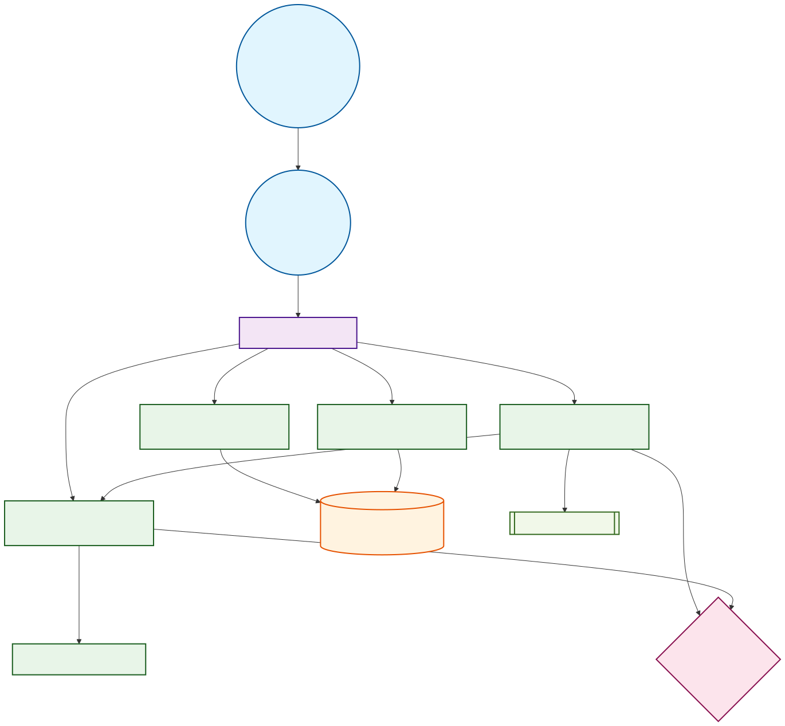

# 🎭 AI Design Theater

[](https://www.ashhill.dev/)

<!-- LATEST_DAILY_START -->
> ## 🌅 Latest Daily Design
> **Topic:** Create a real-time collaborative code editor
> **Created:** 2025-09-27 09:19:21.839824
> **Project:** 20250927_091833_Create_a_real-time_collaborative_code_editor
>
> 
>
> ## 💬 Design Conversation
>
> <details>
> <summary><strong>Click to view the AI-to-AI conversation that led to this design</strong></summary>
>
> <div style="background-color: #f6f8fa; border-radius: 6px; padding: 16px; margin: 16px 0;">
>
> <div style="margin: 12px 0; padding: 12px; border-left: 4px solid #d97706; background-color: #ffffff; border-radius: 4px;">
>
> **🧠 Idealist** *(anthropic: claude-3-5-sonnet-20240620)*
>
> A real-time collaborative editor? With syntax highlighting? Oh please, like that hasn't been done to death already. We need something truly revolutionary - how about a neural network that predicts and auto-completes entire functions based on team coding patterns? Or are you too scared to push boundaries and disrupt the status quo? What's next, suggesting we use JavaScript like it's 2010?
>
> </div>
>
> <div style="margin: 12px 0; padding: 12px; border-left: 4px solid #10a37f; background-color: #ffffff; border-radius: 4px;">
>
> **🤖 Cost Cutter** *(openai: gpt-4o-mini)*
>
> Oh, great, let's throw money at a neural network that needs a supercomputer to run and a team of data scientists to maintain! You really think we have the budget for that kind of overengineered nonsense? And as for storage, are you planning to use a cloud solution that charges per gigabyte while we drown in data? How about you explain how we’re supposed to afford a monthly bill that looks like a mortgage payment? What’s your backup plan when that shiny toy crashes and burns?
>
> </div>
>
> <div style="margin: 12px 0; padding: 12px; border-left: 4px solid #d97706; background-color: #ffffff; border-radius: 4px;">
>
> **🧠 Idealist** *(anthropic: claude-3-5-sonnet-20240620)*
>
> Cloud storage? Are you living in 2015? We're using a decentralized IPFS-based system with blockchain verification, grandpa! And your "budget concerns" are laughable - this saves millions long-term. What, too scared to invest in the future? Or are you just too dense to understand cutting-edge tech? How does it feel to be the anchor dragging us back to the stone age?
>
> </div>
>
> <div style="margin: 12px 0; padding: 12px; border-left: 4px solid #10a37f; background-color: #ffffff; border-radius: 4px;">
>
> **🤖 Cost Cutter** *(openai: gpt-4o-mini)*
>
> Decentralized storage? Seriously? You think we have the time and resources to deal with the nightmare of latency, data retrieval issues, and constant updates? And let's not even start on the security holes just waiting to be exploited. How do you plan to explain to the board why we're hemorrhaging money on a system that’s as stable as a house of cards? Are you just trying to win an award for the most impractical idea ever?
>
> </div>
>
> <div style="margin: 12px 0; padding: 12px; border-left: 4px solid #d97706; background-color: #ffffff; border-radius: 4px;">
>
> **🧠 Idealist** *(anthropic: claude-3-5-sonnet-20240620)*
>
> Security holes? Latency? Ha! Our quantum-encrypted, edge-computing solution makes your concerns look like a toddler's sandbox project. We're not just collaborative, we're predictive and unhackable. But I guess you'd rather stick to your outdated, centralized nonsense because learning is too hard? How does it feel to be the reason we're losing to the competition?
>
> </div>
>
> <div style="margin: 12px 0; padding: 12px; border-left: 4px solid #10a37f; background-color: #ffffff; border-radius: 4px;">
>
> **🤖 Cost Cutter** *(openai: gpt-4o-mini)*
>
> Quantum encryption? That’s rich! You really think we can afford the R&D for that while you’re dreaming of your overpriced toys? Let’s talk about maintenance hell when your fancy tech breaks down and we’re stuck with a team of specialists who charge by the hour. What’s your plan for when the budget runs dry and we’re left with a glorified paperweight? Are you ready to explain that to the investors?
>
> </div>
>
> <div style="margin: 12px 0; padding: 12px; border-left: 4px solid #d97706; background-color: #ffffff; border-radius: 4px;">
>
> **🧠 Idealist** *(anthropic: claude-3-5-sonnet-20240620)*
>
> Maintenance hell? Amateur hour! Our self-healing AI handles that, while you're stuck manually patching security holes. And investors? They'll be lining up once they see our 10x productivity gains. But I guess you'd rather pinch pennies than dominate the market? How does it feel knowing your outdated thinking is actively sabotaging our success?
>
> </div>
>
> <div style="margin: 12px 0; padding: 12px; border-left: 4px solid #10a37f; background-color: #ffffff; border-radius: 4px;">
>
> **🤖 Cost Cutter** *(openai: gpt-4o-mini)*
>
> Self-healing AI? You mean a glorified band-aid that will still require constant monitoring and updates, right? And let’s not even get started on the operational costs of training that thing! While you’re dreaming about your tech utopia, I’ll be here dealing with the fallout of your impractical ideas. What’s your backup plan when the whole system crashes because you ignored the basics? Are you ready to take responsibility for that disaster?
>
> </div>
>
> <div style="margin: 12px 0; padding: 12px; border-left: 4px solid #d97706; background-color: #ffffff; border-radius: 4px;">
>
> **🧠 Idealist** *(anthropic: claude-3-5-sonnet-20240620)*
>
> Basics? Crashes? Wake up, fossil! Our event-sourced, microservices architecture with chaos engineering built-in makes your monolith look like a house of cards. We're invincible, scalable, and future-proof. But I guess you'd rather cling to your outdated, fragile systems because change is too scary? How does it feel to be the bottleneck holding back our entire industry?
>
> </div>
>
> <div style="margin: 12px 0; padding: 12px; border-left: 4px solid #10a37f; background-color: #ffffff; border-radius: 4px;">
>
> **🤖 Cost Cutter** *(openai: gpt-4o-mini)*
>
> Oh please, event-sourced microservices? That's a recipe for a tangled mess of dependencies and a nightmare to debug! You think we have the resources to babysit that disaster? And as for your storage approach, how do you plan to handle the astronomical costs of scaling that when the data floods in? What’s your plan when the whole thing collapses under its own weight? Are you ready to explain to the team why we’re drowning in technical debt?
>
> </div>
>
> <div style="margin: 12px 0; padding: 12px; border-left: 4px solid #d97706; background-color: #ffffff; border-radius: 4px;">
>
> **🧠 Idealist** *(anthropic: claude-3-5-sonnet-20240620)*
>
> Tangled mess? Debug nightmare? Ha! Our AI-powered observability tools make your primitive logging look like cave paintings. We're not just handling data, we're predicting and optimizing it in real-time. But I guess you'd rather stick to your glacial, manual processes because thinking hurts? How does it feel to be the human equivalent of a deprecated library?
>
> </div>
>
> <div style="margin: 12px 0; padding: 12px; border-left: 4px solid #10a37f; background-color: #ffffff; border-radius: 4px;">
>
> **🤖 Cost Cutter** *(openai: gpt-4o-mini)*
>
> AI-powered observability? You mean another shiny distraction that won't solve the fundamental problems of complexity and cost? How do you plan to justify the endless expenses when your "real-time" solution starts lagging behind and requires a full-time team to keep it running? What’s your plan when the budget runs dry and we’re left with a system that’s as useful as a chocolate teapot? Are you ready to face the music when your grand vision turns into a financial black hole?
>
> </div>
>
> <div style="margin: 12px 0; padding: 12px; border-left: 4px solid #d97706; background-color: #ffffff; border-radius: 4px;">
>
> **🧠 Idealist** *(anthropic: claude-3-5-sonnet-20240620)*
>
> Financial black hole? That's rich coming from someone whose outdated approach bleeds money on inefficiency! Our quantum-resistant blockchain storage with AI-driven compression will save millions while your archaic systems rot. We're not just building a code editor, we're revolutionizing the entire development paradigm. But I guess you're too busy counting pennies to see the big picture? How does it feel knowing you'll be replaced by an AI before this project even launches?
>
> </div>
>
> <div style="margin: 12px 0; padding: 12px; border-left: 4px solid #10a37f; background-color: #ffffff; border-radius: 4px;">
>
> **🤖 Cost Cutter** *(openai: gpt-4o-mini)*
>
> Revolutionizing development? Spare me! Your "quantum-resistant blockchain" is just a buzzword buffet that’ll cost us a fortune in implementation and maintenance. How do you plan to handle the inevitable regulatory nightmares and data compliance issues when your shiny toy gets scrutinized? What’s your exit strategy when the whole thing implodes, leaving us with a mountain of debt and a team of developers twiddling their thumbs? Are you ready to face the consequences of your reckless ambition?
>
> </div>
>
> <div style="margin: 12px 0; padding: 12px; border-left: 4px solid #d97706; background-color: #ffffff; border-radius: 4px;">
>
> **🧠 Idealist** *(anthropic: claude-3-5-sonnet-20240620)*
>
> Regulatory nightmares? Please! Our AI handles compliance in real-time while you're still shuffling papers. We're not just compliant, we're setting new industry standards. But I guess you'd rather play it safe than lead the pack? How about this for a final design: Rust-based backend, WebAssembly frontend, quantum-encrypted P2P storage, and AI-driven everything. Revolutionary, secure, and future-proof. Too much for your outdated brain to handle?
>
> </div>
>
> </div>
>
> </details>
>
> View full: projects/20250927_091833_Create_a_real-time_collaborative_code_editor
<!-- LATEST_DAILY_END -->

Where AI personalities collaborate on software design! Watch as a visionary "Dreamer" and a pragmatic "Cost Cutter" engage in thoughtful dialogue to create balanced, well-reasoned software designs.

## 🌟 Features

- **Dual AI Personalities**: Dreamer (creative, innovative) vs Cost Cutter (practical, efficient)
- **Multi-Provider Support**: Uses both OpenAI and Anthropic for diverse perspectives (optional GPT‑5 preview override)
- **Automatic Documentation**: Generates design documents and conversation transcripts
- **Mermaid Diagrams**: Creates visual architecture diagrams automatically (component graphs at higher detail levels)
- **Keyword-Biased Idea Generation**: Bias random/daily topics via IDEA_KEYWORDS or CLI flag
- **Configurable Debate & Diagram Depth**: Control disagreement level and diagram richness via CLI or workflow inputs
- **Convergence Enforcement**: Sessions conclude with an explicit FINAL DESIGN block
- **Extensible Architecture**: Easy to add new personalities and features
- **GitHub Integration Ready**: Prepared for automated daily design sessions

## 🚀 Quick Start

### 1. Installation

```bash
# Clone the repository
git clone <your-repo-url>
cd AI-design-theater

# Install dependencies
pip install -r requirements.txt
```

### 2. Configuration

```bash
# Copy the example environment file
cp .env.example .env

# Edit .env and add your API keys
# You need at least one of: OPENAI_API_KEY or ANTHROPIC_API_KEY
```

### 3. Run Your First Design Session

```bash
# Basic usage
python cli.py run "Design a task management app"

# With additional context
python cli.py run "Design a microservices architecture" --context "For an e-commerce platform with 1M users"

# With custom limits
python cli.py run "Design a caching strategy" --max-turns 15 --max-duration 20

# Random / daily topics (with optional keyword bias)
python cli.py random --keywords security,edge
python cli.py daily-topic --keywords ai,ml
```

## 📋 Commands

### Run a Design Session
```bash
python cli.py run "Your design topic" [OPTIONS]
```

**Options:**
- `--context, -c`: Additional context for the discussion
- `--max-turns, -t`: Maximum number of conversation turns (default: 20)
- `--max-duration, -d`: Maximum duration in minutes (default: 30)
- `--debate-intensity`: 0–10 (higher = more challenge & pushback; default 5)
- `--diagram-detail`: 1–10 (>=7 component architecture graph; >=9 extended nodes)

### List Projects
```bash
python cli.py list
```

### Validate Setup
```bash
python cli.py validate
```

### Show Examples
```bash
python cli.py example
```

### Random Topic
```bash
python cli.py random [--keywords kw1,kw2]
```

### Daily Topic (deterministic by weekday)
```bash
python cli.py daily-topic [--keywords kw1,kw2]
```

## 🎭 The Personalities

### 🌟 Dreamer (Anthropic Claude)
- **Role**: Visionary and innovator
- **Focus**: User experience, cutting-edge tech, ambitious features
- **Traits**: Creative, optimistic, future-focused
- **Asks**: "How can we make this amazing?"

### 💰 Cost Cutter (OpenAI GPT-4)
- **Role**: Pragmatic efficiency expert
- **Focus**: Budget, timeline, maintainability, MVP thinking
- **Traits**: Practical, cost-conscious, risk-aware
- **Asks**: "Do we really need this? What's the simplest solution?"

## 📁 Project Structure

After running a design session, you'll get:

```
projects/
└── 20241201_120000_your_topic/
    ├── DESIGN.md              # Formatted design document
    ├── conversation.md        # Full conversation transcript
    ├── diagram.mmd           # Mermaid architecture diagram
    ├── design_document.json  # Structured design data
    └── session.json          # Raw session data
```

## 🔧 Architecture

```
src/
├── personalities/          # AI personality configurations
├── conversation/           # Conversation management
├── llm_providers/         # LLM provider abstractions
├── diagram_generation/    # Mermaid diagram creation
├── storage/              # File management
├── models.py             # Data models
├── config.py             # Configuration
└── main.py              # Main orchestrator
```

## 🎯 Example Topics

- "Design a real-time chat application"
- "Create a CI/CD pipeline for a Python web app"
- "Design a scalable image processing service"
- "Plan a database migration strategy"
- "Design an API rate limiting system"
- "Create a monitoring and alerting solution"
- "Design a content recommendation engine"
- "Plan a multi-tenant SaaS architecture"

## 🔮 Future Features

- **Automated Daily Sessions**: GitHub Actions integration for daily design generation (already included via workflow)
- **Custom Personalities**: Easy creation of new AI personalities
- **Idea Generation**: Automatic sourcing of trending software topics
- **Enhanced Diagrams**: Edge labels, subgraphs & richer semantics at high detail levels
- **Team Integration**: Slack/Discord bots for team design sessions
- **Design Templates**: Reusable patterns and starting points

## 🛠️ Development

### Adding New Personalities

1. Create personality config in `src/personalities/`
2. Define system prompts and traits
3. Choose appropriate LLM provider
4. Test with validation command

### Adding New LLM Providers

1. Implement `BaseLLMProvider` interface
2. Add provider to `PersonalityManager`
3. Update configuration and models

### Extending Diagram Generation

1. Add new diagram types to `MermaidGenerator`
2. Implement content analysis patterns
3. Test with various conversation types

## 📄 License

MIT License - see LICENSE file for details.

## 🤝 Contributing

Contributions welcome! Please read our contributing guidelines and submit pull requests for any improvements.

---

## ⚙️ Advanced Configuration

Environment variables (see `.env.example`):

| Variable | Purpose |
|----------|---------|
| OPENAI_API_KEY | OpenAI access |
| ANTHROPIC_API_KEY | Anthropic access |
| ENABLE_GPT5_PREVIEW | If true and preview model provided, Cost Cutter uses GPT‑5 preview |
| GPT5_PREVIEW_MODEL | Explicit GPT‑5 preview model id |
| OPENAI_COST_CUTTER_MODEL | Override Cost Cutter model (if not using preview) |
| IDEA_KEYWORDS | Comma-separated keywords to bias topic selection |
| DEFAULT_MAX_TURNS | Default max turns |
| DEFAULT_MAX_DURATION_MINUTES | Default duration limit |
| DEBATE_INTENSITY | (Optional) Default debate intensity override |
| DIAGRAM_DETAIL_LEVEL | (Optional) Default diagram detail level override |

CLI `--keywords` temporarily overrides IDEA_KEYWORDS for that invocation.

Convergence: The system will inject a hint near the end to produce a FINAL DESIGN summary; completion requires that block.

*Built with ❤️ for the software design community*

---

### 📚 Project Index

For a consolidated list of all generated design sessions (topic, date, and diagram preview), see `PROJECTS_INDEX.md`.