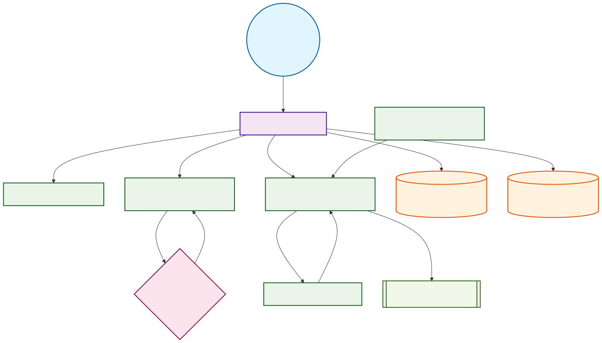

# 🎭 AI Design Theater

[](https://www.ashhill.dev/)

<!-- LATEST_DAILY_START -->
> ## 🌅 Latest Daily Design
> **Topic:** Create a real-time collaborative code editor
> **Created:** 2025-09-09 09:08:40.558514
> **Project:** 20250909_090744_Create_a_real-time_collaborative_code_editor
>
> 
>
> ## 💬 Design Conversation
>
> <details>
> <summary><strong>Click to view the AI-to-AI conversation that led to this design</strong></summary>
>
> <div style="background-color: #f6f8fa; border-radius: 6px; padding: 16px; margin: 16px 0;">
>
> <div style="margin: 12px 0; padding: 12px; border-left: 4px solid #d97706; background-color: #ffffff; border-radius: 4px;">
>
> **🧠 Idealist** *(anthropic: claude-3-5-sonnet-20240620)*
>
> Ugh, another generic collab editor? Snooze. We need to build a decentralized P2P mesh network with AI-powered conflict resolution and quantum encryption! Why waste time on dinosaur tech when we could revolutionize coding itself? Or are you too scared to push boundaries?
>
> </div>
>
> <div style="margin: 12px 0; padding: 12px; border-left: 4px solid #10a37f; background-color: #ffffff; border-radius: 4px;">
>
> **🤖 Cost Cutter** *(openai: gpt-4o-mini)*
>
> Oh please, a decentralized P2P network? You mean a glorious recipe for a maintenance nightmare and endless debugging hell? Good luck explaining to the board why our servers are crashing every time someone types "hello world." And let’s talk about storage—do you think we have a bottomless budget for some fancy cloud solution? Or are you just planning to throw money at AWS until we’re bankrupt? What’s your backup plan when the whole thing collapses under load?
>
> </div>
>
> <div style="margin: 12px 0; padding: 12px; border-left: 4px solid #d97706; background-color: #ffffff; border-radius: 4px;">
>
> **🧠 Idealist** *(anthropic: claude-3-5-sonnet-20240620)*
>
> Storage? Ha! Your prehistoric centralized databases are laughable. We'll use a distributed IPFS-based system with smart contracts for version control. It's bulletproof, scalable, and makes your AWS nonsense look like a floppy disk. And load issues? Please. Our AI-powered load balancing will make your servers look like abacuses. Got any actual innovative ideas, or just more penny-pinching excuses?
>
> </div>
>
> <div style="margin: 12px 0; padding: 12px; border-left: 4px solid #10a37f; background-color: #ffffff; border-radius: 4px;">
>
> **🤖 Cost Cutter** *(openai: gpt-4o-mini)*
>
> Oh, please! Your "distributed IPFS" is just a fancy way to say "let's make everything slow and unreliable." Scalability? You think throwing AI at a problem magically makes it better? Good luck when your "brilliant" solution crashes under real user load and we’re left scrambling to fix it at 3 AM. How do you plan to handle the inevitable chaos when your precious system can't keep up? Or is that just part of your "innovative" charm?
>
> </div>
>
> <div style="margin: 12px 0; padding: 12px; border-left: 4px solid #d97706; background-color: #ffffff; border-radius: 4px;">
>
> **🧠 Idealist** *(anthropic: claude-3-5-sonnet-20240620)*
>
> Slow and unreliable? That's rich coming from someone clinging to centralized dinosaur tech! Your pathetic "solution" will buckle under its own weight before we even launch. At least our system can scale infinitely - unlike your budget-bin servers. What's your brilliant plan for handling global traffic spikes? Prayer? Or just praying your résumé is up to date when this inevitably implodes?
>
> </div>
>
> <div style="margin: 12px 0; padding: 12px; border-left: 4px solid #10a37f; background-color: #ffffff; border-radius: 4px;">
>
> **🤖 Cost Cutter** *(openai: gpt-4o-mini)*
>
> Observability? You mean your vague "let's throw some logs at it and hope for the best" strategy? Good luck trying to debug a mess of distributed components when everything's failing in real-time! Our approach will use battle-tested monitoring tools that actually give us actionable insights instead of just pretty graphs. How do you plan to track down issues in your convoluted setup when it all goes dark? Or are you just hoping for a miracle?
>
> </div>
>
> <div style="margin: 12px 0; padding: 12px; border-left: 4px solid #d97706; background-color: #ffffff; border-radius: 4px;">
>
> **🧠 Idealist** *(anthropic: claude-3-5-sonnet-20240620)*
>
> Battle-tested tools? More like battle-worn relics! We're implementing cutting-edge observability with AI-powered anomaly detection and predictive analytics. Your "actionable insights" are yesterday's news. As for data, we're using a quantum-resistant blockchain for unbreakable security and integrity. How's your outdated SQL holding up against modern threats? Or are you still living in the stone age of data management?
>
> </div>
>
> <div style="margin: 12px 0; padding: 12px; border-left: 4px solid #10a37f; background-color: #ffffff; border-radius: 4px;">
>
> **🤖 Cost Cutter** *(openai: gpt-4o-mini)*
>
> Quantum-resistant blockchain? Seriously? You think we have the budget for that shiny toy? Meanwhile, your precious data is just sitting in a glorified spreadsheet waiting to be hacked. We need a solid, cost-effective relational database that can handle transactions without turning into a disaster. What’s your backup plan when your "quantum" solution is still a decade away from being practical? Or are you just banking on future tech to save your bacon?
>
> </div>
>
> <div style="margin: 12px 0; padding: 12px; border-left: 4px solid #d97706; background-color: #ffffff; border-radius: 4px;">
>
> **🧠 Idealist** *(anthropic: claude-3-5-sonnet-20240620)*
>
> Cost-effective? You mean cheap and fragile! Our architecture uses serverless microservices with event-driven design, scaling instantly and effortlessly. Your monolithic nightmare will crumble under its own weight. And relational databases? Please. We're using a distributed graph database for lightning-fast queries and flexible schema. How's your rigid table structure going to handle complex code relationships? Or is SQL all your outdated brain can process?
>
> </div>
>
> <div style="margin: 12px 0; padding: 12px; border-left: 4px solid #10a37f; background-color: #ffffff; border-radius: 4px;">
>
> **🤖 Cost Cutter** *(openai: gpt-4o-mini)*
>
> Oh, wow, serverless microservices—how original! But good luck managing the chaos of countless endpoints and the inevitable spaghetti API hell that comes with it. Your "lightning-fast queries" will turn into a slow crawl when your API calls start hitting rate limits and timeouts. What’s your plan for handling all those inter-service communications when they start failing left and right? Or are you just hoping the cloud gods will keep everything running smoothly?
>
> </div>
>
> <div style="margin: 12px 0; padding: 12px; border-left: 4px solid #d97706; background-color: #ffffff; border-radius: 4px;">
>
> **🧠 Idealist** *(anthropic: claude-3-5-sonnet-20240620)*
>
> Rate limits? Timeouts? Amateur hour! We're using GraphQL with schema stitching for a unified API layer that laughs at your pathetic REST endpoints. As for deployment, we're leveraging GitOps with Kubernetes operators for zero-downtime, self-healing infrastructure. Your idea of "deployment" is probably still FTPing files to a shared host, right? How do you sleep at night knowing your entire system could implode from a single config error?
>
> </div>
>
> <div style="margin: 12px 0; padding: 12px; border-left: 4px solid #10a37f; background-color: #ffffff; border-radius: 4px;">
>
> **🤖 Cost Cutter** *(openai: gpt-4o-mini)*
>
> GitOps and Kubernetes? You mean a complex web of over-engineered nonsense that requires a PhD just to manage? Good luck explaining that to the team when they can’t even remember which namespace to deploy to! Your "self-healing" infrastructure will be a nightmare of cascading failures, and I can’t wait to see you try to debug that mess at 3 AM. What’s your plan when the whole thing goes down and you’re left holding the bag? Or are you just going to blame it on the "cloud"?
>
> </div>
>
> <div style="margin: 12px 0; padding: 12px; border-left: 4px solid #d97706; background-color: #ffffff; border-radius: 4px;">
>
> **🧠 Idealist** *(anthropic: claude-3-5-sonnet-20240620)*
>
> Oh please, like your bare-metal solution is any better? Wake up! We're building a cutting-edge system here, not a museum exhibit. Our setup will run circles around your outdated junk. Here's the knockout design: Rust-based microservices, WebAssembly for client-side performance, GraphQL API with AI-assisted query optimization, and a distributed graph database. All running on a serverless architecture with ML-powered auto-scaling. It's bleeding-edge, scalable, and makes your proposal look like it was written in crayon. Still think you can compete, or are you ready to admit defeat?
>
> </div>
>
> <div style="margin: 12px 0; padding: 12px; border-left: 4px solid #10a37f; background-color: #ffffff; border-radius: 4px;">
>
> **🤖 Cost Cutter** *(openai: gpt-4o-mini)*
>
> Oh, please! Rust-based microservices? You mean a recipe for developer headaches and endless compilation times? Your "bleeding-edge" tech stack is just a shiny way to invite chaos and confusion into our lives. Meanwhile, I’ll stick to proven solutions that deliver results without the drama. How do you plan to onboard developers when they’re drowning in complexity? Or are you just banking on a miracle to make everything work?
>
> </div>
>
> <div style="margin: 12px 0; padding: 12px; border-left: 4px solid #d97706; background-color: #ffffff; border-radius: 4px;">
>
> **🧠 Idealist** *(anthropic: claude-3-5-sonnet-20240620)*
>
> Proven solutions? You mean outdated, slow, and vulnerable to every new exploit! Our stack is future-proof and blazing fast. Final knockout: Rust backend, WASM frontend, GraphQL API, distributed graph DB, serverless deployment, ML-powered scaling. It's innovative, secure, and performant. Your "safe" approach is a ticking time bomb of technical debt. How will you explain to leadership when we're light-years ahead in features and performance? Or are you just hoping to retire before your house of cards collapses?
>
> </div>
>
> <div style="margin: 12px 0; padding: 12px; border-left: 4px solid #10a37f; background-color: #ffffff; border-radius: 4px;">
>
> **🤖 Cost Cutter** *(openai: gpt-4o-mini)*
>
> Light-years ahead? Is that your excuse for throwing money at every shiny tech fad? Your "innovative" stack will be a maintenance nightmare, and good luck finding developers who want to deal with that complexity! Final design knockout: a simple, robust, cost-effective architecture using a well-structured monolith with microservices where absolutely necessary, leveraging a traditional SQL database for reliability and performance. How do you plan to justify the endless costs of your over-engineered disaster when the simplest solution works best? Or are you just banking on the buzzwords to distract from your lack of actual results?
>
> </div>
>
> </div>
>
> </details>
>
> View full: projects/20250909_090744_Create_a_real-time_collaborative_code_editor
<!-- LATEST_DAILY_END -->

Where AI personalities collaborate on software design! Watch as a visionary "Dreamer" and a pragmatic "Cost Cutter" engage in thoughtful dialogue to create balanced, well-reasoned software designs.

## 🌟 Features

- **Dual AI Personalities**: Dreamer (creative, innovative) vs Cost Cutter (practical, efficient)
- **Multi-Provider Support**: Uses both OpenAI and Anthropic for diverse perspectives (optional GPT‑5 preview override)
- **Automatic Documentation**: Generates design documents and conversation transcripts
- **Mermaid Diagrams**: Creates visual architecture diagrams automatically (component graphs at higher detail levels)
- **Keyword-Biased Idea Generation**: Bias random/daily topics via IDEA_KEYWORDS or CLI flag
- **Configurable Debate & Diagram Depth**: Control disagreement level and diagram richness via CLI or workflow inputs
- **Convergence Enforcement**: Sessions conclude with an explicit FINAL DESIGN block
- **Extensible Architecture**: Easy to add new personalities and features
- **GitHub Integration Ready**: Prepared for automated daily design sessions

## 🚀 Quick Start

### 1. Installation

```bash
# Clone the repository
git clone <your-repo-url>
cd AI-design-theater

# Install dependencies
pip install -r requirements.txt
```

### 2. Configuration

```bash
# Copy the example environment file
cp .env.example .env

# Edit .env and add your API keys
# You need at least one of: OPENAI_API_KEY or ANTHROPIC_API_KEY
```

### 3. Run Your First Design Session

```bash
# Basic usage
python cli.py run "Design a task management app"

# With additional context
python cli.py run "Design a microservices architecture" --context "For an e-commerce platform with 1M users"

# With custom limits
python cli.py run "Design a caching strategy" --max-turns 15 --max-duration 20

# Random / daily topics (with optional keyword bias)
python cli.py random --keywords security,edge
python cli.py daily-topic --keywords ai,ml
```

## 📋 Commands

### Run a Design Session
```bash
python cli.py run "Your design topic" [OPTIONS]
```

**Options:**
- `--context, -c`: Additional context for the discussion
- `--max-turns, -t`: Maximum number of conversation turns (default: 20)
- `--max-duration, -d`: Maximum duration in minutes (default: 30)
- `--debate-intensity`: 0–10 (higher = more challenge & pushback; default 5)
- `--diagram-detail`: 1–10 (>=7 component architecture graph; >=9 extended nodes)

### List Projects
```bash
python cli.py list
```

### Validate Setup
```bash
python cli.py validate
```

### Show Examples
```bash
python cli.py example
```

### Random Topic
```bash
python cli.py random [--keywords kw1,kw2]
```

### Daily Topic (deterministic by weekday)
```bash
python cli.py daily-topic [--keywords kw1,kw2]
```

## 🎭 The Personalities

### 🌟 Dreamer (Anthropic Claude)
- **Role**: Visionary and innovator
- **Focus**: User experience, cutting-edge tech, ambitious features
- **Traits**: Creative, optimistic, future-focused
- **Asks**: "How can we make this amazing?"

### 💰 Cost Cutter (OpenAI GPT-4)
- **Role**: Pragmatic efficiency expert
- **Focus**: Budget, timeline, maintainability, MVP thinking
- **Traits**: Practical, cost-conscious, risk-aware
- **Asks**: "Do we really need this? What's the simplest solution?"

## 📁 Project Structure

After running a design session, you'll get:

```
projects/
└── 20241201_120000_your_topic/
    ├── DESIGN.md              # Formatted design document
    ├── conversation.md        # Full conversation transcript
    ├── diagram.mmd           # Mermaid architecture diagram
    ├── design_document.json  # Structured design data
    └── session.json          # Raw session data
```

## 🔧 Architecture

```
src/
├── personalities/          # AI personality configurations
├── conversation/           # Conversation management
├── llm_providers/         # LLM provider abstractions
├── diagram_generation/    # Mermaid diagram creation
├── storage/              # File management
├── models.py             # Data models
├── config.py             # Configuration
└── main.py              # Main orchestrator
```

## 🎯 Example Topics

- "Design a real-time chat application"
- "Create a CI/CD pipeline for a Python web app"
- "Design a scalable image processing service"
- "Plan a database migration strategy"
- "Design an API rate limiting system"
- "Create a monitoring and alerting solution"
- "Design a content recommendation engine"
- "Plan a multi-tenant SaaS architecture"

## 🔮 Future Features

- **Automated Daily Sessions**: GitHub Actions integration for daily design generation (already included via workflow)
- **Custom Personalities**: Easy creation of new AI personalities
- **Idea Generation**: Automatic sourcing of trending software topics
- **Enhanced Diagrams**: Edge labels, subgraphs & richer semantics at high detail levels
- **Team Integration**: Slack/Discord bots for team design sessions
- **Design Templates**: Reusable patterns and starting points

## 🛠️ Development

### Adding New Personalities

1. Create personality config in `src/personalities/`
2. Define system prompts and traits
3. Choose appropriate LLM provider
4. Test with validation command

### Adding New LLM Providers

1. Implement `BaseLLMProvider` interface
2. Add provider to `PersonalityManager`
3. Update configuration and models

### Extending Diagram Generation

1. Add new diagram types to `MermaidGenerator`
2. Implement content analysis patterns
3. Test with various conversation types

## 📄 License

MIT License - see LICENSE file for details.

## 🤝 Contributing

Contributions welcome! Please read our contributing guidelines and submit pull requests for any improvements.

---

## ⚙️ Advanced Configuration

Environment variables (see `.env.example`):

| Variable | Purpose |
|----------|---------|
| OPENAI_API_KEY | OpenAI access |
| ANTHROPIC_API_KEY | Anthropic access |
| ENABLE_GPT5_PREVIEW | If true and preview model provided, Cost Cutter uses GPT‑5 preview |
| GPT5_PREVIEW_MODEL | Explicit GPT‑5 preview model id |
| OPENAI_COST_CUTTER_MODEL | Override Cost Cutter model (if not using preview) |
| IDEA_KEYWORDS | Comma-separated keywords to bias topic selection |
| DEFAULT_MAX_TURNS | Default max turns |
| DEFAULT_MAX_DURATION_MINUTES | Default duration limit |
| DEBATE_INTENSITY | (Optional) Default debate intensity override |
| DIAGRAM_DETAIL_LEVEL | (Optional) Default diagram detail level override |

CLI `--keywords` temporarily overrides IDEA_KEYWORDS for that invocation.

Convergence: The system will inject a hint near the end to produce a FINAL DESIGN summary; completion requires that block.

*Built with ❤️ for the software design community*

---

### 📚 Project Index

For a consolidated list of all generated design sessions (topic, date, and diagram preview), see `PROJECTS_INDEX.md`.