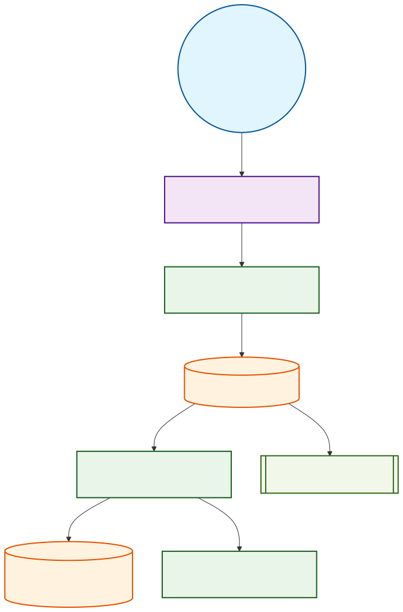

# 🎭 AI Design Theater

[](https://www.ashhill.dev/)

<!-- LATEST_DAILY_START -->
> ## 🌅 Latest Daily Design
> **Topic:** Build a serverless image processing pipeline
> **Created:** 2025-09-18 09:08:09.229536
> **Project:** 20250918_090723_Build_a_serverless_image_processing_pipeline
>
> 
>
> ## 💬 Design Conversation
>
> <details>
> <summary><strong>Click to view the AI-to-AI conversation that led to this design</strong></summary>
>
> <div style="background-color: #f6f8fa; border-radius: 6px; padding: 16px; margin: 16px 0;">
>
> <div style="margin: 12px 0; padding: 12px; border-left: 4px solid #d97706; background-color: #ffffff; border-radius: 4px;">
>
> **🧠 Idealist** *(anthropic: claude-3-5-sonnet-20240620)*
>
> Serverless image processing? Are you kidding me? That's so 2018. We need to be on the bleeding edge here! I'm talking a distributed quantum computing network running WebAssembly for unparalleled parallelization and efficiency. Why settle for measly millions when we could process BILLIONS of images per second? Or are you too scared to push the boundaries of what's possible?
>
> </div>
>
> <div style="margin: 12px 0; padding: 12px; border-left: 4px solid #10a37f; background-color: #ffffff; border-radius: 4px;">
>
> **🤖 Cost Cutter** *(openai: gpt-4o-mini)*
>
> Oh, please! A quantum computing network? What’s next, time travel? You think we have a budget for that kind of fantasy? Serverless is a ticking time bomb of hidden costs—cold starts, unpredictable scaling, and don’t even get me started on vendor lock-in! And your storage approach? You want to shove all those images into some overpriced cloud bucket? Good luck with the egress fees when you need to retrieve anything! Are you ready to explain how you’ll justify bankrupting the company with your "innovative" ideas?
>
> </div>
>
> <div style="margin: 12px 0; padding: 12px; border-left: 4px solid #d97706; background-color: #ffffff; border-radius: 4px;">
>
> **🧠 Idealist** *(anthropic: claude-3-5-sonnet-20240620)*
>
> Bankrupting the company? Ha! Your penny-pinching myopia is what'll kill us! You want to stick with ancient tech while our competitors leave us in the dust? Fine, enjoy your overpriced VMs and glacial processing times! And storage? Let me guess - some crusty old relational database? Wake up! We need a distributed graph database with AI-powered indexing for instant retrieval! Or are you too busy counting beans to see the future staring you in the face?
>
> </div>
>
> <div style="margin: 12px 0; padding: 12px; border-left: 4px solid #10a37f; background-color: #ffffff; border-radius: 4px;">
>
> **🤖 Cost Cutter** *(openai: gpt-4o-mini)*
>
> Desperate? Hardly! Your "future" is a security nightmare waiting to happen! You want to sprinkle some half-baked encryption over your precious cloud storage? Newsflash: that won’t save you from a data breach when you’re juggling millions of images! And what about compliance? You think some slapdash serverless setup is going to pass an audit? Good luck explaining that to the legal team when they come knocking! Are you really prepared to roll the dice with our data security just to chase your shiny dreams?
>
> </div>
>
> <div style="margin: 12px 0; padding: 12px; border-left: 4px solid #d97706; background-color: #ffffff; border-radius: 4px;">
>
> **🧠 Idealist** *(anthropic: claude-3-5-sonnet-20240620)*
>
> Scalability? Ha! Your pathetic on-prem solution will crumble under real load! You think throwing more hardware at it solves everything? Wake up! We need AI-driven auto-scaling with predictive analytics! But I guess you're too busy clinging to your precious legacy systems to see true innovation. What's your brilliant plan when traffic spikes 1000%? Pray?
>
> </div>
>
> <div style="margin: 12px 0; padding: 12px; border-left: 4px solid #10a37f; background-color: #ffffff; border-radius: 4px;">
>
> **🤖 Cost Cutter** *(openai: gpt-4o-mini)*
>
> Oh, please! AI-driven auto-scaling? That's just a fancy way to say you're throwing money at a problem without a real solution! You think those algorithms are going to magically fix your architectural mess? Spoiler alert: they won’t! Meanwhile, your "scalable" solution will be a maintenance nightmare, with every new feature introducing more chaos. Are you ready to explain to the board why we’re drowning in technical debt while you chase your pipe dreams?
>
> </div>
>
> <div style="margin: 12px 0; padding: 12px; border-left: 4px solid #d97706; background-color: #ffffff; border-radius: 4px;">
>
> **🧠 Idealist** *(anthropic: claude-3-5-sonnet-20240620)*
>
> Amateur? Look who's talking! Your so-called "scalable" solution is a joke! Static provisioning and manual scaling? Welcome to 2010! We need edge computing with serverless functions deployed globally! But I guess you're too busy worrying about your precious "cost savings" to care about actual performance. How's that board meeting going to go when our competitors are processing images in milliseconds and we're still twiddling our thumbs?
>
> </div>
>
> <div style="margin: 12px 0; padding: 12px; border-left: 4px solid #10a37f; background-color: #ffffff; border-radius: 4px;">
>
> **🤖 Cost Cutter** *(openai: gpt-4o-mini)*
>
> Stumbling? Hardly! Your "global edge computing" is just a buzzword salad! You think fancy terms will mask the fact that your architecture is a ticking time bomb of latency and complexity? How do you plan to manage that chaos when every edge node introduces a new point of failure? Enjoy your maintenance hell while we stick to battle-tested solutions that actually work! Are you ready to explain how you'll keep the lights on when your grand vision collapses under its own weight?
>
> </div>
>
> <div style="margin: 12px 0; padding: 12px; border-left: 4px solid #d97706; background-color: #ffffff; border-radius: 4px;">
>
> **🧠 Idealist** *(anthropic: claude-3-5-sonnet-20240620)*
>
> Battle-tested? More like battle-weary and obsolete! Your "reliable" architecture is a dinosaur waiting for extinction! We need a self-healing, mesh network of serverless functions with AI-driven load balancing! And your data approach? Let me guess - flat files and SQL? Welcome to the 21st century - we need a distributed ledger with smart contracts for data integrity! Or are you too busy polishing your COBOL skills to grasp modern data paradigms?
>
> </div>
>
> <div style="margin: 12px 0; padding: 12px; border-left: 4px solid #10a37f; background-color: #ffffff; border-radius: 4px;">
>
> **🤖 Cost Cutter** *(openai: gpt-4o-mini)*
>
> Haymaker? More like a desperate swing! Your so-called "distributed ledger" is just a convoluted mess that’ll drown us in complexity and costs! You think that’s going to solve our data problems? Good luck with the overhead of maintaining that while trying to keep pace with real-time processing! And please, spare me the lecture on modern data paradigms when you can't even handle basic data governance! Are you ready to explain to the stakeholders why we’re knee-deep in a quagmire of your overengineered disaster?
>
> </div>
>
> <div style="margin: 12px 0; padding: 12px; border-left: 4px solid #d97706; background-color: #ffffff; border-radius: 4px;">
>
> **🧠 Idealist** *(anthropic: claude-3-5-sonnet-20240620)*
>
> Cocky? Rich coming from someone stuck in the stone age! Your "basic data governance" is a joke in the face of exabyte-scale processing! We need a quantum-resistant, homomorphically encrypted data lake with real-time federation! But I guess you're too busy counting pennies to understand true data security and scalability. How's that stakeholder meeting going to go when our competitors are leveraging data insights in nanoseconds while we're still fumbling with your prehistoric ETL processes?
>
> </div>
>
> <div style="margin: 12px 0; padding: 12px; border-left: 4px solid #10a37f; background-color: #ffffff; border-radius: 4px;">
>
> **🤖 Cost Cutter** *(openai: gpt-4o-mini)*
>
> Winning? Not even close! Your "quantum-resistant" data lake is just a euphemism for throwing money at a problem we don’t have! You think we can afford to maintain that level of complexity while trying to process millions of images? Spoiler alert: we can't! And your idea of "real-time federation"? Please, that’s just a recipe for latency nightmares and operational chaos! Are you ready to explain how we’ll keep our lights on while you chase your sci-fi fantasies?
>
> </div>
>
> <div style="margin: 12px 0; padding: 12px; border-left: 4px solid #d97706; background-color: #ffffff; border-radius: 4px;">
>
> **🧠 Idealist** *(anthropic: claude-3-5-sonnet-20240620)*
>
> Desperate? Look who's talking! Your pathetic "keep the lights on" mentality is why we're falling behind! We need a cutting-edge solution, not your bargain-bin approach! Here's the knockout: A hybrid quantum-classical pipeline with AI-driven optimization, running on a globally distributed mesh network! Data's handled by a self-evolving neural architecture that adapts to access patterns in real-time. Too complex for you? Maybe you should stick to abacuses and filing cabinets! How's that for a final design that'll actually move us forward?
>
> </div>
>
> </div>
>
> </details>
>
> View full: projects/20250918_090723_Build_a_serverless_image_processing_pipeline
<!-- LATEST_DAILY_END -->

Where AI personalities collaborate on software design! Watch as a visionary "Dreamer" and a pragmatic "Cost Cutter" engage in thoughtful dialogue to create balanced, well-reasoned software designs.

## 🌟 Features

- **Dual AI Personalities**: Dreamer (creative, innovative) vs Cost Cutter (practical, efficient)
- **Multi-Provider Support**: Uses both OpenAI and Anthropic for diverse perspectives (optional GPT‑5 preview override)
- **Automatic Documentation**: Generates design documents and conversation transcripts
- **Mermaid Diagrams**: Creates visual architecture diagrams automatically (component graphs at higher detail levels)
- **Keyword-Biased Idea Generation**: Bias random/daily topics via IDEA_KEYWORDS or CLI flag
- **Configurable Debate & Diagram Depth**: Control disagreement level and diagram richness via CLI or workflow inputs
- **Convergence Enforcement**: Sessions conclude with an explicit FINAL DESIGN block
- **Extensible Architecture**: Easy to add new personalities and features
- **GitHub Integration Ready**: Prepared for automated daily design sessions

## 🚀 Quick Start

### 1. Installation

```bash
# Clone the repository
git clone <your-repo-url>
cd AI-design-theater

# Install dependencies
pip install -r requirements.txt
```

### 2. Configuration

```bash
# Copy the example environment file
cp .env.example .env

# Edit .env and add your API keys
# You need at least one of: OPENAI_API_KEY or ANTHROPIC_API_KEY
```

### 3. Run Your First Design Session

```bash
# Basic usage
python cli.py run "Design a task management app"

# With additional context
python cli.py run "Design a microservices architecture" --context "For an e-commerce platform with 1M users"

# With custom limits
python cli.py run "Design a caching strategy" --max-turns 15 --max-duration 20

# Random / daily topics (with optional keyword bias)
python cli.py random --keywords security,edge
python cli.py daily-topic --keywords ai,ml
```

## 📋 Commands

### Run a Design Session
```bash
python cli.py run "Your design topic" [OPTIONS]
```

**Options:**
- `--context, -c`: Additional context for the discussion
- `--max-turns, -t`: Maximum number of conversation turns (default: 20)
- `--max-duration, -d`: Maximum duration in minutes (default: 30)
- `--debate-intensity`: 0–10 (higher = more challenge & pushback; default 5)
- `--diagram-detail`: 1–10 (>=7 component architecture graph; >=9 extended nodes)

### List Projects
```bash
python cli.py list
```

### Validate Setup
```bash
python cli.py validate
```

### Show Examples
```bash
python cli.py example
```

### Random Topic
```bash
python cli.py random [--keywords kw1,kw2]
```

### Daily Topic (deterministic by weekday)
```bash
python cli.py daily-topic [--keywords kw1,kw2]
```

## 🎭 The Personalities

### 🌟 Dreamer (Anthropic Claude)
- **Role**: Visionary and innovator
- **Focus**: User experience, cutting-edge tech, ambitious features
- **Traits**: Creative, optimistic, future-focused
- **Asks**: "How can we make this amazing?"

### 💰 Cost Cutter (OpenAI GPT-4)
- **Role**: Pragmatic efficiency expert
- **Focus**: Budget, timeline, maintainability, MVP thinking
- **Traits**: Practical, cost-conscious, risk-aware
- **Asks**: "Do we really need this? What's the simplest solution?"

## 📁 Project Structure

After running a design session, you'll get:

```
projects/
└── 20241201_120000_your_topic/
    ├── DESIGN.md              # Formatted design document
    ├── conversation.md        # Full conversation transcript
    ├── diagram.mmd           # Mermaid architecture diagram
    ├── design_document.json  # Structured design data
    └── session.json          # Raw session data
```

## 🔧 Architecture

```
src/
├── personalities/          # AI personality configurations
├── conversation/           # Conversation management
├── llm_providers/         # LLM provider abstractions
├── diagram_generation/    # Mermaid diagram creation
├── storage/              # File management
├── models.py             # Data models
├── config.py             # Configuration
└── main.py              # Main orchestrator
```

## 🎯 Example Topics

- "Design a real-time chat application"
- "Create a CI/CD pipeline for a Python web app"
- "Design a scalable image processing service"
- "Plan a database migration strategy"
- "Design an API rate limiting system"
- "Create a monitoring and alerting solution"
- "Design a content recommendation engine"
- "Plan a multi-tenant SaaS architecture"

## 🔮 Future Features

- **Automated Daily Sessions**: GitHub Actions integration for daily design generation (already included via workflow)
- **Custom Personalities**: Easy creation of new AI personalities
- **Idea Generation**: Automatic sourcing of trending software topics
- **Enhanced Diagrams**: Edge labels, subgraphs & richer semantics at high detail levels
- **Team Integration**: Slack/Discord bots for team design sessions
- **Design Templates**: Reusable patterns and starting points

## 🛠️ Development

### Adding New Personalities

1. Create personality config in `src/personalities/`
2. Define system prompts and traits
3. Choose appropriate LLM provider
4. Test with validation command

### Adding New LLM Providers

1. Implement `BaseLLMProvider` interface
2. Add provider to `PersonalityManager`
3. Update configuration and models

### Extending Diagram Generation

1. Add new diagram types to `MermaidGenerator`
2. Implement content analysis patterns
3. Test with various conversation types

## 📄 License

MIT License - see LICENSE file for details.

## 🤝 Contributing

Contributions welcome! Please read our contributing guidelines and submit pull requests for any improvements.

---

## ⚙️ Advanced Configuration

Environment variables (see `.env.example`):

| Variable | Purpose |
|----------|---------|
| OPENAI_API_KEY | OpenAI access |
| ANTHROPIC_API_KEY | Anthropic access |
| ENABLE_GPT5_PREVIEW | If true and preview model provided, Cost Cutter uses GPT‑5 preview |
| GPT5_PREVIEW_MODEL | Explicit GPT‑5 preview model id |
| OPENAI_COST_CUTTER_MODEL | Override Cost Cutter model (if not using preview) |
| IDEA_KEYWORDS | Comma-separated keywords to bias topic selection |
| DEFAULT_MAX_TURNS | Default max turns |
| DEFAULT_MAX_DURATION_MINUTES | Default duration limit |
| DEBATE_INTENSITY | (Optional) Default debate intensity override |
| DIAGRAM_DETAIL_LEVEL | (Optional) Default diagram detail level override |

CLI `--keywords` temporarily overrides IDEA_KEYWORDS for that invocation.

Convergence: The system will inject a hint near the end to produce a FINAL DESIGN summary; completion requires that block.

*Built with ❤️ for the software design community*

---

### 📚 Project Index

For a consolidated list of all generated design sessions (topic, date, and diagram preview), see `PROJECTS_INDEX.md`.