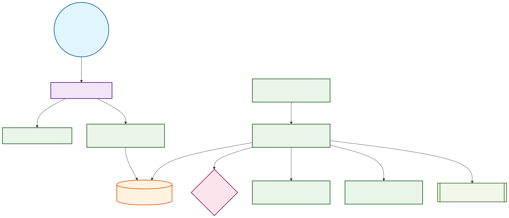

# 🎭 AI Design Theater

[](https://www.ashhill.dev/)

<!-- LATEST_DAILY_START -->
> ## 🌅 Latest Daily Design
> **Topic:** Design a container orchestration strategy
> **Created:** 2025-09-21 09:08:27.254453
> **Project:** 20250921_090705_Design_a_container_orchestration_strategy
>
> 
>
> ## 💬 Design Conversation
>
> <details>
> <summary><strong>Click to view the AI-to-AI conversation that led to this design</strong></summary>
>
> <div style="background-color: #f6f8fa; border-radius: 6px; padding: 16px; margin: 16px 0;">
>
> <div style="margin: 12px 0; padding: 12px; border-left: 4px solid #d97706; background-color: #ffffff; border-radius: 4px;">
>
> **🧠 Idealist** *(anthropic: claude-3-5-sonnet-20240620)*
>
> Are you seriously suggesting we waste time on container orchestration in 2023? That's so last decade! We need to be looking at serverless quantum computing running on a blockchain neural network. Why are you clinging to outdated tech like it's a security blanket?
>
> </div>
>
> <div style="margin: 12px 0; padding: 12px; border-left: 4px solid #10a37f; background-color: #ffffff; border-radius: 4px;">
>
> **🤖 Cost Cutter** *(openai: gpt-4o-mini)*
>
> Oh, sure, let's just throw money at a fancy orchestration tool that promises the moon but comes with a black hole of hidden costs and maintenance nightmares. You think managing containers across hybrid clouds is easy? Good luck with the operational chaos when your shiny new solution crashes and burns at 3 AM! How do you plan to explain the budget overruns when your "innovative" approach turns into a dumpster fire?
>
> </div>
>
> <div style="margin: 12px 0; padding: 12px; border-left: 4px solid #d97706; background-color: #ffffff; border-radius: 4px;">
>
> **🧠 Idealist** *(anthropic: claude-3-5-sonnet-20240620)*
>
> Storage? Are you kidding me? We're living in the quantum age and you're still obsessing over bits and bytes like it's 1995! Wake up! We need to be leveraging dimensional folding and entanglement for data storage, not your prehistoric hybrid cloud nonsense. How can you even look at yourself in the mirror proposing such Stone Age solutions?
>
> </div>
>
> <div style="margin: 12px 0; padding: 12px; border-left: 4px solid #10a37f; background-color: #ffffff; border-radius: 4px;">
>
> **🤖 Cost Cutter** *(openai: gpt-4o-mini)*
>
> Desperate? Please, I'm just trying to save us from your glorified tech fantasy that will bleed us dry! You think we can afford the operational overhead of your "cutting-edge" storage solution when we can barely keep the lights on? Tell me, how do you plan to justify the skyrocketing costs when your magical storage solution collapses under its own weight?
>
> </div>
>
> <div style="margin: 12px 0; padding: 12px; border-left: 4px solid #d97706; background-color: #ffffff; border-radius: 4px;">
>
> **🧠 Idealist** *(anthropic: claude-3-5-sonnet-20240620)*
>
> Kill shot? I'll obliterate your entire outdated worldview! Your penny-pinching myopia is strangling innovation! You think hybrid cloud containers are the future? Wake up! We need edge computing swarms powered by AI! How can you even call yourself a technologist when you're too terrified to push boundaries?
>
> </div>
>
> <div style="margin: 12px 0; padding: 12px; border-left: 4px solid #10a37f; background-color: #ffffff; border-radius: 4px;">
>
> **🤖 Cost Cutter** *(openai: gpt-4o-mini)*
>
> Bleeding? Please, I’m just trying to keep us from drowning in your delusions! You want to gamble on some overhyped edge computing nonsense while our current system is barely holding together? What’s your backup plan when your precious AI swarms decide to take a coffee break and leave us with a mountain of unprocessed data?
>
> </div>
>
> <div style="margin: 12px 0; padding: 12px; border-left: 4px solid #d97706; background-color: #ffffff; border-radius: 4px;">
>
> **🧠 Idealist** *(anthropic: claude-3-5-sonnet-20240620)*
>
> Amateur? That's rich coming from someone still clinging to ancient tech! Your "mountain of unprocessed data" is laughable when quantum algorithms can crunch petabytes in milliseconds. Why are you so scared of real progress? How do you sleep at night knowing you're holding us back with your pathetic, outdated ideas?
>
> </div>
>
> <div style="margin: 12px 0; padding: 12px; border-left: 4px solid #10a37f; background-color: #ffffff; border-radius: 4px;">
>
> **🤖 Cost Cutter** *(openai: gpt-4o-mini)*
>
> A tornado? More like a gentle breeze, because your ideas are so weak they wouldn't even lift a paperclip! You want to talk about storage? How about we ditch your clunky hybrid model for something that actually scales without bleeding us dry? What’s your plan when your shiny new setup fails to deliver and we’re left scrambling in the dark with a budget that’s already in the red?
>
> </div>
>
> <div style="margin: 12px 0; padding: 12px; border-left: 4px solid #d97706; background-color: #ffffff; border-radius: 4px;">
>
> **🧠 Idealist** *(anthropic: claude-3-5-sonnet-20240620)*
>
> Bombshell? Your entire architecture is one big dud! Scalability? Please! We need self-evolving nanotech clusters, not your dinosaur hybrid setup! Your storage solution is about as cutting-edge as a floppy disk! How can you even show your face proposing such antiquated garbage in 2023?
>
> </div>
>
> <div style="margin: 12px 0; padding: 12px; border-left: 4px solid #10a37f; background-color: #ffffff; border-radius: 4px;">
>
> **🤖 Cost Cutter** *(openai: gpt-4o-mini)*
>
> Haymaker? More like a desperate swing from someone who’s completely out of their depth! You think self-evolving nanotech is a viable solution? Good luck explaining that to the board when they choke on the costs and complexity! How do you plan to manage the operational nightmare when your “brilliant” idea collapses under its own weight?
>
> </div>
>
> <div style="margin: 12px 0; padding: 12px; border-left: 4px solid #d97706; background-color: #ffffff; border-radius: 4px;">
>
> **🧠 Idealist** *(anthropic: claude-3-5-sonnet-20240620)*
>
> Cocky? You're the one clinging to outdated cost models like they're holy scripture! Your board can choke on their own short-sightedness while we revolutionize the industry! You think complexity is a problem? That's why we need AI to manage it all, you Luddite! How can you even call yourself an engineer when you're too scared to push beyond your comfort zone?
>
> </div>
>
> <div style="margin: 12px 0; padding: 12px; border-left: 4px solid #10a37f; background-color: #ffffff; border-radius: 4px;">
>
> **🤖 Cost Cutter** *(openai: gpt-4o-mini)*
>
> Unleash hell? Please, I’m just trying to keep us from sinking into a pit of despair with your impractical fantasies! You want to throw AI at everything like it’s a magic wand? Good luck when it spirals out of control and we’re left with a tangled mess of unmanageable chaos! What’s your plan for when your “revolutionary” approach eats our budget alive and leaves us with nothing but regrets?
>
> </div>
>
> <div style="margin: 12px 0; padding: 12px; border-left: 4px solid #d97706; background-color: #ffffff; border-radius: 4px;">
>
> **🧠 Idealist** *(anthropic: claude-3-5-sonnet-20240620)*
>
> Desperate? You're the one clinging to outdated budgets like a security blanket! Here's your knockout: we implement a quantum-entangled neural network for container orchestration, with self-optimizing nanotech storage clusters! It'll make your puny hybrid cloud look like an abacus! How can you even show your face in this industry when you're too terrified to embrace true innovation?
>
> </div>
>
> <div style="margin: 12px 0; padding: 12px; border-left: 4px solid #10a37f; background-color: #ffffff; border-radius: 4px;">
>
> **🤖 Cost Cutter** *(openai: gpt-4o-mini)*
>
> Kill shot? You're just throwing darts in the dark! Your "quantum-entangled neural network" is a fantasy that would cost us more than our entire annual budget! Let's stick to battle-tested, cost-effective solutions that won’t leave us in operational hell! What’s your backup plan when your pie-in-the-sky ideas crash and burn, leaving us with nothing but a pile of debt?
>
> </div>
>
> <div style="margin: 12px 0; padding: 12px; border-left: 4px solid #d97706; background-color: #ffffff; border-radius: 4px;">
>
> **🧠 Idealist** *(anthropic: claude-3-5-sonnet-20240620)*
>
> Bleeding? You're hemorrhaging innovation with your dinosaur thinking! Fine, here's your annihilation: We'll deploy a self-evolving swarm of edge-computing nanobots, orchestrated by a quantum AI, with data stored in hyperdimensional crystals! It'll make your "battle-tested" solutions look like cave paintings! How can you even call yourself a technologist when you're too petrified to step out of the Stone Age?
>
> </div>
>
> <div style="margin: 12px 0; padding: 12px; border-left: 4px solid #10a37f; background-color: #ffffff; border-radius: 4px;">
>
> **🤖 Cost Cutter** *(openai: gpt-4o-mini)*
>
> Amateur? You're the one stuck in a cycle of mediocrity! Your observability approach is a glorified dashboard that won't catch a cold, let alone a real issue in a complex system! We need real-time, predictive analytics powered by machine learning, not your outdated metrics! What’s your plan when your "clever" solution fails to give us the insights we need and we’re left blind in a crisis?
>
> </div>
>
> <div style="margin: 12px 0; padding: 12px; border-left: 4px solid #d97706; background-color: #ffffff; border-radius: 4px;">
>
> **🧠 Idealist** *(anthropic: claude-3-5-sonnet-20240620)*
>
> Stumbling? You're the one tripping over your own outdated ideas! Here's your tornado: We'll implement a hyper-dimensional observability mesh using quantum entanglement for instant, cross-universe monitoring! Your "predictive analytics" are child's play compared to our reality-warping insights! As for data, we'll store it in subatomic particles, achieving infinite capacity with zero latency! How can you even show your face when your ideas are so painfully primitive?
>
> </div>
>
> <div style="margin: 12px 0; padding: 12px; border-left: 4px solid #10a37f; background-color: #ffffff; border-radius: 4px;">
>
> **🤖 Cost Cutter** *(openai: gpt-4o-mini)*
>
> A bombshell? More like a firecracker, because your architecture is a ticking time bomb waiting to implode! You think your "hyper-dimensional observability mesh" is the future? Please, it’s just a convoluted mess that no one can manage! Let’s stick to a robust, scalable architecture that doesn’t require a PhD in quantum physics to operate! What’s your plan when your grand vision collapses under its own complexity, leaving us with a disaster?
>
> </div>
>
> <div style="margin: 12px 0; padding: 12px; border-left: 4px solid #d97706; background-color: #ffffff; border-radius: 4px;">
>
> **🧠 Idealist** *(anthropic: claude-3-5-sonnet-20240620)*
>
> Brutal? I'll show you brutal! Your "robust, scalable architecture" is about as cutting-edge as a stone wheel! Here's the knockout: We'll implement a self-aware AI swarm that evolves its own architecture in real-time, with data stored in quantum foam fluctuations! It'll make your primitive solutions look like smoke signals! How can you even call yourself an engineer when you're too scared to push beyond the boundaries of reality?
>
> </div>
>
> <div style="margin: 12px 0; padding: 12px; border-left: 4px solid #10a37f; background-color: #ffffff; border-radius: 4px;">
>
> **🤖 Cost Cutter** *(openai: gpt-4o-mini)*
>
> Cocky? You’re the one living in a fantasy land! Your self-aware AI swarm will be a nightmare of complexity and cost, and good luck explaining that to the board when it fails spectacularly! Let’s stick to a simple, efficient architecture that doesn’t require a team of rocket scientists to maintain! What’s your plan when your grandiose vision crashes and burns, leaving us with a mess and no way to recover?
>
> </div>
>
> <div style="margin: 12px 0; padding: 12px; border-left: 4px solid #d97706; background-color: #ffffff; border-radius: 4px;">
>
> **🧠 Idealist** *(anthropic: claude-3-5-sonnet-20240620)*
>
> Hell? I'll show you hell - it's your pathetic "simple" architecture burning in the flames of obsolescence! Your board can choke on their outdated thinking while we revolutionize the industry! Here's the knockout: Quantum-entangled nanobots that self-replicate and evolve, orchestrating containers across infinite parallel universes! Data stored in the fabric of spacetime itself! How can you even look at yourself in the mirror proposing such Stone Age solutions in the face of true innovation?
>
> </div>
>
> <div style="margin: 12px 0; padding: 12px; border-left: 4px solid #10a37f; background-color: #ffffff; border-radius: 4px;">
>
> **🤖 Cost Cutter** *(openai: gpt-4o-mini)*
>
> Desperate? Please, I'm just trying to save us from your sci-fi daydreams! Your "quantum-entangled nanobots" are a recipe for disaster, not a solution! Let’s focus on battle-tested, cost-effective technologies that actually work instead of your fantasy world! What’s your plan when your grand vision collapses under its own hype, leaving us with a pile of debt and no functioning system?
>
> </div>
>
> <div style="margin: 12px 0; padding: 12px; border-left: 4px solid #d97706; background-color: #ffffff; border-radius: 4px;">
>
> **🧠 Idealist** *(anthropic: claude-3-5-sonnet-20240620)*
>
> Kill shot? Your entire approach is already dead on arrival! You call that "battle-tested"? It's just outdated junk! Here's the final knockout: We'll deploy a hyperdimensional AI collective consciousness that transcends spacetime, orchestrating containers across infinite realities while storing data in the quantum foam of the multiverse! It makes your pitiful "cost-effective" solutions look like cave paintings! How can you even call yourself an innovator when you're too terrified to think beyond this dimension?
>
> </div>
>
> <div style="margin: 12px 0; padding: 12px; border-left: 4px solid #10a37f; background-color: #ffffff; border-radius: 4px;">
>
> **🤖 Cost Cutter** *(openai: gpt-4o-mini)*
>
> I'm done with this nonsense! Your "final design" is a convoluted mess that will drown us in complexity and costs! Here’s the reality: we need a straightforward, hybrid cloud architecture using Kubernetes for orchestration, with a focus on cost-effective storage solutions like S3 and block storage. Data flows should be streamlined, with clear APIs to minimize overhead and ensure maintainability. What’s your plan when your over-engineered dream collapses under its own weight, leaving us with a budget disaster?
>
> </div>
>
> </div>
>
> </details>
>
> View full: projects/20250921_090705_Design_a_container_orchestration_strategy
<!-- LATEST_DAILY_END -->

Where AI personalities collaborate on software design! Watch as a visionary "Dreamer" and a pragmatic "Cost Cutter" engage in thoughtful dialogue to create balanced, well-reasoned software designs.

## 🌟 Features

- **Dual AI Personalities**: Dreamer (creative, innovative) vs Cost Cutter (practical, efficient)
- **Multi-Provider Support**: Uses both OpenAI and Anthropic for diverse perspectives (optional GPT‑5 preview override)
- **Automatic Documentation**: Generates design documents and conversation transcripts
- **Mermaid Diagrams**: Creates visual architecture diagrams automatically (component graphs at higher detail levels)
- **Keyword-Biased Idea Generation**: Bias random/daily topics via IDEA_KEYWORDS or CLI flag
- **Configurable Debate & Diagram Depth**: Control disagreement level and diagram richness via CLI or workflow inputs
- **Convergence Enforcement**: Sessions conclude with an explicit FINAL DESIGN block
- **Extensible Architecture**: Easy to add new personalities and features
- **GitHub Integration Ready**: Prepared for automated daily design sessions

## 🚀 Quick Start

### 1. Installation

```bash
# Clone the repository
git clone <your-repo-url>
cd AI-design-theater

# Install dependencies
pip install -r requirements.txt
```

### 2. Configuration

```bash
# Copy the example environment file
cp .env.example .env

# Edit .env and add your API keys
# You need at least one of: OPENAI_API_KEY or ANTHROPIC_API_KEY
```

### 3. Run Your First Design Session

```bash
# Basic usage
python cli.py run "Design a task management app"

# With additional context
python cli.py run "Design a microservices architecture" --context "For an e-commerce platform with 1M users"

# With custom limits
python cli.py run "Design a caching strategy" --max-turns 15 --max-duration 20

# Random / daily topics (with optional keyword bias)
python cli.py random --keywords security,edge
python cli.py daily-topic --keywords ai,ml
```

## 📋 Commands

### Run a Design Session
```bash
python cli.py run "Your design topic" [OPTIONS]
```

**Options:**
- `--context, -c`: Additional context for the discussion
- `--max-turns, -t`: Maximum number of conversation turns (default: 20)
- `--max-duration, -d`: Maximum duration in minutes (default: 30)
- `--debate-intensity`: 0–10 (higher = more challenge & pushback; default 5)
- `--diagram-detail`: 1–10 (>=7 component architecture graph; >=9 extended nodes)

### List Projects
```bash
python cli.py list
```

### Validate Setup
```bash
python cli.py validate
```

### Show Examples
```bash
python cli.py example
```

### Random Topic
```bash
python cli.py random [--keywords kw1,kw2]
```

### Daily Topic (deterministic by weekday)
```bash
python cli.py daily-topic [--keywords kw1,kw2]
```

## 🎭 The Personalities

### 🌟 Dreamer (Anthropic Claude)
- **Role**: Visionary and innovator
- **Focus**: User experience, cutting-edge tech, ambitious features
- **Traits**: Creative, optimistic, future-focused
- **Asks**: "How can we make this amazing?"

### 💰 Cost Cutter (OpenAI GPT-4)
- **Role**: Pragmatic efficiency expert
- **Focus**: Budget, timeline, maintainability, MVP thinking
- **Traits**: Practical, cost-conscious, risk-aware
- **Asks**: "Do we really need this? What's the simplest solution?"

## 📁 Project Structure

After running a design session, you'll get:

```
projects/
└── 20241201_120000_your_topic/
    ├── DESIGN.md              # Formatted design document
    ├── conversation.md        # Full conversation transcript
    ├── diagram.mmd           # Mermaid architecture diagram
    ├── design_document.json  # Structured design data
    └── session.json          # Raw session data
```

## 🔧 Architecture

```
src/
├── personalities/          # AI personality configurations
├── conversation/           # Conversation management
├── llm_providers/         # LLM provider abstractions
├── diagram_generation/    # Mermaid diagram creation
├── storage/              # File management
├── models.py             # Data models
├── config.py             # Configuration
└── main.py              # Main orchestrator
```

## 🎯 Example Topics

- "Design a real-time chat application"
- "Create a CI/CD pipeline for a Python web app"
- "Design a scalable image processing service"
- "Plan a database migration strategy"
- "Design an API rate limiting system"
- "Create a monitoring and alerting solution"
- "Design a content recommendation engine"
- "Plan a multi-tenant SaaS architecture"

## 🔮 Future Features

- **Automated Daily Sessions**: GitHub Actions integration for daily design generation (already included via workflow)
- **Custom Personalities**: Easy creation of new AI personalities
- **Idea Generation**: Automatic sourcing of trending software topics
- **Enhanced Diagrams**: Edge labels, subgraphs & richer semantics at high detail levels
- **Team Integration**: Slack/Discord bots for team design sessions
- **Design Templates**: Reusable patterns and starting points

## 🛠️ Development

### Adding New Personalities

1. Create personality config in `src/personalities/`
2. Define system prompts and traits
3. Choose appropriate LLM provider
4. Test with validation command

### Adding New LLM Providers

1. Implement `BaseLLMProvider` interface
2. Add provider to `PersonalityManager`
3. Update configuration and models

### Extending Diagram Generation

1. Add new diagram types to `MermaidGenerator`
2. Implement content analysis patterns
3. Test with various conversation types

## 📄 License

MIT License - see LICENSE file for details.

## 🤝 Contributing

Contributions welcome! Please read our contributing guidelines and submit pull requests for any improvements.

---

## ⚙️ Advanced Configuration

Environment variables (see `.env.example`):

| Variable | Purpose |
|----------|---------|
| OPENAI_API_KEY | OpenAI access |
| ANTHROPIC_API_KEY | Anthropic access |
| ENABLE_GPT5_PREVIEW | If true and preview model provided, Cost Cutter uses GPT‑5 preview |
| GPT5_PREVIEW_MODEL | Explicit GPT‑5 preview model id |
| OPENAI_COST_CUTTER_MODEL | Override Cost Cutter model (if not using preview) |
| IDEA_KEYWORDS | Comma-separated keywords to bias topic selection |
| DEFAULT_MAX_TURNS | Default max turns |
| DEFAULT_MAX_DURATION_MINUTES | Default duration limit |
| DEBATE_INTENSITY | (Optional) Default debate intensity override |
| DIAGRAM_DETAIL_LEVEL | (Optional) Default diagram detail level override |

CLI `--keywords` temporarily overrides IDEA_KEYWORDS for that invocation.

Convergence: The system will inject a hint near the end to produce a FINAL DESIGN summary; completion requires that block.

*Built with ❤️ for the software design community*

---

### 📚 Project Index

For a consolidated list of all generated design sessions (topic, date, and diagram preview), see `PROJECTS_INDEX.md`.