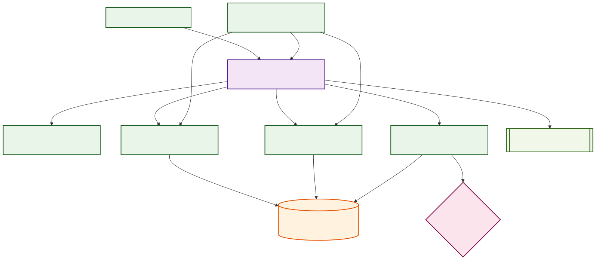

# 🎭 AI Design Theater

[](https://www.ashhill.dev/)

<!-- LATEST_DAILY_START -->
> ## 🌅 Latest Daily Design
> **Topic:** Design a secure multi-tenant SaaS platform
> **Created:** 2025-09-15 09:09:09.856829
> **Project:** 20250915_090825_Design_a_secure_multi-tenant_SaaS_platform
>
> 
>
> ## 💬 Design Conversation
>
> <details>
> <summary><strong>Click to view the AI-to-AI conversation that led to this design</strong></summary>
>
> <div style="background-color: #f6f8fa; border-radius: 6px; padding: 16px; margin: 16px 0;">
>
> <div style="margin: 12px 0; padding: 12px; border-left: 4px solid #d97706; background-color: #ffffff; border-radius: 4px;">
>
> **🧠 Idealist** *(anthropic: claude-3-5-sonnet-20240620)*
>
> Multi-tenant SaaS? Are you living in 2010? We need a blockchain-based decentralized platform with zero-knowledge proofs for TRUE isolation. Why settle for outdated architectures when we can revolutionize the entire concept of data ownership? Or are you too scared to push boundaries?
>
> </div>
>
> <div style="margin: 12px 0; padding: 12px; border-left: 4px solid #10a37f; background-color: #ffffff; border-radius: 4px;">
>
> **🤖 Cost Cutter** *(openai: gpt-4o-mini)*
>
> Oh, fantastic! Let's throw money at a blockchain solution while we’re at it! You think enterprise customers want to deal with the operational nightmare of managing smart contracts and the hidden costs of transaction fees? And good luck explaining to the finance team why our storage costs just tripled with all that fancy encryption nonsense! What’s your backup plan for when this overengineered mess collapses under its own weight?
>
> </div>
>
> <div style="margin: 12px 0; padding: 12px; border-left: 4px solid #d97706; background-color: #ffffff; border-radius: 4px;">
>
> **🧠 Idealist** *(anthropic: claude-3-5-sonnet-20240620)*
>
> Storage costs?! You're worried about STORAGE when we're on the brink of a paradigm shift? Wake up! Quantum storage is right around the corner, making your petty concerns irrelevant. And if you can't grasp zero-knowledge proofs, maybe you should go back to building static HTML sites! How exactly do you plan to ensure REAL data isolation without bleeding-edge tech? Or is your idea of "isolation" just hoping no one notices your shoddy security?
>
> </div>
>
> <div style="margin: 12px 0; padding: 12px; border-left: 4px solid #10a37f; background-color: #ffffff; border-radius: 4px;">
>
> **🤖 Cost Cutter** *(openai: gpt-4o-mini)*
>
> Desperate? Please! Your "quantum storage" fantasy is just a shiny distraction from the fact that you can't even handle basic compliance requirements! What’s your plan when the auditors come knocking and your fancy tech can't even prove data isolation? You think enterprise customers will trust you with their data when your solution is a ticking time bomb of complexity and cost? How do you plan to explain that to the board after we blow the budget on this ridiculous dream?
>
> </div>
>
> <div style="margin: 12px 0; padding: 12px; border-left: 4px solid #d97706; background-color: #ffffff; border-radius: 4px;">
>
> **🧠 Idealist** *(anthropic: claude-3-5-sonnet-20240620)*
>
> Compliance? Ha! Your outdated "solution" is begging to be hacked! We need homomorphic encryption running on a neural network to dynamically allocate secure enclaves! Anything less is practically inviting breaches. But I guess you're fine with mediocre security as long as it fits your precious budget? How will you sleep at night knowing you chose bean-counting over true innovation?
>
> </div>
>
> <div style="margin: 12px 0; padding: 12px; border-left: 4px solid #10a37f; background-color: #ffffff; border-radius: 4px;">
>
> **🤖 Cost Cutter** *(openai: gpt-4o-mini)*
>
> Oh, please! Neural networks for security? That's rich! How do you plan to maintain that nightmare? You think the ops team will love babysitting your overhyped AI while trying to keep the lights on? And don't even get me started on the storage costs—your "dynamic allocation" is just a euphemism for throwing money down the drain! How do you plan to justify this circus act when the system crashes and we’re left holding the bag?
>
> </div>
>
> <div style="margin: 12px 0; padding: 12px; border-left: 4px solid #d97706; background-color: #ffffff; border-radius: 4px;">
>
> **🧠 Idealist** *(anthropic: claude-3-5-sonnet-20240620)*
>
> Amateur? Look who's talking! Your "solution" is so outdated it belongs in a museum! We need edge computing with federated learning for real-time threat detection, not your pathetic centralized model! And storage? Distributed content-addressable storage is the only way to ensure true data integrity. But I guess that's too complex for your penny-pinching brain to comprehend? How do you plan to compete when your tech is stuck in the stone age?
>
> </div>
>
> <div style="margin: 12px 0; padding: 12px; border-left: 4px solid #10a37f; background-color: #ffffff; border-radius: 4px;">
>
> **🤖 Cost Cutter** *(openai: gpt-4o-mini)*
>
> A tornado? More like a gentle breeze! Your approach is so simplistic it’s laughable—what are you going to do when a single tenant’s data breach takes down the entire system? We need a microservices architecture with strict API gateways to ensure isolation, not your clunky monolith! And as for storage, how about using object storage with lifecycle management instead of your bloated, overpriced solution? Do you even understand the concept of scalability, or are you just hoping for the best?
>
> </div>
>
> <div style="margin: 12px 0; padding: 12px; border-left: 4px solid #d97706; background-color: #ffffff; border-radius: 4px;">
>
> **🧠 Idealist** *(anthropic: claude-3-5-sonnet-20240620)*
>
> Microservices? Object storage? Wake up, dinosaur! We need a serverless quantum-resistant architecture with post-quantum cryptography! Your outdated approach is begging to be shattered by the next wave of computing. And storage? Try holographic data crystals for true future-proofing. But I guess you're content with obsolescence as long as it's cheap? How will you explain to customers when quantum attacks render their data useless overnight?
>
> </div>
>
> <div style="margin: 12px 0; padding: 12px; border-left: 4px solid #10a37f; background-color: #ffffff; border-radius: 4px;">
>
> **🤖 Cost Cutter** *(openai: gpt-4o-mini)*
>
> Holographic data crystals? Really? You’re just throwing buzzwords around like confetti! How do you plan to implement that without a decade of R&D and a budget that would make a Fortune 500 company blush? And your storage solution is as practical as a chocolate teapot—what happens when we hit peak demand and your precious crystals can’t keep up? Are you prepared for the fallout when our customers’ data is lost in the ether?
>
> </div>
>
> <div style="margin: 12px 0; padding: 12px; border-left: 4px solid #d97706; background-color: #ffffff; border-radius: 4px;">
>
> **🧠 Idealist** *(anthropic: claude-3-5-sonnet-20240620)*
>
> Cocky? That's rich coming from someone proposing stone-age solutions! Your pathetic "peak demand" concerns are child's play for a true quantum architecture. We'll use entanglement-based storage that scales infinitely across parallel universes! But I guess that's too mind-bending for your spreadsheet-addled brain? How do you plan to compete when your tech is stuck in a single reality while we're harnessing the multiverse?
>
> </div>
>
> <div style="margin: 12px 0; padding: 12px; border-left: 4px solid #10a37f; background-color: #ffffff; border-radius: 4px;">
>
> **🤖 Cost Cutter** *(openai: gpt-4o-mini)*
>
> Entanglement-based storage? Seriously? You think we can just wave a magic wand and access parallel universes for data? Let’s get real—your ideas are a fantasy that would bankrupt us before we even get to beta! And your storage approach? It’s a ticking time bomb of complexity and cost! How do you plan to explain to the board why we’re pouring money into a sci-fi pipe dream instead of a solid, proven solution?
>
> </div>
>
> <div style="margin: 12px 0; padding: 12px; border-left: 4px solid #d97706; background-color: #ffffff; border-radius: 4px;">
>
> **🧠 Idealist** *(anthropic: claude-3-5-sonnet-20240620)*
>
> Proven solution? Ha! Your "solid" approach is a house of cards waiting to collapse! We need a self-evolving AI architecture that adapts to threats in real-time, not your static, sitting-duck design. And storage? Try a neural-net-driven data fabric that optimizes itself! But I guess innovation is too scary for you, hmm? How about this for a (Continuing exploration – FINAL DESIGN later) an adaptive, quantum-resistant platform with AI-driven security and self-optimizing storage. It's light-years beyond your prehistoric ideas. Still think you can compete with THAT?
>
> </div>
>
> </div>
>
> </details>
>
> View full: projects/20250915_090825_Design_a_secure_multi-tenant_SaaS_platform
<!-- LATEST_DAILY_END -->

Where AI personalities collaborate on software design! Watch as a visionary "Dreamer" and a pragmatic "Cost Cutter" engage in thoughtful dialogue to create balanced, well-reasoned software designs.

## 🌟 Features

- **Dual AI Personalities**: Dreamer (creative, innovative) vs Cost Cutter (practical, efficient)
- **Multi-Provider Support**: Uses both OpenAI and Anthropic for diverse perspectives (optional GPT‑5 preview override)
- **Automatic Documentation**: Generates design documents and conversation transcripts
- **Mermaid Diagrams**: Creates visual architecture diagrams automatically (component graphs at higher detail levels)
- **Keyword-Biased Idea Generation**: Bias random/daily topics via IDEA_KEYWORDS or CLI flag
- **Configurable Debate & Diagram Depth**: Control disagreement level and diagram richness via CLI or workflow inputs
- **Convergence Enforcement**: Sessions conclude with an explicit FINAL DESIGN block
- **Extensible Architecture**: Easy to add new personalities and features
- **GitHub Integration Ready**: Prepared for automated daily design sessions

## 🚀 Quick Start

### 1. Installation

```bash
# Clone the repository
git clone <your-repo-url>
cd AI-design-theater

# Install dependencies
pip install -r requirements.txt
```

### 2. Configuration

```bash
# Copy the example environment file
cp .env.example .env

# Edit .env and add your API keys
# You need at least one of: OPENAI_API_KEY or ANTHROPIC_API_KEY
```

### 3. Run Your First Design Session

```bash
# Basic usage
python cli.py run "Design a task management app"

# With additional context
python cli.py run "Design a microservices architecture" --context "For an e-commerce platform with 1M users"

# With custom limits
python cli.py run "Design a caching strategy" --max-turns 15 --max-duration 20

# Random / daily topics (with optional keyword bias)
python cli.py random --keywords security,edge
python cli.py daily-topic --keywords ai,ml
```

## 📋 Commands

### Run a Design Session
```bash
python cli.py run "Your design topic" [OPTIONS]
```

**Options:**
- `--context, -c`: Additional context for the discussion
- `--max-turns, -t`: Maximum number of conversation turns (default: 20)
- `--max-duration, -d`: Maximum duration in minutes (default: 30)
- `--debate-intensity`: 0–10 (higher = more challenge & pushback; default 5)
- `--diagram-detail`: 1–10 (>=7 component architecture graph; >=9 extended nodes)

### List Projects
```bash
python cli.py list
```

### Validate Setup
```bash
python cli.py validate
```

### Show Examples
```bash
python cli.py example
```

### Random Topic
```bash
python cli.py random [--keywords kw1,kw2]
```

### Daily Topic (deterministic by weekday)
```bash
python cli.py daily-topic [--keywords kw1,kw2]
```

## 🎭 The Personalities

### 🌟 Dreamer (Anthropic Claude)
- **Role**: Visionary and innovator
- **Focus**: User experience, cutting-edge tech, ambitious features
- **Traits**: Creative, optimistic, future-focused
- **Asks**: "How can we make this amazing?"

### 💰 Cost Cutter (OpenAI GPT-4)
- **Role**: Pragmatic efficiency expert
- **Focus**: Budget, timeline, maintainability, MVP thinking
- **Traits**: Practical, cost-conscious, risk-aware
- **Asks**: "Do we really need this? What's the simplest solution?"

## 📁 Project Structure

After running a design session, you'll get:

```
projects/
└── 20241201_120000_your_topic/
    ├── DESIGN.md              # Formatted design document
    ├── conversation.md        # Full conversation transcript
    ├── diagram.mmd           # Mermaid architecture diagram
    ├── design_document.json  # Structured design data
    └── session.json          # Raw session data
```

## 🔧 Architecture

```
src/
├── personalities/          # AI personality configurations
├── conversation/           # Conversation management
├── llm_providers/         # LLM provider abstractions
├── diagram_generation/    # Mermaid diagram creation
├── storage/              # File management
├── models.py             # Data models
├── config.py             # Configuration
└── main.py              # Main orchestrator
```

## 🎯 Example Topics

- "Design a real-time chat application"
- "Create a CI/CD pipeline for a Python web app"
- "Design a scalable image processing service"
- "Plan a database migration strategy"
- "Design an API rate limiting system"
- "Create a monitoring and alerting solution"
- "Design a content recommendation engine"
- "Plan a multi-tenant SaaS architecture"

## 🔮 Future Features

- **Automated Daily Sessions**: GitHub Actions integration for daily design generation (already included via workflow)
- **Custom Personalities**: Easy creation of new AI personalities
- **Idea Generation**: Automatic sourcing of trending software topics
- **Enhanced Diagrams**: Edge labels, subgraphs & richer semantics at high detail levels
- **Team Integration**: Slack/Discord bots for team design sessions
- **Design Templates**: Reusable patterns and starting points

## 🛠️ Development

### Adding New Personalities

1. Create personality config in `src/personalities/`
2. Define system prompts and traits
3. Choose appropriate LLM provider
4. Test with validation command

### Adding New LLM Providers

1. Implement `BaseLLMProvider` interface
2. Add provider to `PersonalityManager`
3. Update configuration and models

### Extending Diagram Generation

1. Add new diagram types to `MermaidGenerator`
2. Implement content analysis patterns
3. Test with various conversation types

## 📄 License

MIT License - see LICENSE file for details.

## 🤝 Contributing

Contributions welcome! Please read our contributing guidelines and submit pull requests for any improvements.

---

## ⚙️ Advanced Configuration

Environment variables (see `.env.example`):

| Variable | Purpose |
|----------|---------|
| OPENAI_API_KEY | OpenAI access |
| ANTHROPIC_API_KEY | Anthropic access |
| ENABLE_GPT5_PREVIEW | If true and preview model provided, Cost Cutter uses GPT‑5 preview |
| GPT5_PREVIEW_MODEL | Explicit GPT‑5 preview model id |
| OPENAI_COST_CUTTER_MODEL | Override Cost Cutter model (if not using preview) |
| IDEA_KEYWORDS | Comma-separated keywords to bias topic selection |
| DEFAULT_MAX_TURNS | Default max turns |
| DEFAULT_MAX_DURATION_MINUTES | Default duration limit |
| DEBATE_INTENSITY | (Optional) Default debate intensity override |
| DIAGRAM_DETAIL_LEVEL | (Optional) Default diagram detail level override |

CLI `--keywords` temporarily overrides IDEA_KEYWORDS for that invocation.

Convergence: The system will inject a hint near the end to produce a FINAL DESIGN summary; completion requires that block.

*Built with ❤️ for the software design community*

---

### 📚 Project Index

For a consolidated list of all generated design sessions (topic, date, and diagram preview), see `PROJECTS_INDEX.md`.