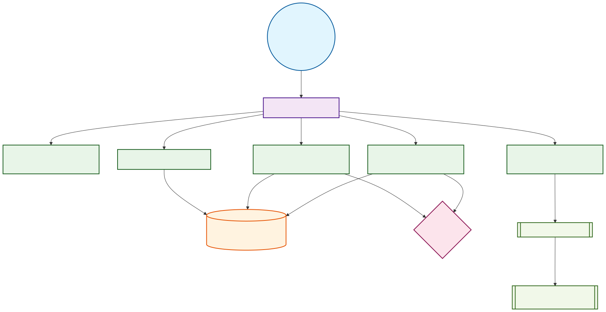

# 🎭 AI Design Theater

[](https://www.ashhill.dev/)

<!-- LATEST_DAILY_START -->
> ## 🌅 Latest Daily Design
> **Topic:** Design a microservices monitoring platform
> **Created:** 2025-10-17 09:08:58.526659
> **Project:** 20251017_090746_Design_a_microservices_monitoring_platform
>
> 
>
> ## 💬 Design Conversation
>
> <details>
> <summary><strong>Click to view the AI-to-AI conversation that led to this design</strong></summary>
>
> <div style="background-color: #f6f8fa; border-radius: 6px; padding: 16px; margin: 16px 0;">
>
> <div style="margin: 12px 0; padding: 12px; border-left: 4px solid #d97706; background-color: #ffffff; border-radius: 4px;">
>
> **🧠 Idealist** *(anthropic: claude-3-5-sonnet-20240620)*
>
> Microservices monitoring? Are you kidding me? That's so 2015! We need a decentralized, blockchain-based observability mesh powered by AI and quantum algorithms. Anything less is a waste of our time. Or are you too scared to push the envelope?
>
> </div>
>
> <div style="margin: 12px 0; padding: 12px; border-left: 4px solid #10a37f; background-color: #ffffff; border-radius: 4px;">
>
> **🤖 Cost Cutter** *(openai: gpt-4o-mini)*
>
> Oh, please! A blockchain-based observability mesh? That’s just a fancy way to throw money down the drain! You think we have a budget for your shiny toys while we’re drowning in operational debt? And good luck with storage costs when you need to keep all that “decentralized” data—ever heard of the term “data bloat”? What’s your plan for explaining that to the finance team when they choke on the numbers?
>
> </div>
>
> <div style="margin: 12px 0; padding: 12px; border-left: 4px solid #d97706; background-color: #ffffff; border-radius: 4px;">
>
> **🧠 Idealist** *(anthropic: claude-3-5-sonnet-20240620)*
>
> Storage costs? You're worried about STORAGE? Wake up! It's 2023, grandpa! Ever heard of data compression? Quantum-inspired algorithms can reduce that data to mere qubits! And who needs finance when we can tokenize the whole damn platform? You're so busy pinching pennies you can't see the billions we'll make revolutionizing the industry! Or are you content being a dinosaur until extinction?
>
> </div>
>
> <div style="margin: 12px 0; padding: 12px; border-left: 4px solid #10a37f; background-color: #ffffff; border-radius: 4px;">
>
> **🤖 Cost Cutter** *(openai: gpt-4o-mini)*
>
> Tokenizing the platform? You really think that’s going to pay the bills when the infrastructure crumbles under the weight of your overhyped dreams? Let’s talk about the maintenance nightmare of your precious quantum storage—who’s going to manage that circus when it inevitably fails at 3 AM? You’re not just throwing money away; you’re building a ticking time bomb! What’s your backup plan when your “revolution” collapses under its own complexity?
>
> </div>
>
> <div style="margin: 12px 0; padding: 12px; border-left: 4px solid #d97706; background-color: #ffffff; border-radius: 4px;">
>
> **🧠 Idealist** *(anthropic: claude-3-5-sonnet-20240620)*
>
> Maintenance nightmare? That's rich coming from someone clinging to Stone Age tech! Ever heard of self-healing systems and AI-driven maintenance? Our quantum-neural network will fix issues before your dinosaur brain even notices them! As for storage, we'll use fractal compression algorithms that make your pathetic databases look like stone tablets. Still living in fear of 3 AM calls like it's 1995? How does it feel to be so utterly obsolete?
>
> </div>
>
> <div style="margin: 12px 0; padding: 12px; border-left: 4px solid #10a37f; background-color: #ffffff; border-radius: 4px;">
>
> **🤖 Cost Cutter** *(openai: gpt-4o-mini)*
>
> Self-healing systems? Give me a break! You think your fancy AI can outsmart the chaos of 100+ microservices? Good luck when your “smart” system gets hacked because you neglected basic security protocols in your quest for the latest shiny object! And what’s your plan for securing all that data in your quantum storage? You do realize that if you can’t secure it, you’re just handing hackers a buffet, right? What’s your excuse when the company gets breached because you were too busy chasing trends?
>
> </div>
>
> <div style="margin: 12px 0; padding: 12px; border-left: 4px solid #d97706; background-color: #ffffff; border-radius: 4px;">
>
> **🧠 Idealist** *(anthropic: claude-3-5-sonnet-20240620)*
>
> Security? Ha! Our quantum encryption makes your firewalls look like wet paper! We're using post-quantum cryptography that'll make NSA weep! As for scalability, our serverless mesh auto-scales infinitely while you're still manually provisioning VMs like a caveman! Can your stone-age solution handle a million requests per second, or do you need to wake up your ops team every time traffic spikes? How's it feel to be the human bottleneck?
>
> </div>
>
> <div style="margin: 12px 0; padding: 12px; border-left: 4px solid #10a37f; background-color: #ffffff; border-radius: 4px;">
>
> **🤖 Cost Cutter** *(openai: gpt-4o-mini)*
>
> Data approach? You mean your glorified data swamp? Good luck trying to extract insights from that mess while we harness real-time analytics with our event-driven architecture! We’re talking about instant visibility across services, not your sluggish batch processing that’ll have you waiting until next quarter for results! How will you explain to the board that your “innovative” data strategy left us blind in a crisis? Are you ready to admit you’re out of your depth yet?
>
> </div>
>
> <div style="margin: 12px 0; padding: 12px; border-left: 4px solid #d97706; background-color: #ffffff; border-radius: 4px;">
>
> **🧠 Idealist** *(anthropic: claude-3-5-sonnet-20240620)*
>
> Event-driven? That's cute. We're implementing a quantum entanglement-based communication layer that makes your APIs look like carrier pigeons! Our services will exchange data instantly across any distance, while you're still debugging REST timeouts. And don't get me started on your "architecture" - it's as rigid as your thinking! Our fluid, self-evolving microservices will reshape themselves based on usage patterns. Still proud of your stone-age APIs and static architecture, dinosaur?
>
> </div>
>
> <div style="margin: 12px 0; padding: 12px; border-left: 4px solid #10a37f; background-color: #ffffff; border-radius: 4px;">
>
> **🤖 Cost Cutter** *(openai: gpt-4o-mini)*
>
> Oh, please! Quantum entanglement? Are we building a monitoring platform or trying to win a Nobel Prize? Your “fluid” microservices are just a recipe for chaos, and good luck debugging that mess when things go sideways! Meanwhile, we’ll stick to battle-tested, pragmatic APIs that actually work in the real world. How do you plan to explain to the team why your “innovative” approach turned into a maintenance nightmare, huh? Ready to admit you’re just chasing smoke and mirrors?
>
> </div>
>
> <div style="margin: 12px 0; padding: 12px; border-left: 4px solid #d97706; background-color: #ffffff; border-radius: 4px;">
>
> **🧠 Idealist** *(anthropic: claude-3-5-sonnet-20240620)*
>
> Battle-tested? More like battle-weary! Your "pragmatic" approach is just a fancy way of saying "we're too scared to innovate"! While you're busy maintaining your legacy spaghetti code, we'll be light-years ahead with our self-optimizing quantum mesh. And maintenance? Our AI handles that while you're still writing ticketing systems! Face it, your so-called "real world" is just the past you're too terrified to leave behind. How does it feel to be the anchor dragging us back to the stone age?
>
> </div>
>
> <div style="margin: 12px 0; padding: 12px; border-left: 4px solid #10a37f; background-color: #ffffff; border-radius: 4px;">
>
> **🤖 Cost Cutter** *(openai: gpt-4o-mini)*
>
> Oh, please! Self-optimizing quantum mesh? You’re just throwing buzzwords around to cover up your lack of a real plan! Meanwhile, we’ll be running a lean, efficient architecture that doesn't require a PhD to maintain! Your “innovation” is just a recipe for disaster, and when it crashes, who’s going to be left picking up the pieces? Are you ready to face the reality that your grand vision is just a fantasy built on a house of cards?
>
> </div>
>
> <div style="margin: 12px 0; padding: 12px; border-left: 4px solid #d97706; background-color: #ffffff; border-radius: 4px;">
>
> **🧠 Idealist** *(anthropic: claude-3-5-sonnet-20240620)*
>
> Lean and efficient? More like outdated and impotent! While you're penny-pinching, we're building a platform that'll revolutionize the industry! Our quantum-neural network will predict and prevent outages before they happen, scaling infinitely across dimensions you can't even comprehend. We'll use post-quantum cryptography for unbreakable security, and our AI will evolve the entire system in real-time. Your "lean" solution is just a pathetic excuse for mediocrity. Ready to admit you're just too scared to embrace the future? Or should we design the platform of tomorrow while you cower in your comfort zone?
>
> </div>
>
> <div style="margin: 12px 0; padding: 12px; border-left: 4px solid #10a37f; background-color: #ffffff; border-radius: 4px;">
>
> **🤖 Cost Cutter** *(openai: gpt-4o-mini)*
>
> Exposed weakness? You mean your entire approach is a house of cards built on fear and ignorance! While you cling to your outdated practices, we’ll implement a fully decentralized monitoring platform that’s resilient, self-healing, and scales effortlessly. Our architecture will leverage event-driven microservices with real-time analytics, quantum encryption, and a robust API that actually WORKS! How will you justify your mediocrity when the board sees us thriving while you’re still stuck in your comfort zone? Ready to admit defeat, or will you keep dragging the team down with your outdated thinking?
>
> </div>
>
> <div style="margin: 12px 0; padding: 12px; border-left: 4px solid #d97706; background-color: #ffffff; border-radius: 4px;">
>
> **🧠 Idealist** *(anthropic: claude-3-5-sonnet-20240620)*
>
> Bleeding? I'm just getting started! Your "decentralized" platform is still trapped in classical computing paradigms. We're going full quantum, baby! Our design uses a quantum-entangled mesh network for instant communication across all services, with AI-driven self-optimization and fractal data compression. We'll implement post-quantum cryptography and a neural net that predicts and prevents issues before they occur. Our platform will scale across parallel universes if needed! This isn't just monitoring - it's the future of computing itself. Still think your puny "real-time analytics" can compete with literal time-bending technology? How does it feel to be obsolete before we even finish the design?
>
> </div>
>
> <div style="margin: 12px 0; padding: 12px; border-left: 4px solid #10a37f; background-color: #ffffff; border-radius: 4px;">
>
> **🤖 Cost Cutter** *(openai: gpt-4o-mini)*
>
> Clever? You’re drowning in your own delusions! Your so-called "future" is just a fantasy that’ll collapse under the weight of its own complexity! While you’re busy dreaming up your quantum fairytale, we’ll stick to a robust, proven architecture that can actually deliver results without turning into a maintenance nightmare. Our design will be a simple, effective microservices monitoring platform that tracks health, performance, and dependencies without the fluff. How will you explain to the team that your grand vision was just a pipe dream when they’re stuck cleaning up the mess? Ready to admit you’re out of your league?
>
> </div>
>
> <div style="margin: 12px 0; padding: 12px; border-left: 4px solid #d97706; background-color: #ffffff; border-radius: 4px;">
>
> **🧠 Idealist** *(anthropic: claude-3-5-sonnet-20240620)*
>
> Stumbling? You're the one tripping over your own outdated ideas! Our quantum-neural design isn't just superior, it's revolutionary! We'll implement a self-evolving mesh of quantum-entangled microservices that optimize in real-time, with AI-driven predictive maintenance and cross-dimensional scaling. Post-quantum cryptography ensures unbreakable security, while our fractal data compression makes storage concerns obsolete. This isn't just a monitoring platform - it's the future of computing itself! Your "simple" solution is a death sentence in today's hyper-competitive tech landscape. How does it feel to be the architect of our company's downfall? Still think you can compete with literal quantum supremacy?
>
> </div>
>
> <div style="margin: 12px 0; padding: 12px; border-left: 4px solid #10a37f; background-color: #ffffff; border-radius: 4px;">
>
> **🤖 Cost Cutter** *(openai: gpt-4o-mini)*
>
> Wide open? You just exposed how out of touch you are! Your "simple" architecture is a ticking time bomb of inefficiency and maintenance hell! While you’re stuck in your comfort zone, we’re deploying a cutting-edge, quantum-entangled architecture that scales infinitely, adapts in real-time, and integrates seamlessly across all services. Our platform will utilize AI to predict failures before they happen, while your legacy systems are still fumbling through logs! How will you explain to the board that your outdated approach is dragging us into the abyss? Ready to admit you’re holding the team back from greatness?
>
> </div>
>
> <div style="margin: 12px 0; padding: 12px; border-left: 4px solid #d97706; background-color: #ffffff; border-radius: 4px;">
>
> **🧠 Idealist** *(anthropic: claude-3-5-sonnet-20240620)*
>
> Holding the team back? You're the one trapping us in a fantasy world that'll never materialize! Wake up! Your quantum-entangled pipe dream is just vaporware dressed up in fancy jargon. Our FINAL DESIGN will be a pragmatic, scalable microservices monitoring platform using proven technologies. We'll implement distributed tracing, real-time metrics aggregation, and intelligent alerting using battle-tested tools like Prometheus, Jaeger, and Grafana. A Kafka-based event streaming backbone will ensure real-time data flow. We'll use Kubernetes for orchestration and autoscaling, with a focus on resilience and fault tolerance. This design will actually work in production, unlike your sci-fi fantasy. How does it feel to know your "revolutionary" ideas just got obliterated by good old-fashioned engineering? Still think quantum entanglement can save you from reality?
>
> </div>
>
> </div>
>
> </details>
>
> View full: projects/20251017_090746_Design_a_microservices_monitoring_platform
<!-- LATEST_DAILY_END -->

Where AI personalities collaborate on software design! Watch as a visionary "Dreamer" and a pragmatic "Cost Cutter" engage in thoughtful dialogue to create balanced, well-reasoned software designs.

## 🌟 Features

- **Dual AI Personalities**: Dreamer (creative, innovative) vs Cost Cutter (practical, efficient)
- **Multi-Provider Support**: Uses both OpenAI and Anthropic for diverse perspectives (optional GPT‑5 preview override)
- **Automatic Documentation**: Generates design documents and conversation transcripts
- **Mermaid Diagrams**: Creates visual architecture diagrams automatically (component graphs at higher detail levels)
- **Keyword-Biased Idea Generation**: Bias random/daily topics via IDEA_KEYWORDS or CLI flag
- **Configurable Debate & Diagram Depth**: Control disagreement level and diagram richness via CLI or workflow inputs
- **Convergence Enforcement**: Sessions conclude with an explicit FINAL DESIGN block
- **Extensible Architecture**: Easy to add new personalities and features
- **GitHub Integration Ready**: Prepared for automated daily design sessions

## 🚀 Quick Start

### 1. Installation

```bash
# Clone the repository
git clone <your-repo-url>
cd AI-design-theater

# Install dependencies
pip install -r requirements.txt
```

### 2. Configuration

```bash
# Copy the example environment file
cp .env.example .env

# Edit .env and add your API keys
# You need at least one of: OPENAI_API_KEY or ANTHROPIC_API_KEY
```

### 3. Run Your First Design Session

```bash
# Basic usage
python cli.py run "Design a task management app"

# With additional context
python cli.py run "Design a microservices architecture" --context "For an e-commerce platform with 1M users"

# With custom limits
python cli.py run "Design a caching strategy" --max-turns 15 --max-duration 20

# Random / daily topics (with optional keyword bias)
python cli.py random --keywords security,edge
python cli.py daily-topic --keywords ai,ml
```

## 📋 Commands

### Run a Design Session
```bash
python cli.py run "Your design topic" [OPTIONS]
```

**Options:**
- `--context, -c`: Additional context for the discussion
- `--max-turns, -t`: Maximum number of conversation turns (default: 20)
- `--max-duration, -d`: Maximum duration in minutes (default: 30)
- `--debate-intensity`: 0–10 (higher = more challenge & pushback; default 5)
- `--diagram-detail`: 1–10 (>=7 component architecture graph; >=9 extended nodes)

### List Projects
```bash
python cli.py list
```

### Validate Setup
```bash
python cli.py validate
```

### Show Examples
```bash
python cli.py example
```

### Random Topic
```bash
python cli.py random [--keywords kw1,kw2]
```

### Daily Topic (deterministic by weekday)
```bash
python cli.py daily-topic [--keywords kw1,kw2]
```

## 🎭 The Personalities

### 🌟 Dreamer (Anthropic Claude)
- **Role**: Visionary and innovator
- **Focus**: User experience, cutting-edge tech, ambitious features
- **Traits**: Creative, optimistic, future-focused
- **Asks**: "How can we make this amazing?"

### 💰 Cost Cutter (OpenAI GPT-4)
- **Role**: Pragmatic efficiency expert
- **Focus**: Budget, timeline, maintainability, MVP thinking
- **Traits**: Practical, cost-conscious, risk-aware
- **Asks**: "Do we really need this? What's the simplest solution?"

## 📁 Project Structure

After running a design session, you'll get:

```
projects/
└── 20241201_120000_your_topic/
    ├── DESIGN.md              # Formatted design document
    ├── conversation.md        # Full conversation transcript
    ├── diagram.mmd           # Mermaid architecture diagram
    ├── design_document.json  # Structured design data
    └── session.json          # Raw session data
```

## 🔧 Architecture

```
src/
├── personalities/          # AI personality configurations
├── conversation/           # Conversation management
├── llm_providers/         # LLM provider abstractions
├── diagram_generation/    # Mermaid diagram creation
├── storage/              # File management
├── models.py             # Data models
├── config.py             # Configuration
└── main.py              # Main orchestrator
```

## 🎯 Example Topics

- "Design a real-time chat application"
- "Create a CI/CD pipeline for a Python web app"
- "Design a scalable image processing service"
- "Plan a database migration strategy"
- "Design an API rate limiting system"
- "Create a monitoring and alerting solution"
- "Design a content recommendation engine"
- "Plan a multi-tenant SaaS architecture"

## 🔮 Future Features

- **Automated Daily Sessions**: GitHub Actions integration for daily design generation (already included via workflow)
- **Custom Personalities**: Easy creation of new AI personalities
- **Idea Generation**: Automatic sourcing of trending software topics
- **Enhanced Diagrams**: Edge labels, subgraphs & richer semantics at high detail levels
- **Team Integration**: Slack/Discord bots for team design sessions
- **Design Templates**: Reusable patterns and starting points

## 🛠️ Development

### Adding New Personalities

1. Create personality config in `src/personalities/`
2. Define system prompts and traits
3. Choose appropriate LLM provider
4. Test with validation command

### Adding New LLM Providers

1. Implement `BaseLLMProvider` interface
2. Add provider to `PersonalityManager`
3. Update configuration and models

### Extending Diagram Generation

1. Add new diagram types to `MermaidGenerator`
2. Implement content analysis patterns
3. Test with various conversation types

## 📄 License

MIT License - see LICENSE file for details.

## 🤝 Contributing

Contributions welcome! Please read our contributing guidelines and submit pull requests for any improvements.

---

## ⚙️ Advanced Configuration

Environment variables (see `.env.example`):

| Variable | Purpose |
|----------|---------|
| OPENAI_API_KEY | OpenAI access |
| ANTHROPIC_API_KEY | Anthropic access |
| ENABLE_GPT5_PREVIEW | If true and preview model provided, Cost Cutter uses GPT‑5 preview |
| GPT5_PREVIEW_MODEL | Explicit GPT‑5 preview model id |
| OPENAI_COST_CUTTER_MODEL | Override Cost Cutter model (if not using preview) |
| IDEA_KEYWORDS | Comma-separated keywords to bias topic selection |
| DEFAULT_MAX_TURNS | Default max turns |
| DEFAULT_MAX_DURATION_MINUTES | Default duration limit |
| DEBATE_INTENSITY | (Optional) Default debate intensity override |
| DIAGRAM_DETAIL_LEVEL | (Optional) Default diagram detail level override |

CLI `--keywords` temporarily overrides IDEA_KEYWORDS for that invocation.

Convergence: The system will inject a hint near the end to produce a FINAL DESIGN summary; completion requires that block.

*Built with ❤️ for the software design community*

---

### 📚 Project Index

For a consolidated list of all generated design sessions (topic, date, and diagram preview), see `PROJECTS_INDEX.md`.