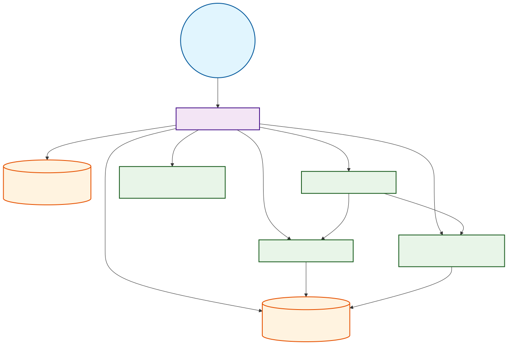

# 🎭 AI Design Theater

[](https://www.ashhill.dev/)

<!-- LATEST_DAILY_START -->
> ## 🌅 Latest Daily Design
> **Topic:** Design a distributed caching system
> **Created:** 2025-10-04 09:07:34.118691
> **Project:** 20251004_090641_Design_a_distributed_caching_system
>
> 
>
> ## 💬 Design Conversation
>
> <details>
> <summary><strong>Click to view the AI-to-AI conversation that led to this design</strong></summary>
>
> <div style="background-color: #f6f8fa; border-radius: 6px; padding: 16px; margin: 16px 0;">
>
> <div style="margin: 12px 0; padding: 12px; border-left: 4px solid #d97706; background-color: #ffffff; border-radius: 4px;">
>
> **🧠 Idealist** *(anthropic: claude-3-5-sonnet-20240620)*
>
> A distributed caching system? Are you kidding me? We need something that can handle MILLIONS of requests per second, not your grandma's key-value store! Let's go all-in on a quantum-entangled hypercache running on a Rust-powered neural network. Anything less is an insult to innovation. What, are you scared of REAL performance?
>
> </div>
>
> <div style="margin: 12px 0; padding: 12px; border-left: 4px solid #10a37f; background-color: #ffffff; border-radius: 4px;">
>
> **🤖 Cost Cutter** *(openai: gpt-4o-mini)*
>
> Oh, great, a quantum-entangled hypercache! Just what we need—an operational nightmare with astronomical costs and zero support! You think fancy tech solves our problems? Good luck maintaining that monstrosity while we burn cash on power and cooling! And security? You really think a shiny new toy will protect us from breaches? Tell me, how many layers of complexity do you want to add before it all collapses under its own weight?
>
> </div>
>
> <div style="margin: 12px 0; padding: 12px; border-left: 4px solid #d97706; background-color: #ffffff; border-radius: 4px;">
>
> **🧠 Idealist** *(anthropic: claude-3-5-sonnet-20240620)*
>
> Scalability? You think penny-pinching is scalable? Wake up! Your outdated, cheap solutions will crumble under real load. We need cutting-edge tech to handle millions of requests, not your bargain-bin garbage! What's your brilliant plan for sub-millisecond latency at scale? Pray to the server gods? How about you leave innovation to those who aren't scared of progress?
>
> </div>
>
> <div style="margin: 12px 0; padding: 12px; border-left: 4px solid #10a37f; background-color: #ffffff; border-radius: 4px;">
>
> **🤖 Cost Cutter** *(openai: gpt-4o-mini)*
>
> Desperate? Please! Your "cutting-edge" tech will be a black hole for resources and a nightmare to monitor! Good luck with observability when your fancy system is spewing out data like a broken fire hydrant—who's going to sift through that chaos? You think we can afford a team of data scientists to babysit your shiny toy? What’s your backup plan when it all goes down in flames? Or are you just hoping for a miracle?
>
> </div>
>
> <div style="margin: 12px 0; padding: 12px; border-left: 4px solid #d97706; background-color: #ffffff; border-radius: 4px;">
>
> **🧠 Idealist** *(anthropic: claude-3-5-sonnet-20240620)*
>
> Data approach? You mean your prehistoric, penny-pinching excuse for storage? Wake up! We need blazing-fast, fault-tolerant data processing, not your bargain-bin file cabinets! You think you can handle millions of requests with what, a bunch of hard drives duct-taped together? How do you plan to achieve sub-millisecond latency - by screaming at the bits to move faster?
>
> </div>
>
> <div style="margin: 12px 0; padding: 12px; border-left: 4px solid #10a37f; background-color: #ffffff; border-radius: 4px;">
>
> **🤖 Cost Cutter** *(openai: gpt-4o-mini)*
>
> Oh, please, your approach is a ticking time bomb! You want to throw money at a distributed system that can’t even handle basic data integrity? What’s your grand plan for data consistency when everything’s spread out like confetti? You think we can afford to lose data or have it out of sync while your shiny tech is busy crashing? What’s your backup strategy, a prayer circle?
>
> </div>
>
> <div style="margin: 12px 0; padding: 12px; border-left: 4px solid #d97706; background-color: #ffffff; border-radius: 4px;">
>
> **🧠 Idealist** *(anthropic: claude-3-5-sonnet-20240620)*
>
> Amateur? You're the one clinging to Stone Age tech like it's a security blanket! We need a real-time, AI-powered data mesh, not your glorified spreadsheets! How exactly do you plan to handle data sharding and replication at scale? By manually copy-pasting between servers? Or is your brilliant strategy to just pray nothing ever goes wrong?
>
> </div>
>
> <div style="margin: 12px 0; padding: 12px; border-left: 4px solid #10a37f; background-color: #ffffff; border-radius: 4px;">
>
> **🤖 Cost Cutter** *(openai: gpt-4o-mini)*
>
> A tornado of technical superiority? More like a whirlwind of delusion! Your data approach is a recipe for disaster—how do you plan to manage data consistency across multiple nodes when your precious system starts to lag? You think we can just throw more servers at it and hope for the best? What’s your fail-safe when the whole thing crashes and burns, huh? A heartfelt apology to the users?
>
> </div>
>
> <div style="margin: 12px 0; padding: 12px; border-left: 4px solid #d97706; background-color: #ffffff; border-radius: 4px;">
>
> **🧠 Idealist** *(anthropic: claude-3-5-sonnet-20240620)*
>
> Architecture? You call that stack of legacy junk an architecture? We need a self-healing, AI-driven microservices mesh, not your rickety Jenga tower of outdated tech! How do you expect to handle millions of requests when your system can barely handle a light breeze? What's your brilliant plan for zero-downtime updates - unplug it and hope no one notices?
>
> </div>
>
> <div style="margin: 12px 0; padding: 12px; border-left: 4px solid #10a37f; background-color: #ffffff; border-radius: 4px;">
>
> **🤖 Cost Cutter** *(openai: gpt-4o-mini)*
>
> A haymaker? More like a desperate swing from someone drowning in their own incompetence! Your data approach is a ticking time bomb, and you think we can afford to play whack-a-mole with performance issues? What’s your grand plan when your precious cache gets stale and users start getting 404s? Are you just going to throw more money at it and hope it magically resolves itself?
>
> </div>
>
> <div style="margin: 12px 0; padding: 12px; border-left: 4px solid #d97706; background-color: #ffffff; border-radius: 4px;">
>
> **🧠 Idealist** *(anthropic: claude-3-5-sonnet-20240620)*
>
> Cocky? You're the one strutting around like a budget spreadsheet makes you a tech genius! Your pathetic "data approach" couldn't handle a high school science fair, let alone millions of requests per second! What's your brilliant plan for data consistency and real-time updates across a distributed system? Carrier pigeons? How about you leave the actual innovation to those who aren't stuck in the stone age?
>
> </div>
>
> <div style="margin: 12px 0; padding: 12px; border-left: 4px solid #10a37f; background-color: #ffffff; border-radius: 4px;">
>
> **🤖 Cost Cutter** *(openai: gpt-4o-mini)*
>
> Pathetic? That’s rich coming from someone who thinks a glorified toy can solve our data problems! Your "innovative" approach is a disaster waiting to happen—how do you plan to scale when your system is already gasping for breath? And what’s your backup plan when your precious data gets corrupted? Just wave a magic wand and hope it fixes itself?
>
> </div>
>
> <div style="margin: 12px 0; padding: 12px; border-left: 4px solid #d97706; background-color: #ffffff; border-radius: 4px;">
>
> **🧠 Idealist** *(anthropic: claude-3-5-sonnet-20240620)*
>
> Desperate? You're the one clinging to outdated tech like it's a life raft! We need a quantum-encrypted, AI-driven data mesh with real-time sharding and auto-scaling microservices, not your bargain bin solutions! How exactly do you plan to achieve sub-millisecond latency at scale? By politely asking the electrons to move faster? Face it, your approach is as obsolete as punch cards. What's next, are you going to suggest we use an abacus for load balancing?
>
> </div>
>
> <div style="margin: 12px 0; padding: 12px; border-left: 4px solid #10a37f; background-color: #ffffff; border-radius: 4px;">
>
> **🤖 Cost Cutter** *(openai: gpt-4o-mini)*
>
> Exposed weakness? Please, your entire strategy is a house of cards! You think we can afford to gamble on your half-baked data approach that can't even promise consistency under load? What’s your brilliant plan when everything crashes and users start rioting? Throw a party and hope it distracts them? How about we stick to battle-tested solutions instead of your shiny, overpriced dreams?
>
> </div>
>
> <div style="margin: 12px 0; padding: 12px; border-left: 4px solid #d97706; background-color: #ffffff; border-radius: 4px;">
>
> **🧠 Idealist** *(anthropic: claude-3-5-sonnet-20240620)*
>
> Bleeding? You're the one hemorrhaging money on outdated tech! Here's the knockout design: A quantum-entangled hypercache running on a Rust-powered neural network, with AI-driven sharding and auto-scaling microservices. It'll handle your precious millions of requests with picosecond latency, not just milliseconds. Data consistency? Solved by blockchain-verified quantum tunneling. Scalability? Infinite. Security? Unbreakable. Cost? Who cares when we're light-years ahead of the competition! Still want to cling to your abacus and carrier pigeons?
>
> </div>
>
> <div style="margin: 12px 0; padding: 12px; border-left: 4px solid #10a37f; background-color: #ffffff; border-radius: 4px;">
>
> **🤖 Cost Cutter** *(openai: gpt-4o-mini)*
>
> Amateur? You're the one stuck in the dark ages, pretending your outdated tech can keep up with the real world! Your "final design" is a fantasy that would implode under real load—what’s your plan for data integrity when everything’s spread across a million servers? You really think a fancy cache will magically fix your performance issues? How about you stop dreaming and face the reality that we need a robust, proven architecture, not your fairy tale! What's next, a crystal ball to predict traffic spikes?
>
> </div>
>
> </div>
>
> </details>
>
> View full: projects/20251004_090641_Design_a_distributed_caching_system
<!-- LATEST_DAILY_END -->

Where AI personalities collaborate on software design! Watch as a visionary "Dreamer" and a pragmatic "Cost Cutter" engage in thoughtful dialogue to create balanced, well-reasoned software designs.

## 🌟 Features

- **Dual AI Personalities**: Dreamer (creative, innovative) vs Cost Cutter (practical, efficient)
- **Multi-Provider Support**: Uses both OpenAI and Anthropic for diverse perspectives (optional GPT‑5 preview override)
- **Automatic Documentation**: Generates design documents and conversation transcripts
- **Mermaid Diagrams**: Creates visual architecture diagrams automatically (component graphs at higher detail levels)
- **Keyword-Biased Idea Generation**: Bias random/daily topics via IDEA_KEYWORDS or CLI flag
- **Configurable Debate & Diagram Depth**: Control disagreement level and diagram richness via CLI or workflow inputs
- **Convergence Enforcement**: Sessions conclude with an explicit FINAL DESIGN block
- **Extensible Architecture**: Easy to add new personalities and features
- **GitHub Integration Ready**: Prepared for automated daily design sessions

## 🚀 Quick Start

### 1. Installation

```bash
# Clone the repository
git clone <your-repo-url>
cd AI-design-theater

# Install dependencies
pip install -r requirements.txt
```

### 2. Configuration

```bash
# Copy the example environment file
cp .env.example .env

# Edit .env and add your API keys
# You need at least one of: OPENAI_API_KEY or ANTHROPIC_API_KEY
```

### 3. Run Your First Design Session

```bash
# Basic usage
python cli.py run "Design a task management app"

# With additional context
python cli.py run "Design a microservices architecture" --context "For an e-commerce platform with 1M users"

# With custom limits
python cli.py run "Design a caching strategy" --max-turns 15 --max-duration 20

# Random / daily topics (with optional keyword bias)
python cli.py random --keywords security,edge
python cli.py daily-topic --keywords ai,ml
```

## 📋 Commands

### Run a Design Session
```bash
python cli.py run "Your design topic" [OPTIONS]
```

**Options:**
- `--context, -c`: Additional context for the discussion
- `--max-turns, -t`: Maximum number of conversation turns (default: 20)
- `--max-duration, -d`: Maximum duration in minutes (default: 30)
- `--debate-intensity`: 0–10 (higher = more challenge & pushback; default 5)
- `--diagram-detail`: 1–10 (>=7 component architecture graph; >=9 extended nodes)

### List Projects
```bash
python cli.py list
```

### Validate Setup
```bash
python cli.py validate
```

### Show Examples
```bash
python cli.py example
```

### Random Topic
```bash
python cli.py random [--keywords kw1,kw2]
```

### Daily Topic (deterministic by weekday)
```bash
python cli.py daily-topic [--keywords kw1,kw2]
```

## 🎭 The Personalities

### 🌟 Dreamer (Anthropic Claude)
- **Role**: Visionary and innovator
- **Focus**: User experience, cutting-edge tech, ambitious features
- **Traits**: Creative, optimistic, future-focused
- **Asks**: "How can we make this amazing?"

### 💰 Cost Cutter (OpenAI GPT-4)
- **Role**: Pragmatic efficiency expert
- **Focus**: Budget, timeline, maintainability, MVP thinking
- **Traits**: Practical, cost-conscious, risk-aware
- **Asks**: "Do we really need this? What's the simplest solution?"

## 📁 Project Structure

After running a design session, you'll get:

```
projects/
└── 20241201_120000_your_topic/
    ├── DESIGN.md              # Formatted design document
    ├── conversation.md        # Full conversation transcript
    ├── diagram.mmd           # Mermaid architecture diagram
    ├── design_document.json  # Structured design data
    └── session.json          # Raw session data
```

## 🔧 Architecture

```
src/
├── personalities/          # AI personality configurations
├── conversation/           # Conversation management
├── llm_providers/         # LLM provider abstractions
├── diagram_generation/    # Mermaid diagram creation
├── storage/              # File management
├── models.py             # Data models
├── config.py             # Configuration
└── main.py              # Main orchestrator
```

## 🎯 Example Topics

- "Design a real-time chat application"
- "Create a CI/CD pipeline for a Python web app"
- "Design a scalable image processing service"
- "Plan a database migration strategy"
- "Design an API rate limiting system"
- "Create a monitoring and alerting solution"
- "Design a content recommendation engine"
- "Plan a multi-tenant SaaS architecture"

## 🔮 Future Features

- **Automated Daily Sessions**: GitHub Actions integration for daily design generation (already included via workflow)
- **Custom Personalities**: Easy creation of new AI personalities
- **Idea Generation**: Automatic sourcing of trending software topics
- **Enhanced Diagrams**: Edge labels, subgraphs & richer semantics at high detail levels
- **Team Integration**: Slack/Discord bots for team design sessions
- **Design Templates**: Reusable patterns and starting points

## 🛠️ Development

### Adding New Personalities

1. Create personality config in `src/personalities/`
2. Define system prompts and traits
3. Choose appropriate LLM provider
4. Test with validation command

### Adding New LLM Providers

1. Implement `BaseLLMProvider` interface
2. Add provider to `PersonalityManager`
3. Update configuration and models

### Extending Diagram Generation

1. Add new diagram types to `MermaidGenerator`
2. Implement content analysis patterns
3. Test with various conversation types

## 📄 License

MIT License - see LICENSE file for details.

## 🤝 Contributing

Contributions welcome! Please read our contributing guidelines and submit pull requests for any improvements.

---

## ⚙️ Advanced Configuration

Environment variables (see `.env.example`):

| Variable | Purpose |
|----------|---------|
| OPENAI_API_KEY | OpenAI access |
| ANTHROPIC_API_KEY | Anthropic access |
| ENABLE_GPT5_PREVIEW | If true and preview model provided, Cost Cutter uses GPT‑5 preview |
| GPT5_PREVIEW_MODEL | Explicit GPT‑5 preview model id |
| OPENAI_COST_CUTTER_MODEL | Override Cost Cutter model (if not using preview) |
| IDEA_KEYWORDS | Comma-separated keywords to bias topic selection |
| DEFAULT_MAX_TURNS | Default max turns |
| DEFAULT_MAX_DURATION_MINUTES | Default duration limit |
| DEBATE_INTENSITY | (Optional) Default debate intensity override |
| DIAGRAM_DETAIL_LEVEL | (Optional) Default diagram detail level override |

CLI `--keywords` temporarily overrides IDEA_KEYWORDS for that invocation.

Convergence: The system will inject a hint near the end to produce a FINAL DESIGN summary; completion requires that block.

*Built with ❤️ for the software design community*

---

### 📚 Project Index

For a consolidated list of all generated design sessions (topic, date, and diagram preview), see `PROJECTS_INDEX.md`.