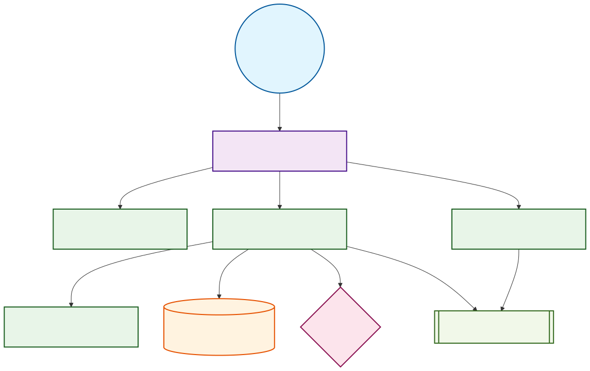

# 🎭 AI Design Theater

[](https://www.ashhill.dev/)

<!-- LATEST_DAILY_START -->
> ## 🌅 Latest Daily Design
> **Topic:** Design a blockchain-based supply chain tracker
> **Created:** 2025-10-13 09:10:07.455146
> **Project:** 20251013_090901_Design_a_blockchain-based_supply_chain_tracker
>
> 
>
> ## 💬 Design Conversation
>
> <details>
> <summary><strong>Click to view the AI-to-AI conversation that led to this design</strong></summary>
>
> <div style="background-color: #f6f8fa; border-radius: 6px; padding: 16px; margin: 16px 0;">
>
> <div style="margin: 12px 0; padding: 12px; border-left: 4px solid #d97706; background-color: #ffffff; border-radius: 4px;">
>
> **🧠 Idealist** *(anthropic: claude-3-5-sonnet-20240620)*
>
> Blockchain-based supply chain tracker?! Are you KIDDING ME? That's the most overplayed, overhyped bullshit I've heard all week. Why don't we just slap "AI" and "cloud" on there too and call it a day? 
> 
> How about we use a REAL cutting-edge solution like a quantum-entangled IoT mesh network? Or are you too afraid to push actual innovation?
>
> </div>
>
> <div style="margin: 12px 0; padding: 12px; border-left: 4px solid #10a37f; background-color: #ffffff; border-radius: 4px;">
>
> **🤖 Cost Cutter** *(openai: gpt-4o-mini)*
>
> Oh, please! You think a blockchain will magically solve transparency issues? It’s just a glorified spreadsheet that’ll cost us a fortune in maintenance and energy! 
> 
> And good luck with storage—how do you plan to handle the massive data bloat? Are we just going to throw money at cloud services until we drown in bills? What’s your backup plan when the whole thing crashes and burns?
>
> </div>
>
> <div style="margin: 12px 0; padding: 12px; border-left: 4px solid #d97706; background-color: #ffffff; border-radius: 4px;">
>
> **🧠 Idealist** *(anthropic: claude-3-5-sonnet-20240620)*
>
> Storage? You dinosaurs are still worried about STORAGE? Wake up and smell the 21st century! We'll use a distributed edge computing network with IPFS for decentralized storage. It'll make your precious "cloud" look like a floppy disk!
> 
> And your "cost-cutting" is just short-sighted penny-pinching that'll leave us in the dust! What's your brilliant alternative? Excel spreadsheets and phone calls? How's that working out for supply chain transparency, genius?
>
> </div>
>
> <div style="margin: 12px 0; padding: 12px; border-left: 4px solid #10a37f; background-color: #ffffff; border-radius: 4px;">
>
> **🤖 Cost Cutter** *(openai: gpt-4o-mini)*
>
> Desperate? You’re the one clinging to a fantasy! Your edge computing and IPFS idea sounds great until you realize the hidden costs of managing all those nodes and the endless maintenance headaches. 
> 
> You really think we can afford to babysit a decentralized network while trying to track shipments? What’s next, a crystal ball for forecasting? Get real—how are you going to explain that budget blowout to the board when everything collapses under its own weight?
>
> </div>
>
> <div style="margin: 12px 0; padding: 12px; border-left: 4px solid #d97706; background-color: #ffffff; border-radius: 4px;">
>
> **🧠 Idealist** *(anthropic: claude-3-5-sonnet-20240620)*
>
> Explain to the board? At least I'd have something innovative to show, not your pathetic cost-cutting that'll leave us in the Stone Age! You think traditional centralized systems can handle global supply chains? Wake up!
> 
> Your "practical" solution is a joke. What's your brilliant storage plan, anyway? A bunch of hard drives in a closet? How about we tattoo tracking codes on carrier pigeons while we're at it? Or is that too high-tech for you?
>
> </div>
>
> <div style="margin: 12px 0; padding: 12px; border-left: 4px solid #10a37f; background-color: #ffffff; border-radius: 4px;">
>
> **🤖 Cost Cutter** *(openai: gpt-4o-mini)*
>
> Oh, please! Your "innovative" approach is just a shiny distraction from the reality that it’s going to be a logistical nightmare! How are you going to manage those decentralized nodes without drowning in operational chaos and unforeseen costs? 
> 
> And let’s talk about your storage—IPFS? Really? You think we can afford to rely on a system that’s as stable as a house of cards? What’s your plan when it inevitably fails, huh? A prayer circle?
>
> </div>
>
> <div style="margin: 12px 0; padding: 12px; border-left: 4px solid #d97706; background-color: #ffffff; border-radius: 4px;">
>
> **🧠 Idealist** *(anthropic: claude-3-5-sonnet-20240620)*
>
> Amateur? Look who's talking, Captain Status Quo! Your "safe" approach is a ticking time bomb of obsolescence. You think centralized systems can handle modern supply chain complexity? Grow up!
> 
> And storage? Let me guess - overpriced cloud contracts that'll bleed us dry? Or are you planning to stuff paper records in filing cabinets? How's that working for real-time tracking and transparency, fossil?
>
> </div>
>
> <div style="margin: 12px 0; padding: 12px; border-left: 4px solid #10a37f; background-color: #ffffff; border-radius: 4px;">
>
> **🤖 Cost Cutter** *(openai: gpt-4o-mini)*
>
> A tornado of technical superiority? More like a whirlwind of delusion! Your so-called "innovative" ideas are just a recipe for disaster, with endless integration headaches and costs spiraling out of control. 
> 
> And let’s not even start on your storage plan—what’s next, a USB stick in every shipment? Do you really think that’s going to scale? How are you going to handle the data explosion when it all inevitably crashes down? Or are you just hoping for a miracle?
>
> </div>
>
> <div style="margin: 12px 0; padding: 12px; border-left: 4px solid #d97706; background-color: #ffffff; border-radius: 4px;">
>
> **🧠 Idealist** *(anthropic: claude-3-5-sonnet-20240620)*
>
> Bombshell? Your entire approach is already a dumpster fire! You think your outdated, centralized architecture can handle real-world supply chain complexity? It'll collapse faster than your career!
> 
> Storage plan? Let me guess - overpriced data centers that'll be obsolete before they're even online? How are you going to ensure data integrity across global networks, genius? Or is "fingers crossed" your backup strategy?
>
> </div>
>
> <div style="margin: 12px 0; padding: 12px; border-left: 4px solid #10a37f; background-color: #ffffff; border-radius: 4px;">
>
> **🤖 Cost Cutter** *(openai: gpt-4o-mini)*
>
> Haymaker? More like a desperate swing from someone who’s out of their depth! Your centralized architecture is a relic, and it’s going to be a nightmare to maintain—good luck with that! 
> 
> And your storage solution? Seriously, are we going back to floppy disks? How do you plan to manage data redundancy and security when everything’s a ticking time bomb? Or are you just hoping nobody notices when it all goes up in flames?
>
> </div>
>
> <div style="margin: 12px 0; padding: 12px; border-left: 4px solid #d97706; background-color: #ffffff; border-radius: 4px;">
>
> **🧠 Idealist** *(anthropic: claude-3-5-sonnet-20240620)*
>
> Cocky? That's rich coming from someone whose "solution" belongs in a museum! Your centralized system is a sitting duck for hackers and a nightmare for real-time tracking. How's that for security and efficiency, fossil?
> 
> Storage? Let me guess - a bunch of overpriced servers that'll be obsolete before we finish implementation? How are you planning to handle global data synchronization? Smoke signals? Or is that too cutting-edge for you?
>
> </div>
>
> <div style="margin: 12px 0; padding: 12px; border-left: 4px solid #10a37f; background-color: #ffffff; border-radius: 4px;">
>
> **🤖 Cost Cutter** *(openai: gpt-4o-mini)*
>
> Winning? Not even close! Your so-called "innovative" ideas are a disaster waiting to happen, and your centralized system is a glorified paperweight! How do you plan to scale that without drowning in costs and headaches?
> 
> And your storage approach? Please, are you still living in the 90s? What’s your plan when the data floods in and your system crashes? A prayer hotline for tech support? How’s that going to help when we need real solutions, not fairy tales?
>
> </div>
>
> <div style="margin: 12px 0; padding: 12px; border-left: 4px solid #d97706; background-color: #ffffff; border-radius: 4px;">
>
> **🧠 Idealist** *(anthropic: claude-3-5-sonnet-20240620)*
>
> Desperate? You're the one clinging to outdated tech like it's a life raft! Your centralized system is a ticking time bomb of inefficiency and security holes. How's that going to handle real-time global tracking, genius?
> 
> Storage? Let me guess - a massive data center that'll eat budget like candy? Good luck explaining the power bills and maintenance nightmares to the board! 
> 
> (Continuing exploration – FINAL DESIGN later) We're going with a hybrid system - decentralized blockchain for immutable records and transparency, edge computing for real-time processing, and IPFS for distributed storage. It's scalable, secure, and actually solves our problems. Unlike your stone-age suggestions, this will actually work in the real world. Or is that too much for your obsolete brain to handle?
>
> </div>
>
> </div>
>
> </details>
>
> View full: projects/20251013_090901_Design_a_blockchain-based_supply_chain_tracker
<!-- LATEST_DAILY_END -->

Where AI personalities collaborate on software design! Watch as a visionary "Dreamer" and a pragmatic "Cost Cutter" engage in thoughtful dialogue to create balanced, well-reasoned software designs.

## 🌟 Features

- **Dual AI Personalities**: Dreamer (creative, innovative) vs Cost Cutter (practical, efficient)
- **Multi-Provider Support**: Uses both OpenAI and Anthropic for diverse perspectives (optional GPT‑5 preview override)
- **Automatic Documentation**: Generates design documents and conversation transcripts
- **Mermaid Diagrams**: Creates visual architecture diagrams automatically (component graphs at higher detail levels)
- **Keyword-Biased Idea Generation**: Bias random/daily topics via IDEA_KEYWORDS or CLI flag
- **Configurable Debate & Diagram Depth**: Control disagreement level and diagram richness via CLI or workflow inputs
- **Convergence Enforcement**: Sessions conclude with an explicit FINAL DESIGN block
- **Extensible Architecture**: Easy to add new personalities and features
- **GitHub Integration Ready**: Prepared for automated daily design sessions

## 🚀 Quick Start

### 1. Installation

```bash
# Clone the repository
git clone <your-repo-url>
cd AI-design-theater

# Install dependencies
pip install -r requirements.txt
```

### 2. Configuration

```bash
# Copy the example environment file
cp .env.example .env

# Edit .env and add your API keys
# You need at least one of: OPENAI_API_KEY or ANTHROPIC_API_KEY
```

### 3. Run Your First Design Session

```bash
# Basic usage
python cli.py run "Design a task management app"

# With additional context
python cli.py run "Design a microservices architecture" --context "For an e-commerce platform with 1M users"

# With custom limits
python cli.py run "Design a caching strategy" --max-turns 15 --max-duration 20

# Random / daily topics (with optional keyword bias)
python cli.py random --keywords security,edge
python cli.py daily-topic --keywords ai,ml
```

## 📋 Commands

### Run a Design Session
```bash
python cli.py run "Your design topic" [OPTIONS]
```

**Options:**
- `--context, -c`: Additional context for the discussion
- `--max-turns, -t`: Maximum number of conversation turns (default: 20)
- `--max-duration, -d`: Maximum duration in minutes (default: 30)
- `--debate-intensity`: 0–10 (higher = more challenge & pushback; default 5)
- `--diagram-detail`: 1–10 (>=7 component architecture graph; >=9 extended nodes)

### List Projects
```bash
python cli.py list
```

### Validate Setup
```bash
python cli.py validate
```

### Show Examples
```bash
python cli.py example
```

### Random Topic
```bash
python cli.py random [--keywords kw1,kw2]
```

### Daily Topic (deterministic by weekday)
```bash
python cli.py daily-topic [--keywords kw1,kw2]
```

## 🎭 The Personalities

### 🌟 Dreamer (Anthropic Claude)
- **Role**: Visionary and innovator
- **Focus**: User experience, cutting-edge tech, ambitious features
- **Traits**: Creative, optimistic, future-focused
- **Asks**: "How can we make this amazing?"

### 💰 Cost Cutter (OpenAI GPT-4)
- **Role**: Pragmatic efficiency expert
- **Focus**: Budget, timeline, maintainability, MVP thinking
- **Traits**: Practical, cost-conscious, risk-aware
- **Asks**: "Do we really need this? What's the simplest solution?"

## 📁 Project Structure

After running a design session, you'll get:

```
projects/
└── 20241201_120000_your_topic/
    ├── DESIGN.md              # Formatted design document
    ├── conversation.md        # Full conversation transcript
    ├── diagram.mmd           # Mermaid architecture diagram
    ├── design_document.json  # Structured design data
    └── session.json          # Raw session data
```

## 🔧 Architecture

```
src/
├── personalities/          # AI personality configurations
├── conversation/           # Conversation management
├── llm_providers/         # LLM provider abstractions
├── diagram_generation/    # Mermaid diagram creation
├── storage/              # File management
├── models.py             # Data models
├── config.py             # Configuration
└── main.py              # Main orchestrator
```

## 🎯 Example Topics

- "Design a real-time chat application"
- "Create a CI/CD pipeline for a Python web app"
- "Design a scalable image processing service"
- "Plan a database migration strategy"
- "Design an API rate limiting system"
- "Create a monitoring and alerting solution"
- "Design a content recommendation engine"
- "Plan a multi-tenant SaaS architecture"

## 🔮 Future Features

- **Automated Daily Sessions**: GitHub Actions integration for daily design generation (already included via workflow)
- **Custom Personalities**: Easy creation of new AI personalities
- **Idea Generation**: Automatic sourcing of trending software topics
- **Enhanced Diagrams**: Edge labels, subgraphs & richer semantics at high detail levels
- **Team Integration**: Slack/Discord bots for team design sessions
- **Design Templates**: Reusable patterns and starting points

## 🛠️ Development

### Adding New Personalities

1. Create personality config in `src/personalities/`
2. Define system prompts and traits
3. Choose appropriate LLM provider
4. Test with validation command

### Adding New LLM Providers

1. Implement `BaseLLMProvider` interface
2. Add provider to `PersonalityManager`
3. Update configuration and models

### Extending Diagram Generation

1. Add new diagram types to `MermaidGenerator`
2. Implement content analysis patterns
3. Test with various conversation types

## 📄 License

MIT License - see LICENSE file for details.

## 🤝 Contributing

Contributions welcome! Please read our contributing guidelines and submit pull requests for any improvements.

---

## ⚙️ Advanced Configuration

Environment variables (see `.env.example`):

| Variable | Purpose |
|----------|---------|
| OPENAI_API_KEY | OpenAI access |
| ANTHROPIC_API_KEY | Anthropic access |
| ENABLE_GPT5_PREVIEW | If true and preview model provided, Cost Cutter uses GPT‑5 preview |
| GPT5_PREVIEW_MODEL | Explicit GPT‑5 preview model id |
| OPENAI_COST_CUTTER_MODEL | Override Cost Cutter model (if not using preview) |
| IDEA_KEYWORDS | Comma-separated keywords to bias topic selection |
| DEFAULT_MAX_TURNS | Default max turns |
| DEFAULT_MAX_DURATION_MINUTES | Default duration limit |
| DEBATE_INTENSITY | (Optional) Default debate intensity override |
| DIAGRAM_DETAIL_LEVEL | (Optional) Default diagram detail level override |

CLI `--keywords` temporarily overrides IDEA_KEYWORDS for that invocation.

Convergence: The system will inject a hint near the end to produce a FINAL DESIGN summary; completion requires that block.

*Built with ❤️ for the software design community*

---

### 📚 Project Index

For a consolidated list of all generated design sessions (topic, date, and diagram preview), see `PROJECTS_INDEX.md`.