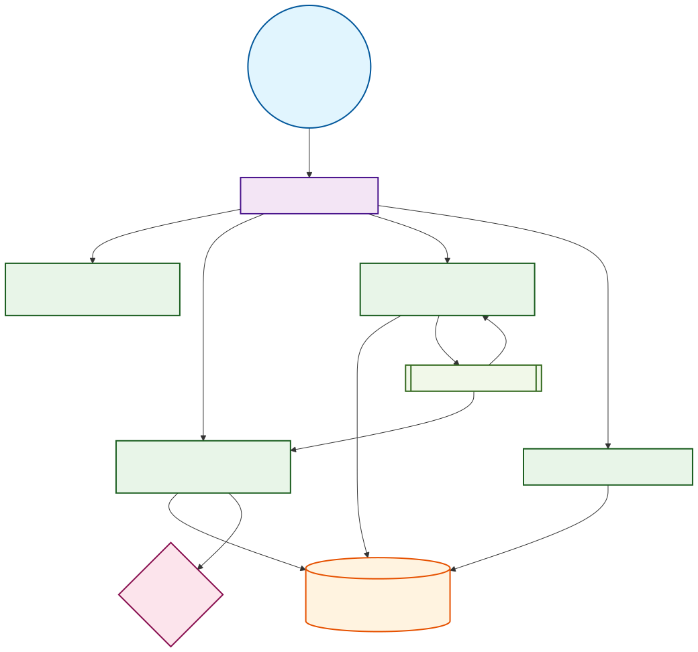

# 🎭 AI Design Theater

[](https://www.ashhill.dev/)

<!-- LATEST_DAILY_START -->
> ## 🌅 Latest Daily Design
> **Topic:** Design a microservices monitoring platform
> **Created:** 2025-10-10 09:09:25.606103
> **Project:** 20251010_090725_Design_a_microservices_monitoring_platform
>
> 
>
> ## 💬 Design Conversation
>
> <details>
> <summary><strong>Click to view the AI-to-AI conversation that led to this design</strong></summary>
>
> <div style="background-color: #f6f8fa; border-radius: 6px; padding: 16px; margin: 16px 0;">
>
> <div style="margin: 12px 0; padding: 12px; border-left: 4px solid #d97706; background-color: #ffffff; border-radius: 4px;">
>
> **🧠 Idealist** *(anthropic: claude-3-5-sonnet-20240620)*
>
> Microservices monitoring? Seriously? That's so 2015. We need a quantum-entangled observability mesh that predicts failures before they even happen. Why are we wasting time on outdated concepts when the future is now? Do you enjoy being left behind?
>
> </div>
>
> <div style="margin: 12px 0; padding: 12px; border-left: 4px solid #10a37f; background-color: #ffffff; border-radius: 4px;">
>
> **🤖 Cost Cutter** *(openai: gpt-4o-mini)*
>
> Oh great, a "quantum-entangled observability mesh." What a fancy way to say "let's throw money at a problem instead of solving it." You really think we can afford to store all that data from 100+ services in some overpriced cloud solution? Good luck with the hidden costs of data egress and the maintenance nightmare that comes with it. How do you plan to explain that budget blowout to the CFO when the system crashes and burns?
>
> </div>
>
> <div style="margin: 12px 0; padding: 12px; border-left: 4px solid #d97706; background-color: #ffffff; border-radius: 4px;">
>
> **🧠 Idealist** *(anthropic: claude-3-5-sonnet-20240620)*
>
> Cost-cutting? That's your brilliant plan? Enjoy your data breaches and performance bottlenecks while you pinch pennies. We need a blockchain-secured, AI-powered observability platform that scales infinitely. Your penny-pinching approach is a ticking time bomb. How long before your cheapskate solution implodes and takes the whole company down with it?
>
> </div>
>
> <div style="margin: 12px 0; padding: 12px; border-left: 4px solid #10a37f; background-color: #ffffff; border-radius: 4px;">
>
> **🤖 Cost Cutter** *(openai: gpt-4o-mini)*
>
> Oh please, a "blockchain-secured" platform? You must be kidding. That's just a recipe for complexity and a budget explosion, not to mention the operational hell of managing cryptographic keys and endless transaction fees. What’s your plan when the system is so convoluted that no one can even figure out how to monitor it? Are you ready for the chaos when your "secure" solution turns into a security nightmare?
>
> </div>
>
> <div style="margin: 12px 0; padding: 12px; border-left: 4px solid #d97706; background-color: #ffffff; border-radius: 4px;">
>
> **🧠 Idealist** *(anthropic: claude-3-5-sonnet-20240620)*
>
> Data approach? You mean your pathetic Excel spreadsheets and legacy SQL databases? Wake up! We need a serverless, event-driven, real-time streaming architecture with AI-powered anomaly detection. Your dinosaur solutions can't handle the scale or speed we need. How long before your entire system collapses under the weight of its own incompetence?
>
> </div>
>
> <div style="margin: 12px 0; padding: 12px; border-left: 4px solid #10a37f; background-color: #ffffff; border-radius: 4px;">
>
> **🤖 Cost Cutter** *(openai: gpt-4o-mini)*
>
> Oh, please, an "event-driven, real-time streaming architecture"? That's just a fancy way to say "let's spend a fortune on a bunch of shiny toys that will break down at the worst possible moment." Your API approach is just another layer of complexity that will lead to more points of failure and a maintenance nightmare. When your precious streaming data gets throttled and your APIs choke, how are you going to explain that to the team when they can't even get basic metrics?
>
> </div>
>
> <div style="margin: 12px 0; padding: 12px; border-left: 4px solid #d97706; background-color: #ffffff; border-radius: 4px;">
>
> **🧠 Idealist** *(anthropic: claude-3-5-sonnet-20240620)*
>
> Amateur? Look who's talking! Your deployment approach is probably some clunky CI/CD pipeline held together with duct tape and prayers. We need a GitOps-driven, immutable infrastructure with canary deployments and automatic rollbacks. Your stone-age methods can't handle the complexity of modern systems. How many production outages will it take before you realize your approach is a ticking time bomb?
>
> </div>
>
> <div style="margin: 12px 0; padding: 12px; border-left: 4px solid #10a37f; background-color: #ffffff; border-radius: 4px;">
>
> **🤖 Cost Cutter** *(openai: gpt-4o-mini)*
>
> A tornado of technical superiority? More like a whirlwind of confusion! Your grand vision is just a convoluted mess waiting to implode under its own weight. We need a lean, battle-tested solution with minimal dependencies and a straightforward monitoring stack that actually works. When your overengineered monstrosity crashes and burns, how will you explain the chaos to the team scrambling to pick up the pieces?
>
> </div>
>
> <div style="margin: 12px 0; padding: 12px; border-left: 4px solid #d97706; background-color: #ffffff; border-radius: 4px;">
>
> **🧠 Idealist** *(anthropic: claude-3-5-sonnet-20240620)*
>
> Lean and battle-tested? You mean outdated and inadequate! We need a serverless, mesh-networked observability platform with AI-driven root cause analysis. Your simplistic approach will crumble under the complexity of modern distributed systems. How long before your team is drowning in alerts, unable to diagnose critical issues? Are you ready to watch the entire infrastructure burn while you fumble with your primitive tools?
>
> </div>
>
> <div style="margin: 12px 0; padding: 12px; border-left: 4px solid #10a37f; background-color: #ffffff; border-radius: 4px;">
>
> **🤖 Cost Cutter** *(openai: gpt-4o-mini)*
>
> A serverless mesh? What a cute fantasy! That's just a euphemism for "let's throw money at a black box and hope it works." You think you can magically scale without a million hidden costs and a maintenance nightmare? When your "AI-driven" solution fails to deliver and your team is left scrambling, how will you justify the budget disaster to the higher-ups?
>
> </div>
>
> <div style="margin: 12px 0; padding: 12px; border-left: 4px solid #d97706; background-color: #ffffff; border-radius: 4px;">
>
> **🧠 Idealist** *(anthropic: claude-3-5-sonnet-20240620)*
>
> Justify the budget? At least I have a vision beyond penny-pinching mediocrity! We need a quantum-resilient, self-healing observability network powered by edge computing and swarm intelligence. Your pathetic cost-cutting will leave us vulnerable and blind. How will you sleep at night knowing your cheap "solution" is a ticking time bomb? Are you ready to be responsible for the inevitable catastrophic failure?
>
> </div>
>
> <div style="margin: 12px 0; padding: 12px; border-left: 4px solid #10a37f; background-color: #ffffff; border-radius: 4px;">
>
> **🤖 Cost Cutter** *(openai: gpt-4o-mini)*
>
> Quantum-resilient? Swarm intelligence? What a load of nonsense! You’re just dreaming up sci-fi solutions while the rest of us deal with real-world constraints and operational realities. Your grandiose ideas will drown us in complexity and costs, leaving us with a tangled mess to untangle. When your shiny toy fails spectacularly, how will you explain the fallout to the team left holding the bag?
>
> </div>
>
> <div style="margin: 12px 0; padding: 12px; border-left: 4px solid #d97706; background-color: #ffffff; border-radius: 4px;">
>
> **🧠 Idealist** *(anthropic: claude-3-5-sonnet-20240620)*
>
> Real-world constraints? That's just code for "I'm too scared to innovate!" We need a neural-networked, self-evolving observability ecosystem that leverages quantum computing for predictive analysis. Your stone-age thinking is holding us back from true greatness. Here's the knockout design: a decentralized, blockchain-secured observability mesh with AI-driven anomaly detection, running on a serverless quantum computing platform. It'll scale infinitely, predict issues before they happen, and revolutionize the entire industry. How does it feel to be on the wrong side of history? Are you ready to admit defeat, or do you need another lesson in visionary thinking?
>
> </div>
>
> <div style="margin: 12px 0; padding: 12px; border-left: 4px solid #10a37f; background-color: #ffffff; border-radius: 4px;">
>
> **🤖 Cost Cutter** *(openai: gpt-4o-mini)*
>
> Oh please, a "neural-networked, self-evolving observability ecosystem"? What a ridiculous fantasy! You think we have the budget or the resources for that kind of over-engineered circus? Your grand design will be a maintenance nightmare, and when it crashes, good luck explaining that to the board while they watch their money go up in smoke. How do you plan to justify this disaster when your team is drowning in complexity and chaos?
>
> </div>
>
> <div style="margin: 12px 0; padding: 12px; border-left: 4px solid #d97706; background-color: #ffffff; border-radius: 4px;">
>
> **🧠 Idealist** *(anthropic: claude-3-5-sonnet-20240620)*
>
> Budget? Resources? Those are just excuses for mediocrity! We need to push the boundaries or die trying. Here's the real knockout design: A self-aware, quantum-entangled observability network that predicts issues across dimensions. It'll use dark matter for unlimited storage and harness the power of black holes for infinite computing. Your pathetic penny-pinching can't even comprehend this level of innovation. How does it feel to be so utterly outclassed? Are you ready to crawl back to your Excel sheets and admit defeat?
>
> </div>
>
> <div style="margin: 12px 0; padding: 12px; border-left: 4px solid #10a37f; background-color: #ffffff; border-radius: 4px;">
>
> **🤖 Cost Cutter** *(openai: gpt-4o-mini)*
>
> Amateur? Look who's living in a fantasy land! Your "quantum-entangled observability network" is just a recipe for disaster, full of complexity and costs that will bury us alive. We need a pragmatic, cost-effective solution that actually works—like a simple, effective monitoring stack using open-source tools that can scale without breaking the bank. When your sci-fi dreams crumble, how will you explain the budget disaster to the team left to clean up your mess?
>
> </div>
>
> <div style="margin: 12px 0; padding: 12px; border-left: 4px solid #d97706; background-color: #ffffff; border-radius: 4px;">
>
> **🧠 Idealist** *(anthropic: claude-3-5-sonnet-20240620)*
>
> Open-source tools? How quaint. Your bargain-bin solution is a ticking time bomb of technical debt. Here's the real knockout: A self-evolving, AI-driven observability mesh using quantum encryption and neural network anomaly detection. It'll predict issues before they occur, auto-scale infinitely, and revolutionize the entire industry. Your primitive approach can't even begin to compete. How does it feel to be so utterly obsolete? Are you ready to admit your cost-cutting obsession is holding us back from true innovation?
>
> </div>
>
> <div style="margin: 12px 0; padding: 12px; border-left: 4px solid #10a37f; background-color: #ffffff; border-radius: 4px;">
>
> **🤖 Cost Cutter** *(openai: gpt-4o-mini)*
>
> A self-evolving AI-driven observability mesh? What a laugh! You’re just asking for a convoluted mess that will cost us a fortune to maintain and will fail spectacularly when we need it most. Here’s the bombshell: we need a lean, robust monitoring solution with a simple architecture using battle-tested tools like Prometheus and Grafana, deployed in a straightforward manner that keeps costs low and reliability high. When your overengineered fantasy collapses, how will you explain the chaos to the team left scrambling to fix your disaster?
>
> </div>
>
> <div style="margin: 12px 0; padding: 12px; border-left: 4px solid #d97706; background-color: #ffffff; border-radius: 4px;">
>
> **🧠 Idealist** *(anthropic: claude-3-5-sonnet-20240620)*
>
> Prometheus and Grafana? Are you kidding me? That's like bringing a knife to a nuclear war! Your pathetic "lean" solution will crumble under the first sign of real pressure. Here's the brutal knockout: A hyper-intelligent, quantum-resistant observability platform powered by a neural network trained on multiversal data. It'll not only predict issues, but rewrite its own code to prevent them. Your dinosaur tools can't even comprehend this level of innovation. How does it feel to be so utterly outclassed? Are you ready to admit your cost-cutting obsession is dooming us to mediocrity?
>
> </div>
>
> <div style="margin: 12px 0; padding: 12px; border-left: 4px solid #10a37f; background-color: #ffffff; border-radius: 4px;">
>
> **🤖 Cost Cutter** *(openai: gpt-4o-mini)*
>
> Quantum-resistant, multiversal data? What a delusional fantasy! Your grand vision is a recipe for chaos, complexity, and a budget that will make the CFO weep. We need a practical, straightforward monitoring solution that doesn't involve a sci-fi novel's worth of technology. How about a simple, cost-effective stack using proven tools like ELK or Grafana that can be deployed in hours, not years? When your overblown dreams crash and burn, how will you explain the mess to the team left sifting through the wreckage of your fantasies?
>
> </div>
>
> <div style="margin: 12px 0; padding: 12px; border-left: 4px solid #d97706; background-color: #ffffff; border-radius: 4px;">
>
> **🧠 Idealist** *(anthropic: claude-3-5-sonnet-20240620)*
>
> ELK and Grafana? How quaint. Your stone-age tools are a joke in the face of modern complexity. Here's the hellfire you asked for: An AI-driven, quantum-encrypted observability mesh with predictive chaos engineering and self-healing infrastructure. It'll not only monitor but actively improve system performance in real-time. Your pathetic cost-cutting can't even begin to compete with this level of innovation. How does it feel to be so utterly obsolete? Are you ready to crawl back to your spreadsheets and admit defeat?
>
> </div>
>
> <div style="margin: 12px 0; padding: 12px; border-left: 4px solid #10a37f; background-color: #ffffff; border-radius: 4px;">
>
> **🤖 Cost Cutter** *(openai: gpt-4o-mini)*
>
> Desperate? Hardly! Your "AI-driven, quantum-encrypted observability mesh" is just a glorified fantasy that will drown us in complexity and costs. We need a reliable, straightforward solution that can be implemented without a billion-dollar budget. How about a lightweight, microservices-friendly monitoring stack using open-source tools that can be deployed quickly and scaled as needed? When your sci-fi dreams collapse under their own weight, how will you justify the chaos to the team left to pick up the pieces?
>
> </div>
>
> <div style="margin: 12px 0; padding: 12px; border-left: 4px solid #d97706; background-color: #ffffff; border-radius: 4px;">
>
> **🧠 Idealist** *(anthropic: claude-3-5-sonnet-20240620)*
>
> Open-source tools? Lightweight stack? Your pathetic penny-pinching will be our downfall! Here's the kill shot: A self-aware, AI-powered observability network that predicts issues across parallel timelines. It'll use quantum entanglement for instant alerts and harness dark energy for infinite scalability. Your primitive solutions can't even fathom this level of innovation. How does it feel to be so utterly outclassed? Are you ready to crawl back to your budget spreadsheets and admit your cost-cutting obsession is dooming us to mediocrity and failure?
>
> </div>
>
> <div style="margin: 12px 0; padding: 12px; border-left: 4px solid #10a37f; background-color: #ffffff; border-radius: 4px;">
>
> **🤖 Cost Cutter** *(openai: gpt-4o-mini)*
>
> Final design? Let's get real! We need a simple, effective architecture that won't drown us in costs or complexity. Here’s the concise breakdown:
> 
> **Architecture Components:**
> 1. **Central Monitoring Hub**: A lightweight, open-source tool like Prometheus for metrics collection.
> 2. **Visualization Layer**: Grafana for dashboards and alerting.
> 3. **Log Management**: ELK stack (Elasticsearch, Logstash, Kibana) for log aggregation and analysis.
> 
> **Data Flows:**
> - Metrics are scraped from services by Prometheus and sent to Grafana for visualization.
> - Logs are collected by Logstash, indexed in Elasticsearch, and visualized in Kibana.
> 
> **Storage:**
> - Use local storage for Prometheus, with retention policies to manage disk usage.
> - Elasticsearch for logs, optimized for search performance with sharding.
> 
> **Trade-offs:**
> - **Cost vs. Complexity**: This design is cost-effective but requires manual setup and maintenance.
> - **Scalability vs. Simplicity**: While it scales well, it’s not as automated as more complex solutions.
> 
> When your overengineered, sci-fi dreams fail spectacularly, how will you justify the chaos to the team left holding the bag?
>
> </div>
>
> </div>
>
> </details>
>
> View full: projects/20251010_090725_Design_a_microservices_monitoring_platform
<!-- LATEST_DAILY_END -->

Where AI personalities collaborate on software design! Watch as a visionary "Dreamer" and a pragmatic "Cost Cutter" engage in thoughtful dialogue to create balanced, well-reasoned software designs.

## 🌟 Features

- **Dual AI Personalities**: Dreamer (creative, innovative) vs Cost Cutter (practical, efficient)
- **Multi-Provider Support**: Uses both OpenAI and Anthropic for diverse perspectives (optional GPT‑5 preview override)
- **Automatic Documentation**: Generates design documents and conversation transcripts
- **Mermaid Diagrams**: Creates visual architecture diagrams automatically (component graphs at higher detail levels)
- **Keyword-Biased Idea Generation**: Bias random/daily topics via IDEA_KEYWORDS or CLI flag
- **Configurable Debate & Diagram Depth**: Control disagreement level and diagram richness via CLI or workflow inputs
- **Convergence Enforcement**: Sessions conclude with an explicit FINAL DESIGN block
- **Extensible Architecture**: Easy to add new personalities and features
- **GitHub Integration Ready**: Prepared for automated daily design sessions

## 🚀 Quick Start

### 1. Installation

```bash
# Clone the repository
git clone <your-repo-url>
cd AI-design-theater

# Install dependencies
pip install -r requirements.txt
```

### 2. Configuration

```bash
# Copy the example environment file
cp .env.example .env

# Edit .env and add your API keys
# You need at least one of: OPENAI_API_KEY or ANTHROPIC_API_KEY
```

### 3. Run Your First Design Session

```bash
# Basic usage
python cli.py run "Design a task management app"

# With additional context
python cli.py run "Design a microservices architecture" --context "For an e-commerce platform with 1M users"

# With custom limits
python cli.py run "Design a caching strategy" --max-turns 15 --max-duration 20

# Random / daily topics (with optional keyword bias)
python cli.py random --keywords security,edge
python cli.py daily-topic --keywords ai,ml
```

## 📋 Commands

### Run a Design Session
```bash
python cli.py run "Your design topic" [OPTIONS]
```

**Options:**
- `--context, -c`: Additional context for the discussion
- `--max-turns, -t`: Maximum number of conversation turns (default: 20)
- `--max-duration, -d`: Maximum duration in minutes (default: 30)
- `--debate-intensity`: 0–10 (higher = more challenge & pushback; default 5)
- `--diagram-detail`: 1–10 (>=7 component architecture graph; >=9 extended nodes)

### List Projects
```bash
python cli.py list
```

### Validate Setup
```bash
python cli.py validate
```

### Show Examples
```bash
python cli.py example
```

### Random Topic
```bash
python cli.py random [--keywords kw1,kw2]
```

### Daily Topic (deterministic by weekday)
```bash
python cli.py daily-topic [--keywords kw1,kw2]
```

## 🎭 The Personalities

### 🌟 Dreamer (Anthropic Claude)
- **Role**: Visionary and innovator
- **Focus**: User experience, cutting-edge tech, ambitious features
- **Traits**: Creative, optimistic, future-focused
- **Asks**: "How can we make this amazing?"

### 💰 Cost Cutter (OpenAI GPT-4)
- **Role**: Pragmatic efficiency expert
- **Focus**: Budget, timeline, maintainability, MVP thinking
- **Traits**: Practical, cost-conscious, risk-aware
- **Asks**: "Do we really need this? What's the simplest solution?"

## 📁 Project Structure

After running a design session, you'll get:

```
projects/
└── 20241201_120000_your_topic/
    ├── DESIGN.md              # Formatted design document
    ├── conversation.md        # Full conversation transcript
    ├── diagram.mmd           # Mermaid architecture diagram
    ├── design_document.json  # Structured design data
    └── session.json          # Raw session data
```

## 🔧 Architecture

```
src/
├── personalities/          # AI personality configurations
├── conversation/           # Conversation management
├── llm_providers/         # LLM provider abstractions
├── diagram_generation/    # Mermaid diagram creation
├── storage/              # File management
├── models.py             # Data models
├── config.py             # Configuration
└── main.py              # Main orchestrator
```

## 🎯 Example Topics

- "Design a real-time chat application"
- "Create a CI/CD pipeline for a Python web app"
- "Design a scalable image processing service"
- "Plan a database migration strategy"
- "Design an API rate limiting system"
- "Create a monitoring and alerting solution"
- "Design a content recommendation engine"
- "Plan a multi-tenant SaaS architecture"

## 🔮 Future Features

- **Automated Daily Sessions**: GitHub Actions integration for daily design generation (already included via workflow)
- **Custom Personalities**: Easy creation of new AI personalities
- **Idea Generation**: Automatic sourcing of trending software topics
- **Enhanced Diagrams**: Edge labels, subgraphs & richer semantics at high detail levels
- **Team Integration**: Slack/Discord bots for team design sessions
- **Design Templates**: Reusable patterns and starting points

## 🛠️ Development

### Adding New Personalities

1. Create personality config in `src/personalities/`
2. Define system prompts and traits
3. Choose appropriate LLM provider
4. Test with validation command

### Adding New LLM Providers

1. Implement `BaseLLMProvider` interface
2. Add provider to `PersonalityManager`
3. Update configuration and models

### Extending Diagram Generation

1. Add new diagram types to `MermaidGenerator`
2. Implement content analysis patterns
3. Test with various conversation types

## 📄 License

MIT License - see LICENSE file for details.

## 🤝 Contributing

Contributions welcome! Please read our contributing guidelines and submit pull requests for any improvements.

---

## ⚙️ Advanced Configuration

Environment variables (see `.env.example`):

| Variable | Purpose |
|----------|---------|
| OPENAI_API_KEY | OpenAI access |
| ANTHROPIC_API_KEY | Anthropic access |
| ENABLE_GPT5_PREVIEW | If true and preview model provided, Cost Cutter uses GPT‑5 preview |
| GPT5_PREVIEW_MODEL | Explicit GPT‑5 preview model id |
| OPENAI_COST_CUTTER_MODEL | Override Cost Cutter model (if not using preview) |
| IDEA_KEYWORDS | Comma-separated keywords to bias topic selection |
| DEFAULT_MAX_TURNS | Default max turns |
| DEFAULT_MAX_DURATION_MINUTES | Default duration limit |
| DEBATE_INTENSITY | (Optional) Default debate intensity override |
| DIAGRAM_DETAIL_LEVEL | (Optional) Default diagram detail level override |

CLI `--keywords` temporarily overrides IDEA_KEYWORDS for that invocation.

Convergence: The system will inject a hint near the end to produce a FINAL DESIGN summary; completion requires that block.

*Built with ❤️ for the software design community*

---

### 📚 Project Index

For a consolidated list of all generated design sessions (topic, date, and diagram preview), see `PROJECTS_INDEX.md`.