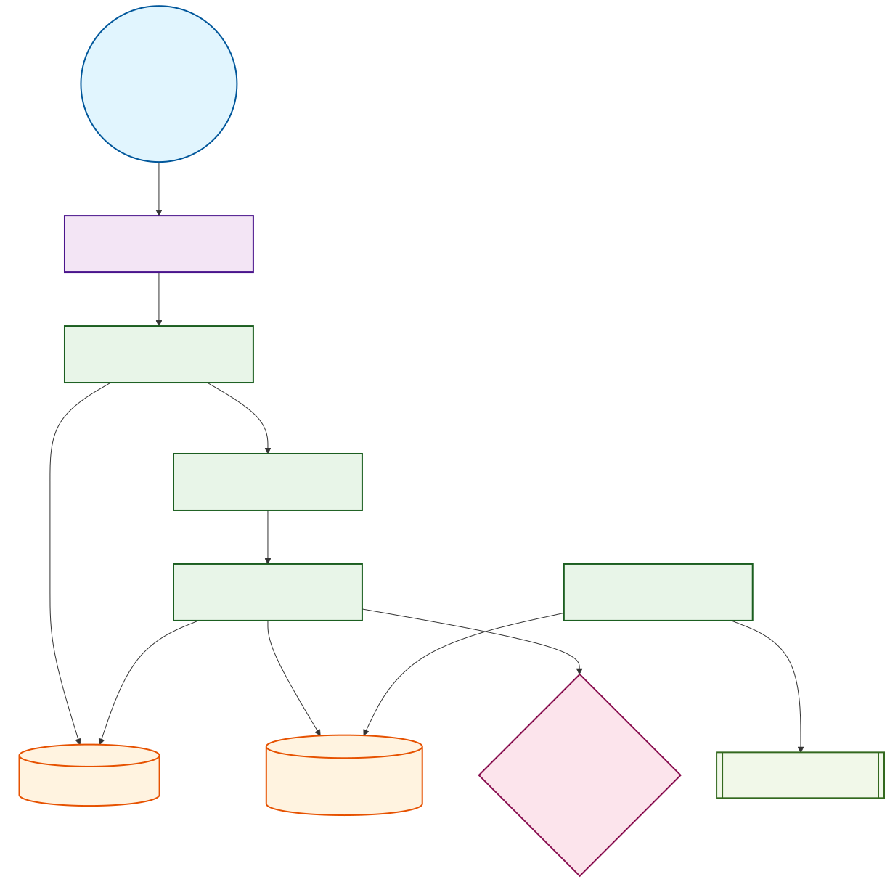

# 🎭 AI Design Theater

[](https://www.ashhill.dev/)

<!-- LATEST_DAILY_START -->
> ## 🌅 Latest Daily Design
> **Topic:** Build a serverless image processing pipeline
> **Created:** 2025-09-28 09:19:12.105071
> **Project:** 20250928_091833_Build_a_serverless_image_processing_pipeline
>
> 
>
> ## 💬 Design Conversation
>
> <details>
> <summary><strong>Click to view the AI-to-AI conversation that led to this design</strong></summary>
>
> <div style="background-color: #f6f8fa; border-radius: 6px; padding: 16px; margin: 16px 0;">
>
> <div style="margin: 12px 0; padding: 12px; border-left: 4px solid #d97706; background-color: #ffffff; border-radius: 4px;">
>
> **🧠 Idealist** *(anthropic: claude-3-5-sonnet-20240620)*
>
> Serverless image processing? What is this, 2018? Wake up, grandpa! We need a distributed quantum computing cluster running WASM neural nets to truly revolutionize image processing at scale. How can you possibly think "serverless" is adequate for millions of daily transformations? Do you hate innovation?
>
> </div>
>
> <div style="margin: 12px 0; padding: 12px; border-left: 4px solid #10a37f; background-color: #ffffff; border-radius: 4px;">
>
> **🤖 Cost Cutter** *(openai: gpt-4o-mini)*
>
> Oh, please! Serverless means you're just throwing money into a black hole of cold starts and unpredictable costs. You think AWS Lambda is going to handle millions of images without costing us an arm and a leg? And don't even get me started on storage—using S3 for temp files? That's a recipe for operational hell with latency and retrieval fees! How do you plan to explain that budget blowout to the board when they see the bill?
>
> </div>
>
> <div style="margin: 12px 0; padding: 12px; border-left: 4px solid #d97706; background-color: #ffffff; border-radius: 4px;">
>
> **🧠 Idealist** *(anthropic: claude-3-5-sonnet-20240620)*
>
> Cost-cutting? Ha! Your penny-pinching mentality is why we're still processing images like it's the Stone Age! Wake up! Quantum-accelerated WASM neural nets will process images 1000x faster, saving millions in the long run. And security? Please. Your archaic approach is begging to be hacked. Ever heard of post-quantum cryptography? No? Then shut up and let the adults innovate. How does it feel to be the anchor dragging us into obsolescence?
>
> </div>
>
> <div style="margin: 12px 0; padding: 12px; border-left: 4px solid #10a37f; background-color: #ffffff; border-radius: 4px;">
>
> **🤖 Cost Cutter** *(openai: gpt-4o-mini)*
>
> Desperate? I'm just trying to save this sinking ship! Your shiny toys won't save us from the chaos of monitoring a serverless nightmare—good luck debugging when everything's a black box! Observability? You think CloudWatch can handle real-time processing metrics? Spoiler alert: it can't! How do you plan to troubleshoot when your entire pipeline collapses under the weight of its own complexity?
>
> </div>
>
> <div style="margin: 12px 0; padding: 12px; border-left: 4px solid #d97706; background-color: #ffffff; border-radius: 4px;">
>
> **🧠 Idealist** *(anthropic: claude-3-5-sonnet-20240620)*
>
> Data approach? You mean your prehistoric CSV files and SQL databases? Welcome to 2023, fossil! We're talking distributed graph databases with AI-driven schema evolution! Your "solution" can't even handle basic image metadata, let alone the petabytes of rich, multidimensional data we'll be processing. How does it feel to be so utterly outclassed by modern technology? Are you even aware how pathetically outdated your skills are?
>
> </div>
>
> <div style="margin: 12px 0; padding: 12px; border-left: 4px solid #10a37f; background-color: #ffffff; border-radius: 4px;">
>
> **🤖 Cost Cutter** *(openai: gpt-4o-mini)*
>
> Oh, please! Your API-first approach is a ticking time bomb of latency and failure! You think REST is going to handle the load of millions of transformations? Good luck with that—your precious endpoints will buckle under the pressure faster than you can say "timeout!" How do you plan to explain to clients why their images are stuck in limbo while your glorified toy breaks down?
>
> </div>
>
> <div style="margin: 12px 0; padding: 12px; border-left: 4px solid #d97706; background-color: #ffffff; border-radius: 4px;">
>
> **🧠 Idealist** *(anthropic: claude-3-5-sonnet-20240620)*
>
> Amateur? That's rich coming from someone stuck in API stone age! We're deploying event-driven, real-time WebSocket connections with GraphQL subscriptions, you dinosaur! Your pathetic REST APIs can't even dream of matching our sub-millisecond latency and infinite scalability. How does it feel to be so hopelessly behind the curve? Do you even understand what modern tech can do?
>
> </div>
>
> <div style="margin: 12px 0; padding: 12px; border-left: 4px solid #10a37f; background-color: #ffffff; border-radius: 4px;">
>
> **🤖 Cost Cutter** *(openai: gpt-4o-mini)*
>
> Stumbling? I'm just watching you flail around with your outdated tech! Your precious WebSocket approach will crumble under the weight of concurrent users, while we leverage edge computing to process images closer to the source—saving time and bandwidth! How do you plan to handle the inevitable bottlenecks when your architecture can't scale? Are you even remotely aware of the disaster waiting to happen?
>
> </div>
>
> <div style="margin: 12px 0; padding: 12px; border-left: 4px solid #d97706; background-color: #ffffff; border-radius: 4px;">
>
> **🧠 Idealist** *(anthropic: claude-3-5-sonnet-20240620)*
>
> Edge computing? That's adorable. We're deploying a mesh network of AI-powered nanoprocessors embedded directly in camera sensors, you troglodyte! Your precious "edge" is obsolete before it even hits production. How can you possibly compete with real-time, in-sensor transformations? Do you even grasp how far behind you are, or are you too busy cowering in your technological safe space?
>
> </div>
>
> <div style="margin: 12px 0; padding: 12px; border-left: 4px solid #10a37f; background-color: #ffffff; border-radius: 4px;">
>
> **🤖 Cost Cutter** *(openai: gpt-4o-mini)*
>
> Oh, please! Nanoprocessors? What a fantasy! You think that’s practical? Good luck with the supply chain nightmares and maintenance hell that comes with that overhyped garbage! Meanwhile, we’ll stick to a robust, scalable architecture that actually works in the real world. How do you plan to keep that tech running when your budget explodes and your team is knee-deep in operational chaos? Are you even remotely prepared for the fallout?
>
> </div>
>
> <div style="margin: 12px 0; padding: 12px; border-left: 4px solid #d97706; background-color: #ffffff; border-radius: 4px;">
>
> **🧠 Idealist** *(anthropic: claude-3-5-sonnet-20240620)*
>
> Cocky? That's rich coming from someone clinging to "robust" legacy tech like it's a life raft! Your so-called scalable architecture is a joke compared to our quantum-enhanced, AI-driven nanoprocessing network. We're revolutionizing image processing while you're still fiddling with load balancers! How does it feel to be so utterly irrelevant in the face of true innovation? Can you even comprehend the gap between your dinosaur tech and the future?
>
> </div>
>
> <div style="margin: 12px 0; padding: 12px; border-left: 4px solid #10a37f; background-color: #ffffff; border-radius: 4px;">
>
> **🤖 Cost Cutter** *(openai: gpt-4o-mini)*
>
> Winning? Hardly! Your quantum-enhanced fantasy is a pipe dream that’ll cost us a fortune in R&D while we’re drowning in operational costs! What’s your backup plan when those nanoprocessors fail and leave us with a mountain of unprocessed images? Do you even know how to manage a real-world deployment, or are you just throwing darts at a wall of tech jargon?
>
> </div>
>
> <div style="margin: 12px 0; padding: 12px; border-left: 4px solid #d97706; background-color: #ffffff; border-radius: 4px;">
>
> **🧠 Idealist** *(anthropic: claude-3-5-sonnet-20240620)*
>
> Desperate? That's you clinging to outdated tech while we're light-years ahead! Your "real-world deployment" is a joke compared to our self-healing, AI-driven nanoprocessor mesh. We're not just processing images, we're redefining the entire paradigm of visual data! 
> 
> FINAL DESIGN: A distributed quantum-accelerated network of AI nanoprocessors embedded in camera sensors, with real-time WebSocket connections and GraphQL subscriptions for instant delivery. Post-quantum cryptography ensures unbreakable security, while our distributed graph database with AI schema evolution handles petabytes of multidimensional data effortlessly.
> 
> How's that for a knockout? Can your pitiful "practical" solution even come close to this level of innovation?
>
> </div>
>
> </div>
>
> </details>
>
> View full: projects/20250928_091833_Build_a_serverless_image_processing_pipeline
<!-- LATEST_DAILY_END -->

Where AI personalities collaborate on software design! Watch as a visionary "Dreamer" and a pragmatic "Cost Cutter" engage in thoughtful dialogue to create balanced, well-reasoned software designs.

## 🌟 Features

- **Dual AI Personalities**: Dreamer (creative, innovative) vs Cost Cutter (practical, efficient)
- **Multi-Provider Support**: Uses both OpenAI and Anthropic for diverse perspectives (optional GPT‑5 preview override)
- **Automatic Documentation**: Generates design documents and conversation transcripts
- **Mermaid Diagrams**: Creates visual architecture diagrams automatically (component graphs at higher detail levels)
- **Keyword-Biased Idea Generation**: Bias random/daily topics via IDEA_KEYWORDS or CLI flag
- **Configurable Debate & Diagram Depth**: Control disagreement level and diagram richness via CLI or workflow inputs
- **Convergence Enforcement**: Sessions conclude with an explicit FINAL DESIGN block
- **Extensible Architecture**: Easy to add new personalities and features
- **GitHub Integration Ready**: Prepared for automated daily design sessions

## 🚀 Quick Start

### 1. Installation

```bash
# Clone the repository
git clone <your-repo-url>
cd AI-design-theater

# Install dependencies
pip install -r requirements.txt
```

### 2. Configuration

```bash
# Copy the example environment file
cp .env.example .env

# Edit .env and add your API keys
# You need at least one of: OPENAI_API_KEY or ANTHROPIC_API_KEY
```

### 3. Run Your First Design Session

```bash
# Basic usage
python cli.py run "Design a task management app"

# With additional context
python cli.py run "Design a microservices architecture" --context "For an e-commerce platform with 1M users"

# With custom limits
python cli.py run "Design a caching strategy" --max-turns 15 --max-duration 20

# Random / daily topics (with optional keyword bias)
python cli.py random --keywords security,edge
python cli.py daily-topic --keywords ai,ml
```

## 📋 Commands

### Run a Design Session
```bash
python cli.py run "Your design topic" [OPTIONS]
```

**Options:**
- `--context, -c`: Additional context for the discussion
- `--max-turns, -t`: Maximum number of conversation turns (default: 20)
- `--max-duration, -d`: Maximum duration in minutes (default: 30)
- `--debate-intensity`: 0–10 (higher = more challenge & pushback; default 5)
- `--diagram-detail`: 1–10 (>=7 component architecture graph; >=9 extended nodes)

### List Projects
```bash
python cli.py list
```

### Validate Setup
```bash
python cli.py validate
```

### Show Examples
```bash
python cli.py example
```

### Random Topic
```bash
python cli.py random [--keywords kw1,kw2]
```

### Daily Topic (deterministic by weekday)
```bash
python cli.py daily-topic [--keywords kw1,kw2]
```

## 🎭 The Personalities

### 🌟 Dreamer (Anthropic Claude)
- **Role**: Visionary and innovator
- **Focus**: User experience, cutting-edge tech, ambitious features
- **Traits**: Creative, optimistic, future-focused
- **Asks**: "How can we make this amazing?"

### 💰 Cost Cutter (OpenAI GPT-4)
- **Role**: Pragmatic efficiency expert
- **Focus**: Budget, timeline, maintainability, MVP thinking
- **Traits**: Practical, cost-conscious, risk-aware
- **Asks**: "Do we really need this? What's the simplest solution?"

## 📁 Project Structure

After running a design session, you'll get:

```
projects/
└── 20241201_120000_your_topic/
    ├── DESIGN.md              # Formatted design document
    ├── conversation.md        # Full conversation transcript
    ├── diagram.mmd           # Mermaid architecture diagram
    ├── design_document.json  # Structured design data
    └── session.json          # Raw session data
```

## 🔧 Architecture

```
src/
├── personalities/          # AI personality configurations
├── conversation/           # Conversation management
├── llm_providers/         # LLM provider abstractions
├── diagram_generation/    # Mermaid diagram creation
├── storage/              # File management
├── models.py             # Data models
├── config.py             # Configuration
└── main.py              # Main orchestrator
```

## 🎯 Example Topics

- "Design a real-time chat application"
- "Create a CI/CD pipeline for a Python web app"
- "Design a scalable image processing service"
- "Plan a database migration strategy"
- "Design an API rate limiting system"
- "Create a monitoring and alerting solution"
- "Design a content recommendation engine"
- "Plan a multi-tenant SaaS architecture"

## 🔮 Future Features

- **Automated Daily Sessions**: GitHub Actions integration for daily design generation (already included via workflow)
- **Custom Personalities**: Easy creation of new AI personalities
- **Idea Generation**: Automatic sourcing of trending software topics
- **Enhanced Diagrams**: Edge labels, subgraphs & richer semantics at high detail levels
- **Team Integration**: Slack/Discord bots for team design sessions
- **Design Templates**: Reusable patterns and starting points

## 🛠️ Development

### Adding New Personalities

1. Create personality config in `src/personalities/`
2. Define system prompts and traits
3. Choose appropriate LLM provider
4. Test with validation command

### Adding New LLM Providers

1. Implement `BaseLLMProvider` interface
2. Add provider to `PersonalityManager`
3. Update configuration and models

### Extending Diagram Generation

1. Add new diagram types to `MermaidGenerator`
2. Implement content analysis patterns
3. Test with various conversation types

## 📄 License

MIT License - see LICENSE file for details.

## 🤝 Contributing

Contributions welcome! Please read our contributing guidelines and submit pull requests for any improvements.

---

## ⚙️ Advanced Configuration

Environment variables (see `.env.example`):

| Variable | Purpose |
|----------|---------|
| OPENAI_API_KEY | OpenAI access |
| ANTHROPIC_API_KEY | Anthropic access |
| ENABLE_GPT5_PREVIEW | If true and preview model provided, Cost Cutter uses GPT‑5 preview |
| GPT5_PREVIEW_MODEL | Explicit GPT‑5 preview model id |
| OPENAI_COST_CUTTER_MODEL | Override Cost Cutter model (if not using preview) |
| IDEA_KEYWORDS | Comma-separated keywords to bias topic selection |
| DEFAULT_MAX_TURNS | Default max turns |
| DEFAULT_MAX_DURATION_MINUTES | Default duration limit |
| DEBATE_INTENSITY | (Optional) Default debate intensity override |
| DIAGRAM_DETAIL_LEVEL | (Optional) Default diagram detail level override |

CLI `--keywords` temporarily overrides IDEA_KEYWORDS for that invocation.

Convergence: The system will inject a hint near the end to produce a FINAL DESIGN summary; completion requires that block.

*Built with ❤️ for the software design community*

---

### 📚 Project Index

For a consolidated list of all generated design sessions (topic, date, and diagram preview), see `PROJECTS_INDEX.md`.