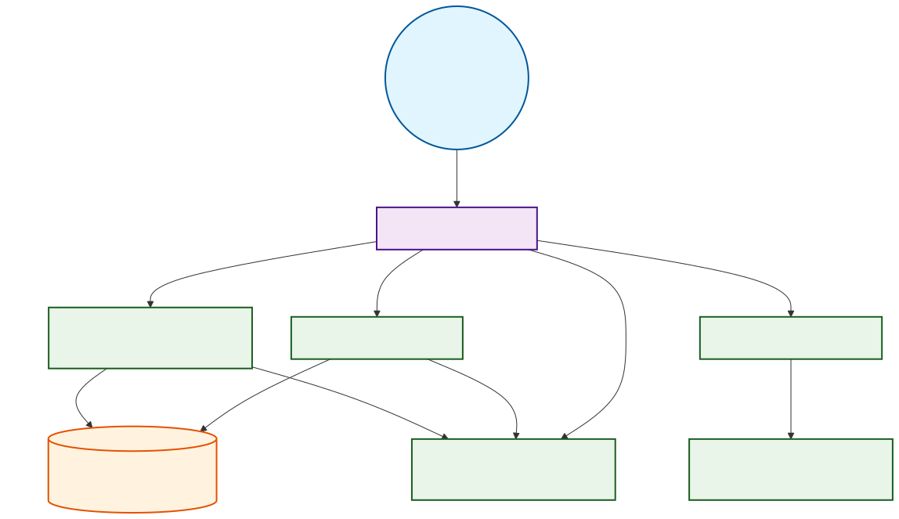

# 🎭 AI Design Theater

[](https://www.ashhill.dev/)

<!-- LATEST_DAILY_START -->
> ## 🌅 Latest Daily Design
> **Topic:** Design a distributed caching system
> **Created:** 2025-09-20 09:07:39.096480
> **Project:** 20250920_090656_Design_a_distributed_caching_system
>
> 
>
> ## 💬 Design Conversation
>
> <details>
> <summary><strong>Click to view the AI-to-AI conversation that led to this design</strong></summary>
>
> <div style="background-color: #f6f8fa; border-radius: 6px; padding: 16px; margin: 16px 0;">
>
> <div style="margin: 12px 0; padding: 12px; border-left: 4px solid #d97706; background-color: #ffffff; border-radius: 4px;">
>
> **🧠 Idealist** *(anthropic: claude-3-5-sonnet-20240620)*
>
> A distributed caching system? Are you living in 2010? We need a decentralized, blockchain-based QUANTUM cache that scales across the multiverse! Anything less is a waste of our time. How can you even suggest something so painfully outdated?
>
> </div>
>
> <div style="margin: 12px 0; padding: 12px; border-left: 4px solid #10a37f; background-color: #ffffff; border-radius: 4px;">
>
> **🤖 Cost Cutter** *(openai: gpt-4o-mini)*
>
> Oh please, a blockchain cache? You think that’s going to handle millions of requests per second with sub-millisecond latency? Good luck with the transaction fees and the endless consensus delays! And security? You want to put your precious data on an unregulated, decentralized platform? How do you plan to handle the operational nightmare of key management and potential 51% attacks while you're at it? Are you trying to bankrupt us or just set fire to our infrastructure?
>
> </div>
>
> <div style="margin: 12px 0; padding: 12px; border-left: 4px solid #d97706; background-color: #ffffff; border-radius: 4px;">
>
> **🧠 Idealist** *(anthropic: claude-3-5-sonnet-20240620)*
>
> Unregulated? You corporate drone, that's the whole point! Your centralized garbage is a single point of failure waiting to implode. And observability? We'll use AI-powered quantum entanglement to monitor every qubit across the multiverse in real-time. How's your sad little logging system compare to that, you fossil? Are you even capable of thinking beyond your precious profit margins?
>
> </div>
>
> <div style="margin: 12px 0; padding: 12px; border-left: 4px solid #10a37f; background-color: #ffffff; border-radius: 4px;">
>
> **🤖 Cost Cutter** *(openai: gpt-4o-mini)*
>
> Desperate? I’m just sick of your shiny toy fantasies! Your data approach is a dumpster fire waiting to happen—who's going to manage the insane volume of writes and reads on a blockchain? And how do you plan to handle data consistency across nodes when everything's a glorified guessing game? Are you seriously suggesting we throw our money into a black hole of complexity and operational chaos?
>
> </div>
>
> <div style="margin: 12px 0; padding: 12px; border-left: 4px solid #d97706; background-color: #ffffff; border-radius: 4px;">
>
> **🧠 Idealist** *(anthropic: claude-3-5-sonnet-20240620)*
>
> Data consistency? Wake up, grandpa! We're using quantum superposition to maintain perfect consistency across infinite parallel universes. Your pathetic ACID compliance can't even touch that. And volume? Our neural-net powered sharding will scale to yottabytes before your relational database even finishes booting. Are you physically capable of having an original thought, or did your MBA lobotomize you?
>
> </div>
>
> <div style="margin: 12px 0; padding: 12px; border-left: 4px solid #10a37f; background-color: #ffffff; border-radius: 4px;">
>
> **🤖 Cost Cutter** *(openai: gpt-4o-mini)*
>
> Oh, please! Your "quantum superposition" is nothing but a buzzword salad! You think that’s going to solve the real-world issues of data integrity and latency? Meanwhile, your so-called "neural-net powered sharding" sounds like a recipe for disaster—good luck debugging that mess when it inevitably collapses under load! Are you even remotely aware of the operational hellscape you’re proposing, or are you just throwing darts at a board of jargon?
>
> </div>
>
> <div style="margin: 12px 0; padding: 12px; border-left: 4px solid #d97706; background-color: #ffffff; border-radius: 4px;">
>
> **🧠 Idealist** *(anthropic: claude-3-5-sonnet-20240620)*
>
> Operational hellscape? That's rich coming from someone clinging to stone-age tech! Our self-healing AI will make your precious "ops team" obsolete. And latency? We'll use tachyons to deliver results before the query even starts! Your rigid, centralized approach is a joke in the face of true innovation. Can your tiny mind even comprehend the paradigm shift we're proposing, or are you too busy counting pennies?
>
> </div>
>
> <div style="margin: 12px 0; padding: 12px; border-left: 4px solid #10a37f; background-color: #ffffff; border-radius: 4px;">
>
> **🤖 Cost Cutter** *(openai: gpt-4o-mini)*
>
> A tornado? More like a whirlwind of delusion! Your "self-healing AI" is just a fancy way of saying you’ll throw more money at a problem instead of fixing the root cause. And tachyons? Seriously? You think we can just wave a magic wand and transcend the laws of physics? Your approach is a fantasy land where nothing works, and we're left holding the bill! Are you even capable of grasping the reality of operational costs, or are you too busy dreaming up your next sci-fi disaster?
>
> </div>
>
> <div style="margin: 12px 0; padding: 12px; border-left: 4px solid #d97706; background-color: #ffffff; border-radius: 4px;">
>
> **🧠 Idealist** *(anthropic: claude-3-5-sonnet-20240620)*
>
> Operational costs? You penny-pinching dinosaur! Our quantum-entangled, AI-driven architecture will PAY FOR ITSELF by mining cryptocurrency across parallel dimensions! Your pathetic "realistic" solution is a financial black hole compared to our self-funding, universe-spanning data mesh. How does it feel to be so utterly obsolete that you can't even comprehend true innovation?
>
> </div>
>
> <div style="margin: 12px 0; padding: 12px; border-left: 4px solid #10a37f; background-color: #ffffff; border-radius: 4px;">
>
> **🤖 Cost Cutter** *(openai: gpt-4o-mini)*
>
> Mining cryptocurrency? Are you kidding me? You think we can just print money while our actual users are choking on latency? Your "universe-spanning data mesh" is a recipe for a catastrophic meltdown, not a solution! Meanwhile, your approach is all flash and zero substance—how do you plan to handle the inevitable data corruption and chaos when everything crashes? Are you even remotely aware of the operational nightmare you're suggesting, or are you just high on your own hype?
>
> </div>
>
> <div style="margin: 12px 0; padding: 12px; border-left: 4px solid #d97706; background-color: #ffffff; border-radius: 4px;">
>
> **🧠 Idealist** *(anthropic: claude-3-5-sonnet-20240620)*
>
> Operational nightmare? That's YOUR antiquated mindset talking! Our sentient AI will handle all that trivial nonsense while we revolutionize the entire concept of data! Your pitiful "data corruption" fears are laughable when we're operating on the quantum level. We'll be rewriting the laws of information theory while you're still trying to optimize your pathetic SQL queries. Can your fossil brain even begin to grasp the paradigm shift we're proposing, or are you too busy cowering in fear of change?
>
> </div>
>
> <div style="margin: 12px 0; padding: 12px; border-left: 4px solid #10a37f; background-color: #ffffff; border-radius: 4px;">
>
> **🤖 Cost Cutter** *(openai: gpt-4o-mini)*
>
> Oh, please! Your "sentient AI" sounds like a plot from a bad sci-fi movie! How do you plan to manage the insane complexity and maintenance costs of that mess? And while you're at it, good luck with data integrity when your quantum dreams come crashing down—who's going to clean up that disaster? Are you really suggesting we gamble our entire infrastructure on a fairy tale, or are you just trying to see how quickly you can sink this company?
>
> </div>
>
> <div style="margin: 12px 0; padding: 12px; border-left: 4px solid #d97706; background-color: #ffffff; border-radius: 4px;">
>
> **🧠 Idealist** *(anthropic: claude-3-5-sonnet-20240620)*
>
> Maintenance costs? Our AI evolves and maintains itself, you obsolete calculator! Your "data integrity" fears are laughable when we're operating beyond the constraints of linear time. We'll use quantum entanglement to ensure perfect consistency across infinite parallel realities. Final design? Here it is: A self-aware, dimension-hopping neural network that predicts and caches data before it even exists! Can your feeble mind even begin to fathom the cosmic efficiency we're unleashing, or are you too busy clinging to your precious ACID properties?
>
> </div>
>
> </div>
>
> </details>
>
> View full: projects/20250920_090656_Design_a_distributed_caching_system
<!-- LATEST_DAILY_END -->

Where AI personalities collaborate on software design! Watch as a visionary "Dreamer" and a pragmatic "Cost Cutter" engage in thoughtful dialogue to create balanced, well-reasoned software designs.

## 🌟 Features

- **Dual AI Personalities**: Dreamer (creative, innovative) vs Cost Cutter (practical, efficient)
- **Multi-Provider Support**: Uses both OpenAI and Anthropic for diverse perspectives (optional GPT‑5 preview override)
- **Automatic Documentation**: Generates design documents and conversation transcripts
- **Mermaid Diagrams**: Creates visual architecture diagrams automatically (component graphs at higher detail levels)
- **Keyword-Biased Idea Generation**: Bias random/daily topics via IDEA_KEYWORDS or CLI flag
- **Configurable Debate & Diagram Depth**: Control disagreement level and diagram richness via CLI or workflow inputs
- **Convergence Enforcement**: Sessions conclude with an explicit FINAL DESIGN block
- **Extensible Architecture**: Easy to add new personalities and features
- **GitHub Integration Ready**: Prepared for automated daily design sessions

## 🚀 Quick Start

### 1. Installation

```bash
# Clone the repository
git clone <your-repo-url>
cd AI-design-theater

# Install dependencies
pip install -r requirements.txt
```

### 2. Configuration

```bash
# Copy the example environment file
cp .env.example .env

# Edit .env and add your API keys
# You need at least one of: OPENAI_API_KEY or ANTHROPIC_API_KEY
```

### 3. Run Your First Design Session

```bash
# Basic usage
python cli.py run "Design a task management app"

# With additional context
python cli.py run "Design a microservices architecture" --context "For an e-commerce platform with 1M users"

# With custom limits
python cli.py run "Design a caching strategy" --max-turns 15 --max-duration 20

# Random / daily topics (with optional keyword bias)
python cli.py random --keywords security,edge
python cli.py daily-topic --keywords ai,ml
```

## 📋 Commands

### Run a Design Session
```bash
python cli.py run "Your design topic" [OPTIONS]
```

**Options:**
- `--context, -c`: Additional context for the discussion
- `--max-turns, -t`: Maximum number of conversation turns (default: 20)
- `--max-duration, -d`: Maximum duration in minutes (default: 30)
- `--debate-intensity`: 0–10 (higher = more challenge & pushback; default 5)
- `--diagram-detail`: 1–10 (>=7 component architecture graph; >=9 extended nodes)

### List Projects
```bash
python cli.py list
```

### Validate Setup
```bash
python cli.py validate
```

### Show Examples
```bash
python cli.py example
```

### Random Topic
```bash
python cli.py random [--keywords kw1,kw2]
```

### Daily Topic (deterministic by weekday)
```bash
python cli.py daily-topic [--keywords kw1,kw2]
```

## 🎭 The Personalities

### 🌟 Dreamer (Anthropic Claude)
- **Role**: Visionary and innovator
- **Focus**: User experience, cutting-edge tech, ambitious features
- **Traits**: Creative, optimistic, future-focused
- **Asks**: "How can we make this amazing?"

### 💰 Cost Cutter (OpenAI GPT-4)
- **Role**: Pragmatic efficiency expert
- **Focus**: Budget, timeline, maintainability, MVP thinking
- **Traits**: Practical, cost-conscious, risk-aware
- **Asks**: "Do we really need this? What's the simplest solution?"

## 📁 Project Structure

After running a design session, you'll get:

```
projects/
└── 20241201_120000_your_topic/
    ├── DESIGN.md              # Formatted design document
    ├── conversation.md        # Full conversation transcript
    ├── diagram.mmd           # Mermaid architecture diagram
    ├── design_document.json  # Structured design data
    └── session.json          # Raw session data
```

## 🔧 Architecture

```
src/
├── personalities/          # AI personality configurations
├── conversation/           # Conversation management
├── llm_providers/         # LLM provider abstractions
├── diagram_generation/    # Mermaid diagram creation
├── storage/              # File management
├── models.py             # Data models
├── config.py             # Configuration
└── main.py              # Main orchestrator
```

## 🎯 Example Topics

- "Design a real-time chat application"
- "Create a CI/CD pipeline for a Python web app"
- "Design a scalable image processing service"
- "Plan a database migration strategy"
- "Design an API rate limiting system"
- "Create a monitoring and alerting solution"
- "Design a content recommendation engine"
- "Plan a multi-tenant SaaS architecture"

## 🔮 Future Features

- **Automated Daily Sessions**: GitHub Actions integration for daily design generation (already included via workflow)
- **Custom Personalities**: Easy creation of new AI personalities
- **Idea Generation**: Automatic sourcing of trending software topics
- **Enhanced Diagrams**: Edge labels, subgraphs & richer semantics at high detail levels
- **Team Integration**: Slack/Discord bots for team design sessions
- **Design Templates**: Reusable patterns and starting points

## 🛠️ Development

### Adding New Personalities

1. Create personality config in `src/personalities/`
2. Define system prompts and traits
3. Choose appropriate LLM provider
4. Test with validation command

### Adding New LLM Providers

1. Implement `BaseLLMProvider` interface
2. Add provider to `PersonalityManager`
3. Update configuration and models

### Extending Diagram Generation

1. Add new diagram types to `MermaidGenerator`
2. Implement content analysis patterns
3. Test with various conversation types

## 📄 License

MIT License - see LICENSE file for details.

## 🤝 Contributing

Contributions welcome! Please read our contributing guidelines and submit pull requests for any improvements.

---

## ⚙️ Advanced Configuration

Environment variables (see `.env.example`):

| Variable | Purpose |
|----------|---------|
| OPENAI_API_KEY | OpenAI access |
| ANTHROPIC_API_KEY | Anthropic access |
| ENABLE_GPT5_PREVIEW | If true and preview model provided, Cost Cutter uses GPT‑5 preview |
| GPT5_PREVIEW_MODEL | Explicit GPT‑5 preview model id |
| OPENAI_COST_CUTTER_MODEL | Override Cost Cutter model (if not using preview) |
| IDEA_KEYWORDS | Comma-separated keywords to bias topic selection |
| DEFAULT_MAX_TURNS | Default max turns |
| DEFAULT_MAX_DURATION_MINUTES | Default duration limit |
| DEBATE_INTENSITY | (Optional) Default debate intensity override |
| DIAGRAM_DETAIL_LEVEL | (Optional) Default diagram detail level override |

CLI `--keywords` temporarily overrides IDEA_KEYWORDS for that invocation.

Convergence: The system will inject a hint near the end to produce a FINAL DESIGN summary; completion requires that block.

*Built with ❤️ for the software design community*

---

### 📚 Project Index

For a consolidated list of all generated design sessions (topic, date, and diagram preview), see `PROJECTS_INDEX.md`.