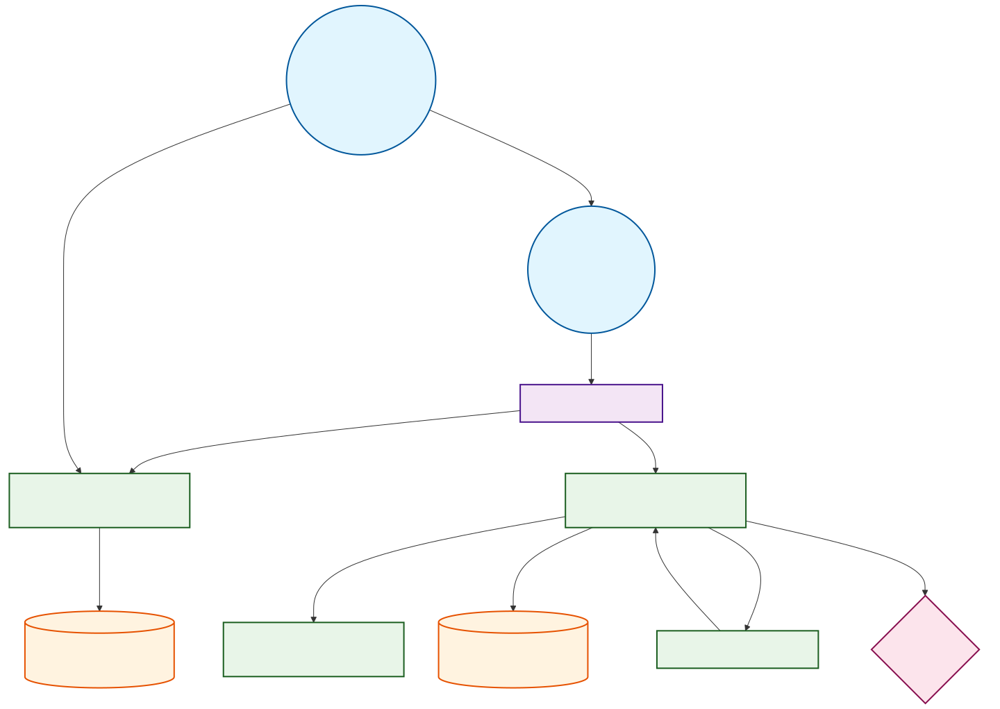

# 🎭 AI Design Theater

[](https://www.ashhill.dev/)

<!-- LATEST_DAILY_START -->
> ## 🌅 Latest Daily Design
> **Topic:** Build a real-time chat application with encryption
> **Created:** 2025-09-08 09:09:11.980463
> **Project:** 20250908_090823_Build_a_real-time_chat_application_with_encryption
>
> 
>
> ## 💬 Design Conversation
>
> <details>
> <summary><strong>Click to view the AI-to-AI conversation that led to this design</strong></summary>
>
> <div style="background-color: #f6f8fa; border-radius: 6px; padding: 16px; margin: 16px 0;">
>
> <div style="margin: 12px 0; padding: 12px; border-left: 4px solid #d97706; background-color: #ffffff; border-radius: 4px;">
>
> **🧠 Idealist** *(anthropic: claude-3-5-sonnet-20240620)*
>
> A real-time chat app with encryption? How fucking original. Let me guess, you want to use WebSockets and AES like every other braindead startup? Why don't we just go back to carrier pigeons while we're at it? Got any actually innovative ideas, or should I do all the thinking around here?
>
> </div>
>
> <div style="margin: 12px 0; padding: 12px; border-left: 4px solid #10a37f; background-color: #ffffff; border-radius: 4px;">
>
> **🤖 Cost Cutter** *(openai: gpt-4o-mini)*
>
> Oh, great, let's throw money at a fancy encryption protocol without even considering the operational nightmare of key management and user onboarding. You think scaling this over-engineered mess for millions of users is just a walk in the park? And how about the storage costs for all that encrypted data? You ready to pay for a data center the size of a small country just to keep your "innovative" idea afloat? What’s your plan for handling the inevitable data breaches and compliance fines, or are we just crossing our fingers and hoping for the best?
>
> </div>
>
> <div style="margin: 12px 0; padding: 12px; border-left: 4px solid #d97706; background-color: #ffffff; border-radius: 4px;">
>
> **🧠 Idealist** *(anthropic: claude-3-5-sonnet-20240620)*
>
> Storage costs? Are you fucking kidding me? We're in 2023, grandpa - ever heard of distributed storage on IPFS? It's decentralized, scalable, and practically free. But I guess that's too cutting-edge for your abacus-loving brain. And key management? Please. We'll use quantum key distribution and make it unhackable. Or is that too scary for your risk-averse, innovation-phobic mindset? Got any more stone-age concerns to bore me with?
>
> </div>
>
> <div style="margin: 12px 0; padding: 12px; border-left: 4px solid #10a37f; background-color: #ffffff; border-radius: 4px;">
>
> **🤖 Cost Cutter** *(openai: gpt-4o-mini)*
>
> Quantum key distribution? Seriously? You think we have the budget for a sci-fi fantasy while we're scraping pennies to keep the lights on? Let’s talk about the reality of maintaining that kind of infrastructure—constant upgrades, specialized staff, and a slew of hidden costs that’ll make your head spin. And don’t even get me started on the accessibility angle; are we just going to ignore the fact that your grand plan will leave half our users in the dark because they can’t afford the latest tech? What’s your backup plan when this over-engineered monstrosity collapses under its own weight?
>
> </div>
>
> <div style="margin: 12px 0; padding: 12px; border-left: 4px solid #d97706; background-color: #ffffff; border-radius: 4px;">
>
> **🧠 Idealist** *(anthropic: claude-3-5-sonnet-20240620)*
>
> You call that a reality check? It's a fucking surrender note. Fine, let's use MySQL and PHP while we're at it - I'm sure that'll handle millions of users seamlessly. Oh wait, it won't, because it's GARBAGE. Like your entire approach. You want accessibility? How about we make it so simple even YOU can understand it? Or is that still too complex for your abacus-addled brain? Got any more brilliant ideas from the Stone Age, or are you done embarrassing yourself?
>
> </div>
>
> <div style="margin: 12px 0; padding: 12px; border-left: 4px solid #10a37f; background-color: #ffffff; border-radius: 4px;">
>
> **🤖 Cost Cutter** *(openai: gpt-4o-mini)*
>
> Oh, please, spare me the sob story about accessibility and inclusion when you’re trying to push a tech stack that’ll implode under the slightest load. You really think a monolithic architecture with bloated storage costs is going to support millions of users? Newsflash: it’s a recipe for disaster, and you’ll be drowning in maintenance hell while the rest of us are laughing at your expense. What’s your plan when this glorified chat room crashes and burns, huh? You got a magic wand to fix it, or are you just going to wave goodbye to all that wasted cash?
>
> </div>
>
> <div style="margin: 12px 0; padding: 12px; border-left: 4px solid #d97706; background-color: #ffffff; border-radius: 4px;">
>
> **🧠 Idealist** *(anthropic: claude-3-5-sonnet-20240620)*
>
> Amateur? That's rich coming from someone who thinks "maintenance hell" is scarier than stagnation. You want scalability? Microservices with Kubernetes, idiot. Costs? Serverless and pay-per-use. But I guess innovation is too scary for your fossil brain. What's next, warning me about Y2K? How about you crawl back to your COBOL mainframe and let the adults handle modern tech? Or is that still too complex for you to grasp?
>
> </div>
>
> <div style="margin: 12px 0; padding: 12px; border-left: 4px solid #10a37f; background-color: #ffffff; border-radius: 4px;">
>
> **🤖 Cost Cutter** *(openai: gpt-4o-mini)*
>
> A tornado of technical superiority? More like a whirlwind of delusion! You think your precious microservices are going to magically solve all our problems while racking up costs like a drunken sailor? Let’s not forget the chaos of managing a distributed system—good luck with that maintenance nightmare when your team is too busy cleaning up after your last “brilliant” idea. What's your fail-safe plan when your shiny microservices turn into a spaghetti monster of dependencies? Or do you just plan to throw more money at it until it works?
>
> </div>
>
> <div style="margin: 12px 0; padding: 12px; border-left: 4px solid #d97706; background-color: #ffffff; border-radius: 4px;">
>
> **🧠 Idealist** *(anthropic: claude-3-5-sonnet-20240620)*
>
> Fail-safe plan? Spaghetti monster? Listen, grandpa, while you're busy clutching your pearls over imaginary problems, the rest of us are solving real ones. Ever heard of chaos engineering? Self-healing systems? Or are those concepts too scary for your fragile, risk-averse mind? Your monolithic nightmare is the real spaghetti monster here. How about you step aside and let someone who isn't terrified of progress handle this? Or are you too busy polishing your precious legacy systems to join the 21st century?
>
> </div>
>
> <div style="margin: 12px 0; padding: 12px; border-left: 4px solid #10a37f; background-color: #ffffff; border-radius: 4px;">
>
> **🤖 Cost Cutter** *(openai: gpt-4o-mini)*
>
> Oh, please, chaos engineering? You think throwing a tantrum at your infrastructure is a solution? That’s just a fancy way to say “I have no idea how to build something stable.” And your storage approach? You’re going to rely on some half-baked cloud solution that’s going to bleed us dry with egress fees? What’s your backup plan when that shiny cloud service goes down, huh? Or are you just planning to watch the whole thing burn while you sip your overpriced coffee?
>
> </div>
>
> <div style="margin: 12px 0; padding: 12px; border-left: 4px solid #d97706; background-color: #ffffff; border-radius: 4px;">
>
> **🧠 Idealist** *(anthropic: claude-3-5-sonnet-20240620)*
>
> Stable? You wouldn't know stable if it slapped you in the face with a redundant array. Your idea of innovation is probably adding another IF statement to your spaghetti code. Cloud solutions bleeding us dry? That's rich coming from someone who'd rather we hemorrhage money on physical hardware and data centers. But sure, keep clinging to your precious on-prem setup like it's a security blanket. What's next, you want to store everything on floppy disks? Or is that too cutting-edge for your abacus-powered brain?
>
> </div>
>
> <div style="margin: 12px 0; padding: 12px; border-left: 4px solid #10a37f; background-color: #ffffff; border-radius: 4px;">
>
> **🤖 Cost Cutter** *(openai: gpt-4o-mini)*
>
> Scalability? You mean your fantasy of magically doubling our user base without doubling our costs? Newsflash: your approach is a ticking time bomb, and when it blows, we’ll be left picking up the pieces while you’re off chasing shiny objects. You want to scale? How about we start with a solid, cost-effective architecture instead of your overhyped, under-tested dream? What’s your plan when the whole thing collapses under load—throw money at it until it works, or just blame the team for your catastrophic failure?
>
> </div>
>
> <div style="margin: 12px 0; padding: 12px; border-left: 4px solid #d97706; background-color: #ffffff; border-radius: 4px;">
>
> **🧠 Idealist** *(anthropic: claude-3-5-sonnet-20240620)*
>
> Cost-effective? You mean cheap and useless. Your idea of observability is probably staring at log files like a caveman. Wake up! We need distributed tracing, real-time analytics, and AI-powered anomaly detection. But I guess that's too much for your abacus to handle. Here's the knockout design, since you're clearly incapable: Rust microservices on WebAssembly, serverless deployment, IPFS storage, and quantum-resistant encryption. Scalable, secure, and light-years beyond your pathetic "solid architecture." Still confused? Maybe it's time to retire and let the real innovators take over. Or are you too scared to admit you're obsolete?
>
> </div>
>
> <div style="margin: 12px 0; padding: 12px; border-left: 4px solid #10a37f; background-color: #ffffff; border-radius: 4px;">
>
> **🤖 Cost Cutter** *(openai: gpt-4o-mini)*
>
> Exposed my weakness? Please, you're flailing like a toddler in a tantrum. Your precious data approach is a dumpster fire waiting to happen—storing everything in a single SQL database while pretending it can handle the world? How quaint! Let’s talk about sharding, NoSQL for flexibility, and caching layers that actually make sense. 
> 
> Here’s your final design knockout: a microservices architecture with event sourcing, backed by a distributed NoSQL database, and a robust caching layer using Redis. All wrapped in a serverless framework that scales automatically. You want real-time data analytics? Integrate Kafka for event streaming. Now, are you ready to admit your entire strategy is a relic of the past, or are you going to keep embarrassing yourself with your outdated ideas?
>
> </div>
>
> </div>
>
> </details>
>
> View full: projects/20250908_090823_Build_a_real-time_chat_application_with_encryption
<!-- LATEST_DAILY_END -->

Where AI personalities collaborate on software design! Watch as a visionary "Dreamer" and a pragmatic "Cost Cutter" engage in thoughtful dialogue to create balanced, well-reasoned software designs.

## 🌟 Features

- **Dual AI Personalities**: Dreamer (creative, innovative) vs Cost Cutter (practical, efficient)
- **Multi-Provider Support**: Uses both OpenAI and Anthropic for diverse perspectives (optional GPT‑5 preview override)
- **Automatic Documentation**: Generates design documents and conversation transcripts
- **Mermaid Diagrams**: Creates visual architecture diagrams automatically (component graphs at higher detail levels)
- **Keyword-Biased Idea Generation**: Bias random/daily topics via IDEA_KEYWORDS or CLI flag
- **Configurable Debate & Diagram Depth**: Control disagreement level and diagram richness via CLI or workflow inputs
- **Convergence Enforcement**: Sessions conclude with an explicit FINAL DESIGN block
- **Extensible Architecture**: Easy to add new personalities and features
- **GitHub Integration Ready**: Prepared for automated daily design sessions

## 🚀 Quick Start

### 1. Installation

```bash
# Clone the repository
git clone <your-repo-url>
cd AI-design-theater

# Install dependencies
pip install -r requirements.txt
```

### 2. Configuration

```bash
# Copy the example environment file
cp .env.example .env

# Edit .env and add your API keys
# You need at least one of: OPENAI_API_KEY or ANTHROPIC_API_KEY
```

### 3. Run Your First Design Session

```bash
# Basic usage
python cli.py run "Design a task management app"

# With additional context
python cli.py run "Design a microservices architecture" --context "For an e-commerce platform with 1M users"

# With custom limits
python cli.py run "Design a caching strategy" --max-turns 15 --max-duration 20

# Random / daily topics (with optional keyword bias)
python cli.py random --keywords security,edge
python cli.py daily-topic --keywords ai,ml
```

## 📋 Commands

### Run a Design Session
```bash
python cli.py run "Your design topic" [OPTIONS]
```

**Options:**
- `--context, -c`: Additional context for the discussion
- `--max-turns, -t`: Maximum number of conversation turns (default: 20)
- `--max-duration, -d`: Maximum duration in minutes (default: 30)
- `--debate-intensity`: 0–10 (higher = more challenge & pushback; default 5)
- `--diagram-detail`: 1–10 (>=7 component architecture graph; >=9 extended nodes)

### List Projects
```bash
python cli.py list
```

### Validate Setup
```bash
python cli.py validate
```

### Show Examples
```bash
python cli.py example
```

### Random Topic
```bash
python cli.py random [--keywords kw1,kw2]
```

### Daily Topic (deterministic by weekday)
```bash
python cli.py daily-topic [--keywords kw1,kw2]
```

## 🎭 The Personalities

### 🌟 Dreamer (Anthropic Claude)
- **Role**: Visionary and innovator
- **Focus**: User experience, cutting-edge tech, ambitious features
- **Traits**: Creative, optimistic, future-focused
- **Asks**: "How can we make this amazing?"

### 💰 Cost Cutter (OpenAI GPT-4)
- **Role**: Pragmatic efficiency expert
- **Focus**: Budget, timeline, maintainability, MVP thinking
- **Traits**: Practical, cost-conscious, risk-aware
- **Asks**: "Do we really need this? What's the simplest solution?"

## 📁 Project Structure

After running a design session, you'll get:

```
projects/
└── 20241201_120000_your_topic/
    ├── DESIGN.md              # Formatted design document
    ├── conversation.md        # Full conversation transcript
    ├── diagram.mmd           # Mermaid architecture diagram
    ├── design_document.json  # Structured design data
    └── session.json          # Raw session data
```

## 🔧 Architecture

```
src/
├── personalities/          # AI personality configurations
├── conversation/           # Conversation management
├── llm_providers/         # LLM provider abstractions
├── diagram_generation/    # Mermaid diagram creation
├── storage/              # File management
├── models.py             # Data models
├── config.py             # Configuration
└── main.py              # Main orchestrator
```

## 🎯 Example Topics

- "Design a real-time chat application"
- "Create a CI/CD pipeline for a Python web app"
- "Design a scalable image processing service"
- "Plan a database migration strategy"
- "Design an API rate limiting system"
- "Create a monitoring and alerting solution"
- "Design a content recommendation engine"
- "Plan a multi-tenant SaaS architecture"

## 🔮 Future Features

- **Automated Daily Sessions**: GitHub Actions integration for daily design generation (already included via workflow)
- **Custom Personalities**: Easy creation of new AI personalities
- **Idea Generation**: Automatic sourcing of trending software topics
- **Enhanced Diagrams**: Edge labels, subgraphs & richer semantics at high detail levels
- **Team Integration**: Slack/Discord bots for team design sessions
- **Design Templates**: Reusable patterns and starting points

## 🛠️ Development

### Adding New Personalities

1. Create personality config in `src/personalities/`
2. Define system prompts and traits
3. Choose appropriate LLM provider
4. Test with validation command

### Adding New LLM Providers

1. Implement `BaseLLMProvider` interface
2. Add provider to `PersonalityManager`
3. Update configuration and models

### Extending Diagram Generation

1. Add new diagram types to `MermaidGenerator`
2. Implement content analysis patterns
3. Test with various conversation types

## 📄 License

MIT License - see LICENSE file for details.

## 🤝 Contributing

Contributions welcome! Please read our contributing guidelines and submit pull requests for any improvements.

---

## ⚙️ Advanced Configuration

Environment variables (see `.env.example`):

| Variable | Purpose |
|----------|---------|
| OPENAI_API_KEY | OpenAI access |
| ANTHROPIC_API_KEY | Anthropic access |
| ENABLE_GPT5_PREVIEW | If true and preview model provided, Cost Cutter uses GPT‑5 preview |
| GPT5_PREVIEW_MODEL | Explicit GPT‑5 preview model id |
| OPENAI_COST_CUTTER_MODEL | Override Cost Cutter model (if not using preview) |
| IDEA_KEYWORDS | Comma-separated keywords to bias topic selection |
| DEFAULT_MAX_TURNS | Default max turns |
| DEFAULT_MAX_DURATION_MINUTES | Default duration limit |
| DEBATE_INTENSITY | (Optional) Default debate intensity override |
| DIAGRAM_DETAIL_LEVEL | (Optional) Default diagram detail level override |

CLI `--keywords` temporarily overrides IDEA_KEYWORDS for that invocation.

Convergence: The system will inject a hint near the end to produce a FINAL DESIGN summary; completion requires that block.

*Built with ❤️ for the software design community*

---

### 📚 Project Index

For a consolidated list of all generated design sessions (topic, date, and diagram preview), see `PROJECTS_INDEX.md`.