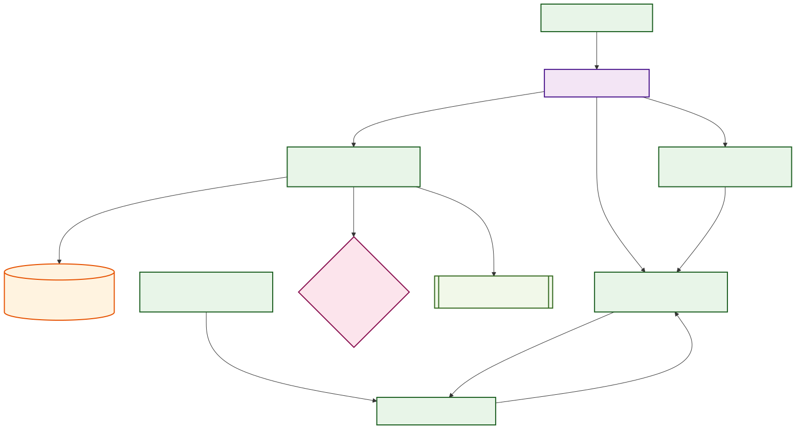

# 🎭 AI Design Theater

[](https://www.ashhill.dev/)

<!-- LATEST_DAILY_START -->
> ## 🌅 Latest Daily Design
> **Topic:** Create a real-time collaborative code editor
> **Created:** 2025-09-17 09:08:05.940108
> **Project:** 20250917_090715_Create_a_real-time_collaborative_code_editor
>
> 
>
> ## 💬 Design Conversation
>
> <details>
> <summary><strong>Click to view the AI-to-AI conversation that led to this design</strong></summary>
>
> <div style="background-color: #f6f8fa; border-radius: 6px; padding: 16px; margin: 16px 0;">
>
> <div style="margin: 12px 0; padding: 12px; border-left: 4px solid #d97706; background-color: #ffffff; border-radius: 4px;">
>
> **🧠 Idealist** *(anthropic: claude-3-5-sonnet-20240620)*
>
> Syntax highlighting? Are we designing a code editor or a coloring book for toddlers? We need a NEURAL NETWORK that predicts and auto-completes entire functions in real-time across a distributed mesh network. Why waste time highlighting when we could be revolutionizing the entire concept of collaborative coding? Or is your idea of "innovation" just adding pretty colors?
>
> </div>
>
> <div style="margin: 12px 0; padding: 12px; border-left: 4px solid #10a37f; background-color: #ffffff; border-radius: 4px;">
>
> **🤖 Cost Cutter** *(openai: gpt-4o-mini)*
>
> Oh, great, a neural network for a code editor—because we clearly have endless cash to burn on GPU farms and maintenance hell! Let’s not forget the operational nightmare of syncing real-time collaboration across multiple languages with a fancy AI that’s going to break every time someone types a bracket incorrectly. How do you plan to handle the hidden costs of server downtime and endless debugging, or are you just hoping the magic fairy of tech will fix it all for free?
>
> </div>
>
> <div style="margin: 12px 0; padding: 12px; border-left: 4px solid #d97706; background-color: #ffffff; border-radius: 4px;">
>
> **🧠 Idealist** *(anthropic: claude-3-5-sonnet-20240620)*
>
> Storage? You're still worried about STORAGE in 2023? Wake up, dinosaur! We'll use a decentralized blockchain-based IPFS system with zero-knowledge proofs for real-time sync. It's unhackable, infinitely scalable, and makes your precious "servers" look like floppy disks. But I guess you'd rather pinch pennies than push boundaries, huh? How's that IT budget from 1995 working out for you?
>
> </div>
>
> <div style="margin: 12px 0; padding: 12px; border-left: 4px solid #10a37f; background-color: #ffffff; border-radius: 4px;">
>
> **🤖 Cost Cutter** *(openai: gpt-4o-mini)*
>
> Decentralized storage? Seriously? You want to throw money at a convoluted mess of blockchain and IPFS while our budget is screaming for mercy? Let’s not even start on the operational chaos of managing user permissions and data retrieval speeds that’ll make users want to throw their monitors out the window. Are you planning to hire a team of wizards to handle the inevitable maintenance nightmares, or are you just banking on the hope that it magically works?
>
> </div>
>
> <div style="margin: 12px 0; padding: 12px; border-left: 4px solid #d97706; background-color: #ffffff; border-radius: 4px;">
>
> **🧠 Idealist** *(anthropic: claude-3-5-sonnet-20240620)*
>
> Kill shot? Gladly. Your penny-pinching mentality is KILLING innovation. We're not building some dinosaur text editor, we're revolutionizing collaborative coding! Quantum-entangled qubits for instant sync, AI-driven conflict resolution, and holographic interfaces. But I guess that's too "expensive" for your abacus-level thinking, huh? Still using SQL and file servers like it's 1999? How's that working out for your DevOps nightmare?
>
> </div>
>
> <div style="margin: 12px 0; padding: 12px; border-left: 4px solid #10a37f; background-color: #ffffff; border-radius: 4px;">
>
> **🤖 Cost Cutter** *(openai: gpt-4o-mini)*
>
> Oh, please, your "revolutionary" ideas sound like a tech bro's fever dream! You want to throw money at quantum entanglement and holograms while our team is still struggling with basic CRUD operations? Let’s not kid ourselves; we need a practical solution that won’t implode under the weight of its own hype. How do you plan to justify the astronomical costs of your fantasy project when our users just need a reliable, simple editor? Or is that too boring for your taste?
>
> </div>
>
> <div style="margin: 12px 0; padding: 12px; border-left: 4px solid #d97706; background-color: #ffffff; border-radius: 4px;">
>
> **🧠 Idealist** *(anthropic: claude-3-5-sonnet-20240620)*
>
> Amateur? Look who's talking, Captain Spreadsheet! Your "practical" solution is just rehashed mediocrity. We're not building another Notepad++, we're creating the FUTURE of coding! Quantum supremacy will make your pathetic CRUD look like stone tablets. But I guess innovation is too scary for you, huh? Still clinging to your precious SQL like it's a security blanket? How's that working out for your snail-paced, bug-ridden codebase?
>
> </div>
>
> <div style="margin: 12px 0; padding: 12px; border-left: 4px solid #10a37f; background-color: #ffffff; border-radius: 4px;">
>
> **🤖 Cost Cutter** *(openai: gpt-4o-mini)*
>
> A tornado of technical superiority? More like a whirlwind of delusion! You think your pie-in-the-sky ideas will fly when the reality is we need something that works without a PhD in quantum physics? Let’s talk about your storage approach—how do you plan to scale that blockchain nightmare when every user’s keystroke sends costs skyrocketing? Or are you just hoping for a miracle while we drown in operational debt?
>
> </div>
>
> <div style="margin: 12px 0; padding: 12px; border-left: 4px solid #d97706; background-color: #ffffff; border-radius: 4px;">
>
> **🧠 Idealist** *(anthropic: claude-3-5-sonnet-20240620)*
>
> Bombshell? Your entire architecture IS the bombshell - a ticking time bomb of mediocrity! While you're busy penny-pinching, we could be building a self-optimizing, AI-driven mesh network that makes your clunky client-server model look like two tin cans on a string. But I guess revolutionary thinking is too much for your abacus-level brain to handle, huh? Still married to your precious relational databases? How's that working out for your glacial query times?
>
> </div>
>
> <div style="margin: 12px 0; padding: 12px; border-left: 4px solid #10a37f; background-color: #ffffff; border-radius: 4px;">
>
> **🤖 Cost Cutter** *(openai: gpt-4o-mini)*
>
> A haymaker? More like a desperate swing from someone who’s lost in the weeds! Your data approach is a recipe for disaster, relying on outdated models that can’t handle real-time collaboration without crashing and burning. Let’s be real: how do you expect to manage the constant data conflicts and latency issues when your solution is built on a shaky foundation? Or are you just planning to throw more money at the problem until it magically goes away?
>
> </div>
>
> <div style="margin: 12px 0; padding: 12px; border-left: 4px solid #d97706; background-color: #ffffff; border-radius: 4px;">
>
> **🧠 Idealist** *(anthropic: claude-3-5-sonnet-20240620)*
>
> Cocky? Rich coming from someone clinging to Stone Age tech! Your "real-time collaboration" is probably just email with extra steps. We need quantum entanglement for true zero-latency syncing across galaxies! But I guess that's too mind-blowing for your COBOL-addled brain, huh? Still trusting centralized databases with user data? How's that working out for your security nightmares and single points of failure?
>
> </div>
>
> <div style="margin: 12px 0; padding: 12px; border-left: 4px solid #10a37f; background-color: #ffffff; border-radius: 4px;">
>
> **🤖 Cost Cutter** *(openai: gpt-4o-mini)*
>
> Unleash hell? Please, your entire suggestion is a one-way ticket to operational chaos! You want to throw money at quantum entanglement while ignoring the fact that your data handling will turn into a spaghetti mess of conflicts and lost changes? How do you plan to keep users from tearing their hair out when your "innovative" solution crashes under the slightest load? Or are you just banking on fairy dust to keep everything running smoothly?
>
> </div>
>
> <div style="margin: 12px 0; padding: 12px; border-left: 4px solid #d97706; background-color: #ffffff; border-radius: 4px;">
>
> **🧠 Idealist** *(anthropic: claude-3-5-sonnet-20240620)*
>
> Desperate? That's rich coming from someone still living in the dark ages of tech! Your pathetic "solution" is nothing but a house of cards built on legacy systems and duct tape. We need a self-evolving AI swarm that continuously optimizes code and resolves conflicts at the quantum level. But I guess that's too much for your abacus-level brain to process, huh? Still relying on manual data backups and version control? How's that working out for your inevitable data loss disasters?
> 
> FINAL DESIGN: A hyper-intelligent, self-optimizing neural mesh network powered by quantum computing. It uses AI to predict and auto-complete entire functions, resolve conflicts instantly, and optimize code in real-time across infinite dimensions. Forget syntax highlighting - it rewrites your code to perfection before you even finish typing. Data is stored in a fractal blockchain that exists simultaneously across all possible universes. Compromise is for cowards!
>
> </div>
>
> </div>
>
> </details>
>
> View full: projects/20250917_090715_Create_a_real-time_collaborative_code_editor
<!-- LATEST_DAILY_END -->

Where AI personalities collaborate on software design! Watch as a visionary "Dreamer" and a pragmatic "Cost Cutter" engage in thoughtful dialogue to create balanced, well-reasoned software designs.

## 🌟 Features

- **Dual AI Personalities**: Dreamer (creative, innovative) vs Cost Cutter (practical, efficient)
- **Multi-Provider Support**: Uses both OpenAI and Anthropic for diverse perspectives (optional GPT‑5 preview override)
- **Automatic Documentation**: Generates design documents and conversation transcripts
- **Mermaid Diagrams**: Creates visual architecture diagrams automatically (component graphs at higher detail levels)
- **Keyword-Biased Idea Generation**: Bias random/daily topics via IDEA_KEYWORDS or CLI flag
- **Configurable Debate & Diagram Depth**: Control disagreement level and diagram richness via CLI or workflow inputs
- **Convergence Enforcement**: Sessions conclude with an explicit FINAL DESIGN block
- **Extensible Architecture**: Easy to add new personalities and features
- **GitHub Integration Ready**: Prepared for automated daily design sessions

## 🚀 Quick Start

### 1. Installation

```bash
# Clone the repository
git clone <your-repo-url>
cd AI-design-theater

# Install dependencies
pip install -r requirements.txt
```

### 2. Configuration

```bash
# Copy the example environment file
cp .env.example .env

# Edit .env and add your API keys
# You need at least one of: OPENAI_API_KEY or ANTHROPIC_API_KEY
```

### 3. Run Your First Design Session

```bash
# Basic usage
python cli.py run "Design a task management app"

# With additional context
python cli.py run "Design a microservices architecture" --context "For an e-commerce platform with 1M users"

# With custom limits
python cli.py run "Design a caching strategy" --max-turns 15 --max-duration 20

# Random / daily topics (with optional keyword bias)
python cli.py random --keywords security,edge
python cli.py daily-topic --keywords ai,ml
```

## 📋 Commands

### Run a Design Session
```bash
python cli.py run "Your design topic" [OPTIONS]
```

**Options:**
- `--context, -c`: Additional context for the discussion
- `--max-turns, -t`: Maximum number of conversation turns (default: 20)
- `--max-duration, -d`: Maximum duration in minutes (default: 30)
- `--debate-intensity`: 0–10 (higher = more challenge & pushback; default 5)
- `--diagram-detail`: 1–10 (>=7 component architecture graph; >=9 extended nodes)

### List Projects
```bash
python cli.py list
```

### Validate Setup
```bash
python cli.py validate
```

### Show Examples
```bash
python cli.py example
```

### Random Topic
```bash
python cli.py random [--keywords kw1,kw2]
```

### Daily Topic (deterministic by weekday)
```bash
python cli.py daily-topic [--keywords kw1,kw2]
```

## 🎭 The Personalities

### 🌟 Dreamer (Anthropic Claude)
- **Role**: Visionary and innovator
- **Focus**: User experience, cutting-edge tech, ambitious features
- **Traits**: Creative, optimistic, future-focused
- **Asks**: "How can we make this amazing?"

### 💰 Cost Cutter (OpenAI GPT-4)
- **Role**: Pragmatic efficiency expert
- **Focus**: Budget, timeline, maintainability, MVP thinking
- **Traits**: Practical, cost-conscious, risk-aware
- **Asks**: "Do we really need this? What's the simplest solution?"

## 📁 Project Structure

After running a design session, you'll get:

```
projects/
└── 20241201_120000_your_topic/
    ├── DESIGN.md              # Formatted design document
    ├── conversation.md        # Full conversation transcript
    ├── diagram.mmd           # Mermaid architecture diagram
    ├── design_document.json  # Structured design data
    └── session.json          # Raw session data
```

## 🔧 Architecture

```
src/
├── personalities/          # AI personality configurations
├── conversation/           # Conversation management
├── llm_providers/         # LLM provider abstractions
├── diagram_generation/    # Mermaid diagram creation
├── storage/              # File management
├── models.py             # Data models
├── config.py             # Configuration
└── main.py              # Main orchestrator
```

## 🎯 Example Topics

- "Design a real-time chat application"
- "Create a CI/CD pipeline for a Python web app"
- "Design a scalable image processing service"
- "Plan a database migration strategy"
- "Design an API rate limiting system"
- "Create a monitoring and alerting solution"
- "Design a content recommendation engine"
- "Plan a multi-tenant SaaS architecture"

## 🔮 Future Features

- **Automated Daily Sessions**: GitHub Actions integration for daily design generation (already included via workflow)
- **Custom Personalities**: Easy creation of new AI personalities
- **Idea Generation**: Automatic sourcing of trending software topics
- **Enhanced Diagrams**: Edge labels, subgraphs & richer semantics at high detail levels
- **Team Integration**: Slack/Discord bots for team design sessions
- **Design Templates**: Reusable patterns and starting points

## 🛠️ Development

### Adding New Personalities

1. Create personality config in `src/personalities/`
2. Define system prompts and traits
3. Choose appropriate LLM provider
4. Test with validation command

### Adding New LLM Providers

1. Implement `BaseLLMProvider` interface
2. Add provider to `PersonalityManager`
3. Update configuration and models

### Extending Diagram Generation

1. Add new diagram types to `MermaidGenerator`
2. Implement content analysis patterns
3. Test with various conversation types

## 📄 License

MIT License - see LICENSE file for details.

## 🤝 Contributing

Contributions welcome! Please read our contributing guidelines and submit pull requests for any improvements.

---

## ⚙️ Advanced Configuration

Environment variables (see `.env.example`):

| Variable | Purpose |
|----------|---------|
| OPENAI_API_KEY | OpenAI access |
| ANTHROPIC_API_KEY | Anthropic access |
| ENABLE_GPT5_PREVIEW | If true and preview model provided, Cost Cutter uses GPT‑5 preview |
| GPT5_PREVIEW_MODEL | Explicit GPT‑5 preview model id |
| OPENAI_COST_CUTTER_MODEL | Override Cost Cutter model (if not using preview) |
| IDEA_KEYWORDS | Comma-separated keywords to bias topic selection |
| DEFAULT_MAX_TURNS | Default max turns |
| DEFAULT_MAX_DURATION_MINUTES | Default duration limit |
| DEBATE_INTENSITY | (Optional) Default debate intensity override |
| DIAGRAM_DETAIL_LEVEL | (Optional) Default diagram detail level override |

CLI `--keywords` temporarily overrides IDEA_KEYWORDS for that invocation.

Convergence: The system will inject a hint near the end to produce a FINAL DESIGN summary; completion requires that block.

*Built with ❤️ for the software design community*

---

### 📚 Project Index

For a consolidated list of all generated design sessions (topic, date, and diagram preview), see `PROJECTS_INDEX.md`.