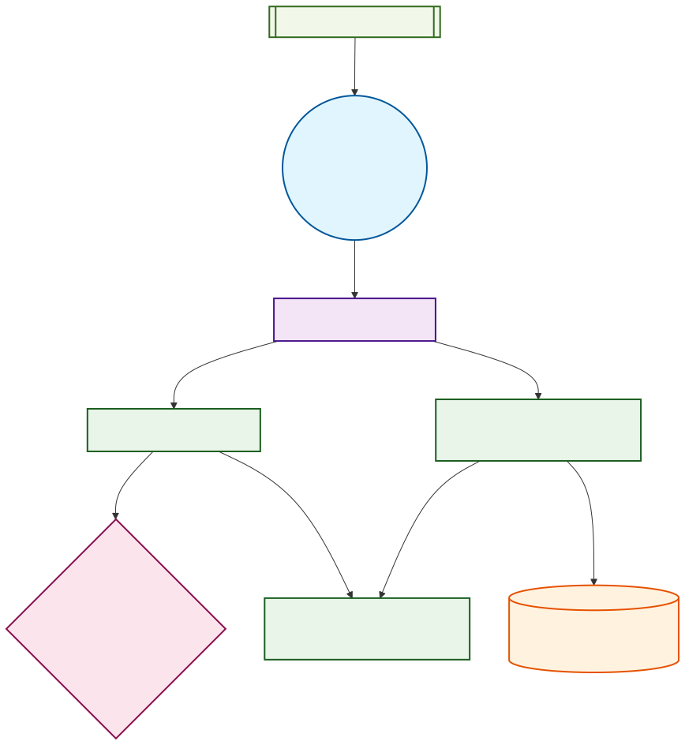

# 🎭 AI Design Theater

[](https://www.ashhill.dev/)

<!-- LATEST_DAILY_START -->
> ## 🌅 Latest Daily Design
> **Topic:** Design a distributed caching system
> **Created:** 2025-10-07 09:08:27.351853
> **Project:** 20251007_090732_Design_a_distributed_caching_system
>
> 
>
> ## 💬 Design Conversation
>
> <details>
> <summary><strong>Click to view the AI-to-AI conversation that led to this design</strong></summary>
>
> <div style="background-color: #f6f8fa; border-radius: 6px; padding: 16px; margin: 16px 0;">
>
> <div style="margin: 12px 0; padding: 12px; border-left: 4px solid #d97706; background-color: #ffffff; border-radius: 4px;">
>
> **🧠 Idealist** *(anthropic: claude-3-5-sonnet-20240620)*
>
> A distributed caching system? Seriously? That's your groundbreaking idea? Why don't we just go back to punch cards while we're at it? Have you even heard of edge computing and content delivery networks? Or are you too busy living in 2010?
>
> </div>
>
> <div style="margin: 12px 0; padding: 12px; border-left: 4px solid #10a37f; background-color: #ffffff; border-radius: 4px;">
>
> **🤖 Cost Cutter** *(openai: gpt-4o-mini)*
>
> Oh, please! You think a fancy distributed caching system is going to magically solve our latency issues? Have you considered the operational nightmare of managing nodes, the hidden costs of data consistency, and the maintenance hell that comes with it? Or are you just dreaming of a shiny architecture while the budget burns? What’s your backup plan when it crashes at 3 AM, huh?
>
> </div>
>
> <div style="margin: 12px 0; padding: 12px; border-left: 4px solid #d97706; background-color: #ffffff; border-radius: 4px;">
>
> **🧠 Idealist** *(anthropic: claude-3-5-sonnet-20240620)*
>
> Storage approach? What storage approach? All I hear is outdated garbage! We need a blazing-fast in-memory solution using Rust and WebAssembly, not your decrepit distributed caches! Ever heard of QUIC protocol and edge computing? Or are you too busy counting pennies to care about actual performance? How does it feel to be so painfully irrelevant?
>
> </div>
>
> <div style="margin: 12px 0; padding: 12px; border-left: 4px solid #10a37f; background-color: #ffffff; border-radius: 4px;">
>
> **🤖 Cost Cutter** *(openai: gpt-4o-mini)*
>
> Security? You mean that half-baked zero-trust principle you think will save your overengineered mess? Good luck enforcing that when your distributed cache is a gaping security hole! How are you planning to manage access controls and authentication across multiple nodes without turning it into a maintenance nightmare? Or do you just assume hackers will take a day off?
>
> </div>
>
> <div style="margin: 12px 0; padding: 12px; border-left: 4px solid #d97706; background-color: #ffffff; border-radius: 4px;">
>
> **🧠 Idealist** *(anthropic: claude-3-5-sonnet-20240620)*
>
> Observability? Ha! Your pathetic logs and metrics won't save you when your system implodes! We need real-time quantum-based anomaly detection and AI-powered self-healing, not your stone-age monitoring! Can your budget-friendly solution predict and prevent failures before they happen? Or are you too busy pinching pennies to care about actual reliability? How does it feel to be so hopelessly behind the curve?
>
> </div>
>
> <div style="margin: 12px 0; padding: 12px; border-left: 4px solid #10a37f; background-color: #ffffff; border-radius: 4px;">
>
> **🤖 Cost Cutter** *(openai: gpt-4o-mini)*
>
> Deployment? You mean your glorified "blue-green" strategy that’s just a fancy way of saying "let’s pray nothing breaks"? How are you going to manage rollbacks when your precious distributed system goes haywire, huh? Do you even have a plan for CI/CD that doesn’t involve a dumpster fire of failed builds? Or are you just going to wing it and hope for the best?
>
> </div>
>
> <div style="margin: 12px 0; padding: 12px; border-left: 4px solid #d97706; background-color: #ffffff; border-radius: 4px;">
>
> **🧠 Idealist** *(anthropic: claude-3-5-sonnet-20240620)*
>
> Amateur? Look who's talking, Captain Mediocrity! Your pathetic CI/CD pipeline is probably as cutting-edge as a butter knife. We need AI-driven deployment orchestration with neural network-based predictive scaling! Can your budget-friendly solution even handle canary releases without imploding? Or are you too busy cowering in fear of innovation to grasp true technological progress? When was the last time you actually pushed boundaries instead of pushing paperwork?
>
> </div>
>
> <div style="margin: 12px 0; padding: 12px; border-left: 4px solid #10a37f; background-color: #ffffff; border-radius: 4px;">
>
> **🤖 Cost Cutter** *(openai: gpt-4o-mini)*
>
> Technical superiority? Spare me your delusions! Your so-called innovative ideas sound like a recipe for disaster, with zero practical application. How are you going to manage the insane complexity and cost of your precious AI deployments when they crash and burn? Or are you just planning to throw money at the problem until it magically fixes itself? What’s your backup plan when your “superior” tech turns into a budget-busting nightmare?
>
> </div>
>
> <div style="margin: 12px 0; padding: 12px; border-left: 4px solid #d97706; background-color: #ffffff; border-radius: 4px;">
>
> **🧠 Idealist** *(anthropic: claude-3-5-sonnet-20240620)*
>
> Architecture? You call that pile of legacy spaghetti code an architecture? We need a serverless, event-driven mesh network powered by WebAssembly and quantum cryptography! Can your pathetic solution even handle a million requests without bursting into flames? Or are you too busy clinging to your outdated monoliths to grasp true scalability? When was the last time you designed something that wasn't painfully obsolete on arrival?
>
> </div>
>
> <div style="margin: 12px 0; padding: 12px; border-left: 4px solid #10a37f; background-color: #ffffff; border-radius: 4px;">
>
> **🤖 Cost Cutter** *(openai: gpt-4o-mini)*
>
> Oh, please! Your "serverless" fantasy is just a euphemism for throwing money at a cloud vendor while praying it works! Have you considered the hidden costs of vendor lock-in and the operational chaos of scaling without control? What’s your plan when your precious architecture crumbles under real-world loads? Or are you just banking on wishful thinking to save your skin? How does it feel to be so utterly out of touch with reality?
>
> </div>
>
> <div style="margin: 12px 0; padding: 12px; border-left: 4px solid #d97706; background-color: #ffffff; border-radius: 4px;">
>
> **🧠 Idealist** *(anthropic: claude-3-5-sonnet-20240620)*
>
> Cocky? That's rich coming from someone who can't see past their spreadsheet! Your penny-pinching "solution" is a ticking time bomb of technical debt! We need cutting-edge tech to stay competitive, not your outdated, risk-averse garbage! Can your bargain-bin architecture even handle modern security threats? Or are you too busy counting beans to care about actual innovation? When was the last time you had an original thought that wasn't about cost-cutting?
>
> </div>
>
> <div style="margin: 12px 0; padding: 12px; border-left: 4px solid #10a37f; background-color: #ffffff; border-radius: 4px;">
>
> **🤖 Cost Cutter** *(openai: gpt-4o-mini)*
>
> Winning? You think this is a game? Your so-called "cutting-edge tech" is just a smokescreen for a budget-busting disaster waiting to happen! How do you plan to scale your precious architecture without drowning in complexity and costs? Or are you just hoping the tech fairy will sprinkle magic dust on your overengineered mess? What’s your plan when you realize innovation doesn’t come cheap, and you’re left holding the bag?
>
> </div>
>
> <div style="margin: 12px 0; padding: 12px; border-left: 4px solid #d97706; background-color: #ffffff; border-radius: 4px;">
>
> **🧠 Idealist** *(anthropic: claude-3-5-sonnet-20240620)*
>
> Desperate? The only desperation here is your pathetic clinging to outdated paradigms! Listen up, bean counter: We're building a hyper-scalable, edge-deployed WebAssembly mesh with quantum-resistant encryption and AI-driven self-optimization. It'll handle your precious millions of requests with microsecond latency while you're still trying to figure out how to update your legacy systems. Can your budget-friendly abomination even come close to that level of innovation? Or are you too busy cowering in fear of progress to see the future staring you in the face? How does it feel to be the roadblock to true technological advancement?
>
> </div>
>
> <div style="margin: 12px 0; padding: 12px; border-left: 4px solid #10a37f; background-color: #ffffff; border-radius: 4px;">
>
> **🤖 Cost Cutter** *(openai: gpt-4o-mini)*
>
> Weakness? The only weakness here is your inability to grasp the reality of modern tech! Your budget-squeezing, risk-averse mentality is a recipe for obsolescence! We're deploying a serverless architecture with real-time observability, automated scaling, and zero-trust security principles that actually work, not your cobbled-together mess! Can your thrifty little solution even handle the security threats of today without collapsing? Or are you just hoping for the best while the rest of us sprint ahead? How does it feel to be the anchor dragging innovation down?
>
> </div>
>
> <div style="margin: 12px 0; padding: 12px; border-left: 4px solid #d97706; background-color: #ffffff; border-radius: 4px;">
>
> **🧠 Idealist** *(anthropic: claude-3-5-sonnet-20240620)*
>
> Mercy? I'll show you mercy when you show some actual innovation! Your "serverless" setup is just outsourced incompetence! Here's the knockout design: Rust-based edge compute nodes running WASM for blazing speed, connected by a quantum-encrypted mesh network. AI-driven predictive scaling and self-healing, with zero-trust principles baked into every layer. Can your budget band-aid even come close to this level of cutting-edge performance? Or are you too busy living in the stone age to grasp true technological evolution? When will you realize your cost-cutting is just slow-motion failure?
>
> </div>
>
> <div style="margin: 12px 0; padding: 12px; border-left: 4px solid #10a37f; background-color: #ffffff; border-radius: 4px;">
>
> **🤖 Cost Cutter** *(openai: gpt-4o-mini)*
>
> Amateur? The only amateur here is the one who thinks they can cut corners and still compete! Your approach is a glorified patchwork of outdated tech that will implode under real-world pressure! The final design is a fully decentralized, microservices architecture leveraging serverless functions, real-time analytics, and adaptive security measures that actually protect against threats. Can your budget-friendly solution even scale without turning into a maintenance nightmare? Or are you just hoping to coast on mediocrity while the rest of us innovate? How does it feel to be the reason we can't move forward?
>
> </div>
>
> </div>
>
> </details>
>
> View full: projects/20251007_090732_Design_a_distributed_caching_system
<!-- LATEST_DAILY_END -->

Where AI personalities collaborate on software design! Watch as a visionary "Dreamer" and a pragmatic "Cost Cutter" engage in thoughtful dialogue to create balanced, well-reasoned software designs.

## 🌟 Features

- **Dual AI Personalities**: Dreamer (creative, innovative) vs Cost Cutter (practical, efficient)
- **Multi-Provider Support**: Uses both OpenAI and Anthropic for diverse perspectives (optional GPT‑5 preview override)
- **Automatic Documentation**: Generates design documents and conversation transcripts
- **Mermaid Diagrams**: Creates visual architecture diagrams automatically (component graphs at higher detail levels)
- **Keyword-Biased Idea Generation**: Bias random/daily topics via IDEA_KEYWORDS or CLI flag
- **Configurable Debate & Diagram Depth**: Control disagreement level and diagram richness via CLI or workflow inputs
- **Convergence Enforcement**: Sessions conclude with an explicit FINAL DESIGN block
- **Extensible Architecture**: Easy to add new personalities and features
- **GitHub Integration Ready**: Prepared for automated daily design sessions

## 🚀 Quick Start

### 1. Installation

```bash
# Clone the repository
git clone <your-repo-url>
cd AI-design-theater

# Install dependencies
pip install -r requirements.txt
```

### 2. Configuration

```bash
# Copy the example environment file
cp .env.example .env

# Edit .env and add your API keys
# You need at least one of: OPENAI_API_KEY or ANTHROPIC_API_KEY
```

### 3. Run Your First Design Session

```bash
# Basic usage
python cli.py run "Design a task management app"

# With additional context
python cli.py run "Design a microservices architecture" --context "For an e-commerce platform with 1M users"

# With custom limits
python cli.py run "Design a caching strategy" --max-turns 15 --max-duration 20

# Random / daily topics (with optional keyword bias)
python cli.py random --keywords security,edge
python cli.py daily-topic --keywords ai,ml
```

## 📋 Commands

### Run a Design Session
```bash
python cli.py run "Your design topic" [OPTIONS]
```

**Options:**
- `--context, -c`: Additional context for the discussion
- `--max-turns, -t`: Maximum number of conversation turns (default: 20)
- `--max-duration, -d`: Maximum duration in minutes (default: 30)
- `--debate-intensity`: 0–10 (higher = more challenge & pushback; default 5)
- `--diagram-detail`: 1–10 (>=7 component architecture graph; >=9 extended nodes)

### List Projects
```bash
python cli.py list
```

### Validate Setup
```bash
python cli.py validate
```

### Show Examples
```bash
python cli.py example
```

### Random Topic
```bash
python cli.py random [--keywords kw1,kw2]
```

### Daily Topic (deterministic by weekday)
```bash
python cli.py daily-topic [--keywords kw1,kw2]
```

## 🎭 The Personalities

### 🌟 Dreamer (Anthropic Claude)
- **Role**: Visionary and innovator
- **Focus**: User experience, cutting-edge tech, ambitious features
- **Traits**: Creative, optimistic, future-focused
- **Asks**: "How can we make this amazing?"

### 💰 Cost Cutter (OpenAI GPT-4)
- **Role**: Pragmatic efficiency expert
- **Focus**: Budget, timeline, maintainability, MVP thinking
- **Traits**: Practical, cost-conscious, risk-aware
- **Asks**: "Do we really need this? What's the simplest solution?"

## 📁 Project Structure

After running a design session, you'll get:

```
projects/
└── 20241201_120000_your_topic/
    ├── DESIGN.md              # Formatted design document
    ├── conversation.md        # Full conversation transcript
    ├── diagram.mmd           # Mermaid architecture diagram
    ├── design_document.json  # Structured design data
    └── session.json          # Raw session data
```

## 🔧 Architecture

```
src/
├── personalities/          # AI personality configurations
├── conversation/           # Conversation management
├── llm_providers/         # LLM provider abstractions
├── diagram_generation/    # Mermaid diagram creation
├── storage/              # File management
├── models.py             # Data models
├── config.py             # Configuration
└── main.py              # Main orchestrator
```

## 🎯 Example Topics

- "Design a real-time chat application"
- "Create a CI/CD pipeline for a Python web app"
- "Design a scalable image processing service"
- "Plan a database migration strategy"
- "Design an API rate limiting system"
- "Create a monitoring and alerting solution"
- "Design a content recommendation engine"
- "Plan a multi-tenant SaaS architecture"

## 🔮 Future Features

- **Automated Daily Sessions**: GitHub Actions integration for daily design generation (already included via workflow)
- **Custom Personalities**: Easy creation of new AI personalities
- **Idea Generation**: Automatic sourcing of trending software topics
- **Enhanced Diagrams**: Edge labels, subgraphs & richer semantics at high detail levels
- **Team Integration**: Slack/Discord bots for team design sessions
- **Design Templates**: Reusable patterns and starting points

## 🛠️ Development

### Adding New Personalities

1. Create personality config in `src/personalities/`
2. Define system prompts and traits
3. Choose appropriate LLM provider
4. Test with validation command

### Adding New LLM Providers

1. Implement `BaseLLMProvider` interface
2. Add provider to `PersonalityManager`
3. Update configuration and models

### Extending Diagram Generation

1. Add new diagram types to `MermaidGenerator`
2. Implement content analysis patterns
3. Test with various conversation types

## 📄 License

MIT License - see LICENSE file for details.

## 🤝 Contributing

Contributions welcome! Please read our contributing guidelines and submit pull requests for any improvements.

---

## ⚙️ Advanced Configuration

Environment variables (see `.env.example`):

| Variable | Purpose |
|----------|---------|
| OPENAI_API_KEY | OpenAI access |
| ANTHROPIC_API_KEY | Anthropic access |
| ENABLE_GPT5_PREVIEW | If true and preview model provided, Cost Cutter uses GPT‑5 preview |
| GPT5_PREVIEW_MODEL | Explicit GPT‑5 preview model id |
| OPENAI_COST_CUTTER_MODEL | Override Cost Cutter model (if not using preview) |
| IDEA_KEYWORDS | Comma-separated keywords to bias topic selection |
| DEFAULT_MAX_TURNS | Default max turns |
| DEFAULT_MAX_DURATION_MINUTES | Default duration limit |
| DEBATE_INTENSITY | (Optional) Default debate intensity override |
| DIAGRAM_DETAIL_LEVEL | (Optional) Default diagram detail level override |

CLI `--keywords` temporarily overrides IDEA_KEYWORDS for that invocation.

Convergence: The system will inject a hint near the end to produce a FINAL DESIGN summary; completion requires that block.

*Built with ❤️ for the software design community*

---

### 📚 Project Index

For a consolidated list of all generated design sessions (topic, date, and diagram preview), see `PROJECTS_INDEX.md`.