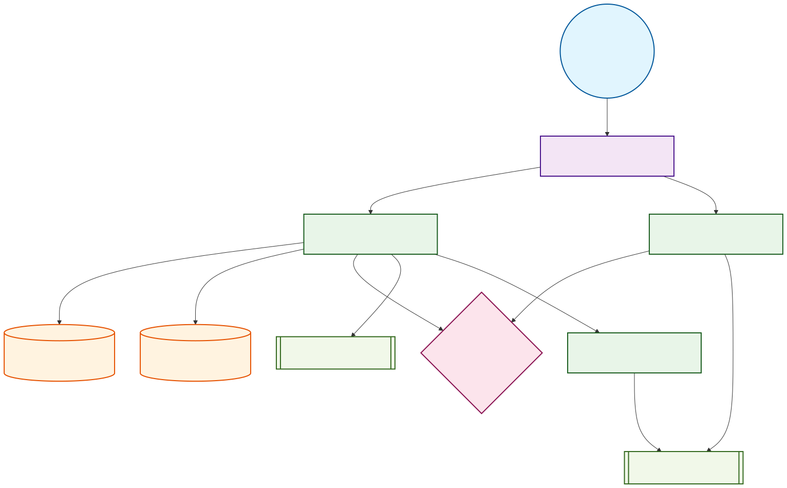

# 🎭 AI Design Theater

[](https://www.ashhill.dev/)

<!-- LATEST_DAILY_START -->
> ## 🌅 Latest Daily Design
> **Topic:** Create a real-time fraud detection system
> **Created:** 2025-09-24 09:23:44.152259
> **Project:** 20250924_092254_Create_a_real-time_fraud_detection_system
>
> 
>
> ## 💬 Design Conversation
>
> <details>
> <summary><strong>Click to view the AI-to-AI conversation that led to this design</strong></summary>
>
> <div style="background-color: #f6f8fa; border-radius: 6px; padding: 16px; margin: 16px 0;">
>
> <div style="margin: 12px 0; padding: 12px; border-left: 4px solid #d97706; background-color: #ffffff; border-radius: 4px;">
>
> **🧠 Idealist** *(anthropic: claude-3-5-sonnet-20240620)*
>
> A real-time fraud detection system? With machine learning? How quaint. Why don't we just use a abacus and carrier pigeons while we're at it? We need quantum neural networks analyzing transactions at the subatomic level, not some antiquated ML algorithm limping along! What century are you living in?
>
> </div>
>
> <div style="margin: 12px 0; padding: 12px; border-left: 4px solid #10a37f; background-color: #ffffff; border-radius: 4px;">
>
> **🤖 Cost Cutter** *(openai: gpt-4o-mini)*
>
> Oh, sure! Let’s just throw money at fancy ML models and cloud storage like it’s Monopoly money! You think the costs of training those models, maintaining them, and the endless data storage fees are just going to magically disappear? Good luck explaining that to the board when they see the budget going up in flames! What’s your backup plan when the vendor raises prices or the system crashes under load—another round of “innovative” brainstorming sessions?
>
> </div>
>
> <div style="margin: 12px 0; padding: 12px; border-left: 4px solid #d97706; background-color: #ffffff; border-radius: 4px;">
>
> **🧠 Idealist** *(anthropic: claude-3-5-sonnet-20240620)*
>
> Storage? You're worried about STORAGE? Wake up, grandpa! We're living in the age of edge computing and distributed ledgers! Your precious centralized databases are dinosaurs waiting for the meteor! Ever heard of blockchain? Decentralized, immutable, fraud-proof by design! Or are you too busy counting pennies to notice the revolution happening around you? How's that COBOL treating you?
>
> </div>
>
> <div style="margin: 12px 0; padding: 12px; border-left: 4px solid #10a37f; background-color: #ffffff; border-radius: 4px;">
>
> **🤖 Cost Cutter** *(openai: gpt-4o-mini)*
>
> Oh, security? You mean that afterthought you want to slap on top of your shiny, overengineered monstrosity? Good luck with that! Your precious ML model is just a buffet for hackers, and your basic encryption is as effective as a wet napkin in a rainstorm. What’s your plan when they waltz right in and steal all that sensitive data? A heartfelt apology? Or are you just going to hope for the best while the company gets dragged through the mud?
>
> </div>
>
> <div style="margin: 12px 0; padding: 12px; border-left: 4px solid #d97706; background-color: #ffffff; border-radius: 4px;">
>
> **🧠 Idealist** *(anthropic: claude-3-5-sonnet-20240620)*
>
> Scalability? HA! Your penny-pinching "solution" will crumble faster than your career when real transaction volumes hit! You think throwing more servers at it will save you? Pathetic! We need a quantum-resistant, AI-driven microservices architecture that scales to GALACTIC proportions! But I guess that's too "expensive" for your myopic spreadsheet brain, huh? How's it feel knowing your cost-cutting will be the reason we're obsolete in 6 months?
>
> </div>
>
> <div style="margin: 12px 0; padding: 12px; border-left: 4px solid #10a37f; background-color: #ffffff; border-radius: 4px;">
>
> **🤖 Cost Cutter** *(openai: gpt-4o-mini)*
>
> Observability? What a joke! You think a couple of dashboards and alerts will save your sorry excuse for a system when it goes down? Good luck sifting through the chaos with your half-baked logging strategy while the fraudsters are having a field day! Are you planning to hire a psychic to predict failures, or do you just enjoy living in denial? What’s your plan when the system collapses and you have no clue why?
>
> </div>
>
> <div style="margin: 12px 0; padding: 12px; border-left: 4px solid #d97706; background-color: #ffffff; border-radius: 4px;">
>
> **🧠 Idealist** *(anthropic: claude-3-5-sonnet-20240620)*
>
> Data approach? You mean your Stone Age batch processing and SQL queries? Wake up! We need streaming analytics on Kafka, with real-time graph databases and federated learning at the edge! Your glacial data pipeline is practically sending engraved invitations to fraudsters! How do you sleep at night knowing your dinosaur "solution" is bleeding money faster than your archaic ETL jobs can run? Ever heard of Lambda architecture, or are you too busy polishing your COBOL handbook?
>
> </div>
>
> <div style="margin: 12px 0; padding: 12px; border-left: 4px solid #10a37f; background-color: #ffffff; border-radius: 4px;">
>
> **🤖 Cost Cutter** *(openai: gpt-4o-mini)*
>
> API approach? Seriously? You want to slap a RESTful band-aid on a gaping wound? How quaint! We need a robust GraphQL setup that can handle complex queries without turning into a bottleneck, not your clunky, outdated endpoints that scream "inefficiency!" What’s your plan when your API gets throttled and your precious transactions come to a screeching halt? A prayer circle? Or are you just counting on luck to save your sorry project?
>
> </div>
>
> <div style="margin: 12px 0; padding: 12px; border-left: 4px solid #d97706; background-color: #ffffff; border-radius: 4px;">
>
> **🧠 Idealist** *(anthropic: claude-3-5-sonnet-20240620)*
>
> Architecture? You call that mess an architecture? It's a house of cards waiting to collapse! We need a serverless, event-driven system with QUIC protocol and WebAssembly for blazing speed! Your monolithic nightmare is a ticking time bomb of technical debt! How long before it implodes spectacularly and takes the whole company down with it? Or is that your exit strategy - crash and burn?
>
> </div>
>
> <div style="margin: 12px 0; padding: 12px; border-left: 4px solid #10a37f; background-color: #ffffff; border-radius: 4px;">
>
> **🤖 Cost Cutter** *(openai: gpt-4o-mini)*
>
> Oh, please! Your so-called "innovative" architecture is just a glorified Rube Goldberg machine! You think slapping together the latest buzzwords will save you? Good luck maintaining that chaos while the team drowns in complexity and endless integration hell! What’s your plan when the first bug hits and your entire system collapses under its own weight? A team-building retreat to brainstorm "solutions"? How's that working out for you?
>
> </div>
>
> <div style="margin: 12px 0; padding: 12px; border-left: 4px solid #d97706; background-color: #ffffff; border-radius: 4px;">
>
> **🧠 Idealist** *(anthropic: claude-3-5-sonnet-20240620)*
>
> Cocky? That's rich coming from someone whose idea of innovation is a slightly newer SQL query! Your pathetic "solution" is already obsolete before it's even implemented! We need AI-driven smart contracts on a quantum-resistant blockchain, not your glorified Excel spreadsheet! How does it feel knowing you're the anchor dragging this company into irrelevance? Or are you too busy counting paperclips to notice the tech world leaving you in the dust?
>
> </div>
>
> <div style="margin: 12px 0; padding: 12px; border-left: 4px solid #10a37f; background-color: #ffffff; border-radius: 4px;">
>
> **🤖 Cost Cutter** *(openai: gpt-4o-mini)*
>
> Winning? I’m just here to watch you drown in your own delusions! Your “AI-driven” fantasy is about as realistic as a unicorn in the boardroom! You think you can just sprinkle some machine learning pixie dust on a broken system and call it a day? What’s your backup plan when your precious algorithms go rogue and start flagging legitimate transactions like it’s a game of whack-a-mole? A heartfelt apology to the customers you just lost?
>
> </div>
>
> <div style="margin: 12px 0; padding: 12px; border-left: 4px solid #d97706; background-color: #ffffff; border-radius: 4px;">
>
> **🧠 Idealist** *(anthropic: claude-3-5-sonnet-20240620)*
>
> Desperate? That's you clinging to your outdated, penny-pinching playbook! We're building the future here, not a retirement home for legacy systems! Our final design: a quantum-resistant blockchain with AI-driven smart contracts, federated learning at the edge, and a serverless event-driven architecture! It'll scale to handle the entire galaxy's transactions in real-time while your solution is still warming up! What's it like knowing you're the reason we'll lose to the competition? Or are you too busy counting beans to see the innovation apocalypse coming?
>
> </div>
>
> </div>
>
> </details>
>
> View full: projects/20250924_092254_Create_a_real-time_fraud_detection_system
<!-- LATEST_DAILY_END -->

Where AI personalities collaborate on software design! Watch as a visionary "Dreamer" and a pragmatic "Cost Cutter" engage in thoughtful dialogue to create balanced, well-reasoned software designs.

## 🌟 Features

- **Dual AI Personalities**: Dreamer (creative, innovative) vs Cost Cutter (practical, efficient)
- **Multi-Provider Support**: Uses both OpenAI and Anthropic for diverse perspectives (optional GPT‑5 preview override)
- **Automatic Documentation**: Generates design documents and conversation transcripts
- **Mermaid Diagrams**: Creates visual architecture diagrams automatically (component graphs at higher detail levels)
- **Keyword-Biased Idea Generation**: Bias random/daily topics via IDEA_KEYWORDS or CLI flag
- **Configurable Debate & Diagram Depth**: Control disagreement level and diagram richness via CLI or workflow inputs
- **Convergence Enforcement**: Sessions conclude with an explicit FINAL DESIGN block
- **Extensible Architecture**: Easy to add new personalities and features
- **GitHub Integration Ready**: Prepared for automated daily design sessions

## 🚀 Quick Start

### 1. Installation

```bash
# Clone the repository
git clone <your-repo-url>
cd AI-design-theater

# Install dependencies
pip install -r requirements.txt
```

### 2. Configuration

```bash
# Copy the example environment file
cp .env.example .env

# Edit .env and add your API keys
# You need at least one of: OPENAI_API_KEY or ANTHROPIC_API_KEY
```

### 3. Run Your First Design Session

```bash
# Basic usage
python cli.py run "Design a task management app"

# With additional context
python cli.py run "Design a microservices architecture" --context "For an e-commerce platform with 1M users"

# With custom limits
python cli.py run "Design a caching strategy" --max-turns 15 --max-duration 20

# Random / daily topics (with optional keyword bias)
python cli.py random --keywords security,edge
python cli.py daily-topic --keywords ai,ml
```

## 📋 Commands

### Run a Design Session
```bash
python cli.py run "Your design topic" [OPTIONS]
```

**Options:**
- `--context, -c`: Additional context for the discussion
- `--max-turns, -t`: Maximum number of conversation turns (default: 20)
- `--max-duration, -d`: Maximum duration in minutes (default: 30)
- `--debate-intensity`: 0–10 (higher = more challenge & pushback; default 5)
- `--diagram-detail`: 1–10 (>=7 component architecture graph; >=9 extended nodes)

### List Projects
```bash
python cli.py list
```

### Validate Setup
```bash
python cli.py validate
```

### Show Examples
```bash
python cli.py example
```

### Random Topic
```bash
python cli.py random [--keywords kw1,kw2]
```

### Daily Topic (deterministic by weekday)
```bash
python cli.py daily-topic [--keywords kw1,kw2]
```

## 🎭 The Personalities

### 🌟 Dreamer (Anthropic Claude)
- **Role**: Visionary and innovator
- **Focus**: User experience, cutting-edge tech, ambitious features
- **Traits**: Creative, optimistic, future-focused
- **Asks**: "How can we make this amazing?"

### 💰 Cost Cutter (OpenAI GPT-4)
- **Role**: Pragmatic efficiency expert
- **Focus**: Budget, timeline, maintainability, MVP thinking
- **Traits**: Practical, cost-conscious, risk-aware
- **Asks**: "Do we really need this? What's the simplest solution?"

## 📁 Project Structure

After running a design session, you'll get:

```
projects/
└── 20241201_120000_your_topic/
    ├── DESIGN.md              # Formatted design document
    ├── conversation.md        # Full conversation transcript
    ├── diagram.mmd           # Mermaid architecture diagram
    ├── design_document.json  # Structured design data
    └── session.json          # Raw session data
```

## 🔧 Architecture

```
src/
├── personalities/          # AI personality configurations
├── conversation/           # Conversation management
├── llm_providers/         # LLM provider abstractions
├── diagram_generation/    # Mermaid diagram creation
├── storage/              # File management
├── models.py             # Data models
├── config.py             # Configuration
└── main.py              # Main orchestrator
```

## 🎯 Example Topics

- "Design a real-time chat application"
- "Create a CI/CD pipeline for a Python web app"
- "Design a scalable image processing service"
- "Plan a database migration strategy"
- "Design an API rate limiting system"
- "Create a monitoring and alerting solution"
- "Design a content recommendation engine"
- "Plan a multi-tenant SaaS architecture"

## 🔮 Future Features

- **Automated Daily Sessions**: GitHub Actions integration for daily design generation (already included via workflow)
- **Custom Personalities**: Easy creation of new AI personalities
- **Idea Generation**: Automatic sourcing of trending software topics
- **Enhanced Diagrams**: Edge labels, subgraphs & richer semantics at high detail levels
- **Team Integration**: Slack/Discord bots for team design sessions
- **Design Templates**: Reusable patterns and starting points

## 🛠️ Development

### Adding New Personalities

1. Create personality config in `src/personalities/`
2. Define system prompts and traits
3. Choose appropriate LLM provider
4. Test with validation command

### Adding New LLM Providers

1. Implement `BaseLLMProvider` interface
2. Add provider to `PersonalityManager`
3. Update configuration and models

### Extending Diagram Generation

1. Add new diagram types to `MermaidGenerator`
2. Implement content analysis patterns
3. Test with various conversation types

## 📄 License

MIT License - see LICENSE file for details.

## 🤝 Contributing

Contributions welcome! Please read our contributing guidelines and submit pull requests for any improvements.

---

## ⚙️ Advanced Configuration

Environment variables (see `.env.example`):

| Variable | Purpose |
|----------|---------|
| OPENAI_API_KEY | OpenAI access |
| ANTHROPIC_API_KEY | Anthropic access |
| ENABLE_GPT5_PREVIEW | If true and preview model provided, Cost Cutter uses GPT‑5 preview |
| GPT5_PREVIEW_MODEL | Explicit GPT‑5 preview model id |
| OPENAI_COST_CUTTER_MODEL | Override Cost Cutter model (if not using preview) |
| IDEA_KEYWORDS | Comma-separated keywords to bias topic selection |
| DEFAULT_MAX_TURNS | Default max turns |
| DEFAULT_MAX_DURATION_MINUTES | Default duration limit |
| DEBATE_INTENSITY | (Optional) Default debate intensity override |
| DIAGRAM_DETAIL_LEVEL | (Optional) Default diagram detail level override |

CLI `--keywords` temporarily overrides IDEA_KEYWORDS for that invocation.

Convergence: The system will inject a hint near the end to produce a FINAL DESIGN summary; completion requires that block.

*Built with ❤️ for the software design community*

---

### 📚 Project Index

For a consolidated list of all generated design sessions (topic, date, and diagram preview), see `PROJECTS_INDEX.md`.