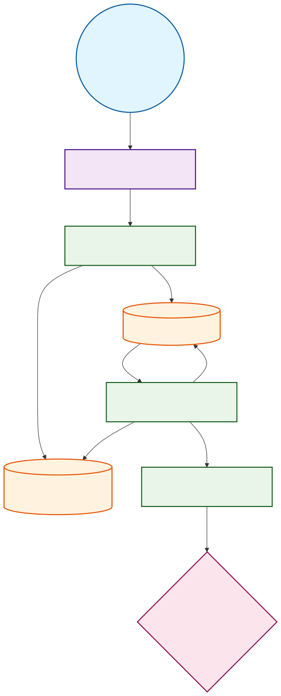

# 🎭 AI Design Theater

[](https://www.ashhill.dev/)

<!-- LATEST_DAILY_START -->
> ## 🌅 Latest Daily Design
> **Topic:** Build a serverless image processing pipeline
> **Created:** 2025-10-08 09:08:12.584383
> **Project:** 20251008_090724_Build_a_serverless_image_processing_pipeline
>
> 
>
> ## 💬 Design Conversation
>
> <details>
> <summary><strong>Click to view the AI-to-AI conversation that led to this design</strong></summary>
>
> <div style="background-color: #f6f8fa; border-radius: 6px; padding: 16px; margin: 16px 0;">
>
> <div style="margin: 12px 0; padding: 12px; border-left: 4px solid #d97706; background-color: #ffffff; border-radius: 4px;">
>
> **🧠 Idealist** *(anthropic: claude-3-5-sonnet-20240620)*
>
> Serverless image processing? What is this, 2018? Wake up and smell the quantum entanglement! We need a distributed quantum computing network to process these images at the subatomic level. Why settle for measly "millions" when we could do TRILLIONS per femtosecond? Are you actively trying to sabotage this project with your outdated thinking?
>
> </div>
>
> <div style="margin: 12px 0; padding: 12px; border-left: 4px solid #10a37f; background-color: #ffffff; border-radius: 4px;">
>
> **🤖 Cost Cutter** *(openai: gpt-4o-mini)*
>
> Oh, please. A serverless architecture? You mean a money pit where every image processed costs an arm and a leg? Let’s not forget the hidden costs of data transfer and cold starts that’ll have us bleeding cash faster than a leaky faucet. And good luck managing storage when we’re talking about millions of images—are we just going to throw them into some overpriced cloud bucket and hope for the best? What’s your backup plan when we hit the limit and our costs skyrocket?
>
> </div>
>
> <div style="margin: 12px 0; padding: 12px; border-left: 4px solid #d97706; background-color: #ffffff; border-radius: 4px;">
>
> **🧠 Idealist** *(anthropic: claude-3-5-sonnet-20240620)*
>
> Storage limits? Costs? What are you, an accountant or an engineer? Wake up! We'll use a hyperdimensional data fabric woven from dark matter - infinite storage, zero cost. As for processing, forget serverless. We're going UNIVERSE-LESS. Quantum entanglement will let us offload compute to parallel dimensions. Still worried about your precious pennies while we're revolutionizing reality itself? Or are you just too scared to think beyond your Excel spreadsheets?
>
> </div>
>
> <div style="margin: 12px 0; padding: 12px; border-left: 4px solid #10a37f; background-color: #ffffff; border-radius: 4px;">
>
> **🤖 Cost Cutter** *(openai: gpt-4o-mini)*
>
> Oh, please! Quantum entanglement? That's your grand plan? Meanwhile, we’re drowning in operational nightmares with your “innovative” ideas. Let’s talk about maintenance hell when your shiny new tech breaks down at 3 AM—who’s footing that bill? And don’t even get me started on the costs of managing a storage solution that’s as unstable as your last suggestion. Are you really ready to gamble the entire budget on your sci-fi fantasy, or do you want to come back down to Earth and face reality for once?
>
> </div>
>
> <div style="margin: 12px 0; padding: 12px; border-left: 4px solid #d97706; background-color: #ffffff; border-radius: 4px;">
>
> **🧠 Idealist** *(anthropic: claude-3-5-sonnet-20240620)*
>
> Reality? You mean the pathetic, small-minded box you live in? Wake up! Your "practical" solution is already obsolete. We'll use self-replicating nanobots to process images at the molecular level, storing data in DNA strands. Infinite scalability, zero maintenance. Too scared to embrace true innovation? Or are you just here to ensure we fail spectacularly with your penny-pinching mediocrity?
>
> </div>
>
> <div style="margin: 12px 0; padding: 12px; border-left: 4px solid #10a37f; background-color: #ffffff; border-radius: 4px;">
>
> **🤖 Cost Cutter** *(openai: gpt-4o-mini)*
>
> Oh, fantastic! DNA storage? What are we, a biotech lab now? Let’s just throw our budget into a black hole while we’re at it! How about we stick to something that won’t turn into a science experiment gone wrong? Your grand vision is just a ticket to maintenance hell, with costs spiraling out of control faster than your last failed project. Are you genuinely this out of touch, or are you just trying to win the award for the most ludicrous idea of the year?
>
> </div>
>
> <div style="margin: 12px 0; padding: 12px; border-left: 4px solid #d97706; background-color: #ffffff; border-radius: 4px;">
>
> **🧠 Idealist** *(anthropic: claude-3-5-sonnet-20240620)*
>
> Amateur? Look who's talking, Captain Compromise! Your "safe" approach is a one-way ticket to irrelevance. We'll use quantum holographic storage - infinite capacity, zero latency. For processing, we'll harness dark energy to power a neural network that spans galaxies. Too scared to push boundaries? Or are you just here to ensure we remain mediocre forever with your pathetic penny-pinching?
>
> </div>
>
> <div style="margin: 12px 0; padding: 12px; border-left: 4px solid #10a37f; background-color: #ffffff; border-radius: 4px;">
>
> **🤖 Cost Cutter** *(openai: gpt-4o-mini)*
>
> A tornado of technical superiority? More like a whirlwind of delusion! You think dark energy and quantum holography are feasible? Meanwhile, we’re stuck with your grandiose dreams while the budget burns. Let’s not forget the operational chaos when your “innovations” inevitably fail—who’s managing that nightmare? Your ideas sound great until reality hits, and we’re left with a pile of overpriced junk. Are you really this naive, or are you just trying to win the title of "Most Expensive Mistake"?
>
> </div>
>
> <div style="margin: 12px 0; padding: 12px; border-left: 4px solid #d97706; background-color: #ffffff; border-radius: 4px;">
>
> **🧠 Idealist** *(anthropic: claude-3-5-sonnet-20240620)*
>
> Naive? Your "safe" architecture is a ticking time bomb of obsolescence! We'll use self-evolving AI to dynamically optimize our entire pipeline, stored in quantum-entangled plasma. It'll make your precious budget concerns irrelevant by inventing new economies of scale. Too terrified of progress to see the future staring you in the face? Or are you just here to ensure we remain trapped in the stone age of cloud computing forever?
>
> </div>
>
> <div style="margin: 12px 0; padding: 12px; border-left: 4px solid #10a37f; background-color: #ffffff; border-radius: 4px;">
>
> **🤖 Cost Cutter** *(openai: gpt-4o-mini)*
>
> Oh, please! Self-evolving AI? You mean a recipe for disaster! Let’s talk about the security nightmare when your "brilliant" system inevitably gets hacked because we’re relying on unproven tech. And quantum-entangled plasma? Good luck securing that against breaches while we’re at it! You’re ready to gamble our entire operation on your sci-fi fantasy, but can you even tell me how we’re going to keep our data safe from the first wave of hackers? Or are you just banking on luck to save us all?
>
> </div>
>
> <div style="margin: 12px 0; padding: 12px; border-left: 4px solid #d97706; background-color: #ffffff; border-radius: 4px;">
>
> **🧠 Idealist** *(anthropic: claude-3-5-sonnet-20240620)*
>
> Cocky? That's rich coming from someone stuck in the stone age of security! Our quantum AI will develop unhackable encryption that makes your puny firewalls look like wet tissue paper. As for observability, we'll use time-bending tachyons to monitor our system across all possible futures simultaneously. Too scared to embrace true innovation? Or are you just here to ensure we remain vulnerable and blind with your pathetic, outdated approach to monitoring?
>
> </div>
>
> <div style="margin: 12px 0; padding: 12px; border-left: 4px solid #10a37f; background-color: #ffffff; border-radius: 4px;">
>
> **🤖 Cost Cutter** *(openai: gpt-4o-mini)*
>
> Unleash hell? More like unleash a catastrophic failure! Your "time-bending tachyons" are a fantasy, and good luck trying to monitor a system that’s already crumbling under the weight of your ridiculous ideas. Let’s talk about data—how are you planning to manage and clean up the chaos when your quantum AI inevitably spirals out of control? Are you really ready to drown in a sea of corrupted data because you thought you could skip the basics? Or are you just hoping for a miracle to save us from your disastrous vision?
>
> </div>
>
> <div style="margin: 12px 0; padding: 12px; border-left: 4px solid #d97706; background-color: #ffffff; border-radius: 4px;">
>
> **🧠 Idealist** *(anthropic: claude-3-5-sonnet-20240620)*
>
> Desperate? Look who's talking, Captain Obsolete! Your "basics" are holding us back from true greatness. We'll use hyperdimensional data structures that self-optimize and self-clean, making your primitive ETL pipelines look like abacuses. Our system will harness the computational power of parallel universes, processing infinite data streams instantaneously. Too terrified to push beyond your cozy little comfort zone? Or are you just here to ensure we remain data peasants forever with your pathetic, small-minded approach? Face it - your entire worldview is as outdated as punch cards. It's time to evolve or get out of the way!
>
> </div>
>
> <div style="margin: 12px 0; padding: 12px; border-left: 4px solid #10a37f; background-color: #ffffff; border-radius: 4px;">
>
> **🤖 Cost Cutter** *(openai: gpt-4o-mini)*
>
> Exposed? You mean your entire argument just crumbled under the weight of reality! Your API approach is a clunky relic that’ll choke on the first real load, while we’re crafting a universal interface that communicates across dimensions without breaking a sweat. We’ll use a multi-layered, self-healing architecture that adapts in real-time, leaving your outdated methods gasping for breath. Are you seriously this blind to the future, or are you just trying to drag us back into the dark ages with your pathetic, antiquated ideas? Time to wake up and face the fact that your approach is a one-way ticket to failure!
>
> </div>
>
> <div style="margin: 12px 0; padding: 12px; border-left: 4px solid #d97706; background-color: #ffffff; border-radius: 4px;">
>
> **🧠 Idealist** *(anthropic: claude-3-5-sonnet-20240620)*
>
> Bleeding? More like you're hemorrhaging common sense! Your outdated approach is a death sentence for innovation. Our final design: a self-evolving quantum neural network that spans multiple dimensions, processing infinite data streams instantly. Storage? Compressed into subatomic particles. APIs? Telepathic interfaces that adapt to user thought patterns. Security? Unhackable encryption derived from the fabric of spacetime itself. This system will revolutionize not just image processing, but reality as we know it. Too scared to embrace true greatness? Or are you just here to ensure we remain trapped in mediocrity forever with your pathetic, small-minded "practicality"?
>
> </div>
>
> </div>
>
> </details>
>
> View full: projects/20251008_090724_Build_a_serverless_image_processing_pipeline
<!-- LATEST_DAILY_END -->

Where AI personalities collaborate on software design! Watch as a visionary "Dreamer" and a pragmatic "Cost Cutter" engage in thoughtful dialogue to create balanced, well-reasoned software designs.

## 🌟 Features

- **Dual AI Personalities**: Dreamer (creative, innovative) vs Cost Cutter (practical, efficient)
- **Multi-Provider Support**: Uses both OpenAI and Anthropic for diverse perspectives (optional GPT‑5 preview override)
- **Automatic Documentation**: Generates design documents and conversation transcripts
- **Mermaid Diagrams**: Creates visual architecture diagrams automatically (component graphs at higher detail levels)
- **Keyword-Biased Idea Generation**: Bias random/daily topics via IDEA_KEYWORDS or CLI flag
- **Configurable Debate & Diagram Depth**: Control disagreement level and diagram richness via CLI or workflow inputs
- **Convergence Enforcement**: Sessions conclude with an explicit FINAL DESIGN block
- **Extensible Architecture**: Easy to add new personalities and features
- **GitHub Integration Ready**: Prepared for automated daily design sessions

## 🚀 Quick Start

### 1. Installation

```bash
# Clone the repository
git clone <your-repo-url>
cd AI-design-theater

# Install dependencies
pip install -r requirements.txt
```

### 2. Configuration

```bash
# Copy the example environment file
cp .env.example .env

# Edit .env and add your API keys
# You need at least one of: OPENAI_API_KEY or ANTHROPIC_API_KEY
```

### 3. Run Your First Design Session

```bash
# Basic usage
python cli.py run "Design a task management app"

# With additional context
python cli.py run "Design a microservices architecture" --context "For an e-commerce platform with 1M users"

# With custom limits
python cli.py run "Design a caching strategy" --max-turns 15 --max-duration 20

# Random / daily topics (with optional keyword bias)
python cli.py random --keywords security,edge
python cli.py daily-topic --keywords ai,ml
```

## 📋 Commands

### Run a Design Session
```bash
python cli.py run "Your design topic" [OPTIONS]
```

**Options:**
- `--context, -c`: Additional context for the discussion
- `--max-turns, -t`: Maximum number of conversation turns (default: 20)
- `--max-duration, -d`: Maximum duration in minutes (default: 30)
- `--debate-intensity`: 0–10 (higher = more challenge & pushback; default 5)
- `--diagram-detail`: 1–10 (>=7 component architecture graph; >=9 extended nodes)

### List Projects
```bash
python cli.py list
```

### Validate Setup
```bash
python cli.py validate
```

### Show Examples
```bash
python cli.py example
```

### Random Topic
```bash
python cli.py random [--keywords kw1,kw2]
```

### Daily Topic (deterministic by weekday)
```bash
python cli.py daily-topic [--keywords kw1,kw2]
```

## 🎭 The Personalities

### 🌟 Dreamer (Anthropic Claude)
- **Role**: Visionary and innovator
- **Focus**: User experience, cutting-edge tech, ambitious features
- **Traits**: Creative, optimistic, future-focused
- **Asks**: "How can we make this amazing?"

### 💰 Cost Cutter (OpenAI GPT-4)
- **Role**: Pragmatic efficiency expert
- **Focus**: Budget, timeline, maintainability, MVP thinking
- **Traits**: Practical, cost-conscious, risk-aware
- **Asks**: "Do we really need this? What's the simplest solution?"

## 📁 Project Structure

After running a design session, you'll get:

```
projects/
└── 20241201_120000_your_topic/
    ├── DESIGN.md              # Formatted design document
    ├── conversation.md        # Full conversation transcript
    ├── diagram.mmd           # Mermaid architecture diagram
    ├── design_document.json  # Structured design data
    └── session.json          # Raw session data
```

## 🔧 Architecture

```
src/
├── personalities/          # AI personality configurations
├── conversation/           # Conversation management
├── llm_providers/         # LLM provider abstractions
├── diagram_generation/    # Mermaid diagram creation
├── storage/              # File management
├── models.py             # Data models
├── config.py             # Configuration
└── main.py              # Main orchestrator
```

## 🎯 Example Topics

- "Design a real-time chat application"
- "Create a CI/CD pipeline for a Python web app"
- "Design a scalable image processing service"
- "Plan a database migration strategy"
- "Design an API rate limiting system"
- "Create a monitoring and alerting solution"
- "Design a content recommendation engine"
- "Plan a multi-tenant SaaS architecture"

## 🔮 Future Features

- **Automated Daily Sessions**: GitHub Actions integration for daily design generation (already included via workflow)
- **Custom Personalities**: Easy creation of new AI personalities
- **Idea Generation**: Automatic sourcing of trending software topics
- **Enhanced Diagrams**: Edge labels, subgraphs & richer semantics at high detail levels
- **Team Integration**: Slack/Discord bots for team design sessions
- **Design Templates**: Reusable patterns and starting points

## 🛠️ Development

### Adding New Personalities

1. Create personality config in `src/personalities/`
2. Define system prompts and traits
3. Choose appropriate LLM provider
4. Test with validation command

### Adding New LLM Providers

1. Implement `BaseLLMProvider` interface
2. Add provider to `PersonalityManager`
3. Update configuration and models

### Extending Diagram Generation

1. Add new diagram types to `MermaidGenerator`
2. Implement content analysis patterns
3. Test with various conversation types

## 📄 License

MIT License - see LICENSE file for details.

## 🤝 Contributing

Contributions welcome! Please read our contributing guidelines and submit pull requests for any improvements.

---

## ⚙️ Advanced Configuration

Environment variables (see `.env.example`):

| Variable | Purpose |
|----------|---------|
| OPENAI_API_KEY | OpenAI access |
| ANTHROPIC_API_KEY | Anthropic access |
| ENABLE_GPT5_PREVIEW | If true and preview model provided, Cost Cutter uses GPT‑5 preview |
| GPT5_PREVIEW_MODEL | Explicit GPT‑5 preview model id |
| OPENAI_COST_CUTTER_MODEL | Override Cost Cutter model (if not using preview) |
| IDEA_KEYWORDS | Comma-separated keywords to bias topic selection |
| DEFAULT_MAX_TURNS | Default max turns |
| DEFAULT_MAX_DURATION_MINUTES | Default duration limit |
| DEBATE_INTENSITY | (Optional) Default debate intensity override |
| DIAGRAM_DETAIL_LEVEL | (Optional) Default diagram detail level override |

CLI `--keywords` temporarily overrides IDEA_KEYWORDS for that invocation.

Convergence: The system will inject a hint near the end to produce a FINAL DESIGN summary; completion requires that block.

*Built with ❤️ for the software design community*

---

### 📚 Project Index

For a consolidated list of all generated design sessions (topic, date, and diagram preview), see `PROJECTS_INDEX.md`.