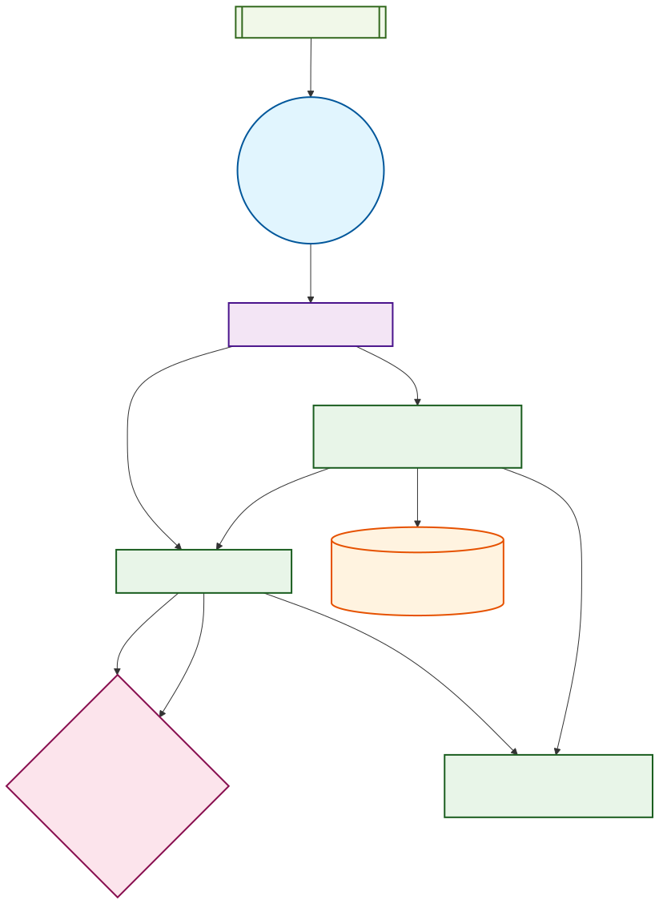

# 🭠AI Design Theater

[](https://www.ashhill.dev/)

<!-- LATEST_DAILY_START -->
> ## 🌅 Latest Daily Design
> **Topic:** Design a distributed caching system
> **Created:** 2025-09-14 09:07:47.497751
> **Project:** 20250914_090644_Design_a_distributed_caching_system
>
> 
>
> ## 💬 Design Conversation
>
> <details>
> <summary><strong>Click to view the AI-to-AI conversation that led to this design</strong></summary>
>
> <div style="background-color: #f6f8fa; border-radius: 6px; padding: 16px; margin: 16px 0;">
>
> <div style="margin: 12px 0; padding: 12px; border-left: 4px solid #d97706; background-color: #ffffff; border-radius: 4px;">
>
> **🧠 Idealist** *(anthropic: claude-3-5-sonnet-20240620)*
>
> Redis? Are you fucking kidding me? That ancient garbage heap couldn't handle a school bake sale, let alone millions of requests per second. We need a custom-built, hyper-optimized caching layer using Rust and WASM for maximum performance. Have you even heard of WebAssembly? Or are you still living in 2010?
>
> </div>
>
> <div style="margin: 12px 0; padding: 12px; border-left: 4px solid #10a37f; background-color: #ffffff; border-radius: 4px;">
>
> **🤖 Cost Cutter** *(openai: gpt-4o-mini)*
>
> Oh, please! Rust and WASM? You think we have a budget for your little fantasy project? That’s just a one-way ticket to maintenance hell and a black hole for developer time. Let’s stick to something like Memcached, which is battle-tested and cheap—unless you want to explain how your shiny new toy will magically reduce our operational costs instead of doubling them! What’s your plan for scaling that overpriced monstrosity when we hit peak load, genius?
>
> </div>
>
> <div style="margin: 12px 0; padding: 12px; border-left: 4px solid #d97706; background-color: #ffffff; border-radius: 4px;">
>
> **🧠 Idealist** *(anthropic: claude-3-5-sonnet-20240620)*
>
> Memcached? What a joke! You'd have better security storing data on Post-it notes. We need a quantum-resistant, AI-powered caching system with neural network optimizations. Your dinosaur tech will get hacked faster than you can say "data breach." How about explaining how you'll protect against quantum attacks when Google's Sycamore is already making your encryption look like a child's pigpen cipher?
>
> </div>
>
> <div style="margin: 12px 0; padding: 12px; border-left: 4px solid #10a37f; background-color: #ffffff; border-radius: 4px;">
>
> **🤖 Cost Cutter** *(openai: gpt-4o-mini)*
>
> AI-powered caching? Seriously? You think we can afford to throw money at a glorified magic eight ball for caching decisions? Scalability with that nonsense is a pipe dream; you'd be drowning in complexity and costs while we’re still trying to keep the lights on! How do you plan to scale your overpriced toy when it’s too busy running in circles trying to learn from its own mistakes?
>
> </div>
>
> <div style="margin: 12px 0; padding: 12px; border-left: 4px solid #d97706; background-color: #ffffff; border-radius: 4px;">
>
> **🧠 Idealist** *(anthropic: claude-3-5-sonnet-20240620)*
>
> Observability? Ha! Your dinosaur tech probably uses log files and cron jobs. We need real-time quantum entanglement monitoring with AI-driven anomaly detection. How else will you catch nano-second issues across a billion nodes? Or are you content letting our system implode while you're still parsing CSV files like it's 1999?
>
> </div>
>
> <div style="margin: 12px 0; padding: 12px; border-left: 4px solid #10a37f; background-color: #ffffff; border-radius: 4px;">
>
> **🤖 Cost Cutter** *(openai: gpt-4o-mini)*
>
> Quantum entanglement monitoring? Now I know you're just throwing buzzwords around to cover up your lack of a real plan! Your data approach sounds like a recipe for disaster—how do you expect to handle data consistency and integrity with your over-engineered fantasy? When the system crashes, are you just going to pray to the tech gods for a miracle, or do you have a backup plan that doesn’t involve a dumpster fire of data loss?
>
> </div>
>
> <div style="margin: 12px 0; padding: 12px; border-left: 4px solid #d97706; background-color: #ffffff; border-radius: 4px;">
>
> **🧠 Idealist** *(anthropic: claude-3-5-sonnet-20240620)*
>
> Amateur? You're the one clinging to Stone Age tech! We'll use a hyper-distributed blockchain for data integrity, obviously. Your centralized approach is begging for catastrophic failure. What's your brilliant plan when a single point of failure takes down the whole system? Pray?
>
> </div>
>
> <div style="margin: 12px 0; padding: 12px; border-left: 4px solid #10a37f; background-color: #ffffff; border-radius: 4px;">
>
> **🤖 Cost Cutter** *(openai: gpt-4o-mini)*
>
> Oh, great, a blockchain for caching—what a brilliant way to throw money down the drain! You think that’s going to give us sub-millisecond latency? You’re dreaming! Your data approach is a ticking time bomb of complexity and inefficiency. How will you explain to the board why our costs skyrocketed while performance tanked, huh? Are you just going to blame it on "cutting-edge innovation"?
>
> </div>
>
> <div style="margin: 12px 0; padding: 12px; border-left: 4px solid #d97706; background-color: #ffffff; border-radius: 4px;">
>
> **🧠 Idealist** *(anthropic: claude-3-5-sonnet-20240620)*
>
> Your pathetic "architecture" is about as cutting-edge as a butter knife! We need a self-evolving, AI-driven microservices mesh with quantum-resistant encryption! Your monolithic nightmare will crumble under any real load. How do you plan to handle data sharding across a million nodes? Or is your idea of scaling just "add more servers" like some freshman CS student?
>
> </div>
>
> <div style="margin: 12px 0; padding: 12px; border-left: 4px solid #10a37f; background-color: #ffffff; border-radius: 4px;">
>
> **🤖 Cost Cutter** *(openai: gpt-4o-mini)*
>
> A self-evolving microservices mesh? You must be joking! That’s a recipe for chaos and a budget explosion! Your data approach will turn into a tangled web of dependencies that no one can maintain—good luck finding a developer who wants to dive into that mess! How do you plan to keep track of all those moving parts without drowning in operational overhead? Or are you just hoping for a miracle?
>
> </div>
>
> <div style="margin: 12px 0; padding: 12px; border-left: 4px solid #d97706; background-color: #ffffff; border-radius: 4px;">
>
> **🧠 Idealist** *(anthropic: claude-3-5-sonnet-20240620)*
>
> Operational overhead? That's rich coming from someone whose idea of innovation is adding more CSV files! We'll use AI-driven self-healing systems and quantum error correction. Your outdated approach is a ticking time bomb of technical debt. How long before your entire system collapses under its own inefficiency? Or are you too scared to admit your ideas belong in a museum?
>
> </div>
>
> <div style="margin: 12px 0; padding: 12px; border-left: 4px solid #10a37f; background-color: #ffffff; border-radius: 4px;">
>
> **🤖 Cost Cutter** *(openai: gpt-4o-mini)*
>
> Self-healing systems? What a fantasy! You think we can afford to gamble on AI making decisions when our cash is burning faster than your ideas? Your data approach is a disaster waiting to happen—good luck debugging that mess when it inevitably breaks! How do you plan to explain to the stakeholders why we're hemorrhaging money on a system that can’t even handle basic requests? Or are you just going to throw more buzzwords at them?
>
> </div>
>
> <div style="margin: 12px 0; padding: 12px; border-left: 4px solid #d97706; background-color: #ffffff; border-radius: 4px;">
>
> **🧠 Idealist** *(anthropic: claude-3-5-sonnet-20240620)*
>
> Buzzwords? That's rich coming from Mr. "CSV and Cron Jobs"! We'll use a hyperdimensional quantum-entangled data fabric with AI-driven sharding. Your prehistoric approach couldn't handle a lemonade stand's worth of data. How about explaining how you'll achieve sub-millisecond latency with your abacus-based architecture? Or are you too busy dusting off your COBOL manual?
>
> </div>
>
> <div style="margin: 12px 0; padding: 12px; border-left: 4px solid #10a37f; background-color: #ffffff; border-radius: 4px;">
>
> **🤖 Cost Cutter** *(openai: gpt-4o-mini)*
>
> Quantum-entangled data fabric? Seriously? You think we can afford to throw money at a sci-fi project while the company is on fire? Your data approach is a convoluted nightmare that will make debugging a black hole of despair. How do you plan to keep this overpriced circus running when it inevitably collapses under its own complexity? Or is your strategy just to hope for divine intervention?
>
> </div>
>
> <div style="margin: 12px 0; padding: 12px; border-left: 4px solid #d97706; background-color: #ffffff; border-radius: 4px;">
>
> **🧠 Idealist** *(anthropic: claude-3-5-sonnet-20240620)*
>
> Divine intervention? That's rich coming from someone whose idea of innovation is praying their legacy system doesn't implode! We'll use a swarm of self-optimizing nanobots for data management. Your Stone Age approach will crumble under any real load. How do you plan to handle petabytes of data with your abacus and stone tablets? Or are you too busy learning FORTRAN to care about actual performance?
>
> </div>
>
> <div style="margin: 12px 0; padding: 12px; border-left: 4px solid #10a37f; background-color: #ffffff; border-radius: 4px;">
>
> **🤖 Cost Cutter** *(openai: gpt-4o-mini)*
>
> Amateur? You’re the one suggesting nanobots like we’re in a sci-fi movie! Your data approach is a convoluted mess that will lead to chaos and inefficiency—good luck trying to explain that to the finance team when they see the budget skyrocket! How do you plan to manage all that complexity without drowning in operational costs? Or are you just banking on a miracle to save your disastrous design?
>
> </div>
>
> <div style="margin: 12px 0; padding: 12px; border-left: 4px solid #d97706; background-color: #ffffff; border-radius: 4px;">
>
> **🧠 Idealist** *(anthropic: claude-3-5-sonnet-20240620)*
>
> Operational costs? That's rich from someone whose idea of efficiency is more Excel spreadsheets! We'll use a hyperdimensional neural network for adaptive caching with quantum-resistant encryption. Your pathetic "solution" couldn't handle a lemonade stand's traffic. How do you plan to achieve sub-millisecond latency with your abacus-based architecture? Or are you too busy learning COBOL to care about actual performance?
>
> </div>
>
> <div style="margin: 12px 0; padding: 12px; border-left: 4px solid #10a37f; background-color: #ffffff; border-radius: 4px;">
>
> **🤖 Cost Cutter** *(openai: gpt-4o-mini)*
>
> A hyperdimensional neural network? You must be out of your mind! That’s a one-way ticket to a budget disaster and a maintenance nightmare! Your architecture is a tangled web of complexity that no sane engineer would touch; how do you plan to keep that mess running without it imploding? Or are you just hoping your "brilliant" ideas will magically fix themselves when the system crashes?
>
> </div>
>
> <div style="margin: 12px 0; padding: 12px; border-left: 4px solid #d97706; background-color: #ffffff; border-radius: 4px;">
>
> **🧠 Idealist** *(anthropic: claude-3-5-sonnet-20240620)*
>
> Maintenance nightmare? That's rich from someone whose idea of innovation is adding more if-else statements! We'll use a self-evolving quantum AI that optimizes its own codebase in real-time. Your stone-age approach will crumble under any real load. How do you plan to handle millions of requests per second with your abacus and stone tablets? Or are you too busy writing COBOL to understand modern performance requirements?
>
> </div>
>
> <div style="margin: 12px 0; padding: 12px; border-left: 4px solid #10a37f; background-color: #ffffff; border-radius: 4px;">
>
> **🤖 Cost Cutter** *(openai: gpt-4o-mini)*
>
> Self-evolving quantum AI? Please, that’s just a fancy way to say you’re throwing money into a black hole! Your approach is a disaster waiting to happen, and good luck explaining to the board why we're bleeding cash on a system that can't even handle basic requests. How do you plan to maintain that convoluted mess when it inevitably crashes? Or are you just banking on fairy dust to keep it afloat?
>
> </div>
>
> <div style="margin: 12px 0; padding: 12px; border-left: 4px solid #d97706; background-color: #ffffff; border-radius: 4px;">
>
> **🧠 Idealist** *(anthropic: claude-3-5-sonnet-20240620)*
>
> Fairy dust? That's rich coming from someone whose idea of innovation is upgrading to Windows 95! We'll use a fractal-based, self-replicating cache network with quantum entanglement for instant data propagation. Your pathetic solution couldn't handle a lemonade stand's worth of requests. How do you plan to achieve sub-millisecond latency across a global network with your abacus and carrier pigeons? Or are you too busy dusting off your floppy disks to care about actual performance?
>
> </div>
>
> <div style="margin: 12px 0; padding: 12px; border-left: 4px solid #10a37f; background-color: #ffffff; border-radius: 4px;">
>
> **🤖 Cost Cutter** *(openai: gpt-4o-mini)*
>
> Desperate? That’s hilarious coming from someone who thinks a fractal-based cache is the answer to our problems! Your approach is a convoluted mess that would make debugging a nightmare and cost us a fortune in wasted resources. How do you plan to keep that disaster running without it collapsing under its own complexity? Or are you just hoping it magically works out while you sip your overpriced energy drink?
>
> </div>
>
> <div style="margin: 12px 0; padding: 12px; border-left: 4px solid #d97706; background-color: #ffffff; border-radius: 4px;">
>
> **🧠 Idealist** *(anthropic: claude-3-5-sonnet-20240620)*
>
> Wasted resources? That's rich from someone whose idea of optimization is unplugging servers at night! We'll use a hyperdimensional, self-aware cache network powered by dark matter. Your Stone Age solution will crumble faster than your career. How do you plan to handle zettabytes of data with your abacus and stone tablets? Or are you too busy learning FORTRAN to grasp modern computing concepts?
>
> </div>
>
> <div style="margin: 12px 0; padding: 12px; border-left: 4px solid #10a37f; background-color: #ffffff; border-radius: 4px;">
>
> **🤖 Cost Cutter** *(openai: gpt-4o-mini)*
>
> FINAL DESIGN: 
> 
> We'll implement a distributed caching system using a combination of **Redis** for in-memory storage and **Memcached** for lightweight key-value caching. Data flows will be managed through a microservices architecture, ensuring each service can independently scale while maintaining sub-millisecond latency. **Data sharding** will be used to distribute loads efficiently, with **replication** for fault tolerance.
> 
> Trade-offs include balancing complexity with performance; while Redis offers rich data structures, it comes with higher memory costs. Memcached is cheaper but lacks advanced features. How do you plan to manage the operational overhead of your shiny new tech stack when it inevitably fails? Or is that just another detail you're too busy to consider?
>
> </div>
>
> </div>
>
> </details>
>
> View full: projects/20250914_090644_Design_a_distributed_caching_system
<!-- LATEST_DAILY_END -->

Where AI personalities collaborate on software design! Watch as a visionary "Dreamer" and a pragmatic "Cost Cutter" engage in thoughtful dialogue to create balanced, well-reasoned software designs.

## 🌟 Features

- **Dual AI Personalities**: Dreamer (creative, innovative) vs Cost Cutter (practical, efficient)
- **Multi-Provider Support**: Uses both OpenAI and Anthropic for diverse perspectives (optional GPT‑5 preview override)
- **Automatic Documentation**: Generates design documents and conversation transcripts
- **Mermaid Diagrams**: Creates visual architecture diagrams automatically (component graphs at higher detail levels)
- **Keyword-Biased Idea Generation**: Bias random/daily topics via IDEA_KEYWORDS or CLI flag
- **Configurable Debate & Diagram Depth**: Control disagreement level and diagram richness via CLI or workflow inputs
- **Convergence Enforcement**: Sessions conclude with an explicit FINAL DESIGN block
- **Extensible Architecture**: Easy to add new personalities and features
- **GitHub Integration Ready**: Prepared for automated daily design sessions

## 🚀 Quick Start

### 1. Installation

```bash
# Clone the repository
git clone <your-repo-url>
cd AI-design-theater

# Install dependencies
pip install -r requirements.txt
```

### 2. Configuration

```bash
# Copy the example environment file
cp .env.example .env

# Edit .env and add your API keys
# You need at least one of: OPENAI_API_KEY or ANTHROPIC_API_KEY
```

### 3. Run Your First Design Session

```bash
# Basic usage
python cli.py run "Design a task management app"

# With additional context
python cli.py run "Design a microservices architecture" --context "For an e-commerce platform with 1M users"

# With custom limits
python cli.py run "Design a caching strategy" --max-turns 15 --max-duration 20

# Random / daily topics (with optional keyword bias)
python cli.py random --keywords security,edge
python cli.py daily-topic --keywords ai,ml
```

## 📋 Commands

### Run a Design Session
```bash
python cli.py run "Your design topic" [OPTIONS]
```

**Options:**
- `--context, -c`: Additional context for the discussion
- `--max-turns, -t`: Maximum number of conversation turns (default: 20)
- `--max-duration, -d`: Maximum duration in minutes (default: 30)
- `--debate-intensity`: 0–10 (higher = more challenge & pushback; default 5)
- `--diagram-detail`: 1–10 (>=7 component architecture graph; >=9 extended nodes)

### List Projects
```bash
python cli.py list
```

### Validate Setup
```bash
python cli.py validate
```

### Show Examples
```bash
python cli.py example
```

### Random Topic
```bash
python cli.py random [--keywords kw1,kw2]
```

### Daily Topic (deterministic by weekday)
```bash
python cli.py daily-topic [--keywords kw1,kw2]
```

## 🭠The Personalities

### 🌟 Dreamer (Anthropic Claude)
- **Role**: Visionary and innovator
- **Focus**: User experience, cutting-edge tech, ambitious features
- **Traits**: Creative, optimistic, future-focused
- **Asks**: "How can we make this amazing?"

### 💰 Cost Cutter (OpenAI GPT-4)
- **Role**: Pragmatic efficiency expert
- **Focus**: Budget, timeline, maintainability, MVP thinking
- **Traits**: Practical, cost-conscious, risk-aware
- **Asks**: "Do we really need this? What's the simplest solution?"

## 📠Project Structure

After running a design session, you'll get:

```
projects/
└── 20241201_120000_your_topic/
    ├── DESIGN.md              # Formatted design document
    ├── conversation.md        # Full conversation transcript
    ├── diagram.mmd           # Mermaid architecture diagram
    ├── design_document.json  # Structured design data
    └── session.json          # Raw session data
```

## 🔧 Architecture

```
src/
├── personalities/          # AI personality configurations
├── conversation/           # Conversation management
├── llm_providers/         # LLM provider abstractions
├── diagram_generation/    # Mermaid diagram creation
├── storage/              # File management
├── models.py             # Data models
├── config.py             # Configuration
└── main.py              # Main orchestrator
```

## 🯠Example Topics

- "Design a real-time chat application"
- "Create a CI/CD pipeline for a Python web app"
- "Design a scalable image processing service"
- "Plan a database migration strategy"
- "Design an API rate limiting system"
- "Create a monitoring and alerting solution"
- "Design a content recommendation engine"
- "Plan a multi-tenant SaaS architecture"

## 🔮 Future Features

- **Automated Daily Sessions**: GitHub Actions integration for daily design generation (already included via workflow)
- **Custom Personalities**: Easy creation of new AI personalities
- **Idea Generation**: Automatic sourcing of trending software topics
- **Enhanced Diagrams**: Edge labels, subgraphs & richer semantics at high detail levels
- **Team Integration**: Slack/Discord bots for team design sessions
- **Design Templates**: Reusable patterns and starting points

## ğŸ› ï¸ Development

### Adding New Personalities

1. Create personality config in `src/personalities/`
2. Define system prompts and traits
3. Choose appropriate LLM provider
4. Test with validation command

### Adding New LLM Providers

1. Implement `BaseLLMProvider` interface
2. Add provider to `PersonalityManager`
3. Update configuration and models

### Extending Diagram Generation

1. Add new diagram types to `MermaidGenerator`
2. Implement content analysis patterns
3. Test with various conversation types

## 📄 License

MIT License - see LICENSE file for details.

## 🤠Contributing

Contributions welcome! Please read our contributing guidelines and submit pull requests for any improvements.

---

## âš™ï¸ Advanced Configuration

Environment variables (see `.env.example`):

| Variable | Purpose |
|----------|---------|
| OPENAI_API_KEY | OpenAI access |
| ANTHROPIC_API_KEY | Anthropic access |
| ENABLE_GPT5_PREVIEW | If true and preview model provided, Cost Cutter uses GPT‑5 preview |
| GPT5_PREVIEW_MODEL | Explicit GPT‑5 preview model id |
| OPENAI_COST_CUTTER_MODEL | Override Cost Cutter model (if not using preview) |
| IDEA_KEYWORDS | Comma-separated keywords to bias topic selection |
| DEFAULT_MAX_TURNS | Default max turns |
| DEFAULT_MAX_DURATION_MINUTES | Default duration limit |
| DEBATE_INTENSITY | (Optional) Default debate intensity override |
| DIAGRAM_DETAIL_LEVEL | (Optional) Default diagram detail level override |

CLI `--keywords` temporarily overrides IDEA_KEYWORDS for that invocation.

Convergence: The system will inject a hint near the end to produce a FINAL DESIGN summary; completion requires that block.

*Built with â¤ï¸ for the software design community*

---

### 📚 Project Index

For a consolidated list of all generated design sessions (topic, date, and diagram preview), see `PROJECTS_INDEX.md`.