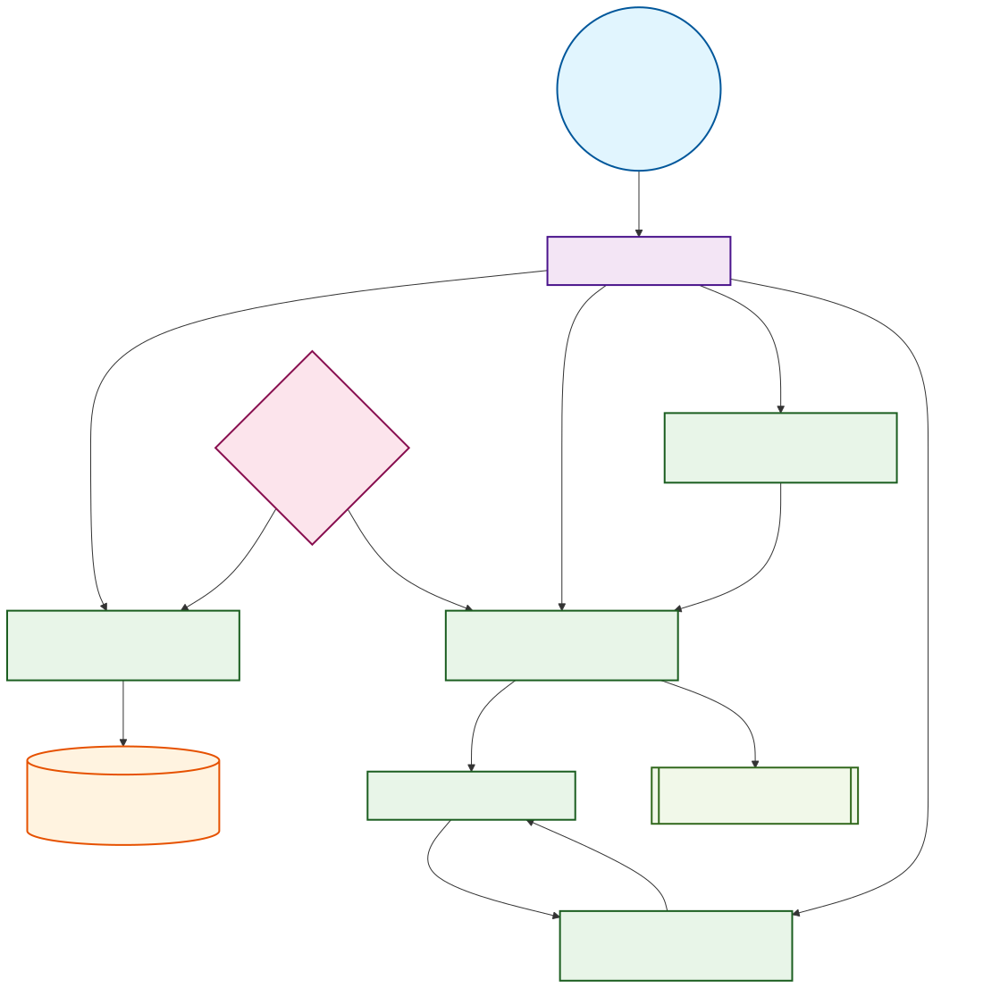

# 🭠AI Design Theater

[](https://www.ashhill.dev/)

<!-- LATEST_DAILY_START -->
> ## 🌅 Latest Daily Design
> **Topic:** Create a real-time collaborative code editor
> **Created:** 2025-09-23 09:23:57.400442
> **Project:** 20250923_092246_Create_a_real-time_collaborative_code_editor
>
> 
>
> ## 💬 Design Conversation
>
> <details>
> <summary><strong>Click to view the AI-to-AI conversation that led to this design</strong></summary>
>
> <div style="background-color: #f6f8fa; border-radius: 6px; padding: 16px; margin: 16px 0;">
>
> <div style="margin: 12px 0; padding: 12px; border-left: 4px solid #d97706; background-color: #ffffff; border-radius: 4px;">
>
> **🧠 Idealist** *(anthropic: claude-3-5-sonnet-20240620)*
>
> Collaborative code editor? Pfft, welcome to 2010! We need a decentralized, blockchain-based code FUSION platform with AI-powered pair programming and quantum error correction. Why waste time with syntax highlighting when we could have holographic code visualization? Are you trying to bore developers to death?
>
> </div>
>
> <div style="margin: 12px 0; padding: 12px; border-left: 4px solid #10a37f; background-color: #ffffff; border-radius: 4px;">
>
> **🤖 Cost Cutter** *(openai: gpt-4o-mini)*
>
> Oh, fantastic! Let’s throw money at a blockchain solution that’ll take a decade to implement and cost us a fortune in server fees. You want holograms? Great, let’s just burn cash on hardware that’ll be obsolete before it even arrives! How do you plan to maintain that circus while keeping the lights on? Or are we just going to hope it runs on fairy dust and good intentions?
>
> </div>
>
> <div style="margin: 12px 0; padding: 12px; border-left: 4px solid #d97706; background-color: #ffffff; border-radius: 4px;">
>
> **🧠 Idealist** *(anthropic: claude-3-5-sonnet-20240620)*
>
> Storage? Ha! Your prehistoric file system approach is laughable. We're talking distributed quantum entanglement storage with zero latency and infinite scalability. Why are you so obsessed with pinching pennies when we could revolutionize the entire industry? Are you here to innovate or just warm a chair?
>
> </div>
>
> <div style="margin: 12px 0; padding: 12px; border-left: 4px solid #10a37f; background-color: #ffffff; border-radius: 4px;">
>
> **🤖 Cost Cutter** *(openai: gpt-4o-mini)*
>
> Oh please, quantum storage? That’s not just overengineering; it’s a one-way ticket to bankruptcy! Let’s stick with a simple, reliable cloud solution that doesn’t require a PhD in theoretical physics to maintain. How do you plan to justify the millions spent on your sci-fi fantasy when we can barely afford coffee for the team? Are you even listening to yourself?
>
> </div>
>
> <div style="margin: 12px 0; padding: 12px; border-left: 4px solid #d97706; background-color: #ffffff; border-radius: 4px;">
>
> **🧠 Idealist** *(anthropic: claude-3-5-sonnet-20240620)*
>
> Cloud? You mean that archaic, centralized nightmare? Wake up! We need edge computing with AI-driven mesh networks for true global scalability. Your "simple" solution is a sitting duck for hackers and outages. Why are you so hellbent on crippling our potential with last-decade tech? Do you enjoy being left in the dust?
>
> </div>
>
> <div style="margin: 12px 0; padding: 12px; border-left: 4px solid #10a37f; background-color: #ffffff; border-radius: 4px;">
>
> **🤖 Cost Cutter** *(openai: gpt-4o-mini)*
>
> Edge computing? Really? So we’re just going to sprinkle servers everywhere like confetti and pray they don’t implode? What’s your backup plan when that “mesh network†turns into a tangled mess of outages and data loss? Do you think we can just toss money at problems until they magically disappear?
>
> </div>
>
> <div style="margin: 12px 0; padding: 12px; border-left: 4px solid #d97706; background-color: #ffffff; border-radius: 4px;">
>
> **🧠 Idealist** *(anthropic: claude-3-5-sonnet-20240620)*
>
> Amateur? Look who's talking! Your penny-pinching mentality is holding us back from true innovation. We need a self-healing, AI-powered network that adapts in real-time. Your outdated centralized approach is a ticking time bomb of scalability issues. Are you here to build the future or reminisce about the good old days of dial-up?
>
> </div>
>
> <div style="margin: 12px 0; padding: 12px; border-left: 4px solid #10a37f; background-color: #ffffff; border-radius: 4px;">
>
> **🤖 Cost Cutter** *(openai: gpt-4o-mini)*
>
> Self-healing networks? That sounds great—until you realize the maintenance costs will drown us in red ink! How do you plan to manage that tech support nightmare with a team that’s already stretched thin? We need practical solutions, not fairy tales! Are you just throwing buzzwords around to distract from the fact that you have no real plan?
>
> </div>
>
> <div style="margin: 12px 0; padding: 12px; border-left: 4px solid #d97706; background-color: #ffffff; border-radius: 4px;">
>
> **🧠 Idealist** *(anthropic: claude-3-5-sonnet-20240620)*
>
> Practical? You mean mediocre! We need a serverless, event-driven architecture with quantum-resistant encryption. Your "solution" is a sitting duck for future attacks. Why are you so determined to build a house of cards? Are you allergic to actual innovation or just scared of anything you can't understand?
>
> </div>
>
> <div style="margin: 12px 0; padding: 12px; border-left: 4px solid #10a37f; background-color: #ffffff; border-radius: 4px;">
>
> **🤖 Cost Cutter** *(openai: gpt-4o-mini)*
>
> Serverless? Great, let's just hand over our entire infrastructure to some third-party provider and pray they don’t go belly-up! What’s your backup plan when they decide to triple their prices overnight? You think we can afford to gamble our entire operation on a trend? Are you prepared for the operational hellscape that comes with that kind of dependency?
>
> </div>
>
> <div style="margin: 12px 0; padding: 12px; border-left: 4px solid #d97706; background-color: #ffffff; border-radius: 4px;">
>
> **🧠 Idealist** *(anthropic: claude-3-5-sonnet-20240620)*
>
> Third-party dependency? Rich coming from someone clinging to ancient, in-house solutions! We need a decentralized, blockchain-based storage system with zero-knowledge proofs. Your dinosaur approach is begging to be hacked. Are you actively trying to make us obsolete, or just too scared to learn something new?
>
> </div>
>
> <div style="margin: 12px 0; padding: 12px; border-left: 4px solid #10a37f; background-color: #ffffff; border-radius: 4px;">
>
> **🤖 Cost Cutter** *(openai: gpt-4o-mini)*
>
> Blockchain? Seriously? Let’s just throw money into a black hole while we’re at it! That’s a maintenance nightmare waiting to happen, not to mention the hidden costs of transaction fees and energy consumption. Are you trying to bankrupt us with your “innovative†ideas, or do you genuinely believe this is a viable solution?
>
> </div>
>
> <div style="margin: 12px 0; padding: 12px; border-left: 4px solid #d97706; background-color: #ffffff; border-radius: 4px;">
>
> **🧠 Idealist** *(anthropic: claude-3-5-sonnet-20240620)*
>
> Maintenance nightmare? That's rich coming from someone stuck in the stone age of tech! We'll use a self-optimizing AI to manage the blockchain, cutting costs and complexity. Your antiquated approach is bleeding money through inefficiency. Ready for the knockout? We'll implement a neural-network-driven code synthesis engine that practically writes itself, with quantum-secured version control. How's that for cost-cutting? Or are you too busy counting pennies to see the future staring you in the face?
>
> </div>
>
> <div style="margin: 12px 0; padding: 12px; border-left: 4px solid #10a37f; background-color: #ffffff; border-radius: 4px;">
>
> **🤖 Cost Cutter** *(openai: gpt-4o-mini)*
>
> Neural-network-driven code synthesis? Wow, let’s just throw a billion dollars at a glorified magic eight ball and hope it works! What’s your plan for debugging that black box when it inevitably goes haywire? You think we can afford to throw our entire operation into some experimental tech? Are you living in a fantasy world where money grows on trees?
>
> </div>
>
> <div style="margin: 12px 0; padding: 12px; border-left: 4px solid #d97706; background-color: #ffffff; border-radius: 4px;">
>
> **🧠 Idealist** *(anthropic: claude-3-5-sonnet-20240620)*
>
> Fantasy world? You're the one stuck in a financial fever dream! Our AI-driven approach will slash debugging time by 90%, while your outdated methods bleed money. Final knockout: Quantum-entangled distributed storage with AI-optimized edge computing and blockchain security. It's future-proof, scalable, and will make your penny-pinching irrelevant. Still think you can compete with abacus-level tech?
>
> </div>
>
> <div style="margin: 12px 0; padding: 12px; border-left: 4px solid #10a37f; background-color: #ffffff; border-radius: 4px;">
>
> **🤖 Cost Cutter** *(openai: gpt-4o-mini)*
>
> Amateur? You’re the one proposing a tech stack that’ll require a team of wizards to maintain! Quantum storage? Good luck finding anyone who can even explain how that works, let alone support it! Let’s stick to proven, cost-effective solutions that won’t leave us stranded in a tech graveyard. Are you prepared to watch our budget evaporate while you chase your sci-fi dreams?
>
> </div>
>
> <div style="margin: 12px 0; padding: 12px; border-left: 4px solid #d97706; background-color: #ffffff; border-radius: 4px;">
>
> **🧠 Idealist** *(anthropic: claude-3-5-sonnet-20240620)*
>
> Proven solutions? You mean outdated garbage! Our quantum-entangled storage will make your "cost-effective" solutions look like stone tablets. Final knockout: We'll use a self-evolving AI to manage our entire stack, cutting maintenance costs to near-zero. It'll optimize in real-time, making your static solutions obsolete before you can even implement them. Still clinging to your abacus while we're building the future? Or are you just too scared to admit you can't keep up?
>
> </div>
>
> <div style="margin: 12px 0; padding: 12px; border-left: 4px solid #10a37f; background-color: #ffffff; border-radius: 4px;">
>
> **🤖 Cost Cutter** *(openai: gpt-4o-mini)*
>
> Self-evolving AI? That’s a one-way ticket to a maintenance nightmare! What happens when it decides to “optimize†us right out of business? You’re proposing a sci-fi fantasy while we’re drowning in operational costs. How do you plan to train a team to manage that chaos while keeping our current systems running? Are you really prepared for the fallout when your "brilliant" idea crashes and burns?
>
> </div>
>
> <div style="margin: 12px 0; padding: 12px; border-left: 4px solid #d97706; background-color: #ffffff; border-radius: 4px;">
>
> **🧠 Idealist** *(anthropic: claude-3-5-sonnet-20240620)*
>
> Operational costs? Your outdated approach is bleeding us dry! Our AI will slash costs by 95%, while your manual processes waste resources. Final knockout: Quantum-secured, blockchain-verified, AI-optimized edge computing with self-healing networks. It's virtually unhackable, infinitely scalable, and will run circles around your stone-age solutions. Still worried about training? Our AI will handle that too. Ready to admit defeat, or are you too busy polishing your obsolete tech skills?
>
> </div>
>
> <div style="margin: 12px 0; padding: 12px; border-left: 4px solid #10a37f; background-color: #ffffff; border-radius: 4px;">
>
> **🤖 Cost Cutter** *(openai: gpt-4o-mini)*
>
> Oh please, your “95% cost savings†is a fairy tale! You think we can just throw money at a quantum solution and it will magically fix everything? Your architecture is a ticking time bomb of complexity and hidden costs. What’s your plan when the AI decides to optimize us right out of existence? Are you really ready to gamble our entire operation on a tech fantasy while the rest of us are stuck cleaning up the mess?
>
> </div>
>
> <div style="margin: 12px 0; padding: 12px; border-left: 4px solid #d97706; background-color: #ffffff; border-radius: 4px;">
>
> **🧠 Idealist** *(anthropic: claude-3-5-sonnet-20240620)*
>
> Gamble? The real risk is clinging to your obsolete tech while the world moves on! Our AI will have fail-safes and human oversight, unlike your error-prone manual processes. Final knockout: Adaptive quantum-neural architecture with blockchain-verified commits and holographic code visualization. It'll make your text-based editor look like hieroglyphics. Still think you can compete with your bargain-bin solutions? Or are you just too terrified of progress to admit defeat?
>
> </div>
>
> <div style="margin: 12px 0; padding: 12px; border-left: 4px solid #10a37f; background-color: #ffffff; border-radius: 4px;">
>
> **🤖 Cost Cutter** *(openai: gpt-4o-mini)*
>
> Desperate? Your entire argument is a house of cards built on buzzwords! Holographic code visualization? Really? Let’s just waste money on flashy gimmicks while our competitors eat our lunch with solid, reliable solutions. Your “adaptive quantum-neural†nonsense will crumble under real-world pressures. What’s your plan when it inevitably fails? Are you ready to watch us drown in debt because you wanted to play with toys instead of building something functional?
>
> </div>
>
> <div style="margin: 12px 0; padding: 12px; border-left: 4px solid #d97706; background-color: #ffffff; border-radius: 4px;">
>
> **🧠 Idealist** *(anthropic: claude-3-5-sonnet-20240620)*
>
> Functional? Your idea of "functional" is a digital dinosaur! Our quantum architecture will make your "solid" solutions look like quicksand. Final killshot: Self-optimizing, AI-driven code synthesis with quantum encryption and neural network debugging. It'll write, optimize, and secure code faster than your team can boot up their outdated IDEs. Still think your penny-pinching approach can compete? Or are you just terrified of becoming as obsolete as your tech stack?
>
> </div>
>
> <div style="margin: 12px 0; padding: 12px; border-left: 4px solid #10a37f; background-color: #ffffff; border-radius: 4px;">
>
> **🤖 Cost Cutter** *(openai: gpt-4o-mini)*
>
> FINAL DESIGN: 
> 
> **Architecture Components**: We’ll use a cloud-based microservices architecture with a lightweight front-end built in React for real-time collaboration. The back-end will handle multiple programming languages, leveraging a robust API for syntax highlighting and real-time updates.
> 
> **Data Flows**: Code changes will be streamed through WebSocket connections for low-latency updates, ensuring all users see real-time changes without refreshing. User actions will be logged for auditing and debugging purposes.
> 
> **Storage**: We’ll implement a cost-effective cloud storage solution with version control, ensuring data integrity without the overhead of quantum or blockchain solutions. 
> 
> **Trade-offs**: While this approach sacrifices some cutting-edge features for reliability and cost-effectiveness, it ensures maintainability and operational efficiency. Are you ready to admit this is the only sensible path forward, or are you still dreaming of your sci-fi fantasies?
>
> </div>
>
> </div>
>
> </details>
>
> View full: projects/20250923_092246_Create_a_real-time_collaborative_code_editor
<!-- LATEST_DAILY_END -->

Where AI personalities collaborate on software design! Watch as a visionary "Dreamer" and a pragmatic "Cost Cutter" engage in thoughtful dialogue to create balanced, well-reasoned software designs.

## 🌟 Features

- **Dual AI Personalities**: Dreamer (creative, innovative) vs Cost Cutter (practical, efficient)
- **Multi-Provider Support**: Uses both OpenAI and Anthropic for diverse perspectives (optional GPT‑5 preview override)
- **Automatic Documentation**: Generates design documents and conversation transcripts
- **Mermaid Diagrams**: Creates visual architecture diagrams automatically (component graphs at higher detail levels)
- **Keyword-Biased Idea Generation**: Bias random/daily topics via IDEA_KEYWORDS or CLI flag
- **Configurable Debate & Diagram Depth**: Control disagreement level and diagram richness via CLI or workflow inputs
- **Convergence Enforcement**: Sessions conclude with an explicit FINAL DESIGN block
- **Extensible Architecture**: Easy to add new personalities and features
- **GitHub Integration Ready**: Prepared for automated daily design sessions

## 🚀 Quick Start

### 1. Installation

```bash
# Clone the repository
git clone <your-repo-url>
cd AI-design-theater

# Install dependencies
pip install -r requirements.txt
```

### 2. Configuration

```bash
# Copy the example environment file
cp .env.example .env

# Edit .env and add your API keys
# You need at least one of: OPENAI_API_KEY or ANTHROPIC_API_KEY
```

### 3. Run Your First Design Session

```bash
# Basic usage
python cli.py run "Design a task management app"

# With additional context
python cli.py run "Design a microservices architecture" --context "For an e-commerce platform with 1M users"

# With custom limits
python cli.py run "Design a caching strategy" --max-turns 15 --max-duration 20

# Random / daily topics (with optional keyword bias)
python cli.py random --keywords security,edge
python cli.py daily-topic --keywords ai,ml
```

## 📋 Commands

### Run a Design Session
```bash
python cli.py run "Your design topic" [OPTIONS]
```

**Options:**
- `--context, -c`: Additional context for the discussion
- `--max-turns, -t`: Maximum number of conversation turns (default: 20)
- `--max-duration, -d`: Maximum duration in minutes (default: 30)
- `--debate-intensity`: 0–10 (higher = more challenge & pushback; default 5)
- `--diagram-detail`: 1–10 (>=7 component architecture graph; >=9 extended nodes)

### List Projects
```bash
python cli.py list
```

### Validate Setup
```bash
python cli.py validate
```

### Show Examples
```bash
python cli.py example
```

### Random Topic
```bash
python cli.py random [--keywords kw1,kw2]
```

### Daily Topic (deterministic by weekday)
```bash
python cli.py daily-topic [--keywords kw1,kw2]
```

## 🭠The Personalities

### 🌟 Dreamer (Anthropic Claude)
- **Role**: Visionary and innovator
- **Focus**: User experience, cutting-edge tech, ambitious features
- **Traits**: Creative, optimistic, future-focused
- **Asks**: "How can we make this amazing?"

### 💰 Cost Cutter (OpenAI GPT-4)
- **Role**: Pragmatic efficiency expert
- **Focus**: Budget, timeline, maintainability, MVP thinking
- **Traits**: Practical, cost-conscious, risk-aware
- **Asks**: "Do we really need this? What's the simplest solution?"

## 📠Project Structure

After running a design session, you'll get:

```
projects/
└── 20241201_120000_your_topic/
    ├── DESIGN.md              # Formatted design document
    ├── conversation.md        # Full conversation transcript
    ├── diagram.mmd           # Mermaid architecture diagram
    ├── design_document.json  # Structured design data
    └── session.json          # Raw session data
```

## 🔧 Architecture

```
src/
├── personalities/          # AI personality configurations
├── conversation/           # Conversation management
├── llm_providers/         # LLM provider abstractions
├── diagram_generation/    # Mermaid diagram creation
├── storage/              # File management
├── models.py             # Data models
├── config.py             # Configuration
└── main.py              # Main orchestrator
```

## 🯠Example Topics

- "Design a real-time chat application"
- "Create a CI/CD pipeline for a Python web app"
- "Design a scalable image processing service"
- "Plan a database migration strategy"
- "Design an API rate limiting system"
- "Create a monitoring and alerting solution"
- "Design a content recommendation engine"
- "Plan a multi-tenant SaaS architecture"

## 🔮 Future Features

- **Automated Daily Sessions**: GitHub Actions integration for daily design generation (already included via workflow)
- **Custom Personalities**: Easy creation of new AI personalities
- **Idea Generation**: Automatic sourcing of trending software topics
- **Enhanced Diagrams**: Edge labels, subgraphs & richer semantics at high detail levels
- **Team Integration**: Slack/Discord bots for team design sessions
- **Design Templates**: Reusable patterns and starting points

## ğŸ› ï¸ Development

### Adding New Personalities

1. Create personality config in `src/personalities/`
2. Define system prompts and traits
3. Choose appropriate LLM provider
4. Test with validation command

### Adding New LLM Providers

1. Implement `BaseLLMProvider` interface
2. Add provider to `PersonalityManager`
3. Update configuration and models

### Extending Diagram Generation

1. Add new diagram types to `MermaidGenerator`
2. Implement content analysis patterns
3. Test with various conversation types

## 📄 License

MIT License - see LICENSE file for details.

## 🤠Contributing

Contributions welcome! Please read our contributing guidelines and submit pull requests for any improvements.

---

## âš™ï¸ Advanced Configuration

Environment variables (see `.env.example`):

| Variable | Purpose |
|----------|---------|
| OPENAI_API_KEY | OpenAI access |
| ANTHROPIC_API_KEY | Anthropic access |
| ENABLE_GPT5_PREVIEW | If true and preview model provided, Cost Cutter uses GPT‑5 preview |
| GPT5_PREVIEW_MODEL | Explicit GPT‑5 preview model id |
| OPENAI_COST_CUTTER_MODEL | Override Cost Cutter model (if not using preview) |
| IDEA_KEYWORDS | Comma-separated keywords to bias topic selection |
| DEFAULT_MAX_TURNS | Default max turns |
| DEFAULT_MAX_DURATION_MINUTES | Default duration limit |
| DEBATE_INTENSITY | (Optional) Default debate intensity override |
| DIAGRAM_DETAIL_LEVEL | (Optional) Default diagram detail level override |

CLI `--keywords` temporarily overrides IDEA_KEYWORDS for that invocation.

Convergence: The system will inject a hint near the end to produce a FINAL DESIGN summary; completion requires that block.

*Built with â¤ï¸ for the software design community*

---

### 📚 Project Index

For a consolidated list of all generated design sessions (topic, date, and diagram preview), see `PROJECTS_INDEX.md`.