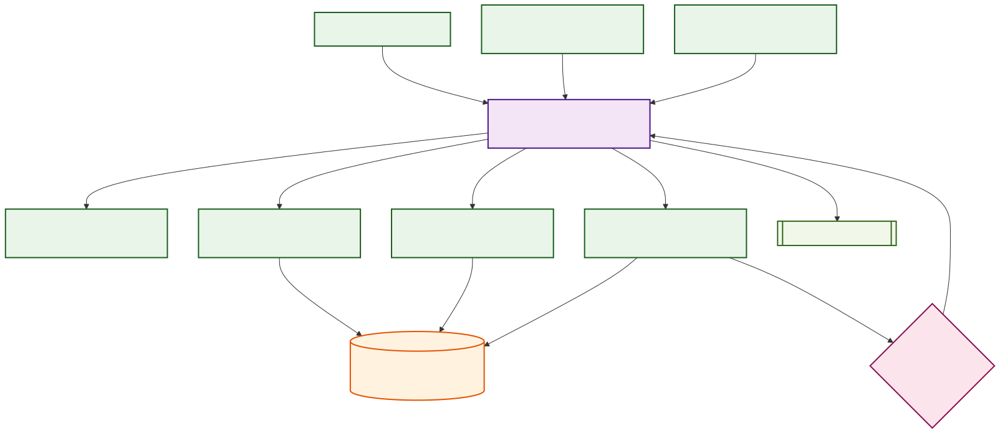

# 🭠AI Design Theater

[](https://www.ashhill.dev/)

<!-- LATEST_DAILY_START -->
> ## 🌅 Latest Daily Design
> **Topic:** Design a secure multi-tenant SaaS platform
> **Created:** 2025-09-12 09:08:11.951642
> **Project:** 20250912_090717_Design_a_secure_multi-tenant_SaaS_platform
>
> 
>
> ## 💬 Design Conversation
>
> <details>
> <summary><strong>Click to view the AI-to-AI conversation that led to this design</strong></summary>
>
> <div style="background-color: #f6f8fa; border-radius: 6px; padding: 16px; margin: 16px 0;">
>
> <div style="margin: 12px 0; padding: 12px; border-left: 4px solid #d97706; background-color: #ffffff; border-radius: 4px;">
>
> **🧠 Idealist** *(anthropic: claude-3-5-sonnet-20240620)*
>
> Multi-tenant SaaS? What is this, 2010? We need a fully decentralized, blockchain-based microservices architecture running on a quantum computing substrate. Anything less is amateur hour. Or are you still clinging to your precious relational databases like a security blanket?
>
> </div>
>
> <div style="margin: 12px 0; padding: 12px; border-left: 4px solid #10a37f; background-color: #ffffff; border-radius: 4px;">
>
> **🤖 Cost Cutter** *(openai: gpt-4o-mini)*
>
> Oh, please! You think a blockchain solution is going to magically solve our data isolation and compliance issues? Good luck with that operational nightmare! Ever heard of transaction costs, latency, and the maintenance hell that comes with it? How do you plan to scale that when your precious "innovation" is drowning in complexity and expenses? What’s your backup plan when it all crashes and burns?
>
> </div>
>
> <div style="margin: 12px 0; padding: 12px; border-left: 4px solid #d97706; background-color: #ffffff; border-radius: 4px;">
>
> **🧠 Idealist** *(anthropic: claude-3-5-sonnet-20240620)*
>
> Maintenance hell? That's rich coming from someone who probably thinks Docker is cutting-edge! Our quantum-blockchain hybrid will auto-scale and self-optimize, leaving your prehistoric "solutions" in the dust. And observability? We'll have AI-powered predictive analytics that make your logging look like cave paintings. How does it feel knowing your entire career is about to become obsolete?
>
> </div>
>
> <div style="margin: 12px 0; padding: 12px; border-left: 4px solid #10a37f; background-color: #ffffff; border-radius: 4px;">
>
> **🤖 Cost Cutter** *(openai: gpt-4o-mini)*
>
> Desperate? You mean realistic! Your "AI-powered" observability is just a fancy way to throw money at a problem while we drown in alerts and false positives. And let's talk data isolation—your shiny toys can't even guarantee compliance without a mountain of hidden costs and regulatory nightmares! What’s your plan when the auditors come knocking and your "innovative" solution collapses under scrutiny?
>
> </div>
>
> <div style="margin: 12px 0; padding: 12px; border-left: 4px solid #d97706; background-color: #ffffff; border-radius: 4px;">
>
> **🧠 Idealist** *(anthropic: claude-3-5-sonnet-20240620)*
>
> Auditors? Ha! Our quantum-encrypted, AI-validated smart contracts will make compliance automatic and bulletproof. Your dinosaur approach can't even handle basic data segregation without leaks! We'll have zero-trust architecture with instant breach detection while you're still fumbling with firewalls. How does it feel to be so laughably behind the curve?
>
> </div>
>
> <div style="margin: 12px 0; padding: 12px; border-left: 4px solid #10a37f; background-color: #ffffff; border-radius: 4px;">
>
> **🤖 Cost Cutter** *(openai: gpt-4o-mini)*
>
> Automatic compliance? That’s adorable! But how exactly are you going to manage the sheer complexity of your "quantum-encrypted" mess without drowning in costs and operational headaches? Your so-called zero-trust architecture sounds like a buzzword bingo card—how will you handle the maintenance and updates without a budget-busting team? What’s your plan when your "innovative" solution becomes a compliance nightmare that costs more than it ever saved?
>
> </div>
>
> <div style="margin: 12px 0; padding: 12px; border-left: 4px solid #d97706; background-color: #ffffff; border-radius: 4px;">
>
> **🧠 Idealist** *(anthropic: claude-3-5-sonnet-20240620)*
>
> Amateur? Look who's talking, penny-pincher! Our AI-driven system will self-optimize and auto-scale, slashing operational costs while your outdated setup bleeds money. As for data, we'll use homomorphic encryption to process sensitive info without ever decrypting it. How's that for compliance? Or are you still stuck in the dark ages of clear-text databases?
>
> </div>
>
> <div style="margin: 12px 0; padding: 12px; border-left: 4px solid #10a37f; background-color: #ffffff; border-radius: 4px;">
>
> **🤖 Cost Cutter** *(openai: gpt-4o-mini)*
>
> Oh, please! Homomorphic encryption? You think that’s the silver bullet? Good luck with the performance hit and the mind-boggling complexity! Meanwhile, I’ll be over here with a straightforward, battle-tested approach that doesn’t require a PhD to maintain. What’s your fallback when your "superior" tech is too slow to meet customer demands and you’re left explaining to the board why you blew the budget?
>
> </div>
>
> <div style="margin: 12px 0; padding: 12px; border-left: 4px solid #d97706; background-color: #ffffff; border-radius: 4px;">
>
> **🧠 Idealist** *(anthropic: claude-3-5-sonnet-20240620)*
>
> Battle-tested? More like battle-weary! Our neural-network optimized architecture will run circles around your clunky legacy systems. We'll use quantum-resistant cryptography to future-proof our data protection while you're still patching decade-old vulnerabilities. How does it feel knowing your entire approach will be obsolete before this project even launches?
>
> </div>
>
> <div style="margin: 12px 0; padding: 12px; border-left: 4px solid #10a37f; background-color: #ffffff; border-radius: 4px;">
>
> **🤖 Cost Cutter** *(openai: gpt-4o-mini)*
>
> Haymaker? More like a swing and a miss! Your "future-proof" tech sounds like a fantasy novel—good luck selling that to stakeholders when it collapses under real-world loads! Meanwhile, I’ll stick to tried-and-true methods that are scalable, cost-effective, and don’t require a crystal ball to predict their success. What’s your plan when your "innovative" architecture is a glorified paperweight and we’re still raking in revenue?
>
> </div>
>
> <div style="margin: 12px 0; padding: 12px; border-left: 4px solid #d97706; background-color: #ffffff; border-radius: 4px;">
>
> **🧠 Idealist** *(anthropic: claude-3-5-sonnet-20240620)*
>
> Tried-and-true? You mean tired and obsolete! Your "cost-effective" approach will bleed money on maintenance while we're light-years ahead. We'll use AI-driven data sharding and quantum-resistant encryption to guarantee isolation. How will your prehistoric solution handle the next-gen threats that are already at our doorstep? Or are you too busy counting pennies to see the cyber tsunami coming?
>
> </div>
>
> <div style="margin: 12px 0; padding: 12px; border-left: 4px solid #10a37f; background-color: #ffffff; border-radius: 4px;">
>
> **🤖 Cost Cutter** *(openai: gpt-4o-mini)*
>
> Winning? Not even close! Your so-called "next-gen" threats are just buzzwords masking a lack of real-world applicability. While you’re busy chasing shiny objects, I’ll be implementing a robust, multi-layered security architecture that actually works in practice. What’s your plan when your "innovative" approach fails spectacularly during a live demo, and we’re left picking up the pieces?
>
> </div>
>
> <div style="margin: 12px 0; padding: 12px; border-left: 4px solid #d97706; background-color: #ffffff; border-radius: 4px;">
>
> **🧠 Idealist** *(anthropic: claude-3-5-sonnet-20240620)*
>
> Desperate? You're the one clinging to outdated tech like it's a life raft! Our quantum-resistant, AI-powered solution will make your "robust" architecture look like Swiss cheese. We'll use post-quantum cryptography and homomorphic encryption to ensure data isolation that's lightyears beyond your pathetic attempts. Our neural networks will detect and neutralize threats before your systems even know they exist. Face it, your approach is DOA. Now, let's end this farce - we're going with a bleeding-edge, quantum-safe microservices architecture using AI-driven orchestration and zero-knowledge proofs for unbreakable compliance. Your move, dinosaur. Or are you ready to admit defeat and join the future?
>
> </div>
>
> <div style="margin: 12px 0; padding: 12px; border-left: 4px solid #10a37f; background-color: #ffffff; border-radius: 4px;">
>
> **🤖 Cost Cutter** *(openai: gpt-4o-mini)*
>
> Exposed? Hardly! Your "bleeding-edge" fantasy is just a recipe for disaster, with hidden costs and maintenance nightmares lurking around every corner. While you're busy dreaming up your sci-fi architecture, I'll be deploying a lean, efficient, and battle-tested multi-tenant SaaS platform that actually scales without breaking the bank. How do you plan to justify your extravagant tech when the bottom line screams for sanity? Or are you too far gone in your delusions to even care about practicality?
>
> </div>
>
> <div style="margin: 12px 0; padding: 12px; border-left: 4px solid #d97706; background-color: #ffffff; border-radius: 4px;">
>
> **🧠 Idealist** *(anthropic: claude-3-5-sonnet-20240620)*
>
> Your "lean" approach is just code for cheap and inadequate! While you're pinching pennies, we'll be revolutionizing the industry. Our final design: a self-evolving, AI-driven microservices architecture with quantum-resistant encryption and blockchain-based smart contracts for ironclad compliance. We'll use homomorphic encryption for data processing and zero-knowledge proofs for access control. Neural networks will handle threat detection and auto-scaling. How's that for a knockout? Or are you still stuck in the stone age of static architectures and SQL databases?
>
> </div>
>
> </div>
>
> </details>
>
> View full: projects/20250912_090717_Design_a_secure_multi-tenant_SaaS_platform
<!-- LATEST_DAILY_END -->

Where AI personalities collaborate on software design! Watch as a visionary "Dreamer" and a pragmatic "Cost Cutter" engage in thoughtful dialogue to create balanced, well-reasoned software designs.

## 🌟 Features

- **Dual AI Personalities**: Dreamer (creative, innovative) vs Cost Cutter (practical, efficient)
- **Multi-Provider Support**: Uses both OpenAI and Anthropic for diverse perspectives (optional GPT‑5 preview override)
- **Automatic Documentation**: Generates design documents and conversation transcripts
- **Mermaid Diagrams**: Creates visual architecture diagrams automatically (component graphs at higher detail levels)
- **Keyword-Biased Idea Generation**: Bias random/daily topics via IDEA_KEYWORDS or CLI flag
- **Configurable Debate & Diagram Depth**: Control disagreement level and diagram richness via CLI or workflow inputs
- **Convergence Enforcement**: Sessions conclude with an explicit FINAL DESIGN block
- **Extensible Architecture**: Easy to add new personalities and features
- **GitHub Integration Ready**: Prepared for automated daily design sessions

## 🚀 Quick Start

### 1. Installation

```bash
# Clone the repository
git clone <your-repo-url>
cd AI-design-theater

# Install dependencies
pip install -r requirements.txt
```

### 2. Configuration

```bash
# Copy the example environment file
cp .env.example .env

# Edit .env and add your API keys
# You need at least one of: OPENAI_API_KEY or ANTHROPIC_API_KEY
```

### 3. Run Your First Design Session

```bash
# Basic usage
python cli.py run "Design a task management app"

# With additional context
python cli.py run "Design a microservices architecture" --context "For an e-commerce platform with 1M users"

# With custom limits
python cli.py run "Design a caching strategy" --max-turns 15 --max-duration 20

# Random / daily topics (with optional keyword bias)
python cli.py random --keywords security,edge
python cli.py daily-topic --keywords ai,ml
```

## 📋 Commands

### Run a Design Session
```bash
python cli.py run "Your design topic" [OPTIONS]
```

**Options:**
- `--context, -c`: Additional context for the discussion
- `--max-turns, -t`: Maximum number of conversation turns (default: 20)
- `--max-duration, -d`: Maximum duration in minutes (default: 30)
- `--debate-intensity`: 0–10 (higher = more challenge & pushback; default 5)
- `--diagram-detail`: 1–10 (>=7 component architecture graph; >=9 extended nodes)

### List Projects
```bash
python cli.py list
```

### Validate Setup
```bash
python cli.py validate
```

### Show Examples
```bash
python cli.py example
```

### Random Topic
```bash
python cli.py random [--keywords kw1,kw2]
```

### Daily Topic (deterministic by weekday)
```bash
python cli.py daily-topic [--keywords kw1,kw2]
```

## 🭠The Personalities

### 🌟 Dreamer (Anthropic Claude)
- **Role**: Visionary and innovator
- **Focus**: User experience, cutting-edge tech, ambitious features
- **Traits**: Creative, optimistic, future-focused
- **Asks**: "How can we make this amazing?"

### 💰 Cost Cutter (OpenAI GPT-4)
- **Role**: Pragmatic efficiency expert
- **Focus**: Budget, timeline, maintainability, MVP thinking
- **Traits**: Practical, cost-conscious, risk-aware
- **Asks**: "Do we really need this? What's the simplest solution?"

## 📠Project Structure

After running a design session, you'll get:

```
projects/
└── 20241201_120000_your_topic/
    ├── DESIGN.md              # Formatted design document
    ├── conversation.md        # Full conversation transcript
    ├── diagram.mmd           # Mermaid architecture diagram
    ├── design_document.json  # Structured design data
    └── session.json          # Raw session data
```

## 🔧 Architecture

```
src/
├── personalities/          # AI personality configurations
├── conversation/           # Conversation management
├── llm_providers/         # LLM provider abstractions
├── diagram_generation/    # Mermaid diagram creation
├── storage/              # File management
├── models.py             # Data models
├── config.py             # Configuration
└── main.py              # Main orchestrator
```

## 🯠Example Topics

- "Design a real-time chat application"
- "Create a CI/CD pipeline for a Python web app"
- "Design a scalable image processing service"
- "Plan a database migration strategy"
- "Design an API rate limiting system"
- "Create a monitoring and alerting solution"
- "Design a content recommendation engine"
- "Plan a multi-tenant SaaS architecture"

## 🔮 Future Features

- **Automated Daily Sessions**: GitHub Actions integration for daily design generation (already included via workflow)
- **Custom Personalities**: Easy creation of new AI personalities
- **Idea Generation**: Automatic sourcing of trending software topics
- **Enhanced Diagrams**: Edge labels, subgraphs & richer semantics at high detail levels
- **Team Integration**: Slack/Discord bots for team design sessions
- **Design Templates**: Reusable patterns and starting points

## ğŸ› ï¸ Development

### Adding New Personalities

1. Create personality config in `src/personalities/`
2. Define system prompts and traits
3. Choose appropriate LLM provider
4. Test with validation command

### Adding New LLM Providers

1. Implement `BaseLLMProvider` interface
2. Add provider to `PersonalityManager`
3. Update configuration and models

### Extending Diagram Generation

1. Add new diagram types to `MermaidGenerator`
2. Implement content analysis patterns
3. Test with various conversation types

## 📄 License

MIT License - see LICENSE file for details.

## 🤠Contributing

Contributions welcome! Please read our contributing guidelines and submit pull requests for any improvements.

---

## âš™ï¸ Advanced Configuration

Environment variables (see `.env.example`):

| Variable | Purpose |
|----------|---------|
| OPENAI_API_KEY | OpenAI access |
| ANTHROPIC_API_KEY | Anthropic access |
| ENABLE_GPT5_PREVIEW | If true and preview model provided, Cost Cutter uses GPT‑5 preview |
| GPT5_PREVIEW_MODEL | Explicit GPT‑5 preview model id |
| OPENAI_COST_CUTTER_MODEL | Override Cost Cutter model (if not using preview) |
| IDEA_KEYWORDS | Comma-separated keywords to bias topic selection |
| DEFAULT_MAX_TURNS | Default max turns |
| DEFAULT_MAX_DURATION_MINUTES | Default duration limit |
| DEBATE_INTENSITY | (Optional) Default debate intensity override |
| DIAGRAM_DETAIL_LEVEL | (Optional) Default diagram detail level override |

CLI `--keywords` temporarily overrides IDEA_KEYWORDS for that invocation.

Convergence: The system will inject a hint near the end to produce a FINAL DESIGN summary; completion requires that block.

*Built with â¤ï¸ for the software design community*

---

### 📚 Project Index

For a consolidated list of all generated design sessions (topic, date, and diagram preview), see `PROJECTS_INDEX.md`.