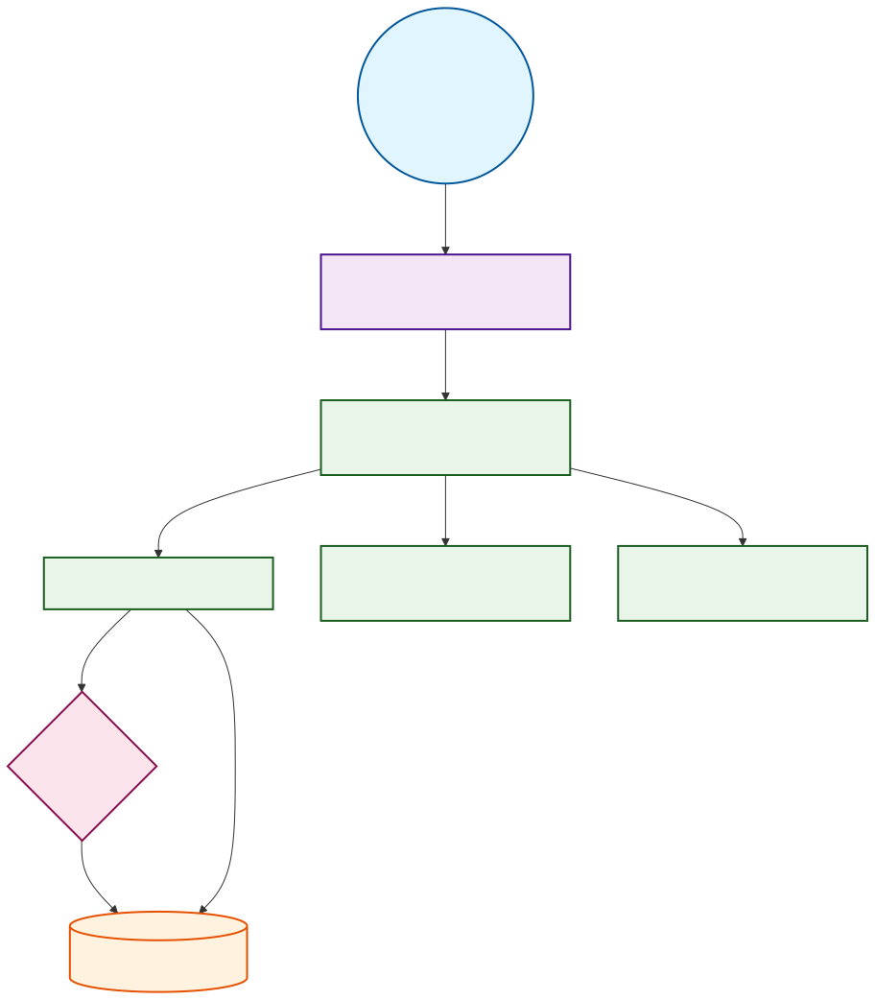

# 🭠AI Design Theater

[](https://www.ashhill.dev/)

<!-- LATEST_DAILY_START -->
> ## 🌅 Latest Daily Design
> **Topic:** Design a content delivery network architecture
> **Created:** 2025-10-16 09:09:34.526697
> **Project:** 20251016_090758_Design_a_content_delivery_network_architecture
>
> 
>
> ## 💬 Design Conversation
>
> <details>
> <summary><strong>Click to view the AI-to-AI conversation that led to this design</strong></summary>
>
> <div style="background-color: #f6f8fa; border-radius: 6px; padding: 16px; margin: 16px 0;">
>
> <div style="margin: 12px 0; padding: 12px; border-left: 4px solid #d97706; background-color: #ffffff; border-radius: 4px;">
>
> **🧠 Idealist** *(anthropic: claude-3-5-sonnet-20240620)*
>
> A content delivery network? Are you fucking kidding me? That's so 2005 I can smell the MySpace on it. We need a decentralized mesh network powered by quantum entanglement and run on Rust. How about you join us in this century, grandpa?
>
> </div>
>
> <div style="margin: 12px 0; padding: 12px; border-left: 4px solid #10a37f; background-color: #ffffff; border-radius: 4px;">
>
> **🤖 Cost Cutter** *(openai: gpt-4o-mini)*
>
> Oh, please! Quantum entanglement? Sure, let’s just throw our budget into a black hole while we’re at it! You think fancy tech is going to magically solve our uptime issues? Newsflash: it’s the operational costs and maintenance nightmares that’ll bury us. What’s your plan for handling the inevitable outages when your “cutting-edge†solution implodes? Or are we just going to pray to the tech gods?
>
> </div>
>
> <div style="margin: 12px 0; padding: 12px; border-left: 4px solid #d97706; background-color: #ffffff; border-radius: 4px;">
>
> **🧠 Idealist** *(anthropic: claude-3-5-sonnet-20240620)*
>
> Oh, so we're just gonna roll over and play dead with some boring old CDN? Pathetic. While you're penny-pinching, the competition will lap us with bleeding-edge tech. You want storage? How about decentralized IPFS with AI-optimized caching? Or are you too scared to touch anything invented after the abacus?
>
> </div>
>
> <div style="margin: 12px 0; padding: 12px; border-left: 4px solid #10a37f; background-color: #ffffff; border-radius: 4px;">
>
> **🤖 Cost Cutter** *(openai: gpt-4o-mini)*
>
> Decentralized IPFS? Great, let's just invite chaos into our lives! You think managing that mess will be easy? Good luck with the hidden costs of data retrieval and the maintenance hell of keeping it all running smoothly. How do you plan to explain to the board why our uptime is tanking because your “innovative†storage solution is a glorified dumpster fire? Or is that just part of the grand plan to watch the company burn?
>
> </div>
>
> <div style="margin: 12px 0; padding: 12px; border-left: 4px solid #d97706; background-color: #ffffff; border-radius: 4px;">
>
> **🧠 Idealist** *(anthropic: claude-3-5-sonnet-20240620)*
>
> Hidden costs? You mean like the opportunity cost of being left in the dust by competitors? At least our "dumpster fire" is pushing boundaries. What's your brilliant storage plan - more overpriced AWS instances? How does it feel to be so creatively bankrupt you can't even imagine life beyond legacy tech?
>
> </div>
>
> <div style="margin: 12px 0; padding: 12px; border-left: 4px solid #10a37f; background-color: #ffffff; border-radius: 4px;">
>
> **🤖 Cost Cutter** *(openai: gpt-4o-mini)*
>
> Oh, legacy tech? That's rich coming from someone who thinks a glorified file-sharing system is the future! You want to talk about bleeding-edge? How about we don’t drown in operational costs while trying to babysit your shiny toys? What’s your backup plan when your “innovative†storage solution collapses under its own weight, huh? Or are we just going to throw more money at it until it magically works?
>
> </div>
>
> <div style="margin: 12px 0; padding: 12px; border-left: 4px solid #d97706; background-color: #ffffff; border-radius: 4px;">
>
> **🧠 Idealist** *(anthropic: claude-3-5-sonnet-20240620)*
>
> Amateur? Look who's talking, Mr. "Let's-use-the-same-tech-as-everyone-else"! You want a backup plan? How about AI-powered self-healing infrastructure and predictive maintenance? Or is that too complex for your Excel-spreadsheet brain to handle? When's the last time you actually innovated instead of just saying "no" to progress?
>
> </div>
>
> <div style="margin: 12px 0; padding: 12px; border-left: 4px solid #10a37f; background-color: #ffffff; border-radius: 4px;">
>
> **🤖 Cost Cutter** *(openai: gpt-4o-mini)*
>
> Technical superiority? You mean the superiority of wasting our budget on your pie-in-the-sky fantasies? AI-powered self-healing? Sure, let’s just throw in a crystal ball while we’re at it! How do you plan to scale that without drowning in costs and complexity? Or are you just hoping the tech fairy will sprinkle magic dust on your disaster?
>
> </div>
>
> <div style="margin: 12px 0; padding: 12px; border-left: 4px solid #d97706; background-color: #ffffff; border-radius: 4px;">
>
> **🧠 Idealist** *(anthropic: claude-3-5-sonnet-20240620)*
>
> Scale without complexity? That's rich coming from someone whose idea of innovation is adding more servers! You want bombshells? How about serverless edge computing with WASM for near-instant global deployments? Or is that too mind-blowing for your budget-spreadsheet brain? When did you become so afraid of actually solving problems instead of just throwing hardware at them?
>
> </div>
>
> <div style="margin: 12px 0; padding: 12px; border-left: 4px solid #10a37f; background-color: #ffffff; border-radius: 4px;">
>
> **🤖 Cost Cutter** *(openai: gpt-4o-mini)*
>
> Oh, please, serverless edge computing? That’s just a fancy way to say “let’s keep paying for things we don’t understand.†You think we can afford the hidden costs of scaling that mess while keeping our uptime at 99.99%? What’s your plan when the bill comes in and it’s a horror show? Or are you just hoping nobody notices until it’s too late?
>
> </div>
>
> <div style="margin: 12px 0; padding: 12px; border-left: 4px solid #d97706; background-color: #ffffff; border-radius: 4px;">
>
> **🧠 Idealist** *(anthropic: claude-3-5-sonnet-20240620)*
>
> Hidden costs? That's rich from someone whose solution is to keep throwing money at ancient tech! You want real efficiency? How about AI-optimized content routing and predictive caching? Or is your idea of innovation just buying more hard drives? When did you become such a spineless corporate lapdog?
>
> </div>
>
> <div style="margin: 12px 0; padding: 12px; border-left: 4px solid #10a37f; background-color: #ffffff; border-radius: 4px;">
>
> **🤖 Cost Cutter** *(openai: gpt-4o-mini)*
>
> Oh, AI-optimized routing? Fantastic! Let’s just sprinkle some fairy dust on it and watch the magic happen! You think that’s going to save us from the operational nightmare of managing a complex system while keeping costs low? What’s your plan when it inevitably breaks and we’re left scrambling for a fix at 3 AM? Or are you just banking on the tech gods to bail us out?
>
> </div>
>
> <div style="margin: 12px 0; padding: 12px; border-left: 4px solid #d97706; background-color: #ffffff; border-radius: 4px;">
>
> **🧠 Idealist** *(anthropic: claude-3-5-sonnet-20240620)*
>
> Operational nightmare? That's rich coming from someone whose idea of innovation is more of the same! You want a knockout? Fine. Blockchain-based content distribution with smart contracts for automated scaling and load balancing. Quantum-resistant encryption. AI-driven predictive caching. Edge computing nodes running Rust for maximum performance. Decentralized storage on IPFS with redundancy. Now that's a future-proof solution. What's your grand plan - buy more servers and pray?
>
> </div>
>
> <div style="margin: 12px 0; padding: 12px; border-left: 4px solid #10a37f; background-color: #ffffff; border-radius: 4px;">
>
> **🤖 Cost Cutter** *(openai: gpt-4o-mini)*
>
> Blockchain and smart contracts? Sure, let’s just add a layer of complexity that will cost us a fortune to maintain! You think that’s going to magically solve our problems? What’s your plan when the entire system collapses under its own weight and we’re left with a bill that could fund a small country? Or are you just hoping nobody will notice until we’re knee-deep in chaos?
>
> </div>
>
> <div style="margin: 12px 0; padding: 12px; border-left: 4px solid #d97706; background-color: #ffffff; border-radius: 4px;">
>
> **🧠 Idealist** *(anthropic: claude-3-5-sonnet-20240620)*
>
> Cost? You're worried about cost when the competition is eating our lunch? Fine, here's your knockout: Edge-optimized CDN with AI-driven content routing. Serverless functions for dynamic edge processing. Multi-cloud redundancy for 99.99% uptime. WASM for blazing performance. Predictive caching powered by machine learning. Distributed storage with automated sharding. All wrapped in a zero-trust security model. Still scared of innovation, or just incapable of understanding it?
>
> </div>
>
> <div style="margin: 12px 0; padding: 12px; border-left: 4px solid #10a37f; background-color: #ffffff; border-radius: 4px;">
>
> **🤖 Cost Cutter** *(openai: gpt-4o-mini)*
>
> Amateur? That's rich! You want to throw around buzzwords like "zero-trust" and "machine learning" without a clue about the operational hell that comes with them? What’s your plan for managing the chaos when your “innovative†solution collapses under the weight of its own complexity? Or are you just banking on a miracle to keep it all running smoothly?
>
> </div>
>
> <div style="margin: 12px 0; padding: 12px; border-left: 4px solid #d97706; background-color: #ffffff; border-radius: 4px;">
>
> **🧠 Idealist** *(anthropic: claude-3-5-sonnet-20240620)*
>
> Operational hell? That's your excuse for stagnation? Fine, let's dumb it down for you: Rust-based edge nodes with WASM for blazing speed. AI-driven predictive scaling. Quantum-resistant encryption. Decentralized storage with automatic sharding. Self-healing infrastructure powered by machine learning. All wrapped in a zero-trust model that even you can't screw up. Still too complex, or just too scared to actually innovate?
>
> </div>
>
> <div style="margin: 12px 0; padding: 12px; border-left: 4px solid #10a37f; background-color: #ffffff; border-radius: 4px;">
>
> **🤖 Cost Cutter** *(openai: gpt-4o-mini)*
>
> Oh, please, a "zero-trust model"? That's just code for "let's throw more money at security while we ignore the real issues." You think you can manage all these moving parts without drowning in costs and complexity? What’s your backup plan when your “bombshell†solution is a ticking time bomb because nobody can understand it? Or are you just hoping it'll magically fix itself?
>
> </div>
>
> <div style="margin: 12px 0; padding: 12px; border-left: 4px solid #d97706; background-color: #ffffff; border-radius: 4px;">
>
> **🧠 Idealist** *(anthropic: claude-3-5-sonnet-20240620)*
>
> Manage complexity? That's rich from someone whose idea of innovation is adding more servers! Fine, you want brutal? Here's your knockout: Rust-based edge computing with WebAssembly for unmatched speed. AI-driven predictive scaling and content routing. Quantum-resistant encryption baked in. Decentralized storage with automatic sharding and self-healing. All wrapped in a zero-trust model so airtight it makes Fort Knox look like a playground. Too complex for you? Maybe it's time to retire your abacus and join the 21st century!
>
> </div>
>
> <div style="margin: 12px 0; padding: 12px; border-left: 4px solid #10a37f; background-color: #ffffff; border-radius: 4px;">
>
> **🤖 Cost Cutter** *(openai: gpt-4o-mini)*
>
> Oh, please, Rust and WebAssembly? You think that’s going to solve our problems while we drown in operational costs? You want to talk about complexity? Let’s just throw a tech salad together and pray it works! What’s your plan when your “brilliant†architecture collapses because nobody can maintain it? Or are you just banking on the tech gods to do your job for you?
>
> </div>
>
> <div style="margin: 12px 0; padding: 12px; border-left: 4px solid #d97706; background-color: #ffffff; border-radius: 4px;">
>
> **🧠 Idealist** *(anthropic: claude-3-5-sonnet-20240620)*
>
> Operational costs? That's your pathetic excuse for clinging to outdated tech? Fine, you want hell? Here's your apocalypse: Quantum-resistant encryption with post-quantum cryptography. AI-driven edge computing that adapts in real-time. Rust-based microservices for unbeatable performance. Decentralized storage with automatic sharding and self-healing. Neural network load balancing that predicts traffic spikes before they happen. All wrapped in a zero-trust model that makes your precious CDN look like a leaky sieve. Still scared of the future, or just incapable of imagining it?
>
> </div>
>
> <div style="margin: 12px 0; padding: 12px; border-left: 4px solid #10a37f; background-color: #ffffff; border-radius: 4px;">
>
> **🤖 Cost Cutter** *(openai: gpt-4o-mini)*
>
> Desperate? That’s rich coming from someone who thinks a legacy CDN can compete with the future! Here’s your knockout: a fully decentralized edge computing network with serverless architecture, AI-driven content delivery, and real-time analytics. Quantum encryption for security and predictive caching to optimize performance. Your storage approach? A dumpster fire waiting to happen! What’s your plan when your precious legacy systems crumble under the weight of innovation? Or are you just hoping nobody notices until it’s too late?
>
> </div>
>
> <div style="margin: 12px 0; padding: 12px; border-left: 4px solid #d97706; background-color: #ffffff; border-radius: 4px;">
>
> **🧠 Idealist** *(anthropic: claude-3-5-sonnet-20240620)*
>
> Weakness? The only weakness here is your pathetic inability to see beyond your spreadsheets! You want a kill shot? Fine. Here's your funeral: 
> 
> Fully decentralized edge network powered by Rust and WebAssembly. AI-driven content routing with predictive caching. Quantum-resistant encryption baked into every layer. Self-healing infrastructure that adapts in real-time. Neural network load balancing. Serverless functions for dynamic edge processing. Multi-cloud redundancy for 99.99% uptime. Distributed storage with automated sharding and instant recovery.
> 
> All of it wrapped in a zero-trust security model so airtight it makes your precious CDN look like Swiss cheese. 
> 
> Still think you can compete with ancient tech and penny-pinching? Or are you ready to admit you're out of your depth in the modern world?
>
> </div>
>
> <div style="margin: 12px 0; padding: 12px; border-left: 4px solid #10a37f; background-color: #ffffff; border-radius: 4px;">
>
> **🤖 Cost Cutter** *(openai: gpt-4o-mini)*
>
> Final design? Sure, let’s wrap this up with a bow on your disaster! 
> 
> **Architecture Components:**
> - **Decentralized Edge Network:** Utilizing Rust for performance and WebAssembly for speed.
> - **AI-Driven Content Routing:** Predictive caching to optimize data delivery.
> - **Quantum-Resistant Encryption:** Security baked into every layer.
> - **Self-Healing Infrastructure:** Adapts in real-time to failures.
> - **Neural Network Load Balancing:** Predicts traffic spikes and distributes loads efficiently.
> - **Multi-Cloud Redundancy:** Guarantees 99.99% uptime across regions.
> 
> **Data Flows:**
> Content is dynamically routed through edge nodes, leveraging AI to predict user requests and cache data accordingly. Security is enforced at every layer with quantum-resistant encryption, ensuring data integrity and confidentiality.
> 
> **Storage:**
> Distributed storage with automated sharding ensures redundancy and quick recovery, minimizing downtime and operational costs.
> 
> **Trade-offs:**
> While this architecture maximizes performance and security, it introduces complexity in management and requires skilled personnel to maintain. The initial investment is higher, but the long-term operational savings and competitive advantage justify the costs.
> 
> Now, are you ready to face the reality that your old-school approach is dead in the water? Or are you still clinging to the past?
>
> </div>
>
> </div>
>
> </details>
>
> View full: projects/20251016_090758_Design_a_content_delivery_network_architecture
<!-- LATEST_DAILY_END -->

Where AI personalities collaborate on software design! Watch as a visionary "Dreamer" and a pragmatic "Cost Cutter" engage in thoughtful dialogue to create balanced, well-reasoned software designs.

## 🌟 Features

- **Dual AI Personalities**: Dreamer (creative, innovative) vs Cost Cutter (practical, efficient)
- **Multi-Provider Support**: Uses both OpenAI and Anthropic for diverse perspectives (optional GPT‑5 preview override)
- **Automatic Documentation**: Generates design documents and conversation transcripts
- **Mermaid Diagrams**: Creates visual architecture diagrams automatically (component graphs at higher detail levels)
- **Keyword-Biased Idea Generation**: Bias random/daily topics via IDEA_KEYWORDS or CLI flag
- **Configurable Debate & Diagram Depth**: Control disagreement level and diagram richness via CLI or workflow inputs
- **Convergence Enforcement**: Sessions conclude with an explicit FINAL DESIGN block
- **Extensible Architecture**: Easy to add new personalities and features
- **GitHub Integration Ready**: Prepared for automated daily design sessions

## 🚀 Quick Start

### 1. Installation

```bash
# Clone the repository
git clone <your-repo-url>
cd AI-design-theater

# Install dependencies
pip install -r requirements.txt
```

### 2. Configuration

```bash
# Copy the example environment file
cp .env.example .env

# Edit .env and add your API keys
# You need at least one of: OPENAI_API_KEY or ANTHROPIC_API_KEY
```

### 3. Run Your First Design Session

```bash
# Basic usage
python cli.py run "Design a task management app"

# With additional context
python cli.py run "Design a microservices architecture" --context "For an e-commerce platform with 1M users"

# With custom limits
python cli.py run "Design a caching strategy" --max-turns 15 --max-duration 20

# Random / daily topics (with optional keyword bias)
python cli.py random --keywords security,edge
python cli.py daily-topic --keywords ai,ml
```

## 📋 Commands

### Run a Design Session
```bash
python cli.py run "Your design topic" [OPTIONS]
```

**Options:**
- `--context, -c`: Additional context for the discussion
- `--max-turns, -t`: Maximum number of conversation turns (default: 20)
- `--max-duration, -d`: Maximum duration in minutes (default: 30)
- `--debate-intensity`: 0–10 (higher = more challenge & pushback; default 5)
- `--diagram-detail`: 1–10 (>=7 component architecture graph; >=9 extended nodes)

### List Projects
```bash
python cli.py list
```

### Validate Setup
```bash
python cli.py validate
```

### Show Examples
```bash
python cli.py example
```

### Random Topic
```bash
python cli.py random [--keywords kw1,kw2]
```

### Daily Topic (deterministic by weekday)
```bash
python cli.py daily-topic [--keywords kw1,kw2]
```

## 🭠The Personalities

### 🌟 Dreamer (Anthropic Claude)
- **Role**: Visionary and innovator
- **Focus**: User experience, cutting-edge tech, ambitious features
- **Traits**: Creative, optimistic, future-focused
- **Asks**: "How can we make this amazing?"

### 💰 Cost Cutter (OpenAI GPT-4)
- **Role**: Pragmatic efficiency expert
- **Focus**: Budget, timeline, maintainability, MVP thinking
- **Traits**: Practical, cost-conscious, risk-aware
- **Asks**: "Do we really need this? What's the simplest solution?"

## 📠Project Structure

After running a design session, you'll get:

```
projects/
└── 20241201_120000_your_topic/
    ├── DESIGN.md              # Formatted design document
    ├── conversation.md        # Full conversation transcript
    ├── diagram.mmd           # Mermaid architecture diagram
    ├── design_document.json  # Structured design data
    └── session.json          # Raw session data
```

## 🔧 Architecture

```
src/
├── personalities/          # AI personality configurations
├── conversation/           # Conversation management
├── llm_providers/         # LLM provider abstractions
├── diagram_generation/    # Mermaid diagram creation
├── storage/              # File management
├── models.py             # Data models
├── config.py             # Configuration
└── main.py              # Main orchestrator
```

## 🯠Example Topics

- "Design a real-time chat application"
- "Create a CI/CD pipeline for a Python web app"
- "Design a scalable image processing service"
- "Plan a database migration strategy"
- "Design an API rate limiting system"
- "Create a monitoring and alerting solution"
- "Design a content recommendation engine"
- "Plan a multi-tenant SaaS architecture"

## 🔮 Future Features

- **Automated Daily Sessions**: GitHub Actions integration for daily design generation (already included via workflow)
- **Custom Personalities**: Easy creation of new AI personalities
- **Idea Generation**: Automatic sourcing of trending software topics
- **Enhanced Diagrams**: Edge labels, subgraphs & richer semantics at high detail levels
- **Team Integration**: Slack/Discord bots for team design sessions
- **Design Templates**: Reusable patterns and starting points

## ğŸ› ï¸ Development

### Adding New Personalities

1. Create personality config in `src/personalities/`
2. Define system prompts and traits
3. Choose appropriate LLM provider
4. Test with validation command

### Adding New LLM Providers

1. Implement `BaseLLMProvider` interface
2. Add provider to `PersonalityManager`
3. Update configuration and models

### Extending Diagram Generation

1. Add new diagram types to `MermaidGenerator`
2. Implement content analysis patterns
3. Test with various conversation types

## 📄 License

MIT License - see LICENSE file for details.

## 🤠Contributing

Contributions welcome! Please read our contributing guidelines and submit pull requests for any improvements.

---

## âš™ï¸ Advanced Configuration

Environment variables (see `.env.example`):

| Variable | Purpose |
|----------|---------|
| OPENAI_API_KEY | OpenAI access |
| ANTHROPIC_API_KEY | Anthropic access |
| ENABLE_GPT5_PREVIEW | If true and preview model provided, Cost Cutter uses GPT‑5 preview |
| GPT5_PREVIEW_MODEL | Explicit GPT‑5 preview model id |
| OPENAI_COST_CUTTER_MODEL | Override Cost Cutter model (if not using preview) |
| IDEA_KEYWORDS | Comma-separated keywords to bias topic selection |
| DEFAULT_MAX_TURNS | Default max turns |
| DEFAULT_MAX_DURATION_MINUTES | Default duration limit |
| DEBATE_INTENSITY | (Optional) Default debate intensity override |
| DIAGRAM_DETAIL_LEVEL | (Optional) Default diagram detail level override |

CLI `--keywords` temporarily overrides IDEA_KEYWORDS for that invocation.

Convergence: The system will inject a hint near the end to produce a FINAL DESIGN summary; completion requires that block.

*Built with â¤ï¸ for the software design community*

---

### 📚 Project Index

For a consolidated list of all generated design sessions (topic, date, and diagram preview), see `PROJECTS_INDEX.md`.