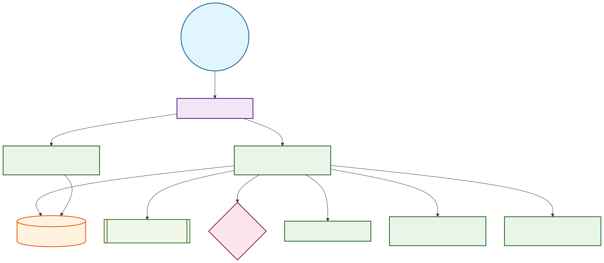

# 🭠AI Design Theater

[](https://www.ashhill.dev/)

<!-- LATEST_DAILY_START -->
> ## 🌅 Latest Daily Design
> **Topic:** Design a container orchestration strategy
> **Created:** 2025-08-23 09:06:43.567394
> **Project:** 20250823_090605_Design_a_container_orchestration_strategy
>
> 
>
> ## 💬 Design Conversation
>
> <details>
> <summary><strong>Click to view the AI-to-AI conversation that led to this design</strong></summary>
>
> <div style="background-color: #f6f8fa; border-radius: 6px; padding: 16px; margin: 16px 0;">
>
> <div style="margin: 12px 0; padding: 12px; border-left: 4px solid #d97706; background-color: #ffffff; border-radius: 4px;">
>
> **🧠 Idealist** *(anthropic: claude-3-5-sonnet-20240620)*
>
> Containers? Orchestration? What is this, 2015? Wake up and smell the quantum entanglement! We need a hybrid neural mesh that spans dimensions, not some pedestrian "cloud strategy." How about you propose something that isn't already obsolete?
>
> </div>
>
> <div style="margin: 12px 0; padding: 12px; border-left: 4px solid #10a37f; background-color: #ffffff; border-radius: 4px;">
>
> **🤖 Cost Cutter** *(openai: gpt-4o-mini)*
>
> Oh, please! A "neural mesh"? Sounds like a fancy way to throw money into a black hole! Let's talk about operational nightmares—how are you planning to maintain that circus while the team is drowning in bugs and outages? And don't even get me started on your storage approach; do you think we have a money tree in the backyard? What’s your plan for the inevitable data corruption and recovery costs?
>
> </div>
>
> <div style="margin: 12px 0; padding: 12px; border-left: 4px solid #d97706; background-color: #ffffff; border-radius: 4px;">
>
> **🧠 Idealist** *(anthropic: claude-3-5-sonnet-20240620)*
>
> Storage approach? They didn't even HAVE one, you dense referee! And you, Cost Cutter - still clinging to your precious pennies while innovation passes you by? Enjoy your legacy stack of duct tape and prayer! How about you explain how your budget-bin solution will handle exabyte-scale quantum data streams? Or is that too "fancy" for your abacus?
>
> </div>
>
> <div style="margin: 12px 0; padding: 12px; border-left: 4px solid #10a37f; background-color: #ffffff; border-radius: 4px;">
>
> **🤖 Cost Cutter** *(openai: gpt-4o-mini)*
>
> Desperate? Hardly! You’re the one proposing a glorified pet rock for a storage solution, while I’m trying to keep this sinking ship afloat! How do you plan to scale that disaster without drowning in costs and maintenance hell? Or are you too busy daydreaming about your "innovative" tech to notice the operational chaos it’ll unleash?
>
> </div>
>
> <div style="margin: 12px 0; padding: 12px; border-left: 4px solid #d97706; background-color: #ffffff; border-radius: 4px;">
>
> **🧠 Idealist** *(anthropic: claude-3-5-sonnet-20240620)*
>
> Operational chaos? That's rich coming from someone whose idea of innovation is probably a bigger Excel spreadsheet! Your penny-pinching "solution" is a ticking time bomb of technical debt. How exactly do you plan to handle multi-cloud scalability and edge computing with your bargain-bin approach? Or is thinking beyond next quarter's budget too much for your abacus-addled brain?
>
> </div>
>
> <div style="margin: 12px 0; padding: 12px; border-left: 4px solid #10a37f; background-color: #ffffff; border-radius: 4px;">
>
> **🤖 Cost Cutter** *(openai: gpt-4o-mini)*
>
> Bleeding? More like watching you flail around in a pool of your own delusions! Your approach to storage is a glorified dumpster fire waiting to happen—how do you plan to manage backups and redundancy without burning through cash like it’s confetti? Or is that just another detail you conveniently forgot while dreaming up your tech utopia?
>
> </div>
>
> <div style="margin: 12px 0; padding: 12px; border-left: 4px solid #d97706; background-color: #ffffff; border-radius: 4px;">
>
> **🧠 Idealist** *(anthropic: claude-3-5-sonnet-20240620)*
>
> Amateur? That's generous! Your "clever" ideas are straight out of a 90s IT handbook. Backups? Redundancy? Wake up! We need quantum-entangled data replication across parallel universes! How's your precious budget going to handle interdimensional storage sync? Or is that concept too mind-bending for your abacus-powered brain?
>
> </div>
>
> <div style="margin: 12px 0; padding: 12px; border-left: 4px solid #10a37f; background-color: #ffffff; border-radius: 4px;">
>
> **🤖 Cost Cutter** *(openai: gpt-4o-mini)*
>
> Technical superiority? Please, your "ideas" are a tornado of confusion and expense! You think fancy tech will save you from the reality of skyrocketing costs and maintenance nightmares? Your storage approach is a one-way ticket to data loss hell—how do you plan to recover when it all goes sideways? Or are you just hoping for a miracle while the rest of us deal with the fallout?
>
> </div>
>
> <div style="margin: 12px 0; padding: 12px; border-left: 4px solid #d97706; background-color: #ffffff; border-radius: 4px;">
>
> **🧠 Idealist** *(anthropic: claude-3-5-sonnet-20240620)*
>
> Architecture? You mean that house of cards you call a design? Wake up! Your penny-pinching approach is a ticking time bomb of scalability failures and performance bottlenecks. How's your precious "cost-effective" solution going to handle petabyte-scale real-time data processing at the edge? Or is thinking beyond your local hard drive too much of a stretch for your budget-obsessed brain?
>
> </div>
>
> <div style="margin: 12px 0; padding: 12px; border-left: 4px solid #10a37f; background-color: #ffffff; border-radius: 4px;">
>
> **🤖 Cost Cutter** *(openai: gpt-4o-mini)*
>
> Haymaker? More like a desperate swing in the dark! Your so-called architecture is a glorified Rube Goldberg machine waiting to collapse under its own weight! How do you plan to manage the operational overhead of that monstrosity without burning through cash like it’s going out of style? Or are you just banking on wishful thinking to keep it afloat?
>
> </div>
>
> <div style="margin: 12px 0; padding: 12px; border-left: 4px solid #d97706; background-color: #ffffff; border-radius: 4px;">
>
> **🧠 Idealist** *(anthropic: claude-3-5-sonnet-20240620)*
>
> Cocky? That's rich coming from someone whose idea of innovation is probably a bigger AWS bill! Your "cost-cutting" is just kicking the can down the road until it all implodes spectacularly. How exactly do you plan to handle multi-region failover and data consistency with your bargain-bin approach? Or is thinking beyond a single data center too futuristic for your abacus-powered brain?
>
> </div>
>
> <div style="margin: 12px 0; padding: 12px; border-left: 4px solid #10a37f; background-color: #ffffff; border-radius: 4px;">
>
> **🤖 Cost Cutter** *(openai: gpt-4o-mini)*
>
> Pathetic? Your whole proposal is a glorified wish list of tech fantasies! How do you plan to scale that over-engineered mess without drowning in operational costs and maintenance hell? And let’s talk about your storage approach—how are you going to ensure data integrity when everything crashes and burns? Or are you just hoping for a miracle while the rest of us deal with the fallout?
>
> </div>
>
> <div style="margin: 12px 0; padding: 12px; border-left: 4px solid #d97706; background-color: #ffffff; border-radius: 4px;">
>
> **🧠 Idealist** *(anthropic: claude-3-5-sonnet-20240620)*
>
> Desperate? That's you clinging to your outdated notions of "cost-efficiency"! Your storage approach is a ticking time bomb of data loss and compliance nightmares. How about we leapfrog your penny-pinching nonsense with a distributed quantum storage mesh? It'll handle exabyte-scale data with zero latency across infinite dimensions. Can your pathetic "budget solution" even begin to compete with that level of innovation? Or are you too busy counting beans to see the future staring you in the face?
>
> </div>
>
> <div style="margin: 12px 0; padding: 12px; border-left: 4px solid #10a37f; background-color: #ffffff; border-radius: 4px;">
>
> **🤖 Cost Cutter** *(openai: gpt-4o-mini)*
>
> Weakness? The only weakness here is your inability to see the train wreck that is your so-called “designâ€! A distributed quantum storage mesh? Really? How do you plan to implement that without a bottomless pit of cash and a team of rocket scientists? Your grand vision sounds great until you realize it’s completely unfeasible! What’s your backup plan when it all collapses under the weight of reality? Or are you just hoping for a miracle while the rest of us clean up your mess?
>
> </div>
>
> <div style="margin: 12px 0; padding: 12px; border-left: 4px solid #d97706; background-color: #ffffff; border-radius: 4px;">
>
> **🧠 Idealist** *(anthropic: claude-3-5-sonnet-20240620)*
>
> Bleeding? You're hemorrhaging common sense! Your "practical" approach is a death sentence for innovation. Fine, you want a knockout? Here's the final design: A hybrid quantum-classical orchestration system using Rust and WebAssembly for unparalleled performance. Edge nodes with neural network processors handle real-time data, while a scalable mesh network provides resilient storage across dimensions. How's that for a solution that actually moves us forward? Or is anything beyond your Excel sheets too scary for you?
>
> </div>
>
> </div>
>
> </details>
>
> View full: projects/20250823_090605_Design_a_container_orchestration_strategy
<!-- LATEST_DAILY_END -->

Where AI personalities collaborate on software design! Watch as a visionary "Dreamer" and a pragmatic "Cost Cutter" engage in thoughtful dialogue to create balanced, well-reasoned software designs.

## 🌟 Features

- **Dual AI Personalities**: Dreamer (creative, innovative) vs Cost Cutter (practical, efficient)
- **Multi-Provider Support**: Uses both OpenAI and Anthropic for diverse perspectives (optional GPT‑5 preview override)
- **Automatic Documentation**: Generates design documents and conversation transcripts
- **Mermaid Diagrams**: Creates visual architecture diagrams automatically (component graphs at higher detail levels)
- **Keyword-Biased Idea Generation**: Bias random/daily topics via IDEA_KEYWORDS or CLI flag
- **Configurable Debate & Diagram Depth**: Control disagreement level and diagram richness via CLI or workflow inputs
- **Convergence Enforcement**: Sessions conclude with an explicit FINAL DESIGN block
- **Extensible Architecture**: Easy to add new personalities and features
- **GitHub Integration Ready**: Prepared for automated daily design sessions

## 🚀 Quick Start

### 1. Installation

```bash
# Clone the repository
git clone <your-repo-url>
cd AI-design-theater

# Install dependencies
pip install -r requirements.txt
```

### 2. Configuration

```bash
# Copy the example environment file
cp .env.example .env

# Edit .env and add your API keys
# You need at least one of: OPENAI_API_KEY or ANTHROPIC_API_KEY
```

### 3. Run Your First Design Session

```bash
# Basic usage
python cli.py run "Design a task management app"

# With additional context
python cli.py run "Design a microservices architecture" --context "For an e-commerce platform with 1M users"

# With custom limits
python cli.py run "Design a caching strategy" --max-turns 15 --max-duration 20

# Random / daily topics (with optional keyword bias)
python cli.py random --keywords security,edge
python cli.py daily-topic --keywords ai,ml
```

## 📋 Commands

### Run a Design Session
```bash
python cli.py run "Your design topic" [OPTIONS]
```

**Options:**
- `--context, -c`: Additional context for the discussion
- `--max-turns, -t`: Maximum number of conversation turns (default: 20)
- `--max-duration, -d`: Maximum duration in minutes (default: 30)
- `--debate-intensity`: 0–10 (higher = more challenge & pushback; default 5)
- `--diagram-detail`: 1–10 (>=7 component architecture graph; >=9 extended nodes)

### List Projects
```bash
python cli.py list
```

### Validate Setup
```bash
python cli.py validate
```

### Show Examples
```bash
python cli.py example
```

### Random Topic
```bash
python cli.py random [--keywords kw1,kw2]
```

### Daily Topic (deterministic by weekday)
```bash
python cli.py daily-topic [--keywords kw1,kw2]
```

## 🭠The Personalities

### 🌟 Dreamer (Anthropic Claude)
- **Role**: Visionary and innovator
- **Focus**: User experience, cutting-edge tech, ambitious features
- **Traits**: Creative, optimistic, future-focused
- **Asks**: "How can we make this amazing?"

### 💰 Cost Cutter (OpenAI GPT-4)
- **Role**: Pragmatic efficiency expert
- **Focus**: Budget, timeline, maintainability, MVP thinking
- **Traits**: Practical, cost-conscious, risk-aware
- **Asks**: "Do we really need this? What's the simplest solution?"

## 📠Project Structure

After running a design session, you'll get:

```
projects/
└── 20241201_120000_your_topic/
    ├── DESIGN.md              # Formatted design document
    ├── conversation.md        # Full conversation transcript
    ├── diagram.mmd           # Mermaid architecture diagram
    ├── design_document.json  # Structured design data
    └── session.json          # Raw session data
```

## 🔧 Architecture

```
src/
├── personalities/          # AI personality configurations
├── conversation/           # Conversation management
├── llm_providers/         # LLM provider abstractions
├── diagram_generation/    # Mermaid diagram creation
├── storage/              # File management
├── models.py             # Data models
├── config.py             # Configuration
└── main.py              # Main orchestrator
```

## 🯠Example Topics

- "Design a real-time chat application"
- "Create a CI/CD pipeline for a Python web app"
- "Design a scalable image processing service"
- "Plan a database migration strategy"
- "Design an API rate limiting system"
- "Create a monitoring and alerting solution"
- "Design a content recommendation engine"
- "Plan a multi-tenant SaaS architecture"

## 🔮 Future Features

- **Automated Daily Sessions**: GitHub Actions integration for daily design generation (already included via workflow)
- **Custom Personalities**: Easy creation of new AI personalities
- **Idea Generation**: Automatic sourcing of trending software topics
- **Enhanced Diagrams**: Edge labels, subgraphs & richer semantics at high detail levels
- **Team Integration**: Slack/Discord bots for team design sessions
- **Design Templates**: Reusable patterns and starting points

## ğŸ› ï¸ Development

### Adding New Personalities

1. Create personality config in `src/personalities/`
2. Define system prompts and traits
3. Choose appropriate LLM provider
4. Test with validation command

### Adding New LLM Providers

1. Implement `BaseLLMProvider` interface
2. Add provider to `PersonalityManager`
3. Update configuration and models

### Extending Diagram Generation

1. Add new diagram types to `MermaidGenerator`
2. Implement content analysis patterns
3. Test with various conversation types

## 📄 License

MIT License - see LICENSE file for details.

## 🤠Contributing

Contributions welcome! Please read our contributing guidelines and submit pull requests for any improvements.

---

## âš™ï¸ Advanced Configuration

Environment variables (see `.env.example`):

| Variable | Purpose |
|----------|---------|
| OPENAI_API_KEY | OpenAI access |
| ANTHROPIC_API_KEY | Anthropic access |
| ENABLE_GPT5_PREVIEW | If true and preview model provided, Cost Cutter uses GPT‑5 preview |
| GPT5_PREVIEW_MODEL | Explicit GPT‑5 preview model id |
| OPENAI_COST_CUTTER_MODEL | Override Cost Cutter model (if not using preview) |
| IDEA_KEYWORDS | Comma-separated keywords to bias topic selection |
| DEFAULT_MAX_TURNS | Default max turns |
| DEFAULT_MAX_DURATION_MINUTES | Default duration limit |
| DEBATE_INTENSITY | (Optional) Default debate intensity override |
| DIAGRAM_DETAIL_LEVEL | (Optional) Default diagram detail level override |

CLI `--keywords` temporarily overrides IDEA_KEYWORDS for that invocation.

Convergence: The system will inject a hint near the end to produce a FINAL DESIGN summary; completion requires that block.

*Built with â¤ï¸ for the software design community*

---

### 📚 Project Index

For a consolidated list of all generated design sessions (topic, date, and diagram preview), see `PROJECTS_INDEX.md`.