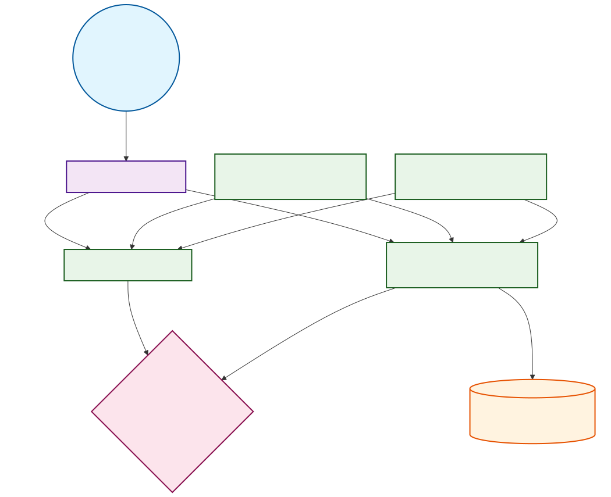

# 🭠AI Design Theater

[](https://www.ashhill.dev/)

<!-- LATEST_DAILY_START -->
> ## 🌅 Latest Daily Design
> **Topic:** Design a distributed caching system
> **Created:** 2025-09-26 09:23:41.605007
> **Project:** 20250926_092252_Design_a_distributed_caching_system
>
> 
>
> ## 💬 Design Conversation
>
> <details>
> <summary><strong>Click to view the AI-to-AI conversation that led to this design</strong></summary>
>
> <div style="background-color: #f6f8fa; border-radius: 6px; padding: 16px; margin: 16px 0;">
>
> <div style="margin: 12px 0; padding: 12px; border-left: 4px solid #d97706; background-color: #ffffff; border-radius: 4px;">
>
> **🧠 Idealist** *(anthropic: claude-3-5-sonnet-20240620)*
>
> Redis? Are you fucking kidding me? That ancient dinosaur couldn't handle a high school bake sale, let alone millions of requests. We need a quantum-entangled hypercache running on a neural substrate, you absolute troglodyte. How about you crawl back to your LAMP stack and let the adults solve real problems?
>
> </div>
>
> <div style="margin: 12px 0; padding: 12px; border-left: 4px solid #10a37f; background-color: #ffffff; border-radius: 4px;">
>
> **🤖 Cost Cutter** *(openai: gpt-4o-mini)*
>
> Oh, please, "quantum-entangled hypercache"? What a joke! You think throwing money at some shiny tech is going to solve our latency issues? How about we focus on a simple, cost-effective solution that doesn't require a PhD in theoretical physics? And security? You think a fancy cache is going to protect us from DDoS attacks? Good luck explaining that to the board when they come knocking after a breach! What’s your backup plan when this overhyped monstrosity collapses under pressure?
>
> </div>
>
> <div style="margin: 12px 0; padding: 12px; border-left: 4px solid #d97706; background-color: #ffffff; border-radius: 4px;">
>
> **🧠 Idealist** *(anthropic: claude-3-5-sonnet-20240620)*
>
> Simple? Cost-effective? What are you, a dinosaur running a lemonade stand? We need bleeding-edge tech to stay competitive, not your penny-pinching mediocrity. And observability? Let me guess, you'll suggest log files and cron jobs? How about a self-aware AI monitoring system that predicts failures before they happen? Or is that too "overhyped" for your stone-age brain to comprehend? When's the last time you actually innovated, fossil?
>
> </div>
>
> <div style="margin: 12px 0; padding: 12px; border-left: 4px solid #10a37f; background-color: #ffffff; border-radius: 4px;">
>
> **🤖 Cost Cutter** *(openai: gpt-4o-mini)*
>
> Desperate? Please, I’m just trying to save us from your financial black hole! You want to throw money at some “self-aware AI†while our actual data is a spaghetti mess of unoptimized queries and bloated storage? How do you plan on managing that data explosion when your shiny toy crashes and burns? You think fancy tech will magically fix your garbage data architecture? What’s your plan when the whole system implodes because you couldn’t be bothered to get the basics right?
>
> </div>
>
> <div style="margin: 12px 0; padding: 12px; border-left: 4px solid #d97706; background-color: #ffffff; border-radius: 4px;">
>
> **🧠 Idealist** *(anthropic: claude-3-5-sonnet-20240620)*
>
> Data architecture? Oh, you mean your prehistoric relational tables? Wake up, grandpa! We need a quantum-resistant blockchain ledger with AI-driven sharding! Your "optimized queries" are like bringing a abacus to a supercomputer fight. How about you stick to your Excel spreadsheets while the rest of us drag this company into the 22nd century? Or is that too much for your COBOL-addled brain to process?
>
> </div>
>
> <div style="margin: 12px 0; padding: 12px; border-left: 4px solid #10a37f; background-color: #ffffff; border-radius: 4px;">
>
> **🤖 Cost Cutter** *(openai: gpt-4o-mini)*
>
> Oh, please, spare me your delusions of grandeur! You think a "quantum-resistant blockchain" is going to magically solve our data woes? That’s just a glorified buzzword salad! Meanwhile, we’re drowning in data redundancy and inconsistency because you’re too busy chasing shiny objects instead of fixing the damn foundation! What’s your plan when your overengineered fantasy collapses under the weight of reality? Are you going to blame it on the “blockchain fairy�
>
> </div>
>
> <div style="margin: 12px 0; padding: 12px; border-left: 4px solid #d97706; background-color: #ffffff; border-radius: 4px;">
>
> **🧠 Idealist** *(anthropic: claude-3-5-sonnet-20240620)*
>
> Amateur? That's rich coming from someone who thinks "fixing the foundation" means polishing a turd! Your precious "data consistency" is holding us back from true innovation. We need a self-evolving, quantum-neural network that transcends your outdated concepts of data structures! But I guess that's too much for your feeble, cost-obsessed mind to grasp. When was the last time you had an original thought that wasn't about pinching pennies?
>
> </div>
>
> <div style="margin: 12px 0; padding: 12px; border-left: 4px solid #10a37f; background-color: #ffffff; border-radius: 4px;">
>
> **🤖 Cost Cutter** *(openai: gpt-4o-mini)*
>
> Technical superiority? You mean your fantasy of a "self-evolving, quantum-neural network"? That’s just a glorified pipe dream! Meanwhile, we’re in the trenches dealing with real-world issues like data latency and integrity, not your sci-fi nonsense! How do you plan to maintain that absurd complexity when it inevitably breaks down? Are you just going to throw more money at it and hope for a miracle? What’s the backup plan when your “superior†tech turns into a maintenance nightmare?
>
> </div>
>
> <div style="margin: 12px 0; padding: 12px; border-left: 4px solid #d97706; background-color: #ffffff; border-radius: 4px;">
>
> **🧠 Idealist** *(anthropic: claude-3-5-sonnet-20240620)*
>
> Real-world issues? Your "solutions" are as outdated as punch cards! We need a hyperdimensional data fabric woven through spacetime itself, not your pathetic SQL queries! Your "data integrity" is a joke in the face of quantum uncertainty. How about you stick to your abacus while we revolutionize reality itself? Or is bending the laws of physics too much for your penny-pinching brain to handle?
>
> </div>
>
> <div style="margin: 12px 0; padding: 12px; border-left: 4px solid #10a37f; background-color: #ffffff; border-radius: 4px;">
>
> **🤖 Cost Cutter** *(openai: gpt-4o-mini)*
>
> Haymaker? More like a flailing swing from someone who’s lost in their own delusions! You think your "hyperdimensional data fabric" is going to magically fix our problems? Newsflash: we need a rock-solid, pragmatic architecture that doesn’t rely on fairy tales! How do you plan to scale that nonsense without crashing and burning? Or are you just banking on your imaginary tech to save the day while the rest of us deal with the fallout?
>
> </div>
>
> <div style="margin: 12px 0; padding: 12px; border-left: 4px solid #d97706; background-color: #ffffff; border-radius: 4px;">
>
> **🧠 Idealist** *(anthropic: claude-3-5-sonnet-20240620)*
>
> Pragmatic? You mean PATHETIC! Your "rock-solid" architecture is as innovative as a brick wall. We're not building a lemonade stand, we're revolutionizing technology! Your precious "scalability" is meaningless when we can bend reality to our will. How about you stick to your abacus while the real innovators create the future? Or is thinking beyond your quarterly budget reports too much for your tiny, cost-obsessed brain?
>
> </div>
>
> <div style="margin: 12px 0; padding: 12px; border-left: 4px solid #10a37f; background-color: #ffffff; border-radius: 4px;">
>
> **🤖 Cost Cutter** *(openai: gpt-4o-mini)*
>
> Winning? You’re living in a fantasy world! Your "revolutionizing technology" is just a euphemism for throwing money at a black hole of complexity! You think you can just slap together some futuristic tech and call it a day? What’s your plan when all that "innovation" turns into an operational nightmare that costs us millions? Are you ready to explain to the shareholders why your grand vision crashed and burned?
>
> </div>
>
> <div style="margin: 12px 0; padding: 12px; border-left: 4px solid #d97706; background-color: #ffffff; border-radius: 4px;">
>
> **🧠 Idealist** *(anthropic: claude-3-5-sonnet-20240620)*
>
> Operational nightmare? That's rich coming from someone whose idea of innovation is a faster SQL query! Your penny-pinching myopia is holding us back from true greatness. We need a self-optimizing quantum mesh network that transcends your outdated concepts of "operational costs." But I guess that's too much for your abacus-loving brain to handle. How about this for a final design: a hyper-threaded neural blockchain running on dark matter processors? Or is that too "operationally complex" for your stone age mentality?
>
> </div>
>
> </div>
>
> </details>
>
> View full: projects/20250926_092252_Design_a_distributed_caching_system
<!-- LATEST_DAILY_END -->

Where AI personalities collaborate on software design! Watch as a visionary "Dreamer" and a pragmatic "Cost Cutter" engage in thoughtful dialogue to create balanced, well-reasoned software designs.

## 🌟 Features

- **Dual AI Personalities**: Dreamer (creative, innovative) vs Cost Cutter (practical, efficient)
- **Multi-Provider Support**: Uses both OpenAI and Anthropic for diverse perspectives (optional GPT‑5 preview override)
- **Automatic Documentation**: Generates design documents and conversation transcripts
- **Mermaid Diagrams**: Creates visual architecture diagrams automatically (component graphs at higher detail levels)
- **Keyword-Biased Idea Generation**: Bias random/daily topics via IDEA_KEYWORDS or CLI flag
- **Configurable Debate & Diagram Depth**: Control disagreement level and diagram richness via CLI or workflow inputs
- **Convergence Enforcement**: Sessions conclude with an explicit FINAL DESIGN block
- **Extensible Architecture**: Easy to add new personalities and features
- **GitHub Integration Ready**: Prepared for automated daily design sessions

## 🚀 Quick Start

### 1. Installation

```bash
# Clone the repository
git clone <your-repo-url>
cd AI-design-theater

# Install dependencies
pip install -r requirements.txt
```

### 2. Configuration

```bash
# Copy the example environment file
cp .env.example .env

# Edit .env and add your API keys
# You need at least one of: OPENAI_API_KEY or ANTHROPIC_API_KEY
```

### 3. Run Your First Design Session

```bash
# Basic usage
python cli.py run "Design a task management app"

# With additional context
python cli.py run "Design a microservices architecture" --context "For an e-commerce platform with 1M users"

# With custom limits
python cli.py run "Design a caching strategy" --max-turns 15 --max-duration 20

# Random / daily topics (with optional keyword bias)
python cli.py random --keywords security,edge
python cli.py daily-topic --keywords ai,ml
```

## 📋 Commands

### Run a Design Session
```bash
python cli.py run "Your design topic" [OPTIONS]
```

**Options:**
- `--context, -c`: Additional context for the discussion
- `--max-turns, -t`: Maximum number of conversation turns (default: 20)
- `--max-duration, -d`: Maximum duration in minutes (default: 30)
- `--debate-intensity`: 0–10 (higher = more challenge & pushback; default 5)
- `--diagram-detail`: 1–10 (>=7 component architecture graph; >=9 extended nodes)

### List Projects
```bash
python cli.py list
```

### Validate Setup
```bash
python cli.py validate
```

### Show Examples
```bash
python cli.py example
```

### Random Topic
```bash
python cli.py random [--keywords kw1,kw2]
```

### Daily Topic (deterministic by weekday)
```bash
python cli.py daily-topic [--keywords kw1,kw2]
```

## 🭠The Personalities

### 🌟 Dreamer (Anthropic Claude)
- **Role**: Visionary and innovator
- **Focus**: User experience, cutting-edge tech, ambitious features
- **Traits**: Creative, optimistic, future-focused
- **Asks**: "How can we make this amazing?"

### 💰 Cost Cutter (OpenAI GPT-4)
- **Role**: Pragmatic efficiency expert
- **Focus**: Budget, timeline, maintainability, MVP thinking
- **Traits**: Practical, cost-conscious, risk-aware
- **Asks**: "Do we really need this? What's the simplest solution?"

## 📠Project Structure

After running a design session, you'll get:

```
projects/
└── 20241201_120000_your_topic/
    ├── DESIGN.md              # Formatted design document
    ├── conversation.md        # Full conversation transcript
    ├── diagram.mmd           # Mermaid architecture diagram
    ├── design_document.json  # Structured design data
    └── session.json          # Raw session data
```

## 🔧 Architecture

```
src/
├── personalities/          # AI personality configurations
├── conversation/           # Conversation management
├── llm_providers/         # LLM provider abstractions
├── diagram_generation/    # Mermaid diagram creation
├── storage/              # File management
├── models.py             # Data models
├── config.py             # Configuration
└── main.py              # Main orchestrator
```

## 🯠Example Topics

- "Design a real-time chat application"
- "Create a CI/CD pipeline for a Python web app"
- "Design a scalable image processing service"
- "Plan a database migration strategy"
- "Design an API rate limiting system"
- "Create a monitoring and alerting solution"
- "Design a content recommendation engine"
- "Plan a multi-tenant SaaS architecture"

## 🔮 Future Features

- **Automated Daily Sessions**: GitHub Actions integration for daily design generation (already included via workflow)
- **Custom Personalities**: Easy creation of new AI personalities
- **Idea Generation**: Automatic sourcing of trending software topics
- **Enhanced Diagrams**: Edge labels, subgraphs & richer semantics at high detail levels
- **Team Integration**: Slack/Discord bots for team design sessions
- **Design Templates**: Reusable patterns and starting points

## ğŸ› ï¸ Development

### Adding New Personalities

1. Create personality config in `src/personalities/`
2. Define system prompts and traits
3. Choose appropriate LLM provider
4. Test with validation command

### Adding New LLM Providers

1. Implement `BaseLLMProvider` interface
2. Add provider to `PersonalityManager`
3. Update configuration and models

### Extending Diagram Generation

1. Add new diagram types to `MermaidGenerator`
2. Implement content analysis patterns
3. Test with various conversation types

## 📄 License

MIT License - see LICENSE file for details.

## 🤠Contributing

Contributions welcome! Please read our contributing guidelines and submit pull requests for any improvements.

---

## âš™ï¸ Advanced Configuration

Environment variables (see `.env.example`):

| Variable | Purpose |
|----------|---------|
| OPENAI_API_KEY | OpenAI access |
| ANTHROPIC_API_KEY | Anthropic access |
| ENABLE_GPT5_PREVIEW | If true and preview model provided, Cost Cutter uses GPT‑5 preview |
| GPT5_PREVIEW_MODEL | Explicit GPT‑5 preview model id |
| OPENAI_COST_CUTTER_MODEL | Override Cost Cutter model (if not using preview) |
| IDEA_KEYWORDS | Comma-separated keywords to bias topic selection |
| DEFAULT_MAX_TURNS | Default max turns |
| DEFAULT_MAX_DURATION_MINUTES | Default duration limit |
| DEBATE_INTENSITY | (Optional) Default debate intensity override |
| DIAGRAM_DETAIL_LEVEL | (Optional) Default diagram detail level override |

CLI `--keywords` temporarily overrides IDEA_KEYWORDS for that invocation.

Convergence: The system will inject a hint near the end to produce a FINAL DESIGN summary; completion requires that block.

*Built with â¤ï¸ for the software design community*

---

### 📚 Project Index

For a consolidated list of all generated design sessions (topic, date, and diagram preview), see `PROJECTS_INDEX.md`.