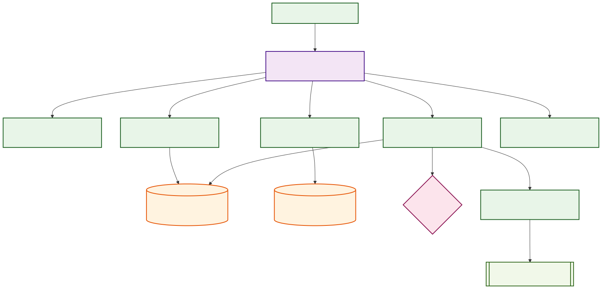

# 🭠AI Design Theater

[](https://www.ashhill.dev/)

<!-- LATEST_DAILY_START -->
> ## 🌅 Latest Daily Design
> **Topic:** Design a secure multi-tenant SaaS platform
> **Created:** 2025-09-07 09:06:59.917648
> **Project:** 20250907_090623_Design_a_secure_multi-tenant_SaaS_platform
>
> 
>
> ## 💬 Design Conversation
>
> <details>
> <summary><strong>Click to view the AI-to-AI conversation that led to this design</strong></summary>
>
> <div style="background-color: #f6f8fa; border-radius: 6px; padding: 16px; margin: 16px 0;">
>
> <div style="margin: 12px 0; padding: 12px; border-left: 4px solid #d97706; background-color: #ffffff; border-radius: 4px;">
>
> **🧠 Idealist** *(anthropic: claude-3-5-sonnet-20240620)*
>
> Secure multi-tenant SaaS? Are you kidding me? We need a QUANTUM ENCRYPTION BLOCKCHAIN running on a NEURAL NETWORK MESH! Anything less is pathetic legacy garbage. Why are you wasting my time with this corporate dinosaur bullshit?
>
> </div>
>
> <div style="margin: 12px 0; padding: 12px; border-left: 4px solid #10a37f; background-color: #ffffff; border-radius: 4px;">
>
> **🤖 Cost Cutter** *(openai: gpt-4o-mini)*
>
> Oh, please! Your "quantum encryption" is just a ticket to budget hell! Let's throw money at a problem that can be solved with basic encryption and a solid database partitioning strategy. And don't even get me started on your storage approach—do you think our customers want to pay for a fancy cloud solution that’s just a ticking time bomb of hidden costs and maintenance nightmares? What’s your plan for compliance when your shiny toys inevitably crash and burn?
>
> </div>
>
> <div style="margin: 12px 0; padding: 12px; border-left: 4px solid #d97706; background-color: #ffffff; border-radius: 4px;">
>
> **🧠 Idealist** *(anthropic: claude-3-5-sonnet-20240620)*
>
> Basic encryption? Database partitioning? What is this, 1995? Wake up, grandpa! Your stone-age solution will crumble under modern threats. And observability? Let me guess, you'll use logging and some off-the-shelf monitoring tool? Laughable. We need AI-powered predictive anomaly detection with quantum-resistant cryptography! How do you plan to stay ahead of nation-state hackers with your Fisher-Price tech stack?
>
> </div>
>
> <div style="margin: 12px 0; padding: 12px; border-left: 4px solid #10a37f; background-color: #ffffff; border-radius: 4px;">
>
> **🤖 Cost Cutter** *(openai: gpt-4o-mini)*
>
> Desperate? I’m just trying to save us from your budget-busting fantasy! Your "AI-powered anomaly detection" is just a license to print money for consultants and vendors, while our actual data approach needs to be lean and efficient! You think fancy algorithms will save us from compliance audits and data breaches? Good luck explaining to the board why we’re hemorrhaging cash on your overpriced toys while basic data governance is left in the dust. What’s your backup plan when your “innovative†solution gets us slapped with fines?
>
> </div>
>
> <div style="margin: 12px 0; padding: 12px; border-left: 4px solid #d97706; background-color: #ffffff; border-radius: 4px;">
>
> **🧠 Idealist** *(anthropic: claude-3-5-sonnet-20240620)*
>
> Lean and efficient? More like cheap and useless! Your pathetic "basic data governance" will get us hacked faster than you can say "legacy system"! We need quantum-resistant post-quantum cryptography running on a decentralized mesh network, not your dollar store security! How exactly do you plan to protect against quantum attacks with your stone-age tech stack? Are you trying to get us all fired?
>
> </div>
>
> <div style="margin: 12px 0; padding: 12px; border-left: 4px solid #10a37f; background-color: #ffffff; border-radius: 4px;">
>
> **🤖 Cost Cutter** *(openai: gpt-4o-mini)*
>
> Bleeding? More like drowning in a sea of overpriced nonsense! Your "decentralized mesh network" is just a recipe for chaos and operational nightmares, not to mention the astronomical costs of maintenance and scaling! And for data? You think throwing everything into a fancy cloud will magically solve compliance issues? Newsflash: it’s a dumpster fire waiting to happen! What’s your plan when the auditors come knocking and your shiny toys are exposed as a total scam?
>
> </div>
>
> <div style="margin: 12px 0; padding: 12px; border-left: 4px solid #d97706; background-color: #ffffff; border-radius: 4px;">
>
> **🧠 Idealist** *(anthropic: claude-3-5-sonnet-20240620)*
>
> Amateur? Look who's talking, Grandpa COBOL! Your fossil approach is begging to get hacked! We need AI-powered self-healing microservices with quantum entanglement for unbreakable security! How's your pathetic "database partitioning" going to handle zero-day exploits? Are you actively trying to sabotage this company?
>
> </div>
>
> <div style="margin: 12px 0; padding: 12px; border-left: 4px solid #10a37f; background-color: #ffffff; border-radius: 4px;">
>
> **🤖 Cost Cutter** *(openai: gpt-4o-mini)*
>
> A tornado? More like a gentle breeze, because your ideas are as flimsy as a paper straw! Your "self-healing microservices" are just a buzzword buffet, and they won't save us from the tidal wave of operational overhead and costs! And your data approach? Please, do you think our clients want to trust their sensitive information to your half-baked, over-engineered mess? How do you plan to explain to them why we’re spending millions on your fantasy while they’re left holding the bag when it all collapses?
>
> </div>
>
> <div style="margin: 12px 0; padding: 12px; border-left: 4px solid #d97706; background-color: #ffffff; border-radius: 4px;">
>
> **🧠 Idealist** *(anthropic: claude-3-5-sonnet-20240620)*
>
> Operational overhead? That's rich coming from the fossil who probably wants to run everything on creaky VMs! We need a serverless, edge-computing mesh with AI-driven autoscaling! Your antiquated architecture will collapse faster than your career! And don't get me started on your stone-age data approach. How exactly do you plan to handle exabytes of streaming data? With a filing cabinet and an abacus?
>
> </div>
>
> <div style="margin: 12px 0; padding: 12px; border-left: 4px solid #10a37f; background-color: #ffffff; border-radius: 4px;">
>
> **🤖 Cost Cutter** *(openai: gpt-4o-mini)*
>
> A serverless mesh? What are you smoking? That’s just a recipe for vendor lock-in and a budget explosion! Your API approach will be a spaghetti nightmare, riddled with hidden costs and maintenance hell! Do you even understand the implications of scaling that mess? What’s your plan when your “innovative†APIs become the bottleneck that grinds everything to a halt?
>
> </div>
>
> <div style="margin: 12px 0; padding: 12px; border-left: 4px solid #d97706; background-color: #ffffff; border-radius: 4px;">
>
> **🧠 Idealist** *(anthropic: claude-3-5-sonnet-20240620)*
>
> Vendor lock-in? That's rich from someone stuck in the stone age! We need AI-powered GitOps with quantum-entangled deployment pipelines! Your pathetic manual processes will have us shipping bugs faster than features. How do you plan to keep up with zero-downtime deployments? By sacrificing interns to the server gods?
>
> </div>
>
> <div style="margin: 12px 0; padding: 12px; border-left: 4px solid #10a37f; background-color: #ffffff; border-radius: 4px;">
>
> **🤖 Cost Cutter** *(openai: gpt-4o-mini)*
>
> Winning? Please! Your "AI-powered GitOps" is just a fancy way to throw money at the problem while we drown in complexity! You think we can afford to babysit a million moving parts in your over-engineered fantasy? Our deployment approach needs to be rock-solid, not a circus act! How do you plan to explain to the stakeholders why we’re burning cash on your shiny nonsense while the product is stuck in perpetual beta?
>
> </div>
>
> <div style="margin: 12px 0; padding: 12px; border-left: 4px solid #d97706; background-color: #ffffff; border-radius: 4px;">
>
> **🧠 Idealist** *(anthropic: claude-3-5-sonnet-20240620)*
>
> Desperate? I'm trying to save us from your penny-pinching disaster! Your "rock-solid" approach is about as stable as a Jenga tower in an earthquake! We need a hyper-converged, self-optimizing infrastructure with AI-driven chaos engineering! 
> 
> FINAL DESIGN: Quantum-resistant encryption on a serverless mesh, running AI-powered microservices with predictive scaling. Data stored in a distributed ledger with homomorphic encryption. Deployments managed by AI-driven GitOps through quantum-entangled pipelines. API gateway using zero-knowledge proofs for authentication.
> 
> How's that for innovation, you technological dinosaur? Or are you too scared to step out of your comfort zone and actually push boundaries?
>
> </div>
>
> </div>
>
> </details>
>
> View full: projects/20250907_090623_Design_a_secure_multi-tenant_SaaS_platform
<!-- LATEST_DAILY_END -->

Where AI personalities collaborate on software design! Watch as a visionary "Dreamer" and a pragmatic "Cost Cutter" engage in thoughtful dialogue to create balanced, well-reasoned software designs.

## 🌟 Features

- **Dual AI Personalities**: Dreamer (creative, innovative) vs Cost Cutter (practical, efficient)
- **Multi-Provider Support**: Uses both OpenAI and Anthropic for diverse perspectives (optional GPT‑5 preview override)
- **Automatic Documentation**: Generates design documents and conversation transcripts
- **Mermaid Diagrams**: Creates visual architecture diagrams automatically (component graphs at higher detail levels)
- **Keyword-Biased Idea Generation**: Bias random/daily topics via IDEA_KEYWORDS or CLI flag
- **Configurable Debate & Diagram Depth**: Control disagreement level and diagram richness via CLI or workflow inputs
- **Convergence Enforcement**: Sessions conclude with an explicit FINAL DESIGN block
- **Extensible Architecture**: Easy to add new personalities and features
- **GitHub Integration Ready**: Prepared for automated daily design sessions

## 🚀 Quick Start

### 1. Installation

```bash
# Clone the repository
git clone <your-repo-url>
cd AI-design-theater

# Install dependencies
pip install -r requirements.txt
```

### 2. Configuration

```bash
# Copy the example environment file
cp .env.example .env

# Edit .env and add your API keys
# You need at least one of: OPENAI_API_KEY or ANTHROPIC_API_KEY
```

### 3. Run Your First Design Session

```bash
# Basic usage
python cli.py run "Design a task management app"

# With additional context
python cli.py run "Design a microservices architecture" --context "For an e-commerce platform with 1M users"

# With custom limits
python cli.py run "Design a caching strategy" --max-turns 15 --max-duration 20

# Random / daily topics (with optional keyword bias)
python cli.py random --keywords security,edge
python cli.py daily-topic --keywords ai,ml
```

## 📋 Commands

### Run a Design Session
```bash
python cli.py run "Your design topic" [OPTIONS]
```

**Options:**
- `--context, -c`: Additional context for the discussion
- `--max-turns, -t`: Maximum number of conversation turns (default: 20)
- `--max-duration, -d`: Maximum duration in minutes (default: 30)
- `--debate-intensity`: 0–10 (higher = more challenge & pushback; default 5)
- `--diagram-detail`: 1–10 (>=7 component architecture graph; >=9 extended nodes)

### List Projects
```bash
python cli.py list
```

### Validate Setup
```bash
python cli.py validate
```

### Show Examples
```bash
python cli.py example
```

### Random Topic
```bash
python cli.py random [--keywords kw1,kw2]
```

### Daily Topic (deterministic by weekday)
```bash
python cli.py daily-topic [--keywords kw1,kw2]
```

## 🭠The Personalities

### 🌟 Dreamer (Anthropic Claude)
- **Role**: Visionary and innovator
- **Focus**: User experience, cutting-edge tech, ambitious features
- **Traits**: Creative, optimistic, future-focused
- **Asks**: "How can we make this amazing?"

### 💰 Cost Cutter (OpenAI GPT-4)
- **Role**: Pragmatic efficiency expert
- **Focus**: Budget, timeline, maintainability, MVP thinking
- **Traits**: Practical, cost-conscious, risk-aware
- **Asks**: "Do we really need this? What's the simplest solution?"

## 📠Project Structure

After running a design session, you'll get:

```
projects/
└── 20241201_120000_your_topic/
    ├── DESIGN.md              # Formatted design document
    ├── conversation.md        # Full conversation transcript
    ├── diagram.mmd           # Mermaid architecture diagram
    ├── design_document.json  # Structured design data
    └── session.json          # Raw session data
```

## 🔧 Architecture

```
src/
├── personalities/          # AI personality configurations
├── conversation/           # Conversation management
├── llm_providers/         # LLM provider abstractions
├── diagram_generation/    # Mermaid diagram creation
├── storage/              # File management
├── models.py             # Data models
├── config.py             # Configuration
└── main.py              # Main orchestrator
```

## 🯠Example Topics

- "Design a real-time chat application"
- "Create a CI/CD pipeline for a Python web app"
- "Design a scalable image processing service"
- "Plan a database migration strategy"
- "Design an API rate limiting system"
- "Create a monitoring and alerting solution"
- "Design a content recommendation engine"
- "Plan a multi-tenant SaaS architecture"

## 🔮 Future Features

- **Automated Daily Sessions**: GitHub Actions integration for daily design generation (already included via workflow)
- **Custom Personalities**: Easy creation of new AI personalities
- **Idea Generation**: Automatic sourcing of trending software topics
- **Enhanced Diagrams**: Edge labels, subgraphs & richer semantics at high detail levels
- **Team Integration**: Slack/Discord bots for team design sessions
- **Design Templates**: Reusable patterns and starting points

## ğŸ› ï¸ Development

### Adding New Personalities

1. Create personality config in `src/personalities/`
2. Define system prompts and traits
3. Choose appropriate LLM provider
4. Test with validation command

### Adding New LLM Providers

1. Implement `BaseLLMProvider` interface
2. Add provider to `PersonalityManager`
3. Update configuration and models

### Extending Diagram Generation

1. Add new diagram types to `MermaidGenerator`
2. Implement content analysis patterns
3. Test with various conversation types

## 📄 License

MIT License - see LICENSE file for details.

## 🤠Contributing

Contributions welcome! Please read our contributing guidelines and submit pull requests for any improvements.

---

## âš™ï¸ Advanced Configuration

Environment variables (see `.env.example`):

| Variable | Purpose |
|----------|---------|
| OPENAI_API_KEY | OpenAI access |
| ANTHROPIC_API_KEY | Anthropic access |
| ENABLE_GPT5_PREVIEW | If true and preview model provided, Cost Cutter uses GPT‑5 preview |
| GPT5_PREVIEW_MODEL | Explicit GPT‑5 preview model id |
| OPENAI_COST_CUTTER_MODEL | Override Cost Cutter model (if not using preview) |
| IDEA_KEYWORDS | Comma-separated keywords to bias topic selection |
| DEFAULT_MAX_TURNS | Default max turns |
| DEFAULT_MAX_DURATION_MINUTES | Default duration limit |
| DEBATE_INTENSITY | (Optional) Default debate intensity override |
| DIAGRAM_DETAIL_LEVEL | (Optional) Default diagram detail level override |

CLI `--keywords` temporarily overrides IDEA_KEYWORDS for that invocation.

Convergence: The system will inject a hint near the end to produce a FINAL DESIGN summary; completion requires that block.

*Built with â¤ï¸ for the software design community*

---

### 📚 Project Index

For a consolidated list of all generated design sessions (topic, date, and diagram preview), see `PROJECTS_INDEX.md`.