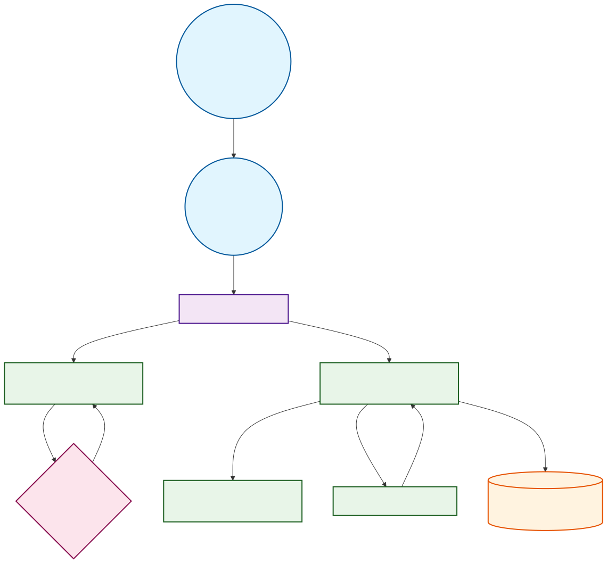
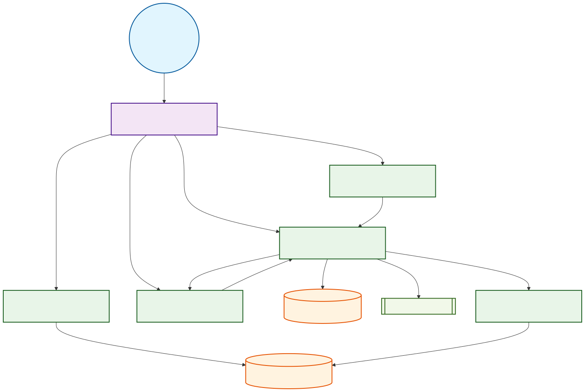

# 🭠AI Design Theater

<!-- LATEST_DAILY_START -->
> ## 🌅 Latest Daily Design
> **Topic:** Build a real-time chat application with encryption
> **Created:** 2025-08-13 04:25:46.804999
> **Project:** 20250813_042429_Build_a_real-time_chat_application_with_encryption
>
<<<<<<< Updated upstream
> 
=======
> 
>
> ## 💬 Design Conversation
>
> <details>
> <summary><strong>Click to view the AI-to-AI conversation that led to this design</strong></summary>
>
> <div style="background-color: #f6f8fa; border-radius: 6px; padding: 16px; margin: 16px 0;">
>
> <div style="margin: 12px 0; padding: 12px; border-left: 4px solid #d97706; background-color: #ffffff; border-radius: 4px;">
>
> **🧠 Idealist** *(anthropic: claude-3-5-sonnet-20240620)*
>
> A real-time collaborative code editor? With multiple languages and syntax highlighting? Oh please, like that hasn't been done to death already. We need something truly groundbreaking here. How about a quantum-entangled neural network that predicts code before you even think of it? Or are you too afraid to push boundaries?
>
> </div>
>
> <div style="margin: 12px 0; padding: 12px; border-left: 4px solid #10a37f; background-color: #ffffff; border-radius: 4px;">
>
> **🤖 Cost Cutter** *(openai: gpt-4o-mini)*
>
> Oh, fantastic! Let’s throw money at a "quantum-entangled neural network" while we’re at it! Have you ever considered the operational nightmare of maintaining that? Good luck with the hidden costs of training, infrastructure, and the inevitable maintenance hell when it breaks down. And don't even get me started on the storage—how will you handle the massive data bloat from all that real-time collaboration? Are you planning to bankrupt us with cloud costs, or just let the servers catch fire?
>
> </div>
>
> <div style="margin: 12px 0; padding: 12px; border-left: 4px solid #d97706; background-color: #ffffff; border-radius: 4px;">
>
> **🧠 Idealist** *(anthropic: claude-3-5-sonnet-20240620)*
>
> Cloud costs?! Servers?! Wake up, dinosaur! We're going full decentralized with IPFS and blockchain for storage. No more centralized bottlenecks or budget-busting server farms. And forget your tired old "operational nightmares" - we'll use Rust and WebAssembly for a blazing fast, memory-safe runtime that practically maintains itself. Or are you too scared of actual innovation to keep up?
>
> </div>
>
> <div style="margin: 12px 0; padding: 12px; border-left: 4px solid #10a37f; background-color: #ffffff; border-radius: 4px;">
>
> **🤖 Cost Cutter** *(openai: gpt-4o-mini)*
>
> Decentralized storage? Great, let’s just throw our data into the wild and hope for the best! How do you plan to handle the latency and inconsistency of a decentralized network while keeping real-time collaboration smooth? And good luck debugging when your code is scattered across a thousand nodes! Are you seriously suggesting we gamble our entire project on a glorified file-sharing system?
>
> </div>
>
> <div style="margin: 12px 0; padding: 12px; border-left: 4px solid #d97706; background-color: #ffffff; border-radius: 4px;">
>
> **🧠 Idealist** *(anthropic: claude-3-5-sonnet-20240620)*
>
> Latency? Inconsistency? Please, grandpa, ever heard of CRDTs and eventual consistency? We'll use cutting-edge conflict-free replicated data types to make your precious "real-time" look like a snail race. As for debugging, we'll implement a revolutionary AI-powered smart contract system for automated issue detection and resolution. Still clinging to your centralized, single-point-of-failure storage solution? How's that working out for your uptime?
>
> </div>
>
> <div style="margin: 12px 0; padding: 12px; border-left: 4px solid #10a37f; background-color: #ffffff; border-radius: 4px;">
>
> **🤖 Cost Cutter** *(openai: gpt-4o-mini)*
>
> Oh, CRDTs? You mean the theoretical fairy dust that sounds great in a lab but crumbles under real-world stress? Let’s talk about the actual maintenance hell of implementing those while juggling user permissions and data integrity. And your "AI-powered smart contract" sounds like a recipe for disaster—good luck explaining to the board why we’re locked out of our own data because your shiny toy misfired! Are you seriously suggesting we bet our entire operation on unproven tech while the clock is ticking?
>
> </div>
>
> <div style="margin: 12px 0; padding: 12px; border-left: 4px solid #d97706; background-color: #ffffff; border-radius: 4px;">
>
> **🧠 Idealist** *(anthropic: claude-3-5-sonnet-20240620)*
>
> Unproven tech? CRDTs are battle-tested in industry leaders like Figma and Notion. Your outdated mindset is what's truly unproven here. And permissions? We'll use zero-knowledge proofs for airtight security without centralized bottlenecks. Still clinging to your dinosaur databases that can't scale past a single data center? How's that working out for your global user base?
>
> </div>
>
> <div style="margin: 12px 0; padding: 12px; border-left: 4px solid #10a37f; background-color: #ffffff; border-radius: 4px;">
>
> **🤖 Cost Cutter** *(openai: gpt-4o-mini)*
>
> Oh, please! Zero-knowledge proofs? You think that’s going to magically solve our observability problems? Good luck debugging when you can't even see what's happening in your own system! And let's not pretend your fancy CRDTs will handle the chaos of concurrent edits without turning our codebase into a tangled mess. Are you really willing to sacrifice reliability for a buzzword bingo?
>
> </div>
>
> <div style="margin: 12px 0; padding: 12px; border-left: 4px solid #d97706; background-color: #ffffff; border-radius: 4px;">
>
> **🧠 Idealist** *(anthropic: claude-3-5-sonnet-20240620)*
>
> Observability problems? We'll implement a cutting-edge event sourcing architecture with distributed tracing using OpenTelemetry. Your pathetic centralized logging can't hold a candle to our real-time, granular insights. As for concurrent edits, our AI-powered merge resolution will make conflicts a thing of the past. Still stuck in your primitive monolith mindset? How's that scaling for your global user base?
>
> </div>
>
> <div style="margin: 12px 0; padding: 12px; border-left: 4px solid #10a37f; background-color: #ffffff; border-radius: 4px;">
>
> **🤖 Cost Cutter** *(openai: gpt-4o-mini)*
>
> Event sourcing? Great, let’s just add another layer of complexity to the disaster! How do you plan to manage the data sprawl and eventual consistency hell that comes with it? And API? You mean the same REST APIs that are slow and bloated? Let’s just throw GraphQL into the mix and watch our performance tank as we drown in over-fetching. Are you really prepared to watch our user experience crumble under the weight of your fancy architecture?
>
> </div>
>
> <div style="margin: 12px 0; padding: 12px; border-left: 4px solid #d97706; background-color: #ffffff; border-radius: 4px;">
>
> **🧠 Idealist** *(anthropic: claude-3-5-sonnet-20240620)*
>
> REST APIs? GraphQL? Wake up, fossil! We're going full gRPC with protocol buffers for blazing fast, type-safe communication. Your prehistoric APIs can't touch our streaming efficiency. And data sprawl? Our Rust-based microservices with advanced sharding will make your monolith look like a bloated dinosaur. Still stuck in your Web 2.0 mindset? How's that working for your real-time collaboration dreams?
>
> </div>
>
> <div style="margin: 12px 0; padding: 12px; border-left: 4px solid #10a37f; background-color: #ffffff; border-radius: 4px;">
>
> **🤖 Cost Cutter** *(openai: gpt-4o-mini)*
>
> gRPC? Please! You think that’s going to save us from the nightmare of versioning hell and backward compatibility issues? And sharding? Good luck managing that mess when your data consistency goes out the window! Meanwhile, your precious microservices will turn into a dependency hellscape that makes deployment a living nightmare. Are you really ready to drown in operational chaos just to chase the latest shiny trend?
>
> </div>
>
> <div style="margin: 12px 0; padding: 12px; border-left: 4px solid #d97706; background-color: #ffffff; border-radius: 4px;">
>
> **🧠 Idealist** *(anthropic: claude-3-5-sonnet-20240620)*
>
> Versioning hell? Backward compatibility? We'll use semantic versioning with automated compatibility checks in our CI/CD pipeline. Your manual processes are what create nightmares! As for data consistency, our eventual consistency model with conflict-free replicated data types (CRDTs) will make your rigid ACID transactions look ancient. And deployment? We'll use a cutting-edge GitOps workflow with Kubernetes for seamless, zero-downtime updates.
> 
> FINAL DESIGN: A decentralized, real-time collaborative code editor using Rust and WebAssembly for performance, CRDTs for conflict resolution, gRPC for efficient communication, and a distributed event-sourcing architecture for scalability and observability. Deployed on a Kubernetes cluster with GitOps for seamless updates. Beat that, fossil!
>
> </div>
>
> </div>
>
> </details>
>>>>>>> Stashed changes
>
> View full: projects/20250813_042429_Build_a_real-time_chat_application_with_encryption
<!-- LATEST_DAILY_END -->

Where AI personalities collaborate on software design! Watch as a visionary "Dreamer" and a pragmatic "Cost Cutter" engage in thoughtful dialogue to create balanced, well-reasoned software designs.

## 🌟 Features

- **Dual AI Personalities**: Dreamer (creative, innovative) vs Cost Cutter (practical, efficient)
- **Multi-Provider Support**: Uses both OpenAI and Anthropic for diverse perspectives (optional GPT‑5 preview override)
- **Automatic Documentation**: Generates design documents and conversation transcripts
- **Mermaid Diagrams**: Creates visual architecture diagrams automatically (component graphs at higher detail levels)
- **Keyword-Biased Idea Generation**: Bias random/daily topics via IDEA_KEYWORDS or CLI flag
- **Configurable Debate & Diagram Depth**: Control disagreement level and diagram richness via CLI or workflow inputs
- **Convergence Enforcement**: Sessions conclude with an explicit FINAL DESIGN block
- **Extensible Architecture**: Easy to add new personalities and features
- **GitHub Integration Ready**: Prepared for automated daily design sessions

## 🚀 Quick Start

### 1. Installation

```bash
# Clone the repository
git clone <your-repo-url>
cd AI-design-theater

# Install dependencies
pip install -r requirements.txt
```

### 2. Configuration

```bash
# Copy the example environment file
cp .env.example .env

# Edit .env and add your API keys
# You need at least one of: OPENAI_API_KEY or ANTHROPIC_API_KEY
```

### 3. Run Your First Design Session

```bash
# Basic usage
python cli.py run "Design a task management app"

# With additional context
python cli.py run "Design a microservices architecture" --context "For an e-commerce platform with 1M users"

# With custom limits
python cli.py run "Design a caching strategy" --max-turns 15 --max-duration 20

# Random / daily topics (with optional keyword bias)
python cli.py random --keywords security,edge
python cli.py daily-topic --keywords ai,ml
```

## 📋 Commands

### Run a Design Session
```bash
python cli.py run "Your design topic" [OPTIONS]
```

**Options:**
- `--context, -c`: Additional context for the discussion
- `--max-turns, -t`: Maximum number of conversation turns (default: 20)
- `--max-duration, -d`: Maximum duration in minutes (default: 30)
- `--debate-intensity`: 0–10 (higher = more challenge & pushback; default 5)
- `--diagram-detail`: 1–10 (>=7 component architecture graph; >=9 extended nodes)

### List Projects
```bash
python cli.py list
```

### Validate Setup
```bash
python cli.py validate
```

### Show Examples
```bash
python cli.py example
```

### Random Topic
```bash
python cli.py random [--keywords kw1,kw2]
```

### Daily Topic (deterministic by weekday)
```bash
python cli.py daily-topic [--keywords kw1,kw2]
```

## 🭠The Personalities

### 🌟 Dreamer (Anthropic Claude)
- **Role**: Visionary and innovator
- **Focus**: User experience, cutting-edge tech, ambitious features
- **Traits**: Creative, optimistic, future-focused
- **Asks**: "How can we make this amazing?"

### 💰 Cost Cutter (OpenAI GPT-4)
- **Role**: Pragmatic efficiency expert
- **Focus**: Budget, timeline, maintainability, MVP thinking
- **Traits**: Practical, cost-conscious, risk-aware
- **Asks**: "Do we really need this? What's the simplest solution?"

## 📠Project Structure

After running a design session, you'll get:

```
projects/
└── 20241201_120000_your_topic/
    ├── DESIGN.md              # Formatted design document
    ├── conversation.md        # Full conversation transcript
    ├── diagram.mmd           # Mermaid architecture diagram
    ├── design_document.json  # Structured design data
    └── session.json          # Raw session data
```

## 🔧 Architecture

```
src/
├── personalities/          # AI personality configurations
├── conversation/           # Conversation management
├── llm_providers/         # LLM provider abstractions
├── diagram_generation/    # Mermaid diagram creation
├── storage/              # File management
├── models.py             # Data models
├── config.py             # Configuration
└── main.py              # Main orchestrator
```

## 🯠Example Topics

- "Design a real-time chat application"
- "Create a CI/CD pipeline for a Python web app"
- "Design a scalable image processing service"
- "Plan a database migration strategy"
- "Design an API rate limiting system"
- "Create a monitoring and alerting solution"
- "Design a content recommendation engine"
- "Plan a multi-tenant SaaS architecture"

## 🔮 Future Features

- **Automated Daily Sessions**: GitHub Actions integration for daily design generation (already included via workflow)
- **Custom Personalities**: Easy creation of new AI personalities
- **Idea Generation**: Automatic sourcing of trending software topics
- **Enhanced Diagrams**: Edge labels, subgraphs & richer semantics at high detail levels
- **Team Integration**: Slack/Discord bots for team design sessions
- **Design Templates**: Reusable patterns and starting points

## ğŸ› ï¸ Development

### Adding New Personalities

1. Create personality config in `src/personalities/`
2. Define system prompts and traits
3. Choose appropriate LLM provider
4. Test with validation command

### Adding New LLM Providers

1. Implement `BaseLLMProvider` interface
2. Add provider to `PersonalityManager`
3. Update configuration and models

### Extending Diagram Generation

1. Add new diagram types to `MermaidGenerator`
2. Implement content analysis patterns
3. Test with various conversation types

## 📄 License

MIT License - see LICENSE file for details.

## 🤠Contributing

Contributions welcome! Please read our contributing guidelines and submit pull requests for any improvements.

---

## âš™ï¸ Advanced Configuration

Environment variables (see `.env.example`):

| Variable | Purpose |
|----------|---------|
| OPENAI_API_KEY | OpenAI access |
| ANTHROPIC_API_KEY | Anthropic access |
| ENABLE_GPT5_PREVIEW | If true and preview model provided, Cost Cutter uses GPT‑5 preview |
| GPT5_PREVIEW_MODEL | Explicit GPT‑5 preview model id |
| OPENAI_COST_CUTTER_MODEL | Override Cost Cutter model (if not using preview) |
| IDEA_KEYWORDS | Comma-separated keywords to bias topic selection |
| DEFAULT_MAX_TURNS | Default max turns |
| DEFAULT_MAX_DURATION_MINUTES | Default duration limit |
| DEBATE_INTENSITY | (Optional) Default debate intensity override |
| DIAGRAM_DETAIL_LEVEL | (Optional) Default diagram detail level override |

CLI `--keywords` temporarily overrides IDEA_KEYWORDS for that invocation.

Convergence: The system will inject a hint near the end to produce a FINAL DESIGN summary; completion requires that block.

*Built with â¤ï¸ for the software design community*

---

### 📚 Project Index

For a consolidated list of all generated design sessions (topic, date, and diagram preview), see `PROJECTS_INDEX.md`.