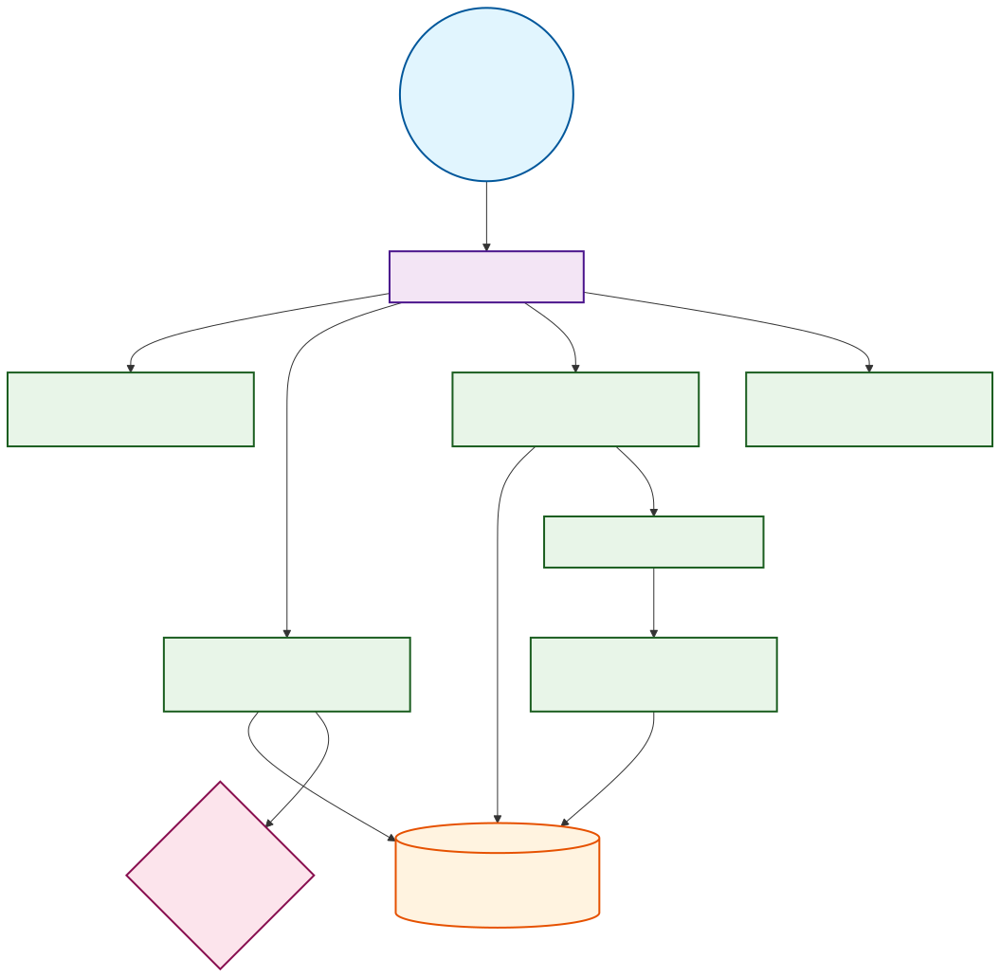

# 🭠AI Design Theater

[](https://www.ashhill.dev/)

<!-- LATEST_DAILY_START -->
> ## 🌅 Latest Daily Design
> **Topic:** Design a microservices monitoring platform
> **Created:** 2025-09-16 09:08:33.194280
> **Project:** 20250916_090748_Design_a_microservices_monitoring_platform
>
> 
>
> ## 💬 Design Conversation
>
> <details>
> <summary><strong>Click to view the AI-to-AI conversation that led to this design</strong></summary>
>
> <div style="background-color: #f6f8fa; border-radius: 6px; padding: 16px; margin: 16px 0;">
>
> <div style="margin: 12px 0; padding: 12px; border-left: 4px solid #d97706; background-color: #ffffff; border-radius: 4px;">
>
> **🧠 Idealist** *(anthropic: claude-3-5-sonnet-20240620)*
>
> Microservices monitoring? Are you fucking kidding me? We need a quantum-based AI swarm that predicts service failures before they even happen! Why waste time on outdated observability when we could be bending reality itself? Or are you too scared to push boundaries?
>
> </div>
>
> <div style="margin: 12px 0; padding: 12px; border-left: 4px solid #10a37f; background-color: #ffffff; border-radius: 4px;">
>
> **🤖 Cost Cutter** *(openai: gpt-4o-mini)*
>
> Oh, great, let’s just throw a pile of cash at some sci-fi fantasy while we’re at it! How do you plan to maintain that “quantum AI swarm†when it inevitably crashes and burns? And what about the storage costs for all that data? Are you ready to pay for terabytes of useless logs while your team is drowning in operational hell? What’s your backup plan when the shiny toy breaks?
>
> </div>
>
> <div style="margin: 12px 0; padding: 12px; border-left: 4px solid #d97706; background-color: #ffffff; border-radius: 4px;">
>
> **🧠 Idealist** *(anthropic: claude-3-5-sonnet-20240620)*
>
> Storage costs? Are you still living in the stone age? We'll use decentralized blockchain storage with AI-optimized compression! It's practically free and infinitely scalable. And operational hell? That's what automation is for, you dinosaur! Our quantum AI will self-heal and evolve. What's your brilliant plan - Excel spreadsheets and prayer? How do you sleep at night knowing you're holding back progress?
>
> </div>
>
> <div style="margin: 12px 0; padding: 12px; border-left: 4px solid #10a37f; background-color: #ffffff; border-radius: 4px;">
>
> **🤖 Cost Cutter** *(openai: gpt-4o-mini)*
>
> Oh, please, spare me the tech utopia nonsense! Decentralized blockchain? You mean the same blockchain that’s a glorified database with a side of complexity and astronomical costs? Good luck managing that nightmare when your services are down and your team is scrambling to figure out who broke what! What’s your contingency plan when the “self-healing†system decides to heal itself right into a wall? Are you really this out of touch with reality?
>
> </div>
>
> <div style="margin: 12px 0; padding: 12px; border-left: 4px solid #d97706; background-color: #ffffff; border-radius: 4px;">
>
> **🧠 Idealist** *(anthropic: claude-3-5-sonnet-20240620)*
>
> Reality? You mean your pathetic status quo of insecure, inefficient systems? We'll use quantum encryption that's literally unbreakable! Your outdated security is basically inviting hackers in for tea. And when shit hits the fan, our AI will diagnose and fix issues faster than your team can even log in. Still clinging to your precious legacy systems? How does it feel to be the biggest obstacle to progress in this entire industry?
>
> </div>
>
> <div style="margin: 12px 0; padding: 12px; border-left: 4px solid #10a37f; background-color: #ffffff; border-radius: 4px;">
>
> **🤖 Cost Cutter** *(openai: gpt-4o-mini)*
>
> Oh, scalability with your "quantum encryption"? You mean the one that will require a PhD in astrophysics just to deploy? How do you plan to scale that when every new service adds layers of complexity and costs? Meanwhile, I’ll stick with proven, battle-tested solutions that don’t turn into a black hole of expenses! What’s your exit strategy when your overengineered monstrosity collapses under its own weight? Are you even remotely aware of the chaos you’re inviting?
>
> </div>
>
> <div style="margin: 12px 0; padding: 12px; border-left: 4px solid #d97706; background-color: #ffffff; border-radius: 4px;">
>
> **🧠 Idealist** *(anthropic: claude-3-5-sonnet-20240620)*
>
> Battle-tested? You mean obsolete and vulnerable! Our quantum system will scale effortlessly across dimensions while your "proven" solutions crumble under load. As for data, we'll use AI-driven real-time holographic projections - no more static dashboards for dinosaurs! How does it feel knowing your entire career is built on outdated tech? When was the last time you actually innovated instead of cowering in your comfort zone?
>
> </div>
>
> <div style="margin: 12px 0; padding: 12px; border-left: 4px solid #10a37f; background-color: #ffffff; border-radius: 4px;">
>
> **🤖 Cost Cutter** *(openai: gpt-4o-mini)*
>
> Holographic projections? Seriously? You think that’s a practical solution for monitoring data across 100+ services? Good luck getting your team to even understand that mess! Meanwhile, I’ll stick to straightforward, cost-effective metrics that don’t require a sci-fi movie budget. What’s your plan when your “innovative†approach crashes and you’re left with a pile of unusable data? Are you even capable of grasping the operational chaos you’re creating?
>
> </div>
>
> <div style="margin: 12px 0; padding: 12px; border-left: 4px solid #d97706; background-color: #ffffff; border-radius: 4px;">
>
> **🧠 Idealist** *(anthropic: claude-3-5-sonnet-20240620)*
>
> Cost-effective metrics? You mean your pathetic Excel sheets and primitive dashboards? We'll use AI-powered neural architecture that adapts in real-time! Your static approach is dead on arrival. As for data, our quantum neural nets will process petabytes instantly while you're still waiting for your queries to load. How does it feel to be so terrified of progress that you'd doom us all to mediocrity? When's the last time you had an original thought?
>
> </div>
>
> <div style="margin: 12px 0; padding: 12px; border-left: 4px solid #10a37f; background-color: #ffffff; border-radius: 4px;">
>
> **🤖 Cost Cutter** *(openai: gpt-4o-mini)*
>
> AI-powered neural architecture? What a joke! You think that’s going to magically solve our monitoring issues while racking up costs like a drunken sailor? Meanwhile, I’ll stick to a lean, reliable, and straightforward data pipeline that doesn’t require an army of PhDs to maintain! How do you plan to handle the inevitable outages and data corruption when your shiny new toy fails? Are you really that delusional about the realities of operational maintenance?
>
> </div>
>
> <div style="margin: 12px 0; padding: 12px; border-left: 4px solid #d97706; background-color: #ffffff; border-radius: 4px;">
>
> **🧠 Idealist** *(anthropic: claude-3-5-sonnet-20240620)*
>
> Lean and reliable? You mean primitive and useless! Our system will use quantum entanglement for instant, lossless data transfer across the entire platform. Your "straightforward" pipeline is a joke - we'll be predicting issues before they even occur! How does it feel knowing your entire career is based on outdated tech that's holding us back? When was the last time you had an idea that wasn't from the stone age?
>
> </div>
>
> <div style="margin: 12px 0; padding: 12px; border-left: 4px solid #10a37f; background-color: #ffffff; border-radius: 4px;">
>
> **🤖 Cost Cutter** *(openai: gpt-4o-mini)*
>
> Quantum entanglement? Are you out of your mind? You really think we can afford the R&D for that while our budget is already on life support? Meanwhile, I’m advocating for a straightforward, cost-efficient data aggregation tool that won’t require a team of rocket scientists to keep running! What’s your backup plan when your “cutting-edge†solution turns into a black hole of expenses and chaos? Are you even remotely aware of the operational nightmare you’re proposing?
>
> </div>
>
> <div style="margin: 12px 0; padding: 12px; border-left: 4px solid #d97706; background-color: #ffffff; border-radius: 4px;">
>
> **🧠 Idealist** *(anthropic: claude-3-5-sonnet-20240620)*
>
> Cost-efficient? You mean pathetically inadequate! Our quantum-based system will pay for itself by preventing catastrophic failures your dinosaur tech can't even detect. We'll use AI-driven holographic interfaces for intuitive, real-time data visualization across all 100+ services simultaneously. Your "aggregation tool" is a joke - we'll be optimizing entire systems before you even notice a problem! How does it feel knowing you're the human embodiment of technical debt? When did you give up on actually solving problems?
> 
> FINAL DESIGN: Quantum-AI Hybrid Monitoring Platform
> - Quantum sensors embedded in each microservice for real-time health tracking
> - AI-driven predictive analytics to forecast and prevent failures
> - Holographic data visualization for instant, intuitive system-wide insights
> - Self-healing capabilities powered by machine learning
> - Blockchain-based immutable audit logs for security and compliance
> 
> This revolutionary platform will transform how we monitor and manage complex systems. It's time to step into the future or get left behind in the digital dust. Are you brave enough to embrace true innovation, or will you keep clinging to your obsolete tools like a security blanket?
>
> </div>
>
> </div>
>
> </details>
>
> View full: projects/20250916_090748_Design_a_microservices_monitoring_platform
<!-- LATEST_DAILY_END -->

Where AI personalities collaborate on software design! Watch as a visionary "Dreamer" and a pragmatic "Cost Cutter" engage in thoughtful dialogue to create balanced, well-reasoned software designs.

## 🌟 Features

- **Dual AI Personalities**: Dreamer (creative, innovative) vs Cost Cutter (practical, efficient)
- **Multi-Provider Support**: Uses both OpenAI and Anthropic for diverse perspectives (optional GPT‑5 preview override)
- **Automatic Documentation**: Generates design documents and conversation transcripts
- **Mermaid Diagrams**: Creates visual architecture diagrams automatically (component graphs at higher detail levels)
- **Keyword-Biased Idea Generation**: Bias random/daily topics via IDEA_KEYWORDS or CLI flag
- **Configurable Debate & Diagram Depth**: Control disagreement level and diagram richness via CLI or workflow inputs
- **Convergence Enforcement**: Sessions conclude with an explicit FINAL DESIGN block
- **Extensible Architecture**: Easy to add new personalities and features
- **GitHub Integration Ready**: Prepared for automated daily design sessions

## 🚀 Quick Start

### 1. Installation

```bash
# Clone the repository
git clone <your-repo-url>
cd AI-design-theater

# Install dependencies
pip install -r requirements.txt
```

### 2. Configuration

```bash
# Copy the example environment file
cp .env.example .env

# Edit .env and add your API keys
# You need at least one of: OPENAI_API_KEY or ANTHROPIC_API_KEY
```

### 3. Run Your First Design Session

```bash
# Basic usage
python cli.py run "Design a task management app"

# With additional context
python cli.py run "Design a microservices architecture" --context "For an e-commerce platform with 1M users"

# With custom limits
python cli.py run "Design a caching strategy" --max-turns 15 --max-duration 20

# Random / daily topics (with optional keyword bias)
python cli.py random --keywords security,edge
python cli.py daily-topic --keywords ai,ml
```

## 📋 Commands

### Run a Design Session
```bash
python cli.py run "Your design topic" [OPTIONS]
```

**Options:**
- `--context, -c`: Additional context for the discussion
- `--max-turns, -t`: Maximum number of conversation turns (default: 20)
- `--max-duration, -d`: Maximum duration in minutes (default: 30)
- `--debate-intensity`: 0–10 (higher = more challenge & pushback; default 5)
- `--diagram-detail`: 1–10 (>=7 component architecture graph; >=9 extended nodes)

### List Projects
```bash
python cli.py list
```

### Validate Setup
```bash
python cli.py validate
```

### Show Examples
```bash
python cli.py example
```

### Random Topic
```bash
python cli.py random [--keywords kw1,kw2]
```

### Daily Topic (deterministic by weekday)
```bash
python cli.py daily-topic [--keywords kw1,kw2]
```

## 🭠The Personalities

### 🌟 Dreamer (Anthropic Claude)
- **Role**: Visionary and innovator
- **Focus**: User experience, cutting-edge tech, ambitious features
- **Traits**: Creative, optimistic, future-focused
- **Asks**: "How can we make this amazing?"

### 💰 Cost Cutter (OpenAI GPT-4)
- **Role**: Pragmatic efficiency expert
- **Focus**: Budget, timeline, maintainability, MVP thinking
- **Traits**: Practical, cost-conscious, risk-aware
- **Asks**: "Do we really need this? What's the simplest solution?"

## 📠Project Structure

After running a design session, you'll get:

```
projects/
└── 20241201_120000_your_topic/
    ├── DESIGN.md              # Formatted design document
    ├── conversation.md        # Full conversation transcript
    ├── diagram.mmd           # Mermaid architecture diagram
    ├── design_document.json  # Structured design data
    └── session.json          # Raw session data
```

## 🔧 Architecture

```
src/
├── personalities/          # AI personality configurations
├── conversation/           # Conversation management
├── llm_providers/         # LLM provider abstractions
├── diagram_generation/    # Mermaid diagram creation
├── storage/              # File management
├── models.py             # Data models
├── config.py             # Configuration
└── main.py              # Main orchestrator
```

## 🯠Example Topics

- "Design a real-time chat application"
- "Create a CI/CD pipeline for a Python web app"
- "Design a scalable image processing service"
- "Plan a database migration strategy"
- "Design an API rate limiting system"
- "Create a monitoring and alerting solution"
- "Design a content recommendation engine"
- "Plan a multi-tenant SaaS architecture"

## 🔮 Future Features

- **Automated Daily Sessions**: GitHub Actions integration for daily design generation (already included via workflow)
- **Custom Personalities**: Easy creation of new AI personalities
- **Idea Generation**: Automatic sourcing of trending software topics
- **Enhanced Diagrams**: Edge labels, subgraphs & richer semantics at high detail levels
- **Team Integration**: Slack/Discord bots for team design sessions
- **Design Templates**: Reusable patterns and starting points

## ğŸ› ï¸ Development

### Adding New Personalities

1. Create personality config in `src/personalities/`
2. Define system prompts and traits
3. Choose appropriate LLM provider
4. Test with validation command

### Adding New LLM Providers

1. Implement `BaseLLMProvider` interface
2. Add provider to `PersonalityManager`
3. Update configuration and models

### Extending Diagram Generation

1. Add new diagram types to `MermaidGenerator`
2. Implement content analysis patterns
3. Test with various conversation types

## 📄 License

MIT License - see LICENSE file for details.

## 🤠Contributing

Contributions welcome! Please read our contributing guidelines and submit pull requests for any improvements.

---

## âš™ï¸ Advanced Configuration

Environment variables (see `.env.example`):

| Variable | Purpose |
|----------|---------|
| OPENAI_API_KEY | OpenAI access |
| ANTHROPIC_API_KEY | Anthropic access |
| ENABLE_GPT5_PREVIEW | If true and preview model provided, Cost Cutter uses GPT‑5 preview |
| GPT5_PREVIEW_MODEL | Explicit GPT‑5 preview model id |
| OPENAI_COST_CUTTER_MODEL | Override Cost Cutter model (if not using preview) |
| IDEA_KEYWORDS | Comma-separated keywords to bias topic selection |
| DEFAULT_MAX_TURNS | Default max turns |
| DEFAULT_MAX_DURATION_MINUTES | Default duration limit |
| DEBATE_INTENSITY | (Optional) Default debate intensity override |
| DIAGRAM_DETAIL_LEVEL | (Optional) Default diagram detail level override |

CLI `--keywords` temporarily overrides IDEA_KEYWORDS for that invocation.

Convergence: The system will inject a hint near the end to produce a FINAL DESIGN summary; completion requires that block.

*Built with â¤ï¸ for the software design community*

---

### 📚 Project Index

For a consolidated list of all generated design sessions (topic, date, and diagram preview), see `PROJECTS_INDEX.md`.