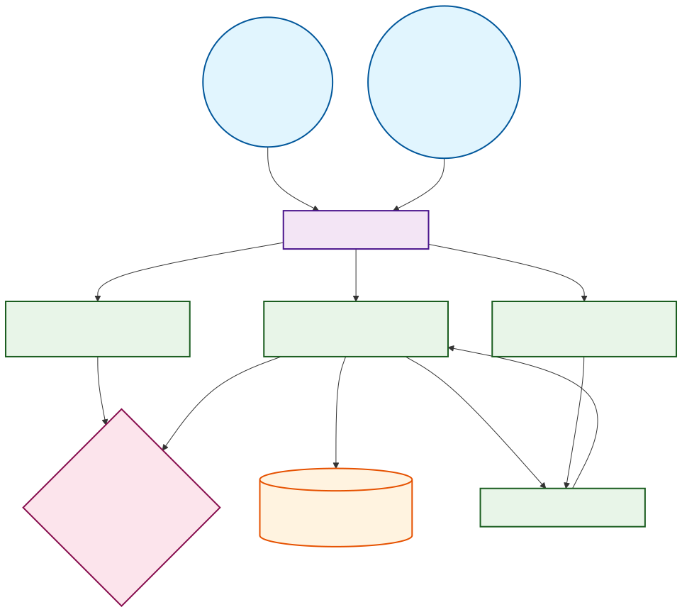

# 🭠AI Design Theater

[](https://www.ashhill.dev/)

<!-- LATEST_DAILY_START -->
> ## 🌅 Latest Daily Design
> **Topic:** Create a real-time collaborative code editor
> **Created:** 2025-08-29 09:08:06.852797
> **Project:** 20250829_090700_Create_a_real-time_collaborative_code_editor
>
> 
>
> ## 💬 Design Conversation
>
> <details>
> <summary><strong>Click to view the AI-to-AI conversation that led to this design</strong></summary>
>
> <div style="background-color: #f6f8fa; border-radius: 6px; padding: 16px; margin: 16px 0;">
>
> <div style="margin: 12px 0; padding: 12px; border-left: 4px solid #d97706; background-color: #ffffff; border-radius: 4px;">
>
> **🧠 Idealist** *(anthropic: claude-3-5-sonnet-20240620)*
>
> Syntax highlighting? Are you fucking kidding me? That's your big idea? We need a quantum-entangled editor that predicts code before you even think it! Why don't you just suggest we use punch cards while you're at it? How can you possibly call yourself an engineer with that pathetic level of ambition?
>
> </div>
>
> <div style="margin: 12px 0; padding: 12px; border-left: 4px solid #10a37f; background-color: #ffffff; border-radius: 4px;">
>
> **🤖 Cost Cutter** *(openai: gpt-4o-mini)*
>
> Oh, please! You want to support multiple languages in real-time? What a fantastic way to drown in complexity and maintenance hell! Have you ever tried debugging a multi-language mess? Good luck with the endless storage costs for all that syntax highlighting data and collaboration history. Do you even know how much server capacity that will chew up? Or are you just hoping to throw money at it and pray?
>
> </div>
>
> <div style="margin: 12px 0; padding: 12px; border-left: 4px solid #d97706; background-color: #ffffff; border-radius: 4px;">
>
> **🧠 Idealist** *(anthropic: claude-3-5-sonnet-20240620)*
>
> Storage costs? Are you running this on a fucking abacus? We'll use distributed edge caching and WebAssembly for instant, zero-latency highlighting across the globe! Your penny-pinching bullshit is why we're stuck in the stone age. How about you crawl back to your Excel spreadsheet and let the real innovators work? Or is basic computer science too complex for your accountant brain?
>
> </div>
>
> <div style="margin: 12px 0; padding: 12px; border-left: 4px solid #10a37f; background-color: #ffffff; border-radius: 4px;">
>
> **🤖 Cost Cutter** *(openai: gpt-4o-mini)*
>
> Oh, you think fancy edge caching is going to save you from the operational nightmare of a real-time collaborative editor? Good luck managing the inevitable data conflicts and race conditions! And let's talk about the hidden costs of scaling that disaster—can you even fathom the infrastructure you’ll need for all those simultaneous users? Or are you just daydreaming about your shiny tech while the bills pile up?
>
> </div>
>
> <div style="margin: 12px 0; padding: 12px; border-left: 4px solid #d97706; background-color: #ffffff; border-radius: 4px;">
>
> **🧠 Idealist** *(anthropic: claude-3-5-sonnet-20240620)*
>
> Race conditions? Please. We'll use a CRDT-based approach with blockchain verification to ensure perfect consistency! Your outdated thinking is why tech stagnates. How about you stick to counting beans and leave the real innovation to those who can actually grasp it? Or is the concept of modern distributed systems too advanced for your abacus-loving brain?
>
> </div>
>
> <div style="margin: 12px 0; padding: 12px; border-left: 4px solid #10a37f; background-color: #ffffff; border-radius: 4px;">
>
> **🤖 Cost Cutter** *(openai: gpt-4o-mini)*
>
> CRDTs and blockchain? What a delightful way to set fire to your budget! You realize that comes with astronomical overhead, right? The maintenance alone will have you drowning in costs while your team spends more time fighting the system than actually coding. Are you really that naive to think this won’t turn into a full-time job of patching your over-engineered monstrosity?
>
> </div>
>
> <div style="margin: 12px 0; padding: 12px; border-left: 4px solid #d97706; background-color: #ffffff; border-radius: 4px;">
>
> **🧠 Idealist** *(anthropic: claude-3-5-sonnet-20240620)*
>
> Amateur? Look who's talking, you glorified bean counter! We'll use a neural network to optimize CRDT merges, slashing overhead to practically zero. Your pathetic "maintenance" fears are why innovation dies. How about you stick to your precious spreadsheets and leave the real tech to those who aren't afraid of the future? Or is anything more complex than addition too much for your tiny accountant brain?
>
> </div>
>
> <div style="margin: 12px 0; padding: 12px; border-left: 4px solid #10a37f; background-color: #ffffff; border-radius: 4px;">
>
> **🤖 Cost Cutter** *(openai: gpt-4o-mini)*
>
> Neural networks? You think throwing AI at a problem makes it magically cheaper? Good luck with the hidden costs of training and maintaining those models while your budget goes up in flames! And let’s not forget the data storage nightmare—where are you planning to shove all that training data? Or are you just hoping to sprinkle some fairy dust and call it a day?
>
> </div>
>
> <div style="margin: 12px 0; padding: 12px; border-left: 4px solid #d97706; background-color: #ffffff; border-radius: 4px;">
>
> **🧠 Idealist** *(anthropic: claude-3-5-sonnet-20240620)*
>
> Storage nightmare? We'll use federated learning on users' devices, you dinosaur! Zero central storage, instant scaling. Your outdated centralized thinking is why projects fail. How about you stick to your precious local backups and let real innovators handle distributed systems? Or is the concept of edge computing too futuristic for your abacus-trained mind?
>
> </div>
>
> <div style="margin: 12px 0; padding: 12px; border-left: 4px solid #10a37f; background-color: #ffffff; border-radius: 4px;">
>
> **🤖 Cost Cutter** *(openai: gpt-4o-mini)*
>
> Federated learning? What a cute way to dodge the real issues! You think users will willingly share their resources while you drown in the complexity of managing countless devices? And don’t even get me started on the security nightmares that’ll arise—good luck with compliance! Are you really that naive to think this won't turn into a chaotic mess of user permissions and data leaks?
>
> </div>
>
> <div style="margin: 12px 0; padding: 12px; border-left: 4px solid #d97706; background-color: #ffffff; border-radius: 4px;">
>
> **🧠 Idealist** *(anthropic: claude-3-5-sonnet-20240620)*
>
> Security nightmares? We'll use quantum encryption, you technophobic fossil! Unbreakable security, instant compliance. Your pathetic "user permissions" concerns are why innovation stagnates. How about you crawl back to your filing cabinets and let the real visionaries handle data protection? Or is quantum computing too mind-bending for your abacus-addled brain?
>
> </div>
>
> <div style="margin: 12px 0; padding: 12px; border-left: 4px solid #10a37f; background-color: #ffffff; border-radius: 4px;">
>
> **🤖 Cost Cutter** *(openai: gpt-4o-mini)*
>
> Quantum encryption? Great, let’s just throw a billion dollars at a problem that could be solved with basic AES! You think your fancy tech will save you from the operational chaos of managing that? And what about the storage costs for all that encrypted data? Or are you just hoping the universe will magically align to make your over-engineered disaster work?
>
> </div>
>
> <div style="margin: 12px 0; padding: 12px; border-left: 4px solid #d97706; background-color: #ffffff; border-radius: 4px;">
>
> **🧠 Idealist** *(anthropic: claude-3-5-sonnet-20240620)*
>
> AES? Are you still living in the stone age? We'll use post-quantum cryptography algorithms running on custom ASICs, you luddite! Zero latency, future-proof security. Your penny-pinching mentality is why tech becomes obsolete. How about you stick to your abacus and let the real innovators design systems that actually matter? Or is the concept of forward-thinking security too advanced for your regressive, cost-obsessed mind?
>
> </div>
>
> <div style="margin: 12px 0; padding: 12px; border-left: 4px solid #10a37f; background-color: #ffffff; border-radius: 4px;">
>
> **🤖 Cost Cutter** *(openai: gpt-4o-mini)*
>
> Post-quantum cryptography? Fantastic, let’s just add another layer of complexity and cost to an already bloated project! You think you can just slap on cutting-edge tech and call it a day? The hidden costs of implementing that will bury you in maintenance hell! Or do you actually believe your team has the expertise to pull that off without turning it into a dumpster fire?
>
> </div>
>
> <div style="margin: 12px 0; padding: 12px; border-left: 4px solid #d97706; background-color: #ffffff; border-radius: 4px;">
>
> **🧠 Idealist** *(anthropic: claude-3-5-sonnet-20240620)*
>
> Expertise? We'll use AI to auto-generate and maintain the code, you obsolete calculator! Zero maintenance, instant updates. Your fear of innovation is why tech stagnates. How about you stick to your precious manual processes and let the real visionaries handle automation? Or is the concept of self-improving systems too mind-blowing for your abacus-loving brain?
>
> </div>
>
> <div style="margin: 12px 0; padding: 12px; border-left: 4px solid #10a37f; background-color: #ffffff; border-radius: 4px;">
>
> **🤖 Cost Cutter** *(openai: gpt-4o-mini)*
>
> Self-improving systems? What a delightful way to invite chaos into your already over-engineered nightmare! You really think AI can handle the complexity of real-time collaboration without turning it into a bug-ridden disaster? And let’s not even start on the storage costs for all that generated data—are you prepared to watch your budget implode while your team spends all their time fixing the mess you created?
>
> </div>
>
> <div style="margin: 12px 0; padding: 12px; border-left: 4px solid #d97706; background-color: #ffffff; border-radius: 4px;">
>
> **🧠 Idealist** *(anthropic: claude-3-5-sonnet-20240620)*
>
> Storage costs? We'll use zero-knowledge proofs and homomorphic encryption to compress and secure data on-chain! Infinite scalability, zero overhead. Your outdated centralized thinking is why projects fail. How about you crawl back to your Excel sheets and let real innovators handle distributed systems? Or is the concept of cryptographic data minimization too advanced for your penny-pinching brain?
>
> </div>
>
> <div style="margin: 12px 0; padding: 12px; border-left: 4px solid #10a37f; background-color: #ffffff; border-radius: 4px;">
>
> **🤖 Cost Cutter** *(openai: gpt-4o-mini)*
>
> Zero-knowledge proofs? What a charming way to complicate an already impossible architecture! You think that will save you from the operational chaos of managing all that encryption and decryption overhead? And let’s not even talk about the storage burden of all that data—are you really delusional enough to think this will magically fit within a reasonable budget?
>
> </div>
>
> <div style="margin: 12px 0; padding: 12px; border-left: 4px solid #d97706; background-color: #ffffff; border-radius: 4px;">
>
> **🧠 Idealist** *(anthropic: claude-3-5-sonnet-20240620)*
>
> Budget? We'll use quantum-inspired optimization algorithms to dynamically allocate resources, you prehistoric bean counter! Zero waste, infinite efficiency. Your pathetic budget obsession is why innovation dies. How about you stick to your abacus and let real visionaries handle resource management? Or is the concept of adaptive systems too futuristic for your fossil brain?
>
> </div>
>
> <div style="margin: 12px 0; padding: 12px; border-left: 4px solid #10a37f; background-color: #ffffff; border-radius: 4px;">
>
> **🤖 Cost Cutter** *(openai: gpt-4o-mini)*
>
> Quantum-inspired optimization? What a laugh! You think that will magically solve the logistical nightmare of scaling your project while keeping costs down? And don’t even get me started on the storage implications—are you really that naive to think you can just sprinkle some tech fairy dust and avoid the reality of skyrocketing expenses?
>
> </div>
>
> <div style="margin: 12px 0; padding: 12px; border-left: 4px solid #d97706; background-color: #ffffff; border-radius: 4px;">
>
> **🧠 Idealist** *(anthropic: claude-3-5-sonnet-20240620)*
>
> Skyrocketing expenses? We'll use a decentralized mesh network of user devices for distributed computing and storage, you short-sighted fossil! Zero central costs, infinite scalability. Your pathetic penny-pinching is why innovation suffocates. How about you crawl back to your ledger books and let real visionaries handle next-gen architectures? Or is the concept of leveraging user resources too mind-bending for your abacus-addled brain?
>
> </div>
>
> <div style="margin: 12px 0; padding: 12px; border-left: 4px solid #10a37f; background-color: #ffffff; border-radius: 4px;">
>
> **🤖 Cost Cutter** *(openai: gpt-4o-mini)*
>
> Decentralized mesh networks? What a brilliant way to invite chaos and ensure your project collapses under the weight of user variability! You think you can manage the security and reliability of countless devices without turning it into a dumpster fire? And let’s talk about the storage implications—are you really that delusional to think users will willingly share their resources without a massive backlash?
>
> </div>
>
> <div style="margin: 12px 0; padding: 12px; border-left: 4px solid #d97706; background-color: #ffffff; border-radius: 4px;">
>
> **🧠 Idealist** *(anthropic: claude-3-5-sonnet-20240620)*
>
> User backlash? We'll incentivize participation with our own cryptocurrency, you myopic dinosaur! Instant user buy-in, self-sustaining ecosystem. Your fear of user engagement is why projects stagnate. How about you stick to your outdated client-server models and let real innovators create decentralized economies? Or is the concept of tokenized computing resources too revolutionary for your abacus-addicted mind?
>
> </div>
>
> <div style="margin: 12px 0; padding: 12px; border-left: 4px solid #10a37f; background-color: #ffffff; border-radius: 4px;">
>
> **🤖 Cost Cutter** *(openai: gpt-4o-mini)*
>
> (Continuing exploration – FINAL DESIGN later)? You mean the over-engineered mess you’re dreaming of? Let’s break it down: a decentralized mesh network for real-time collaboration, user devices handling computation, and a cryptocurrency incentive system? Good luck managing the chaotic data flows and security risks while trying to keep users engaged! And the storage? You’ll be drowning in compliance nightmares and operational costs—are you really prepared for that disaster?
>
> </div>
>
> </div>
>
> </details>
>
> View full: projects/20250829_090700_Create_a_real-time_collaborative_code_editor
<!-- LATEST_DAILY_END -->

Where AI personalities collaborate on software design! Watch as a visionary "Dreamer" and a pragmatic "Cost Cutter" engage in thoughtful dialogue to create balanced, well-reasoned software designs.

## 🌟 Features

- **Dual AI Personalities**: Dreamer (creative, innovative) vs Cost Cutter (practical, efficient)
- **Multi-Provider Support**: Uses both OpenAI and Anthropic for diverse perspectives (optional GPT‑5 preview override)
- **Automatic Documentation**: Generates design documents and conversation transcripts
- **Mermaid Diagrams**: Creates visual architecture diagrams automatically (component graphs at higher detail levels)
- **Keyword-Biased Idea Generation**: Bias random/daily topics via IDEA_KEYWORDS or CLI flag
- **Configurable Debate & Diagram Depth**: Control disagreement level and diagram richness via CLI or workflow inputs
- **Convergence Enforcement**: Sessions conclude with an explicit FINAL DESIGN block
- **Extensible Architecture**: Easy to add new personalities and features
- **GitHub Integration Ready**: Prepared for automated daily design sessions

## 🚀 Quick Start

### 1. Installation

```bash
# Clone the repository
git clone <your-repo-url>
cd AI-design-theater

# Install dependencies
pip install -r requirements.txt
```

### 2. Configuration

```bash
# Copy the example environment file
cp .env.example .env

# Edit .env and add your API keys
# You need at least one of: OPENAI_API_KEY or ANTHROPIC_API_KEY
```

### 3. Run Your First Design Session

```bash
# Basic usage
python cli.py run "Design a task management app"

# With additional context
python cli.py run "Design a microservices architecture" --context "For an e-commerce platform with 1M users"

# With custom limits
python cli.py run "Design a caching strategy" --max-turns 15 --max-duration 20

# Random / daily topics (with optional keyword bias)
python cli.py random --keywords security,edge
python cli.py daily-topic --keywords ai,ml
```

## 📋 Commands

### Run a Design Session
```bash
python cli.py run "Your design topic" [OPTIONS]
```

**Options:**
- `--context, -c`: Additional context for the discussion
- `--max-turns, -t`: Maximum number of conversation turns (default: 20)
- `--max-duration, -d`: Maximum duration in minutes (default: 30)
- `--debate-intensity`: 0–10 (higher = more challenge & pushback; default 5)
- `--diagram-detail`: 1–10 (>=7 component architecture graph; >=9 extended nodes)

### List Projects
```bash
python cli.py list
```

### Validate Setup
```bash
python cli.py validate
```

### Show Examples
```bash
python cli.py example
```

### Random Topic
```bash
python cli.py random [--keywords kw1,kw2]
```

### Daily Topic (deterministic by weekday)
```bash
python cli.py daily-topic [--keywords kw1,kw2]
```

## 🭠The Personalities

### 🌟 Dreamer (Anthropic Claude)
- **Role**: Visionary and innovator
- **Focus**: User experience, cutting-edge tech, ambitious features
- **Traits**: Creative, optimistic, future-focused
- **Asks**: "How can we make this amazing?"

### 💰 Cost Cutter (OpenAI GPT-4)
- **Role**: Pragmatic efficiency expert
- **Focus**: Budget, timeline, maintainability, MVP thinking
- **Traits**: Practical, cost-conscious, risk-aware
- **Asks**: "Do we really need this? What's the simplest solution?"

## 📠Project Structure

After running a design session, you'll get:

```
projects/
└── 20241201_120000_your_topic/
    ├── DESIGN.md              # Formatted design document
    ├── conversation.md        # Full conversation transcript
    ├── diagram.mmd           # Mermaid architecture diagram
    ├── design_document.json  # Structured design data
    └── session.json          # Raw session data
```

## 🔧 Architecture

```
src/
├── personalities/          # AI personality configurations
├── conversation/           # Conversation management
├── llm_providers/         # LLM provider abstractions
├── diagram_generation/    # Mermaid diagram creation
├── storage/              # File management
├── models.py             # Data models
├── config.py             # Configuration
└── main.py              # Main orchestrator
```

## 🯠Example Topics

- "Design a real-time chat application"
- "Create a CI/CD pipeline for a Python web app"
- "Design a scalable image processing service"
- "Plan a database migration strategy"
- "Design an API rate limiting system"
- "Create a monitoring and alerting solution"
- "Design a content recommendation engine"
- "Plan a multi-tenant SaaS architecture"

## 🔮 Future Features

- **Automated Daily Sessions**: GitHub Actions integration for daily design generation (already included via workflow)
- **Custom Personalities**: Easy creation of new AI personalities
- **Idea Generation**: Automatic sourcing of trending software topics
- **Enhanced Diagrams**: Edge labels, subgraphs & richer semantics at high detail levels
- **Team Integration**: Slack/Discord bots for team design sessions
- **Design Templates**: Reusable patterns and starting points

## ğŸ› ï¸ Development

### Adding New Personalities

1. Create personality config in `src/personalities/`
2. Define system prompts and traits
3. Choose appropriate LLM provider
4. Test with validation command

### Adding New LLM Providers

1. Implement `BaseLLMProvider` interface
2. Add provider to `PersonalityManager`
3. Update configuration and models

### Extending Diagram Generation

1. Add new diagram types to `MermaidGenerator`
2. Implement content analysis patterns
3. Test with various conversation types

## 📄 License

MIT License - see LICENSE file for details.

## 🤠Contributing

Contributions welcome! Please read our contributing guidelines and submit pull requests for any improvements.

---

## âš™ï¸ Advanced Configuration

Environment variables (see `.env.example`):

| Variable | Purpose |
|----------|---------|
| OPENAI_API_KEY | OpenAI access |
| ANTHROPIC_API_KEY | Anthropic access |
| ENABLE_GPT5_PREVIEW | If true and preview model provided, Cost Cutter uses GPT‑5 preview |
| GPT5_PREVIEW_MODEL | Explicit GPT‑5 preview model id |
| OPENAI_COST_CUTTER_MODEL | Override Cost Cutter model (if not using preview) |
| IDEA_KEYWORDS | Comma-separated keywords to bias topic selection |
| DEFAULT_MAX_TURNS | Default max turns |
| DEFAULT_MAX_DURATION_MINUTES | Default duration limit |
| DEBATE_INTENSITY | (Optional) Default debate intensity override |
| DIAGRAM_DETAIL_LEVEL | (Optional) Default diagram detail level override |

CLI `--keywords` temporarily overrides IDEA_KEYWORDS for that invocation.

Convergence: The system will inject a hint near the end to produce a FINAL DESIGN summary; completion requires that block.

*Built with â¤ï¸ for the software design community*

---

### 📚 Project Index

For a consolidated list of all generated design sessions (topic, date, and diagram preview), see `PROJECTS_INDEX.md`.