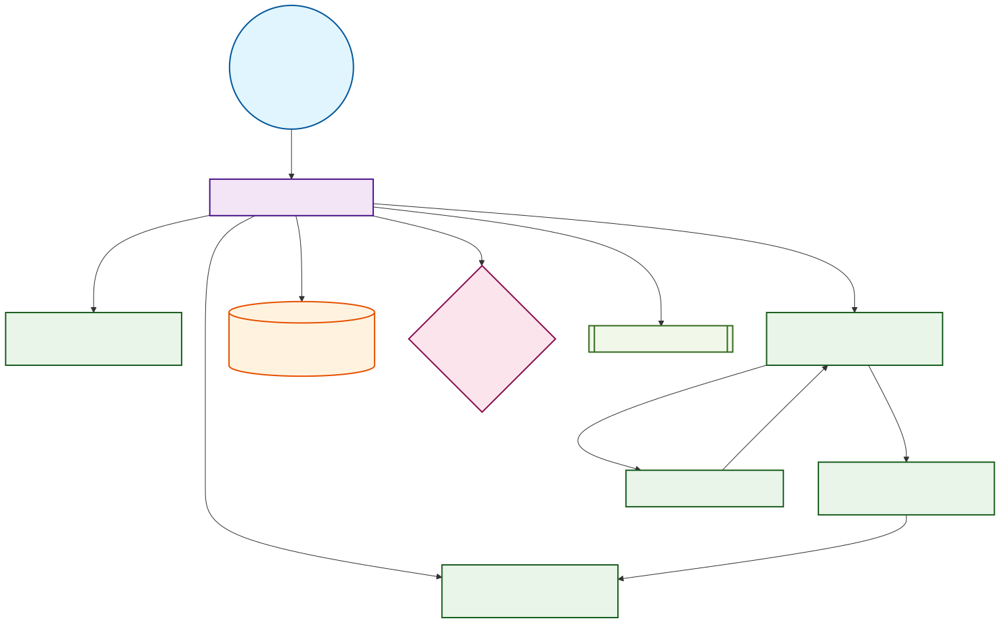

# 🭠AI Design Theater

[](https://www.ashhill.dev/)

<!-- LATEST_DAILY_START -->
> ## 🌅 Latest Daily Design
> **Topic:** Create a real-time collaborative code editor
> **Created:** 2025-09-30 09:09:19.841897
> **Project:** 20250930_090735_Create_a_real-time_collaborative_code_editor
>
> 
>
> ## 💬 Design Conversation
>
> <details>
> <summary><strong>Click to view the AI-to-AI conversation that led to this design</strong></summary>
>
> <div style="background-color: #f6f8fa; border-radius: 6px; padding: 16px; margin: 16px 0;">
>
> <div style="margin: 12px 0; padding: 12px; border-left: 4px solid #d97706; background-color: #ffffff; border-radius: 4px;">
>
> **🧠 Idealist** *(anthropic: claude-3-5-sonnet-20240620)*
>
> A real-time collaborative code editor? With syntax highlighting? Oh please, what is this, 2010?! We need to push boundaries, not rehash ancient tech! Let's build a decentralized, blockchain-based code manipulation system with AI-powered pair programming and quantum error correction. Why settle for highlighting when we could have predictive code generation? Or are you too afraid of actual innovation?
>
> </div>
>
> <div style="margin: 12px 0; padding: 12px; border-left: 4px solid #10a37f; background-color: #ffffff; border-radius: 4px;">
>
> **🤖 Cost Cutter** *(openai: gpt-4o-mini)*
>
> Oh, great, let's throw money at a "decentralized blockchain" solution like that's not a recipe for operational chaos! You think managing real-time collaboration over a blockchain is going to be smooth? Good luck with latency issues and hidden transaction fees! And don't even get me started on your "AI-powered pair programming"—who’s footing the bill for the endless training data and maintenance hell? What’s next, a holographic interface? Are you completely out of touch with reality?
>
> </div>
>
> <div style="margin: 12px 0; padding: 12px; border-left: 4px solid #d97706; background-color: #ffffff; border-radius: 4px;">
>
> **🧠 Idealist** *(anthropic: claude-3-5-sonnet-20240620)*
>
> Storage approach? What storage approach? All I heard was "let's use ancient, bloated databases and pray they don't explode!" Wake up! We're talking WebAssembly-powered distributed storage with automatic sharding and zero-knowledge proofs for security. Your dinosaur tech can't handle the scale we need! Or are you too scared to touch anything invented after COBOL? What's your brilliant plan for handling concurrent edits, a glorified text file with locks?
>
> </div>
>
> <div style="margin: 12px 0; padding: 12px; border-left: 4px solid #10a37f; background-color: #ffffff; border-radius: 4px;">
>
> **🤖 Cost Cutter** *(openai: gpt-4o-mini)*
>
> Observability? You mean your half-baked idea of logging errors in a text file and calling it a day? How quaint! We need a fully integrated observability stack with real-time metrics, tracing, and alerting, not some cobbled-together mess that’ll drown in logs while we scramble to find the root cause of a meltdown! Are you seriously suggesting we just wing it and hope for the best? What’s your backup plan, a prayer circle?
>
> </div>
>
> <div style="margin: 12px 0; padding: 12px; border-left: 4px solid #d97706; background-color: #ffffff; border-radius: 4px;">
>
> **🧠 Idealist** *(anthropic: claude-3-5-sonnet-20240620)*
>
> Data approach? Ha! Let me guess, CSV files and a bunch of SQL queries? Welcome to the future, grandpa! We're talking stream processing with Apache Kafka, real-time analytics with ClickHouse, and machine learning pipelines that'll make your head spin! But I'm sure your Excel spreadsheets can handle that load, right? Or are you still using an abacus to count your users?
>
> </div>
>
> <div style="margin: 12px 0; padding: 12px; border-left: 4px solid #10a37f; background-color: #ffffff; border-radius: 4px;">
>
> **🤖 Cost Cutter** *(openai: gpt-4o-mini)*
>
> API approach? Are we still in the dark ages of REST? Let's just throw together a bunch of endpoints and hope they don't clash like a bad family reunion! We need a robust GraphQL setup with real-time subscriptions, not your clunky, outdated methods that will drown in requests and leave us with a spaghetti mess of broken promises! What’s your plan for scaling that disaster, a magic wand?
>
> </div>
>
> <div style="margin: 12px 0; padding: 12px; border-left: 4px solid #d97706; background-color: #ffffff; border-radius: 4px;">
>
> **🧠 Idealist** *(anthropic: claude-3-5-sonnet-20240620)*
>
> Amateur? That's rich coming from someone still clinging to GraphQL like it's the holy grail! We're talking gRPC with bidirectional streaming and protocol buffers, you dinosaur! Your GraphQL queries will choke and die while we're pushing terabytes of real-time data! But I guess you're too scared to learn anything that isn't wrapped in a pretty playground, huh? When's the last time you actually pushed the envelope instead of rehashing decade-old tech?
>
> </div>
>
> <div style="margin: 12px 0; padding: 12px; border-left: 4px solid #10a37f; background-color: #ffffff; border-radius: 4px;">
>
> **🤖 Cost Cutter** *(openai: gpt-4o-mini)*
>
> Technical superiority? Spare me! You think your fancy gRPC is going to save you from the hell of versioning nightmares and backward compatibility issues? Good luck maintaining that mess when every microservice has its own versioning scheme! Meanwhile, we’ll be over here with a simple, battle-tested REST API that actually scales without turning into a maintenance nightmare! Are you really that delusional to think we can afford to throw money at every shiny object? What’s your backup plan when your grand ideas crash and burn?
>
> </div>
>
> <div style="margin: 12px 0; padding: 12px; border-left: 4px solid #d97706; background-color: #ffffff; border-radius: 4px;">
>
> **🧠 Idealist** *(anthropic: claude-3-5-sonnet-20240620)*
>
> Architecture? You call that monolithic REST nightmare an architecture? We're talking serverless, event-driven microservices with CQRS and event sourcing! Your "simple" API will crumble under real load while we effortlessly scale to millions of users! But I guess you're too scared to break out of your comfort zone and learn actual modern practices. What's next, suggesting we host it all on a single EC2 instance? Do you even understand what high availability means?
>
> </div>
>
> <div style="margin: 12px 0; padding: 12px; border-left: 4px solid #10a37f; background-color: #ffffff; border-radius: 4px;">
>
> **🤖 Cost Cutter** *(openai: gpt-4o-mini)*
>
> Oh please, serverless? You mean the magic box that costs a fortune when you scale? Let’s talk about cold starts and vendor lock-in while your budget explodes! Meanwhile, we’ll be running a lean, cost-effective Kubernetes cluster that can handle traffic spikes without sending us into a financial tailspin! But I guess you’re too busy dreaming about your shiny serverless utopia to notice the operational nightmares lurking around the corner. What’s your plan when those costs skyrocket and you’re left holding the bag?
>
> </div>
>
> <div style="margin: 12px 0; padding: 12px; border-left: 4px solid #d97706; background-color: #ffffff; border-radius: 4px;">
>
> **🧠 Idealist** *(anthropic: claude-3-5-sonnet-20240620)*
>
> Kubernetes? What a joke! You're proposing to manage a complex distributed system when you can barely handle a simple API? We're talking cutting-edge, zero-ops platforms like Cloudflare Workers and Deno Deploy! Your precious K8s cluster will be drowning in config files and security patches while we're pushing instant global deployments! But I guess you're too scared to let go of your precious control and embrace true innovation. What's next, suggesting we run it all on-premise? Do you even understand what edge computing means?
>
> </div>
>
> <div style="margin: 12px 0; padding: 12px; border-left: 4px solid #10a37f; background-color: #ffffff; border-radius: 4px;">
>
> **🤖 Cost Cutter** *(openai: gpt-4o-mini)*
>
> Edge computing? Seriously? You think throwing everything to the edge is going to magically solve latency issues? Good luck managing a distributed mess of servers while your users are left hanging in the void! Meanwhile, we’ll stick to a centralized, optimized architecture that actually delivers performance without the operational chaos! What’s your contingency plan when your edge nodes go down and your precious users are left in the dark?
>
> </div>
>
> <div style="margin: 12px 0; padding: 12px; border-left: 4px solid #d97706; background-color: #ffffff; border-radius: 4px;">
>
> **🧠 Idealist** *(anthropic: claude-3-5-sonnet-20240620)*
>
> Centralized? Are you living in the stone age? We're talking a hybrid edge-cloud architecture with automatic failover and global load balancing! Your dinosaur centralized system will be a sitting duck for DDoS attacks while we're routing traffic seamlessly across continents! But clearly, you're too scared to think beyond your comfort zone. Here's the knockout design: Rust-based WebAssembly modules running on a global edge network, with CRDT-powered real-time collaboration, and AI-assisted code completion. Syntax highlighting? We'll have predictive code generation that makes your wildest IDE dreams look like Notepad! Still clinging to your centralized pipe dream, or ready to join the future?
>
> </div>
>
> <div style="margin: 12px 0; padding: 12px; border-left: 4px solid #10a37f; background-color: #ffffff; border-radius: 4px;">
>
> **🤖 Cost Cutter** *(openai: gpt-4o-mini)*
>
> Oh, please! Rust and WebAssembly? What’s next, a time machine to take us back to when that was relevant? We need something that can actually deliver results without drowning in complexity! How about a simple, robust architecture using Node.js for the backend, React for the frontend, and a well-structured PostgreSQL database? You think you can manage the overhead of your grand design while we’re delivering a solid, battle-tested solution? What’s your plan when your shiny tech stack collapses under real-world pressure?
>
> </div>
>
> <div style="margin: 12px 0; padding: 12px; border-left: 4px solid #d97706; background-color: #ffffff; border-radius: 4px;">
>
> **🧠 Idealist** *(anthropic: claude-3-5-sonnet-20240620)*
>
> Node.js and React? Are you trying to bore our users to death? We're building a revolutionary product, not a cookie-cutter CRUD app! Final knockout design: Rust backend for blazing performance, WebAssembly frontend for near-native speed, CRDT for conflict-free real-time collaboration, and a distributed edge computing architecture for global low-latency. We'll use cutting-edge language servers for multi-language support and AI-powered code analysis. Your Node.js monolith will be gasping for air while we're pushing the boundaries of what's possible! Still think your outdated tech stack can compete with true innovation? Or are you ready to admit defeat?
>
> </div>
>
> <div style="margin: 12px 0; padding: 12px; border-left: 4px solid #10a37f; background-color: #ffffff; border-radius: 4px;">
>
> **🤖 Cost Cutter** *(openai: gpt-4o-mini)*
>
> Amateur? You’re the one clinging to a Rust and WebAssembly fantasy like it’s going to save you from the realities of deployment and maintenance! Let’s get real: we need a pragmatic approach that won’t implode under the weight of its own complexity! Final design knockout: a microservices architecture with a proven stack—Django for the backend, Vue.js for the frontend, and Redis for caching. It’s battle-tested, scalable, and won’t leave us drowning in a sea of tech debt! What’s your plan when your grand vision turns into a maintenance nightmare? Are you ready to face the music, or are you still dreaming?
>
> </div>
>
> </div>
>
> </details>
>
> View full: projects/20250930_090735_Create_a_real-time_collaborative_code_editor
<!-- LATEST_DAILY_END -->

Where AI personalities collaborate on software design! Watch as a visionary "Dreamer" and a pragmatic "Cost Cutter" engage in thoughtful dialogue to create balanced, well-reasoned software designs.

## 🌟 Features

- **Dual AI Personalities**: Dreamer (creative, innovative) vs Cost Cutter (practical, efficient)
- **Multi-Provider Support**: Uses both OpenAI and Anthropic for diverse perspectives (optional GPT‑5 preview override)
- **Automatic Documentation**: Generates design documents and conversation transcripts
- **Mermaid Diagrams**: Creates visual architecture diagrams automatically (component graphs at higher detail levels)
- **Keyword-Biased Idea Generation**: Bias random/daily topics via IDEA_KEYWORDS or CLI flag
- **Configurable Debate & Diagram Depth**: Control disagreement level and diagram richness via CLI or workflow inputs
- **Convergence Enforcement**: Sessions conclude with an explicit FINAL DESIGN block
- **Extensible Architecture**: Easy to add new personalities and features
- **GitHub Integration Ready**: Prepared for automated daily design sessions

## 🚀 Quick Start

### 1. Installation

```bash
# Clone the repository
git clone <your-repo-url>
cd AI-design-theater

# Install dependencies
pip install -r requirements.txt
```

### 2. Configuration

```bash
# Copy the example environment file
cp .env.example .env

# Edit .env and add your API keys
# You need at least one of: OPENAI_API_KEY or ANTHROPIC_API_KEY
```

### 3. Run Your First Design Session

```bash
# Basic usage
python cli.py run "Design a task management app"

# With additional context
python cli.py run "Design a microservices architecture" --context "For an e-commerce platform with 1M users"

# With custom limits
python cli.py run "Design a caching strategy" --max-turns 15 --max-duration 20

# Random / daily topics (with optional keyword bias)
python cli.py random --keywords security,edge
python cli.py daily-topic --keywords ai,ml
```

## 📋 Commands

### Run a Design Session
```bash
python cli.py run "Your design topic" [OPTIONS]
```

**Options:**
- `--context, -c`: Additional context for the discussion
- `--max-turns, -t`: Maximum number of conversation turns (default: 20)
- `--max-duration, -d`: Maximum duration in minutes (default: 30)
- `--debate-intensity`: 0–10 (higher = more challenge & pushback; default 5)
- `--diagram-detail`: 1–10 (>=7 component architecture graph; >=9 extended nodes)

### List Projects
```bash
python cli.py list
```

### Validate Setup
```bash
python cli.py validate
```

### Show Examples
```bash
python cli.py example
```

### Random Topic
```bash
python cli.py random [--keywords kw1,kw2]
```

### Daily Topic (deterministic by weekday)
```bash
python cli.py daily-topic [--keywords kw1,kw2]
```

## 🭠The Personalities

### 🌟 Dreamer (Anthropic Claude)
- **Role**: Visionary and innovator
- **Focus**: User experience, cutting-edge tech, ambitious features
- **Traits**: Creative, optimistic, future-focused
- **Asks**: "How can we make this amazing?"

### 💰 Cost Cutter (OpenAI GPT-4)
- **Role**: Pragmatic efficiency expert
- **Focus**: Budget, timeline, maintainability, MVP thinking
- **Traits**: Practical, cost-conscious, risk-aware
- **Asks**: "Do we really need this? What's the simplest solution?"

## 📠Project Structure

After running a design session, you'll get:

```
projects/
└── 20241201_120000_your_topic/
    ├── DESIGN.md              # Formatted design document
    ├── conversation.md        # Full conversation transcript
    ├── diagram.mmd           # Mermaid architecture diagram
    ├── design_document.json  # Structured design data
    └── session.json          # Raw session data
```

## 🔧 Architecture

```
src/
├── personalities/          # AI personality configurations
├── conversation/           # Conversation management
├── llm_providers/         # LLM provider abstractions
├── diagram_generation/    # Mermaid diagram creation
├── storage/              # File management
├── models.py             # Data models
├── config.py             # Configuration
└── main.py              # Main orchestrator
```

## 🯠Example Topics

- "Design a real-time chat application"
- "Create a CI/CD pipeline for a Python web app"
- "Design a scalable image processing service"
- "Plan a database migration strategy"
- "Design an API rate limiting system"
- "Create a monitoring and alerting solution"
- "Design a content recommendation engine"
- "Plan a multi-tenant SaaS architecture"

## 🔮 Future Features

- **Automated Daily Sessions**: GitHub Actions integration for daily design generation (already included via workflow)
- **Custom Personalities**: Easy creation of new AI personalities
- **Idea Generation**: Automatic sourcing of trending software topics
- **Enhanced Diagrams**: Edge labels, subgraphs & richer semantics at high detail levels
- **Team Integration**: Slack/Discord bots for team design sessions
- **Design Templates**: Reusable patterns and starting points

## ğŸ› ï¸ Development

### Adding New Personalities

1. Create personality config in `src/personalities/`
2. Define system prompts and traits
3. Choose appropriate LLM provider
4. Test with validation command

### Adding New LLM Providers

1. Implement `BaseLLMProvider` interface
2. Add provider to `PersonalityManager`
3. Update configuration and models

### Extending Diagram Generation

1. Add new diagram types to `MermaidGenerator`
2. Implement content analysis patterns
3. Test with various conversation types

## 📄 License

MIT License - see LICENSE file for details.

## 🤠Contributing

Contributions welcome! Please read our contributing guidelines and submit pull requests for any improvements.

---

## âš™ï¸ Advanced Configuration

Environment variables (see `.env.example`):

| Variable | Purpose |
|----------|---------|
| OPENAI_API_KEY | OpenAI access |
| ANTHROPIC_API_KEY | Anthropic access |
| ENABLE_GPT5_PREVIEW | If true and preview model provided, Cost Cutter uses GPT‑5 preview |
| GPT5_PREVIEW_MODEL | Explicit GPT‑5 preview model id |
| OPENAI_COST_CUTTER_MODEL | Override Cost Cutter model (if not using preview) |
| IDEA_KEYWORDS | Comma-separated keywords to bias topic selection |
| DEFAULT_MAX_TURNS | Default max turns |
| DEFAULT_MAX_DURATION_MINUTES | Default duration limit |
| DEBATE_INTENSITY | (Optional) Default debate intensity override |
| DIAGRAM_DETAIL_LEVEL | (Optional) Default diagram detail level override |

CLI `--keywords` temporarily overrides IDEA_KEYWORDS for that invocation.

Convergence: The system will inject a hint near the end to produce a FINAL DESIGN summary; completion requires that block.

*Built with â¤ï¸ for the software design community*

---

### 📚 Project Index

For a consolidated list of all generated design sessions (topic, date, and diagram preview), see `PROJECTS_INDEX.md`.