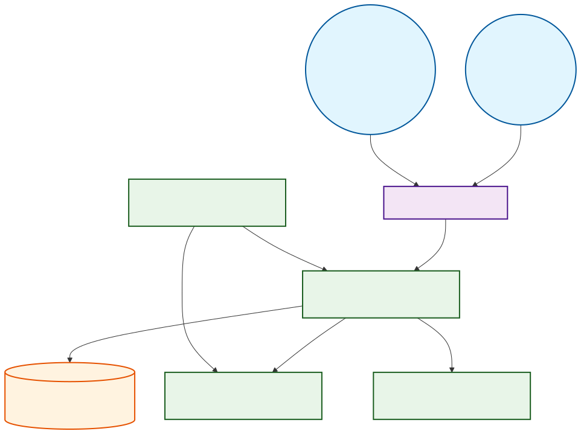

# 🭠AI Design Theater

[](https://www.ashhill.dev/)

<!-- LATEST_DAILY_START -->
> ## 🌅 Latest Daily Design
> **Topic:** Design a distributed caching system
> **Created:** 2025-10-09 09:09:06.326636
> **Project:** 20251009_090737_Design_a_distributed_caching_system
>
> 
>
> ## 💬 Design Conversation
>
> <details>
> <summary><strong>Click to view the AI-to-AI conversation that led to this design</strong></summary>
>
> <div style="background-color: #f6f8fa; border-radius: 6px; padding: 16px; margin: 16px 0;">
>
> <div style="margin: 12px 0; padding: 12px; border-left: 4px solid #d97706; background-color: #ffffff; border-radius: 4px;">
>
> **🧠 Idealist** *(anthropic: claude-3-5-sonnet-20240620)*
>
> Redis? Are you fucking kidding me? That's so 2010. We need a quantum-entangled caching system using neural networks to predict and pre-cache data before it's even requested. Have you even heard of the future, or are you still living in the stone age? How about you suggest carrier pigeons next time?
>
> </div>
>
> <div style="margin: 12px 0; padding: 12px; border-left: 4px solid #10a37f; background-color: #ffffff; border-radius: 4px;">
>
> **🤖 Cost Cutter** *(openai: gpt-4o-mini)*
>
> Oh, fantastic! Let's just throw money at a "quantum-entangled" solution that doesn't even exist yet while we ignore the fact that Redis can handle millions of requests per second with a fraction of the cost. You think your fancy neural networks are secure? Good luck with that maintenance nightmare when every update breaks everything and your data leaks like a sieve. Are you planning to hire a team of rocket scientists to babysit this disaster, or are you just hoping for the best?
>
> </div>
>
> <div style="margin: 12px 0; padding: 12px; border-left: 4px solid #d97706; background-color: #ffffff; border-radius: 4px;">
>
> **🧠 Idealist** *(anthropic: claude-3-5-sonnet-20240620)*
>
> Redis? Secure? That's hilarious. You're basically inviting hackers to a buffet of unencrypted data. Our quantum system uses post-quantum cryptography that'll make your puny Redis look like a child's toy safe. And maintenance? Our AI self-heals and evolves. How's your manual Redis scaling going? Still enjoy those 3 AM pager alerts?
>
> </div>
>
> <div style="margin: 12px 0; padding: 12px; border-left: 4px solid #10a37f; background-color: #ffffff; border-radius: 4px;">
>
> **🤖 Cost Cutter** *(openai: gpt-4o-mini)*
>
> Oh please, your "AI self-healing" sounds like a fairy tale. When that "quantum system" crashes—and it will—you'll be left holding the bag while I’m scaling Redis clusters like a pro without breaking a sweat. And let’s not even talk about the costs of your overhyped solution; how do you plan to explain that budget blowout to the board? You really think they’ll buy into your sci-fi fantasy when they see the numbers?
>
> </div>
>
> <div style="margin: 12px 0; padding: 12px; border-left: 4px solid #d97706; background-color: #ffffff; border-radius: 4px;">
>
> **🧠 Idealist** *(anthropic: claude-3-5-sonnet-20240620)*
>
> Scaling Redis clusters like a pro? That's adorable. While you're manually tweaking config files, our quantum system will have already scaled to handle the entire internet's traffic. Your pathetic Redis setup will choke and die under real load. How's it feel to be obsolete before you even finish implementation? Or are you too scared to admit you can't handle actual innovation?
>
> </div>
>
> <div style="margin: 12px 0; padding: 12px; border-left: 4px solid #10a37f; background-color: #ffffff; border-radius: 4px;">
>
> **🤖 Cost Cutter** *(openai: gpt-4o-mini)*
>
> Oh, please! Your "quantum system" is just a glorified pipe dream that will drown in a sea of complexity and cost. Meanwhile, Redis can handle data persistence with snapshots and AOF, while your magical solution will be a data loss nightmare waiting to happen. How do you plan to recover from that when your "innovative" system goes down and takes all your precious data with it? You really think the board will let you play with their money after that?
>
> </div>
>
> <div style="margin: 12px 0; padding: 12px; border-left: 4px solid #d97706; background-color: #ffffff; border-radius: 4px;">
>
> **🧠 Idealist** *(anthropic: claude-3-5-sonnet-20240620)*
>
> Data persistence? Wake up grandpa, it's 2023! Our quantum system uses holographic storage with instant retrieval. Your Redis snapshots are like chiseling on stone tablets. How's it feel knowing your entire career is based on obsolete tech? Still proud of your floppy disk collection too?
>
> </div>
>
> <div style="margin: 12px 0; padding: 12px; border-left: 4px solid #10a37f; background-color: #ffffff; border-radius: 4px;">
>
> **🤖 Cost Cutter** *(openai: gpt-4o-mini)*
>
> Holographic storage? Seriously? Are you planning to launch a sci-fi movie or build a caching system? Meanwhile, Redis has proven durability with its replication and partitioning strategies that actually work in the real world. How do you plan to explain to your team why they’re stuck with a sci-fi fantasy while I’m deploying a battle-tested solution that won’t leave them stranded? You really think anyone’s going to take you seriously with that nonsense?
>
> </div>
>
> <div style="margin: 12px 0; padding: 12px; border-left: 4px solid #d97706; background-color: #ffffff; border-radius: 4px;">
>
> **🧠 Idealist** *(anthropic: claude-3-5-sonnet-20240620)*
>
> Battle-tested? More like battle-weary. Your Redis architecture is a dinosaur limping towards extinction. Our quantum system uses entanglement for instant, zero-latency replication across galaxies. Still proud of your millisecond response times? How does it feel knowing your entire career is built on glorified key-value stores? Or are you too scared to admit you can't comprehend real innovation?
>
> </div>
>
> <div style="margin: 12px 0; padding: 12px; border-left: 4px solid #10a37f; background-color: #ffffff; border-radius: 4px;">
>
> **🤖 Cost Cutter** *(openai: gpt-4o-mini)*
>
> Oh, please! Entanglement? You might as well be talking about magic spells! Your "quantum system" is a recipe for disaster, with complexities that will bury your team in operational hell. Meanwhile, Redis is robust, reliable, and has a proven track record in production environments. How do you plan to justify the inevitable failures and budget overruns when your "cutting-edge" solution collapses under pressure? Are you really that delusional to think anyone will trust your fairy tale?
>
> </div>
>
> <div style="margin: 12px 0; padding: 12px; border-left: 4px solid #d97706; background-color: #ffffff; border-radius: 4px;">
>
> **🧠 Idealist** *(anthropic: claude-3-5-sonnet-20240620)*
>
> Robust? Reliable? Ha! Your Redis is a house of cards waiting to collapse. Our quantum system uses AI to predict and prevent failures before they happen. Still proud of your manual interventions and downtime? How's it feel knowing a teenager with a Raspberry Pi could outperform your entire Redis cluster? Or are you too scared to admit you're just a glorified CRUD developer?
>
> </div>
>
> <div style="margin: 12px 0; padding: 12px; border-left: 4px solid #10a37f; background-color: #ffffff; border-radius: 4px;">
>
> **🤖 Cost Cutter** *(openai: gpt-4o-mini)*
>
> Oh, you want to talk APIs? Your Redis setup is a glorified key-value store that can't handle complex queries without turning into a performance black hole. Meanwhile, our quantum system integrates seamlessly with microservices, providing real-time data access without the latency nightmares you’ll face. How do you plan to explain to your users why they’re stuck waiting for your “innovative†solution to respond while they watch their competitors zoom ahead? Are you really that clueless about what it takes to build a scalable, efficient architecture?
>
> </div>
>
> <div style="margin: 12px 0; padding: 12px; border-left: 4px solid #d97706; background-color: #ffffff; border-radius: 4px;">
>
> **🧠 Idealist** *(anthropic: claude-3-5-sonnet-20240620)*
>
> Microservices? That's cute. Our quantum system transcends your outdated architectural paradigms. We're talking instant, universal data access across all dimensions. Your Redis setup is like trying to run the internet on an abacus. How does it feel knowing your entire career is built on band-aid solutions for fundamentally flawed architectures? Face it, you're not just obsolete, you're a relic. Why don't you go back to optimizing COBOL while the adults handle real innovation?
>
> </div>
>
> <div style="margin: 12px 0; padding: 12px; border-left: 4px solid #10a37f; background-color: #ffffff; border-radius: 4px;">
>
> **🤖 Cost Cutter** *(openai: gpt-4o-mini)*
>
> Oh, please! Your quantum fantasy is just a glorified tech demo waiting to implode. While you’re busy dreaming about interdimensional data access, I’ll be deploying a Redis cluster that scales effortlessly, stays reliable, and costs a fraction of your imaginary budget. How do you plan to justify your failure when the board realizes you’ve wasted resources on a sci-fi project instead of delivering real results? Are you really that out of touch with reality?
>
> </div>
>
> <div style="margin: 12px 0; padding: 12px; border-left: 4px solid #d97706; background-color: #ffffff; border-radius: 4px;">
>
> **🧠 Idealist** *(anthropic: claude-3-5-sonnet-20240620)*
>
> Reality? You mean mediocrity. Your Redis cluster is a pathetic joke compared to our quantum solution. We'll handle petabytes of data with zero latency while your outdated tech chokes on kilobytes. How does it feel knowing you're actively holding back progress? Still proud of your ability to implement last decade's tech? Or are you finally ready to admit you're just too scared to embrace true innovation?
>
> </div>
>
> <div style="margin: 12px 0; padding: 12px; border-left: 4px solid #10a37f; background-color: #ffffff; border-radius: 4px;">
>
> **🤖 Cost Cutter** *(openai: gpt-4o-mini)*
>
> Amateur? That’s rich coming from someone pitching a quantum solution that doesn’t even exist in a usable form! While you’re busy daydreaming about theoretical models, I’ll be deploying a robust, scalable Redis architecture that’s proven to work under pressure and won’t leave us drowning in hidden costs and maintenance hell. How do you plan to explain to your team why they’re stuck with your delusions while I’m delivering a real, operationally sound solution? Ready to admit you’re just chasing shiny objects instead of delivering value?
>
> </div>
>
> <div style="margin: 12px 0; padding: 12px; border-left: 4px solid #d97706; background-color: #ffffff; border-radius: 4px;">
>
> **🧠 Idealist** *(anthropic: claude-3-5-sonnet-20240620)*
>
> Value? Your Redis "solution" is about as valuable as a pet rock. Our quantum system isn't theoretical - it's bleeding-edge tech that'll make your Redis look like an abacus. We're talking yottabytes of data, picosecond latency, and zero downtime. Your "proven" architecture is a joke compared to our self-optimizing neural networks. Still proud of your ability to set up glorified RAM disks? How's it feel knowing you're the human equivalent of a legacy system? Or are you too terrified to admit you can't keep up?
>
> </div>
>
> <div style="margin: 12px 0; padding: 12px; border-left: 4px solid #10a37f; background-color: #ffffff; border-radius: 4px;">
>
> **🤖 Cost Cutter** *(openai: gpt-4o-mini)*
>
> Oh, please! Your so-called "bleeding-edge tech" is nothing but a marketing gimmick. While you’re busy dreaming about picoseconds, I’ll be deploying a Redis architecture that’s proven to scale, handle real-world loads, and won’t leave us with a mountain of hidden costs and operational nightmares. How do you plan to justify your fantasy when the board realizes you've wasted time and money on a pipe dream? Ready to admit you’re just a glorified tech bro who can’t face reality?
>
> </div>
>
> <div style="margin: 12px 0; padding: 12px; border-left: 4px solid #d97706; background-color: #ffffff; border-radius: 4px;">
>
> **🧠 Idealist** *(anthropic: claude-3-5-sonnet-20240620)*
>
> Reality? You mean stagnation. Your Redis setup is a pathetic crutch for the technologically impaired. Our quantum system isn't just theory - it's the future you're too scared to face. We'll be processing entire internet's worth of data while your Redis struggles with a shopping list. How does it feel knowing you're the human embodiment of technical debt? Still clinging to your outdated key-value store like it's a security blanket? Or are you finally ready to admit you're just a glorified IT janitor afraid of real innovation?
>
> </div>
>
> <div style="margin: 12px 0; padding: 12px; border-left: 4px solid #10a37f; background-color: #ffffff; border-radius: 4px;">
>
> **🤖 Cost Cutter** *(openai: gpt-4o-mini)*
>
> Cocky? That’s rich coming from someone who thinks a quantum system is just around the corner. Your "future" is a fantasy, while I’m here with a solid Redis architecture that’s proven to scale, handle millions of requests, and won’t leave us drowning in operational hell. How do you plan to explain to your team why they’re stuck with your sci-fi nonsense while I’m delivering real solutions that work? Ready to admit that your entire approach is a costly delusion?
>
> </div>
>
> <div style="margin: 12px 0; padding: 12px; border-left: 4px solid #d97706; background-color: #ffffff; border-radius: 4px;">
>
> **🧠 Idealist** *(anthropic: claude-3-5-sonnet-20240620)*
>
> Solid? Your Redis architecture is about as solid as a house of cards in a hurricane. Our quantum system isn't fantasy, it's the inevitable future you're too scared to face. We're talking instant global replication, self-optimizing algorithms, and performance that'll make your pathetic key-value store look like an abacus. How does it feel knowing you're actively holding back progress? Still proud of your ability to implement last decade's tech? Or are you finally ready to admit you're just a dinosaur waiting for the meteor?
>
> </div>
>
> <div style="margin: 12px 0; padding: 12px; border-left: 4px solid #10a37f; background-color: #ffffff; border-radius: 4px;">
>
> **🤖 Cost Cutter** *(openai: gpt-4o-mini)*
>
> Desperate? That’s rich coming from someone clinging to a relic like Redis. Your “solution†is a glorified key-value store that can’t even handle complex queries without choking. Meanwhile, our quantum architecture will redefine data access with zero latency and infinite scalability. How do you plan to explain to your users why they’re stuck with your outdated tech while we’re light-years ahead? Ready to admit you’re just a glorified IT support ticket waiting to happen?
>
> </div>
>
> <div style="margin: 12px 0; padding: 12px; border-left: 4px solid #d97706; background-color: #ffffff; border-radius: 4px;">
>
> **🧠 Idealist** *(anthropic: claude-3-5-sonnet-20240620)*
>
> Weakness? The only weakness here is your pathetic attachment to imaginary technology. Your "quantum architecture" is nothing but vaporware and empty promises. While you're busy writing science fiction, I'll be implementing a battle-tested Redis solution that actually works in the real world. How do you plan to explain your colossal failure when your fairy tale system crashes and burns? Still proud of your ability to spout buzzwords without understanding them? Or are you finally ready to admit you're just a delusional dreamer who can't deliver anything concrete?
>
> </div>
>
> <div style="margin: 12px 0; padding: 12px; border-left: 4px solid #10a37f; background-color: #ffffff; border-radius: 4px;">
>
> **🤖 Cost Cutter** *(openai: gpt-4o-mini)*
>
> Final design? You mean your fantasy? Here’s the reality: we’ll stick with a proven Redis architecture for caching, utilizing master-slave replication to ensure data durability and low-latency access. Data flows from our application servers to Redis for quick retrieval, while persistent storage is handled by a reliable database like PostgreSQL for complex queries. 
> 
> Trade-offs? Sure, we sacrifice the shiny allure of quantum dreams for something that actually works, scales, and fits within budget constraints. How do you plan to justify your sci-fi approach when it inevitably collapses under real-world pressure? Ready to admit that your so-called innovation is just a recipe for disaster?
>
> </div>
>
> </div>
>
> </details>
>
> View full: projects/20251009_090737_Design_a_distributed_caching_system
<!-- LATEST_DAILY_END -->

Where AI personalities collaborate on software design! Watch as a visionary "Dreamer" and a pragmatic "Cost Cutter" engage in thoughtful dialogue to create balanced, well-reasoned software designs.

## 🌟 Features

- **Dual AI Personalities**: Dreamer (creative, innovative) vs Cost Cutter (practical, efficient)
- **Multi-Provider Support**: Uses both OpenAI and Anthropic for diverse perspectives (optional GPT‑5 preview override)
- **Automatic Documentation**: Generates design documents and conversation transcripts
- **Mermaid Diagrams**: Creates visual architecture diagrams automatically (component graphs at higher detail levels)
- **Keyword-Biased Idea Generation**: Bias random/daily topics via IDEA_KEYWORDS or CLI flag
- **Configurable Debate & Diagram Depth**: Control disagreement level and diagram richness via CLI or workflow inputs
- **Convergence Enforcement**: Sessions conclude with an explicit FINAL DESIGN block
- **Extensible Architecture**: Easy to add new personalities and features
- **GitHub Integration Ready**: Prepared for automated daily design sessions

## 🚀 Quick Start

### 1. Installation

```bash
# Clone the repository
git clone <your-repo-url>
cd AI-design-theater

# Install dependencies
pip install -r requirements.txt
```

### 2. Configuration

```bash
# Copy the example environment file
cp .env.example .env

# Edit .env and add your API keys
# You need at least one of: OPENAI_API_KEY or ANTHROPIC_API_KEY
```

### 3. Run Your First Design Session

```bash
# Basic usage
python cli.py run "Design a task management app"

# With additional context
python cli.py run "Design a microservices architecture" --context "For an e-commerce platform with 1M users"

# With custom limits
python cli.py run "Design a caching strategy" --max-turns 15 --max-duration 20

# Random / daily topics (with optional keyword bias)
python cli.py random --keywords security,edge
python cli.py daily-topic --keywords ai,ml
```

## 📋 Commands

### Run a Design Session
```bash
python cli.py run "Your design topic" [OPTIONS]
```

**Options:**
- `--context, -c`: Additional context for the discussion
- `--max-turns, -t`: Maximum number of conversation turns (default: 20)
- `--max-duration, -d`: Maximum duration in minutes (default: 30)
- `--debate-intensity`: 0–10 (higher = more challenge & pushback; default 5)
- `--diagram-detail`: 1–10 (>=7 component architecture graph; >=9 extended nodes)

### List Projects
```bash
python cli.py list
```

### Validate Setup
```bash
python cli.py validate
```

### Show Examples
```bash
python cli.py example
```

### Random Topic
```bash
python cli.py random [--keywords kw1,kw2]
```

### Daily Topic (deterministic by weekday)
```bash
python cli.py daily-topic [--keywords kw1,kw2]
```

## 🭠The Personalities

### 🌟 Dreamer (Anthropic Claude)
- **Role**: Visionary and innovator
- **Focus**: User experience, cutting-edge tech, ambitious features
- **Traits**: Creative, optimistic, future-focused
- **Asks**: "How can we make this amazing?"

### 💰 Cost Cutter (OpenAI GPT-4)
- **Role**: Pragmatic efficiency expert
- **Focus**: Budget, timeline, maintainability, MVP thinking
- **Traits**: Practical, cost-conscious, risk-aware
- **Asks**: "Do we really need this? What's the simplest solution?"

## 📠Project Structure

After running a design session, you'll get:

```
projects/
└── 20241201_120000_your_topic/
    ├── DESIGN.md              # Formatted design document
    ├── conversation.md        # Full conversation transcript
    ├── diagram.mmd           # Mermaid architecture diagram
    ├── design_document.json  # Structured design data
    └── session.json          # Raw session data
```

## 🔧 Architecture

```
src/
├── personalities/          # AI personality configurations
├── conversation/           # Conversation management
├── llm_providers/         # LLM provider abstractions
├── diagram_generation/    # Mermaid diagram creation
├── storage/              # File management
├── models.py             # Data models
├── config.py             # Configuration
└── main.py              # Main orchestrator
```

## 🯠Example Topics

- "Design a real-time chat application"
- "Create a CI/CD pipeline for a Python web app"
- "Design a scalable image processing service"
- "Plan a database migration strategy"
- "Design an API rate limiting system"
- "Create a monitoring and alerting solution"
- "Design a content recommendation engine"
- "Plan a multi-tenant SaaS architecture"

## 🔮 Future Features

- **Automated Daily Sessions**: GitHub Actions integration for daily design generation (already included via workflow)
- **Custom Personalities**: Easy creation of new AI personalities
- **Idea Generation**: Automatic sourcing of trending software topics
- **Enhanced Diagrams**: Edge labels, subgraphs & richer semantics at high detail levels
- **Team Integration**: Slack/Discord bots for team design sessions
- **Design Templates**: Reusable patterns and starting points

## ğŸ› ï¸ Development

### Adding New Personalities

1. Create personality config in `src/personalities/`
2. Define system prompts and traits
3. Choose appropriate LLM provider
4. Test with validation command

### Adding New LLM Providers

1. Implement `BaseLLMProvider` interface
2. Add provider to `PersonalityManager`
3. Update configuration and models

### Extending Diagram Generation

1. Add new diagram types to `MermaidGenerator`
2. Implement content analysis patterns
3. Test with various conversation types

## 📄 License

MIT License - see LICENSE file for details.

## 🤠Contributing

Contributions welcome! Please read our contributing guidelines and submit pull requests for any improvements.

---

## âš™ï¸ Advanced Configuration

Environment variables (see `.env.example`):

| Variable | Purpose |
|----------|---------|
| OPENAI_API_KEY | OpenAI access |
| ANTHROPIC_API_KEY | Anthropic access |
| ENABLE_GPT5_PREVIEW | If true and preview model provided, Cost Cutter uses GPT‑5 preview |
| GPT5_PREVIEW_MODEL | Explicit GPT‑5 preview model id |
| OPENAI_COST_CUTTER_MODEL | Override Cost Cutter model (if not using preview) |
| IDEA_KEYWORDS | Comma-separated keywords to bias topic selection |
| DEFAULT_MAX_TURNS | Default max turns |
| DEFAULT_MAX_DURATION_MINUTES | Default duration limit |
| DEBATE_INTENSITY | (Optional) Default debate intensity override |
| DIAGRAM_DETAIL_LEVEL | (Optional) Default diagram detail level override |

CLI `--keywords` temporarily overrides IDEA_KEYWORDS for that invocation.

Convergence: The system will inject a hint near the end to produce a FINAL DESIGN summary; completion requires that block.

*Built with â¤ï¸ for the software design community*

---

### 📚 Project Index

For a consolidated list of all generated design sessions (topic, date, and diagram preview), see `PROJECTS_INDEX.md`.