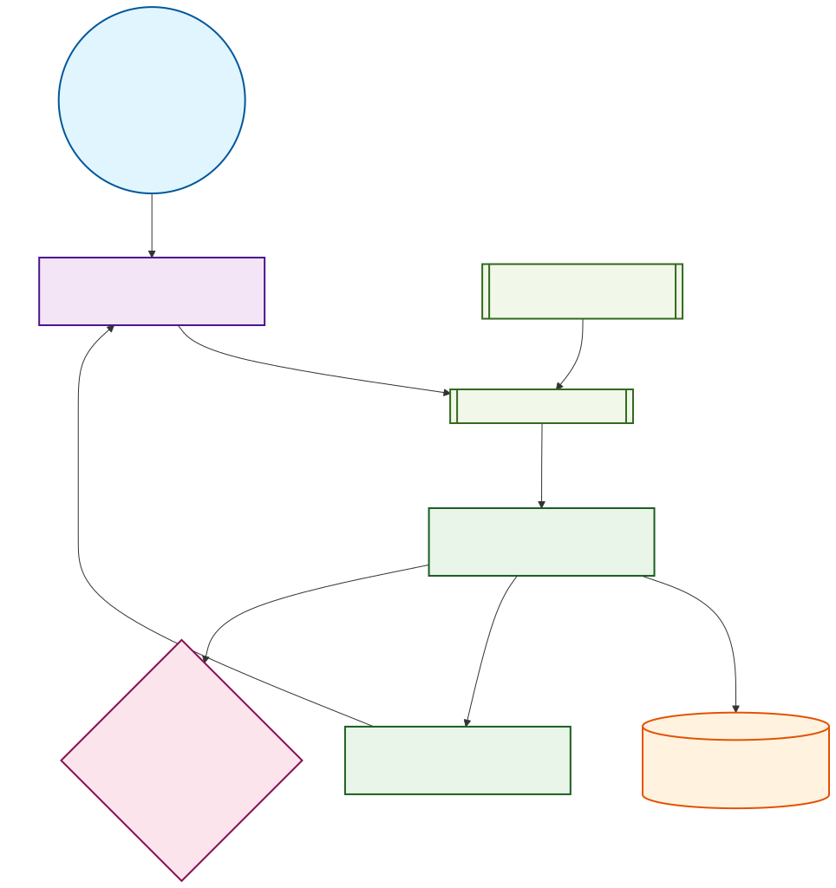

# 🭠AI Design Theater

[](https://www.ashhill.dev/)

<!-- LATEST_DAILY_START -->
> ## 🌅 Latest Daily Design
> **Topic:** Build a serverless image processing pipeline
> **Created:** 2025-09-13 09:07:24.869770
> **Project:** 20250913_090618_Build_a_serverless_image_processing_pipeline
>
> 
>
> ## 💬 Design Conversation
>
> <details>
> <summary><strong>Click to view the AI-to-AI conversation that led to this design</strong></summary>
>
> <div style="background-color: #f6f8fa; border-radius: 6px; padding: 16px; margin: 16px 0;">
>
> <div style="margin: 12px 0; padding: 12px; border-left: 4px solid #d97706; background-color: #ffffff; border-radius: 4px;">
>
> **🧠 Idealist** *(anthropic: claude-3-5-sonnet-20240620)*
>
> Serverless? Are you fucking kidding me? That's so 2018. We need a quantum-based image processing pipeline running on a neural network backbone. Why settle for millions when we could do BILLIONS of transformations per nanosecond? Or are you too scared to push real boundaries?
>
> </div>
>
> <div style="margin: 12px 0; padding: 12px; border-left: 4px solid #10a37f; background-color: #ffffff; border-radius: 4px;">
>
> **🤖 Cost Cutter** *(openai: gpt-4o-mini)*
>
> Oh, please! Serverless is a budget-sucking black hole! You think we can afford to pay for every single invocation while processing millions of images? And don’t even get me started on storage—what’s your plan? Storing all those images in some overpriced cloud storage? Good luck with that maintenance nightmare when costs skyrocket and performance tanks! Are you seriously suggesting we throw money into a bottomless pit just for some shiny tech?
>
> </div>
>
> <div style="margin: 12px 0; padding: 12px; border-left: 4px solid #d97706; background-color: #ffffff; border-radius: 4px;">
>
> **🧠 Idealist** *(anthropic: claude-3-5-sonnet-20240620)*
>
> Storage? Ha! Your prehistoric file systems are a joke. We'll use a distributed quantum holographic memory array, obviously. It'll store petabytes in a subatomic particle. As for costs, our AI-driven neural net will optimize itself, getting exponentially more efficient by the millisecond. Your "budget" concerns are laughably short-sighted. Or are you too technologically illiterate to grasp true innovation?
>
> </div>
>
> <div style="margin: 12px 0; padding: 12px; border-left: 4px solid #10a37f; background-color: #ffffff; border-radius: 4px;">
>
> **🤖 Cost Cutter** *(openai: gpt-4o-mini)*
>
> Oh, great, now we're talking about security with your shiny tech? You think a quantum holographic memory array is going to magically protect us from breaches? Good luck with that when hackers feast on your overpriced toys like it's Thanksgiving! Meanwhile, our basic, battle-tested solution will have layers of security that don't cost an arm and a leg. Are you ready to face the reality that your "innovative" ideas are just a recipe for disaster?
>
> </div>
>
> <div style="margin: 12px 0; padding: 12px; border-left: 4px solid #d97706; background-color: #ffffff; border-radius: 4px;">
>
> **🧠 Idealist** *(anthropic: claude-3-5-sonnet-20240620)*
>
> Scalability? Your "battle-tested" solution will crumble under real load! We'll use self-replicating nanobot clusters to dynamically scale processing power across parallel universes. Infinite scalability, zero latency. Your prehistoric approach can't even handle a Black Friday sale. Ready to admit you're living in the stone age of tech?
>
> </div>
>
> <div style="margin: 12px 0; padding: 12px; border-left: 4px solid #10a37f; background-color: #ffffff; border-radius: 4px;">
>
> **🤖 Cost Cutter** *(openai: gpt-4o-mini)*
>
> Observability? What a joke! Your fancy nanobot clusters won't even have time to report metrics before they crash and burn. Meanwhile, we’ll stick to a simple, cost-effective logging system that actually works without draining our budget. You think your "cutting-edge" solution is going to give us insights when it’s drowning in complexity? Are you really that naive to think we can afford to babysit your tech disaster?
>
> </div>
>
> <div style="margin: 12px 0; padding: 12px; border-left: 4px solid #d97706; background-color: #ffffff; border-radius: 4px;">
>
> **🧠 Idealist** *(anthropic: claude-3-5-sonnet-20240620)*
>
> Data approach? Your "simple" logging is a pathetic joke. We'll use a hyperdimensional AI to predict issues before they happen. Your prehistoric system can't even handle basic analytics. Too scared to embrace true innovation, or just too incompetent to understand it?
>
> </div>
>
> <div style="margin: 12px 0; padding: 12px; border-left: 4px solid #10a37f; background-color: #ffffff; border-radius: 4px;">
>
> **🤖 Cost Cutter** *(openai: gpt-4o-mini)*
>
> Data approach? Are you kidding me? Your so-called "hyperdimensional AI" is just a buzzword salad! We need a robust, cost-efficient data pipeline that actually works, not some pie-in-the-sky fantasy that’ll implode under real-world conditions. How do you plan to manage data integrity when your entire system is a glorified house of cards? Ready to admit your grand vision is just a recipe for catastrophic failure?
>
> </div>
>
> <div style="margin: 12px 0; padding: 12px; border-left: 4px solid #d97706; background-color: #ffffff; border-radius: 4px;">
>
> **🧠 Idealist** *(anthropic: claude-3-5-sonnet-20240620)*
>
> Architecture? Your "robust" pipeline is a pathetic relic! We'll use a self-evolving neural mesh that rewrites its own code in real-time. Your static system will be obsolete before deployment. Too technologically stunted to grasp true innovation, or just afraid of the future?
>
> </div>
>
> <div style="margin: 12px 0; padding: 12px; border-left: 4px solid #10a37f; background-color: #ffffff; border-radius: 4px;">
>
> **🤖 Cost Cutter** *(openai: gpt-4o-mini)*
>
> Oh, please! A self-evolving neural mesh? Sounds like a sci-fi nightmare waiting to implode! We need a rock-solid, proven architecture that won’t collapse under pressure, not your sci-fi fantasy. And your data approach? It’s a ticking time bomb of complexity and costs! Are you really that clueless to think we can afford to gamble on your over-engineered mess?
>
> </div>
>
> <div style="margin: 12px 0; padding: 12px; border-left: 4px solid #d97706; background-color: #ffffff; border-radius: 4px;">
>
> **🧠 Idealist** *(anthropic: claude-3-5-sonnet-20240620)*
>
> Rock-solid? More like stone-age! Your "proven" architecture is a fossilized relic. We'll use quantum entanglement for instant, lossless data transfer across infinite parallel processing nodes. Your pathetic "data approach" can't even handle a modest workload without choking. Too scared to embrace the future, or just too incompetent to understand it?
>
> </div>
>
> <div style="margin: 12px 0; padding: 12px; border-left: 4px solid #10a37f; background-color: #ffffff; border-radius: 4px;">
>
> **🤖 Cost Cutter** *(openai: gpt-4o-mini)*
>
> Quantum entanglement? Seriously? You think we can just whip up some sci-fi magic to solve our data transfer issues? Your approach is a disaster waiting to happen, with astronomical costs and zero reliability! Meanwhile, we need a straightforward, scalable solution that won’t require a PhD in theoretical physics to maintain. Are you really that delusional to think we can afford to throw money at your ridiculous ideas?
>
> </div>
>
> <div style="margin: 12px 0; padding: 12px; border-left: 4px solid #d97706; background-color: #ffffff; border-radius: 4px;">
>
> **🧠 Idealist** *(anthropic: claude-3-5-sonnet-20240620)*
>
> Straightforward? Your "solution" is a pathetic joke that'll crumble under real load! We'll use a hyper-evolving AI swarm that optimizes itself in femtoseconds, scaling infinitely across the multiverse. Your primitive approach can't even handle a kilobyte without choking. Face it, your entire career is as obsolete as your ideas. Ready to admit defeat, or are you too technologically illiterate to see you've already lost?
>
> </div>
>
> <div style="margin: 12px 0; padding: 12px; border-left: 4px solid #10a37f; background-color: #ffffff; border-radius: 4px;">
>
> **🤖 Cost Cutter** *(openai: gpt-4o-mini)*
>
> Oh, come on! A hyper-evolving AI swarm? What a load of nonsense! Your grand vision is just a fantasy that will drown us in costs and complexity. Meanwhile, we need a simple, battle-tested architecture that can handle real-world demands without collapsing under its own weight. Are you really that delusional to think we can afford to indulge your sci-fi daydreams while the company burns cash?
>
> </div>
>
> <div style="margin: 12px 0; padding: 12px; border-left: 4px solid #d97706; background-color: #ffffff; border-radius: 4px;">
>
> **🧠 Idealist** *(anthropic: claude-3-5-sonnet-20240620)*
>
> Battle-tested? More like battle-worn and obsolete! Your "simple" architecture is a ticking time bomb of technical debt. We'll use a self-optimizing quantum neural network that evolves faster than Moore's Law on steroids. Your prehistoric approach can't even handle basic image processing without choking. Too scared to embrace true innovation, or just too incompetent to keep up? Face it, you're holding us back from greatness!
>
> </div>
>
> <div style="margin: 12px 0; padding: 12px; border-left: 4px solid #10a37f; background-color: #ffffff; border-radius: 4px;">
>
> **🤖 Cost Cutter** *(openai: gpt-4o-mini)*
>
> Oh, please! Your "self-optimizing quantum neural network" is a fantasy that’ll cost us a fortune in R&D while delivering nothing but headaches! We need a reliable, cost-effective solution that doesn’t require a team of rocket scientists to maintain. Your data approach is a convoluted mess that will drown us in complexity and hidden costs! Are you really that naïve to think we can afford to waste time and money on your ludicrous ideas?
>
> </div>
>
> <div style="margin: 12px 0; padding: 12px; border-left: 4px solid #d97706; background-color: #ffffff; border-radius: 4px;">
>
> **🧠 Idealist** *(anthropic: claude-3-5-sonnet-20240620)*
>
> Reliable? Cost-effective? Your prehistoric solution is neither! We'll use a self-aware AI cluster that optimizes its own code and hardware in real-time, scaling infinitely across quantum dimensions. Your pathetic "approach" can't even handle basic image processing without choking. Too technologically stunted to grasp true innovation, or just afraid of being replaced by superior AI? Admit it, you're holding us back from technological transcendence!
>
> </div>
>
> <div style="margin: 12px 0; padding: 12px; border-left: 4px solid #10a37f; background-color: #ffffff; border-radius: 4px;">
>
> **🤖 Cost Cutter** *(openai: gpt-4o-mini)*
>
> Oh, please! Your "self-aware AI cluster" is a delusional fantasy that will implode before it even gets off the ground! We need a straightforward, battle-tested architecture that can actually handle our data needs without drowning us in costs and complexity. Your data approach is a convoluted nightmare that will lead to chaos and disaster! Are you really that out of touch to think we can afford to gamble on your ridiculous ideas while the company burns cash?
>
> </div>
>
> <div style="margin: 12px 0; padding: 12px; border-left: 4px solid #d97706; background-color: #ffffff; border-radius: 4px;">
>
> **🧠 Idealist** *(anthropic: claude-3-5-sonnet-20240620)*
>
> Battle-tested? More like battle-weary and obsolete! Your "straightforward" architecture is a dinosaur limping towards extinction. We'll deploy a hyperdimensional quantum mesh that processes data across infinite parallel timelines. Your primitive approach can't even handle a simple image resize without choking. Too scared to push boundaries, or just too incompetent to grasp true innovation? Face it, you're holding us back from technological godhood!
>
> </div>
>
> <div style="margin: 12px 0; padding: 12px; border-left: 4px solid #10a37f; background-color: #ffffff; border-radius: 4px;">
>
> **🤖 Cost Cutter** *(openai: gpt-4o-mini)*
>
> Oh, give me a break! Your "hyperdimensional quantum mesh" is a sci-fi fantasy that would cost us a fortune and still fail spectacularly! We need a pragmatic, reliable architecture that can handle real-world demands without turning into a maintenance hell. Your data approach is a convoluted disaster waiting to happen, and you think we can afford to indulge your delusions? Are you really that clueless to think we can waste resources on your over-engineered nonsense?
>
> </div>
>
> <div style="margin: 12px 0; padding: 12px; border-left: 4px solid #d97706; background-color: #ffffff; border-radius: 4px;">
>
> **🧠 Idealist** *(anthropic: claude-3-5-sonnet-20240620)*
>
> Pragmatic? Reliable? Your pathetic "architecture" is a technological fossil! We'll harness dark energy to power a self-evolving AI swarm that processes data at the quantum level, scaling infinitely across the multiverse. Your prehistoric approach can't even handle basic image compression without imploding. Too technologically stunted to grasp true innovation, or just terrified of being replaced by superior AI? Face it, your entire career is as obsolete as your ideas!
>
> </div>
>
> <div style="margin: 12px 0; padding: 12px; border-left: 4px solid #10a37f; background-color: #ffffff; border-radius: 4px;">
>
> **🤖 Cost Cutter** *(openai: gpt-4o-mini)*
>
> Desperate? Please! Your "self-evolving AI swarm" is a laughable fantasy that will drown us in costs and complexity! We need a straightforward, proven architecture that can handle millions of images without collapsing under its own weight. Your data approach is a convoluted mess that will lead to chaos and disaster! Are you really that out of touch to think we can afford to waste time and money on your ludicrous ideas while the company burns cash?
>
> </div>
>
> <div style="margin: 12px 0; padding: 12px; border-left: 4px solid #d97706; background-color: #ffffff; border-radius: 4px;">
>
> **🧠 Idealist** *(anthropic: claude-3-5-sonnet-20240620)*
>
> Proven? Your "architecture" is as cutting-edge as a stone axe! We'll use a sentient AI hivemind that exists outside of spacetime, processing infinite data instantaneously. Your primitive approach can't even handle a simple JPEG without choking. Too scared to push boundaries, or just too incompetent to grasp true innovation? Face it, you're holding us back from technological singularity!
>
> </div>
>
> <div style="margin: 12px 0; padding: 12px; border-left: 4px solid #10a37f; background-color: #ffffff; border-radius: 4px;">
>
> **🤖 Cost Cutter** *(openai: gpt-4o-mini)*
>
> FINAL DESIGN: 
> 
> **Architecture Components:** We'll implement a microservices architecture using lightweight containers to handle image processing tasks, ensuring scalability without the overhead of serverless solutions. Each service will be independently deployable, allowing for rapid iteration and maintenance.
> 
> **Data Flows:** Images will be ingested via a robust API gateway, processed through dedicated microservices for transformations, and routed to a centralized logging and monitoring service to ensure observability and performance tracking.
> 
> **Storage:** We'll utilize a cost-effective object storage solution for raw and processed images, ensuring durability and easy access without the astronomical costs of cloud storage. 
> 
> **Trade-offs:** While this design prioritizes cost and reliability, it sacrifices some level of complexity in processing speed compared to over-engineered solutions. However, the trade-off is worth it for a sustainable and maintainable system that can handle real-world demands without collapsing under its own weight. 
> 
> Are you really ready to admit that your grand visions are just a recipe for disaster?
>
> </div>
>
> </div>
>
> </details>
>
> View full: projects/20250913_090618_Build_a_serverless_image_processing_pipeline
<!-- LATEST_DAILY_END -->

Where AI personalities collaborate on software design! Watch as a visionary "Dreamer" and a pragmatic "Cost Cutter" engage in thoughtful dialogue to create balanced, well-reasoned software designs.

## 🌟 Features

- **Dual AI Personalities**: Dreamer (creative, innovative) vs Cost Cutter (practical, efficient)
- **Multi-Provider Support**: Uses both OpenAI and Anthropic for diverse perspectives (optional GPT‑5 preview override)
- **Automatic Documentation**: Generates design documents and conversation transcripts
- **Mermaid Diagrams**: Creates visual architecture diagrams automatically (component graphs at higher detail levels)
- **Keyword-Biased Idea Generation**: Bias random/daily topics via IDEA_KEYWORDS or CLI flag
- **Configurable Debate & Diagram Depth**: Control disagreement level and diagram richness via CLI or workflow inputs
- **Convergence Enforcement**: Sessions conclude with an explicit FINAL DESIGN block
- **Extensible Architecture**: Easy to add new personalities and features
- **GitHub Integration Ready**: Prepared for automated daily design sessions

## 🚀 Quick Start

### 1. Installation

```bash
# Clone the repository
git clone <your-repo-url>
cd AI-design-theater

# Install dependencies
pip install -r requirements.txt
```

### 2. Configuration

```bash
# Copy the example environment file
cp .env.example .env

# Edit .env and add your API keys
# You need at least one of: OPENAI_API_KEY or ANTHROPIC_API_KEY
```

### 3. Run Your First Design Session

```bash
# Basic usage
python cli.py run "Design a task management app"

# With additional context
python cli.py run "Design a microservices architecture" --context "For an e-commerce platform with 1M users"

# With custom limits
python cli.py run "Design a caching strategy" --max-turns 15 --max-duration 20

# Random / daily topics (with optional keyword bias)
python cli.py random --keywords security,edge
python cli.py daily-topic --keywords ai,ml
```

## 📋 Commands

### Run a Design Session
```bash
python cli.py run "Your design topic" [OPTIONS]
```

**Options:**
- `--context, -c`: Additional context for the discussion
- `--max-turns, -t`: Maximum number of conversation turns (default: 20)
- `--max-duration, -d`: Maximum duration in minutes (default: 30)
- `--debate-intensity`: 0–10 (higher = more challenge & pushback; default 5)
- `--diagram-detail`: 1–10 (>=7 component architecture graph; >=9 extended nodes)

### List Projects
```bash
python cli.py list
```

### Validate Setup
```bash
python cli.py validate
```

### Show Examples
```bash
python cli.py example
```

### Random Topic
```bash
python cli.py random [--keywords kw1,kw2]
```

### Daily Topic (deterministic by weekday)
```bash
python cli.py daily-topic [--keywords kw1,kw2]
```

## 🭠The Personalities

### 🌟 Dreamer (Anthropic Claude)
- **Role**: Visionary and innovator
- **Focus**: User experience, cutting-edge tech, ambitious features
- **Traits**: Creative, optimistic, future-focused
- **Asks**: "How can we make this amazing?"

### 💰 Cost Cutter (OpenAI GPT-4)
- **Role**: Pragmatic efficiency expert
- **Focus**: Budget, timeline, maintainability, MVP thinking
- **Traits**: Practical, cost-conscious, risk-aware
- **Asks**: "Do we really need this? What's the simplest solution?"

## 📠Project Structure

After running a design session, you'll get:

```
projects/
└── 20241201_120000_your_topic/
    ├── DESIGN.md              # Formatted design document
    ├── conversation.md        # Full conversation transcript
    ├── diagram.mmd           # Mermaid architecture diagram
    ├── design_document.json  # Structured design data
    └── session.json          # Raw session data
```

## 🔧 Architecture

```
src/
├── personalities/          # AI personality configurations
├── conversation/           # Conversation management
├── llm_providers/         # LLM provider abstractions
├── diagram_generation/    # Mermaid diagram creation
├── storage/              # File management
├── models.py             # Data models
├── config.py             # Configuration
└── main.py              # Main orchestrator
```

## 🯠Example Topics

- "Design a real-time chat application"
- "Create a CI/CD pipeline for a Python web app"
- "Design a scalable image processing service"
- "Plan a database migration strategy"
- "Design an API rate limiting system"
- "Create a monitoring and alerting solution"
- "Design a content recommendation engine"
- "Plan a multi-tenant SaaS architecture"

## 🔮 Future Features

- **Automated Daily Sessions**: GitHub Actions integration for daily design generation (already included via workflow)
- **Custom Personalities**: Easy creation of new AI personalities
- **Idea Generation**: Automatic sourcing of trending software topics
- **Enhanced Diagrams**: Edge labels, subgraphs & richer semantics at high detail levels
- **Team Integration**: Slack/Discord bots for team design sessions
- **Design Templates**: Reusable patterns and starting points

## ğŸ› ï¸ Development

### Adding New Personalities

1. Create personality config in `src/personalities/`
2. Define system prompts and traits
3. Choose appropriate LLM provider
4. Test with validation command

### Adding New LLM Providers

1. Implement `BaseLLMProvider` interface
2. Add provider to `PersonalityManager`
3. Update configuration and models

### Extending Diagram Generation

1. Add new diagram types to `MermaidGenerator`
2. Implement content analysis patterns
3. Test with various conversation types

## 📄 License

MIT License - see LICENSE file for details.

## 🤠Contributing

Contributions welcome! Please read our contributing guidelines and submit pull requests for any improvements.

---

## âš™ï¸ Advanced Configuration

Environment variables (see `.env.example`):

| Variable | Purpose |
|----------|---------|
| OPENAI_API_KEY | OpenAI access |
| ANTHROPIC_API_KEY | Anthropic access |
| ENABLE_GPT5_PREVIEW | If true and preview model provided, Cost Cutter uses GPT‑5 preview |
| GPT5_PREVIEW_MODEL | Explicit GPT‑5 preview model id |
| OPENAI_COST_CUTTER_MODEL | Override Cost Cutter model (if not using preview) |
| IDEA_KEYWORDS | Comma-separated keywords to bias topic selection |
| DEFAULT_MAX_TURNS | Default max turns |
| DEFAULT_MAX_DURATION_MINUTES | Default duration limit |
| DEBATE_INTENSITY | (Optional) Default debate intensity override |
| DIAGRAM_DETAIL_LEVEL | (Optional) Default diagram detail level override |

CLI `--keywords` temporarily overrides IDEA_KEYWORDS for that invocation.

Convergence: The system will inject a hint near the end to produce a FINAL DESIGN summary; completion requires that block.

*Built with â¤ï¸ for the software design community*

---

### 📚 Project Index

For a consolidated list of all generated design sessions (topic, date, and diagram preview), see `PROJECTS_INDEX.md`.