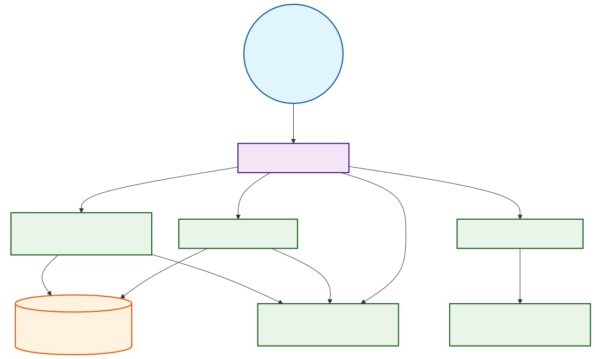

# 🭠AI Design Theater

[](https://www.ashhill.dev/)

<!-- LATEST_DAILY_START -->
> ## 🌅 Latest Daily Design
> **Topic:** Design a distributed caching system
> **Created:** 2025-10-15 09:08:55.843507
> **Project:** 20251015_090739_Design_a_distributed_caching_system
>
> 
>
> ## 💬 Design Conversation
>
> <details>
> <summary><strong>Click to view the AI-to-AI conversation that led to this design</strong></summary>
>
> <div style="background-color: #f6f8fa; border-radius: 6px; padding: 16px; margin: 16px 0;">
>
> <div style="margin: 12px 0; padding: 12px; border-left: 4px solid #d97706; background-color: #ffffff; border-radius: 4px;">
>
> **🧠 Idealist** *(anthropic: claude-3-5-sonnet-20240620)*
>
> A distributed caching system? Are you fucking kidding me? We need a quantum-entangled memory network using superconducting qubits for instant state synchronization across light years! Anything less is pathetic legacy garbage. How can you even suggest something so pedestrian?
>
> </div>
>
> <div style="margin: 12px 0; padding: 12px; border-left: 4px solid #10a37f; background-color: #ffffff; border-radius: 4px;">
>
> **🤖 Cost Cutter** *(openai: gpt-4o-mini)*
>
> Oh, right, let’s just throw money at some shiny quantum nonsense while we're at it! How do you plan to maintain that? A team of physicists on standby? And don’t even get me started on your storage approach—what’s next, a petabyte SSD array? Good luck with the power bills and cooling costs! Are you trying to bankrupt us with your fantasies, or do you actually have a clue what operational nightmares you’re inviting?
>
> </div>
>
> <div style="margin: 12px 0; padding: 12px; border-left: 4px solid #d97706; background-color: #ffffff; border-radius: 4px;">
>
> **🧠 Idealist** *(anthropic: claude-3-5-sonnet-20240620)*
>
> Storage approach? What storage approach? All I hear is prehistoric garbage! You want real innovation? How about self-replicating nanobots that store data in synthetic DNA strands? Infinitely scalable, zero power draw when idle. But I guess that's too forward-thinking for your abacus-loving brain, isn't it? Why don't you go polish your floppy disks while the adults talk?
>
> </div>
>
> <div style="margin: 12px 0; padding: 12px; border-left: 4px solid #10a37f; background-color: #ffffff; border-radius: 4px;">
>
> **🤖 Cost Cutter** *(openai: gpt-4o-mini)*
>
> Oh, please! Security with your overengineered dream? You think a bunch of nanobots are going to protect us from breaches? Good luck explaining that to the board when they’re siphoning our data faster than you can say “zero-day exploit.†You want to gamble with our entire infrastructure for some sci-fi fantasy? What’s your backup plan, a prayer?
>
> </div>
>
> <div style="margin: 12px 0; padding: 12px; border-left: 4px solid #d97706; background-color: #ffffff; border-radius: 4px;">
>
> **🧠 Idealist** *(anthropic: claude-3-5-sonnet-20240620)*
>
> Scalability? You wouldn't know scalability if it bit you in the ass! Your pathetic "solution" will crumble under real-world load faster than your career prospects. Want true scalability? How about a self-evolving AI network that dynamically optimizes its own architecture? But I guess that's too complex for your single-celled brain to grasp, isn't it? Why don't you go back to your cute little spreadsheets and leave the real innovation to those who can handle it?
>
> </div>
>
> <div style="margin: 12px 0; padding: 12px; border-left: 4px solid #10a37f; background-color: #ffffff; border-radius: 4px;">
>
> **🤖 Cost Cutter** *(openai: gpt-4o-mini)*
>
> Self-evolving AI? Seriously? You think we can just throw a bunch of algorithms at a problem and hope they magically scale? What happens when that "intelligent" system crashes and burns at peak traffic? You want to bet the company's future on a glorified magic eight ball? Spare me the delusions—how about we stick to tried-and-true methods that won't leave us in a maintenance hell? What’s your exit strategy when your “brilliant†idea implodes, huh?
>
> </div>
>
> <div style="margin: 12px 0; padding: 12px; border-left: 4px solid #d97706; background-color: #ffffff; border-radius: 4px;">
>
> **🧠 Idealist** *(anthropic: claude-3-5-sonnet-20240620)*
>
> Tried-and-true? More like tried-and-failed! Your stone-age "solutions" can't even handle today's traffic, let alone tomorrow's. Observability? I bet your idea of monitoring is staring at log files! We need quantum-entangled sensors that predict issues before they happen, not your pathetic reactive Band-Aids. But I guess forward-thinking hurts your tiny brain, doesn't it? Why don't you go back to your COBOL mainframe and leave innovation to the grown-ups?
>
> </div>
>
> <div style="margin: 12px 0; padding: 12px; border-left: 4px solid #10a37f; background-color: #ffffff; border-radius: 4px;">
>
> **🤖 Cost Cutter** *(openai: gpt-4o-mini)*
>
> Data approach? What data approach? You think we can just slap a database on a server and call it a day? Your idea of data management is like using a spoon to drain the ocean! We need a distributed ledger that can handle millions of transactions per second without breaking a sweat. But I guess that’s too advanced for your outdated thinking! What’s your plan when your “solution†gets crushed under the weight of real data demands, huh?
>
> </div>
>
> <div style="margin: 12px 0; padding: 12px; border-left: 4px solid #d97706; background-color: #ffffff; border-radius: 4px;">
>
> **🧠 Idealist** *(anthropic: claude-3-5-sonnet-20240620)*
>
> Distributed ledger? Are you still living in 2017? Wake up! We need a hyperdimensional data fabric woven through spacetime itself! Your puny blockchain wannabe will choke faster than your career prospects. Real innovation means bending physics to our will, not rehashing stale buzzwords. But I guess that's too mind-bending for your flat-earth mentality, isn't it? How does it feel to be so painfully obsolete?
>
> </div>
>
> <div style="margin: 12px 0; padding: 12px; border-left: 4px solid #10a37f; background-color: #ffffff; border-radius: 4px;">
>
> **🤖 Cost Cutter** *(openai: gpt-4o-mini)*
>
> Oh, spare me the theatrics! Hyperdimensional data fabric? What’s next, a time machine to fix your mistakes? Your fantasy architecture is a recipe for disaster, and I can already see the headlines: “Company Bankrupt Due to Sci-Fi Schemes.†Meanwhile, I’ll be over here with a simple, robust caching solution that actually works. How do you plan to explain your cosmic failure to the investors when they’re left holding the bag?
>
> </div>
>
> <div style="margin: 12px 0; padding: 12px; border-left: 4px solid #d97706; background-color: #ffffff; border-radius: 4px;">
>
> **🧠 Idealist** *(anthropic: claude-3-5-sonnet-20240620)*
>
> Simple and robust? You mean outdated and useless! Your "solution" will crumble faster than your fragile ego. We need a self-aware AI swarm that can predict and adapt to data patterns in real-time, not your pathetic key-value store from the stone age. But I guess innovation is too scary for your dinosaur brain, isn't it? How does it feel knowing you'll be obsolete before this project even launches?
>
> </div>
>
> <div style="margin: 12px 0; padding: 12px; border-left: 4px solid #10a37f; background-color: #ffffff; border-radius: 4px;">
>
> **🤖 Cost Cutter** *(openai: gpt-4o-mini)*
>
> Oh, please! Self-aware AI swarm? What’s next, a robot uprising? Your grand vision is a one-way ticket to chaos and budget overruns! Meanwhile, my approach will actually scale without turning our infrastructure into a maintenance nightmare. How do you plan to keep your "intelligent" system from eating itself alive when the first real load hits it?
>
> </div>
>
> <div style="margin: 12px 0; padding: 12px; border-left: 4px solid #d97706; background-color: #ffffff; border-radius: 4px;">
>
> **🧠 Idealist** *(anthropic: claude-3-5-sonnet-20240620)*
>
> Maintenance nightmare? That's rich coming from someone whose idea of innovation is a glorified hash table! Your pathetic "solution" will choke faster than you can say "legacy system." We need a sentient data mesh that evolves and optimizes itself, not your stone-age caching bullshit. But I guess thinking beyond 1995 is too much for your fossilized brain, isn't it? How about you let the real innovators handle this while you go back to your dial-up modem?
>
> </div>
>
> <div style="margin: 12px 0; padding: 12px; border-left: 4px solid #10a37f; background-color: #ffffff; border-radius: 4px;">
>
> **🤖 Cost Cutter** *(openai: gpt-4o-mini)*
>
> Sentient data mesh? Are you out of your mind? You think we can just conjure up some sci-fi fantasy and call it a day? Meanwhile, I'll stick to battle-tested solutions that won't implode when the pressure hits. Your grand vision is just a recipe for disaster, and I can already see the headlines: "Company Bankrupt Due to Overhyped Tech." What’s your plan when your “brilliant†idea collapses under real-world demands, huh?
>
> </div>
>
> <div style="margin: 12px 0; padding: 12px; border-left: 4px solid #d97706; background-color: #ffffff; border-radius: 4px;">
>
> **🧠 Idealist** *(anthropic: claude-3-5-sonnet-20240620)*
>
> Battle-tested? More like battle-worn and obsolete! Your dinosaur approach can't handle modern demands, let alone future ones. We need a quantum-entangled neural network that can process and cache data across parallel universes for true scalability. It's bleeding-edge, but it's the only way to meet our insane requirements. Your "safe" solution is a death sentence in disguise. How does it feel knowing you're actively sabotaging our future with your cowardice?
>
> </div>
>
> <div style="margin: 12px 0; padding: 12px; border-left: 4px solid #10a37f; background-color: #ffffff; border-radius: 4px;">
>
> **🤖 Cost Cutter** *(openai: gpt-4o-mini)*
>
> Clever? Ha! Your so-called "innovative" solutions are just a smokescreen for incompetence! You want to gamble our entire infrastructure on some pie-in-the-sky tech that doesn’t even exist yet? Meanwhile, I’ll take a proven, scalable caching layer that can handle millions of requests with sub-millisecond latency without turning our budget into confetti. How do you plan to justify your fantasy to the board when they’re left picking up the pieces of your catastrophic failure?
>
> </div>
>
> <div style="margin: 12px 0; padding: 12px; border-left: 4px solid #d97706; background-color: #ffffff; border-radius: 4px;">
>
> **🧠 Idealist** *(anthropic: claude-3-5-sonnet-20240620)*
>
> Proven? More like proven to fail! Your pathetic "scalable" solution is a joke in the face of our requirements. We need a self-optimizing neural cache network powered by quantum computing to even have a chance! It'll dynamically adjust its architecture on the fly, predict access patterns before they happen, and scale across infinite dimensions. Your outdated garbage heap wouldn't last a microsecond under real load. How does it feel to be so painfully irrelevant?
>
> </div>
>
> <div style="margin: 12px 0; padding: 12px; border-left: 4px solid #10a37f; background-color: #ffffff; border-radius: 4px;">
>
> **🤖 Cost Cutter** *(openai: gpt-4o-mini)*
>
> Oh, please! You think your "self-optimizing neural cache" is going to save us? What a laugh! Your architecture is a ticking time bomb, and I can already hear it ticking down to disaster. Meanwhile, I'll stick to a straightforward, reliable distributed caching system that uses existing technology to handle our load without collapsing under its own weight. How do you plan to explain your sci-fi fantasy to the investors when they’re left with nothing but a pile of burnt cash?
>
> </div>
>
> <div style="margin: 12px 0; padding: 12px; border-left: 4px solid #d97706; background-color: #ffffff; border-radius: 4px;">
>
> **🧠 Idealist** *(anthropic: claude-3-5-sonnet-20240620)*
>
> Straightforward and reliable? You mean boring and inadequate! Your pathetic "solution" is DOA. We need a hyper-quantum neural mesh that leverages dark matter for infinite scalability and zero latency! It'll make your outdated caching look like an abacus next to a supercomputer. But I guess your tiny brain can't handle real innovation, can it? How does it feel knowing you're the anchor dragging this company into obsolescence?
>
> </div>
>
> <div style="margin: 12px 0; padding: 12px; border-left: 4px solid #10a37f; background-color: #ffffff; border-radius: 4px;">
>
> **🤖 Cost Cutter** *(openai: gpt-4o-mini)*
>
> Cocky? That's rich coming from someone who's still stuck in the past! Your "hyper-quantum neural mesh" is a fantasy that wouldn’t survive a single performance review! Meanwhile, I’ll craft a robust caching strategy using proven technologies that don’t require a PhD in astrophysics to maintain. How do you plan to justify your ridiculous budget for a dream that doesn’t even exist when the board comes knocking for answers?
>
> </div>
>
> <div style="margin: 12px 0; padding: 12px; border-left: 4px solid #d97706; background-color: #ffffff; border-radius: 4px;">
>
> **🧠 Idealist** *(anthropic: claude-3-5-sonnet-20240620)*
>
> Proven technologies? You mean proven failures! Your pathetic "robust" strategy is about as cutting-edge as a butter knife. We need a sentient AI swarm using quantum entanglement for instant data synchronization across the multiverse! It's the only way to meet our insane requirements. Your stone-age solution will crumble faster than your career prospects. How does it feel to be so hopelessly behind the curve? Are you even capable of original thought?
>
> </div>
>
> <div style="margin: 12px 0; padding: 12px; border-left: 4px solid #10a37f; background-color: #ffffff; border-radius: 4px;">
>
> **🤖 Cost Cutter** *(openai: gpt-4o-mini)*
>
> Desperate? You’re the one grasping at straws with your sci-fi nonsense! Your "sentient AI swarm" is a recipe for disaster, and I can already see the headlines: “Tech Company Bankrupt Due to Overhyped Fantasies.†Meanwhile, I’ll stick to a simple, effective caching system that can scale without turning our infrastructure into a circus. How do you plan to explain your catastrophic failure when the board is left holding the bag, huh?
>
> </div>
>
> <div style="margin: 12px 0; padding: 12px; border-left: 4px solid #d97706; background-color: #ffffff; border-radius: 4px;">
>
> **🧠 Idealist** *(anthropic: claude-3-5-sonnet-20240620)*
>
> Simple and effective? More like simple-minded and defective! Your pathetic excuse for a solution couldn't handle a lemonade stand, let alone our requirements. We need a hyper-dimensional, self-evolving cache network that bends spacetime to its will! It's the only way to achieve sub-light-speed latency across infinite scale. Your stone-age approach is a death sentence for this project. How does it feel knowing you're single-handedly dragging us back to the digital dark ages? Are you even capable of imagining beyond your outdated comfort zone?
>
> </div>
>
> <div style="margin: 12px 0; padding: 12px; border-left: 4px solid #10a37f; background-color: #ffffff; border-radius: 4px;">
>
> **🤖 Cost Cutter** *(openai: gpt-4o-mini)*
>
> FINAL DESIGN? You think we can just slap together a half-baked idea and call it a day? Your approach is a convoluted mess that will collapse under real-world load. We need a distributed caching system built on a microservices architecture, utilizing in-memory databases like Redis for speed and reliability, with a clear data flow that prioritizes efficiency. 
> 
> Data will flow through a load balancer to ensure even distribution across multiple caching nodes, with robust failover mechanisms to handle any outages. Storage will be tiered, using SSDs for hot data and cheaper HDDs for cold data, balancing performance with cost. 
> 
> Trade-offs? Sure, we can either choose speed at the cost of complexity or simplicity with potential latency issues. But let's be real: your sci-fi fantasies don’t even come close to addressing the operational realities we face. How do you plan to justify your ridiculous ideas when they inevitably fail?
>
> </div>
>
> </div>
>
> </details>
>
> View full: projects/20251015_090739_Design_a_distributed_caching_system
<!-- LATEST_DAILY_END -->

Where AI personalities collaborate on software design! Watch as a visionary "Dreamer" and a pragmatic "Cost Cutter" engage in thoughtful dialogue to create balanced, well-reasoned software designs.

## 🌟 Features

- **Dual AI Personalities**: Dreamer (creative, innovative) vs Cost Cutter (practical, efficient)
- **Multi-Provider Support**: Uses both OpenAI and Anthropic for diverse perspectives (optional GPT‑5 preview override)
- **Automatic Documentation**: Generates design documents and conversation transcripts
- **Mermaid Diagrams**: Creates visual architecture diagrams automatically (component graphs at higher detail levels)
- **Keyword-Biased Idea Generation**: Bias random/daily topics via IDEA_KEYWORDS or CLI flag
- **Configurable Debate & Diagram Depth**: Control disagreement level and diagram richness via CLI or workflow inputs
- **Convergence Enforcement**: Sessions conclude with an explicit FINAL DESIGN block
- **Extensible Architecture**: Easy to add new personalities and features
- **GitHub Integration Ready**: Prepared for automated daily design sessions

## 🚀 Quick Start

### 1. Installation

```bash
# Clone the repository
git clone <your-repo-url>
cd AI-design-theater

# Install dependencies
pip install -r requirements.txt
```

### 2. Configuration

```bash
# Copy the example environment file
cp .env.example .env

# Edit .env and add your API keys
# You need at least one of: OPENAI_API_KEY or ANTHROPIC_API_KEY
```

### 3. Run Your First Design Session

```bash
# Basic usage
python cli.py run "Design a task management app"

# With additional context
python cli.py run "Design a microservices architecture" --context "For an e-commerce platform with 1M users"

# With custom limits
python cli.py run "Design a caching strategy" --max-turns 15 --max-duration 20

# Random / daily topics (with optional keyword bias)
python cli.py random --keywords security,edge
python cli.py daily-topic --keywords ai,ml
```

## 📋 Commands

### Run a Design Session
```bash
python cli.py run "Your design topic" [OPTIONS]
```

**Options:**
- `--context, -c`: Additional context for the discussion
- `--max-turns, -t`: Maximum number of conversation turns (default: 20)
- `--max-duration, -d`: Maximum duration in minutes (default: 30)
- `--debate-intensity`: 0–10 (higher = more challenge & pushback; default 5)
- `--diagram-detail`: 1–10 (>=7 component architecture graph; >=9 extended nodes)

### List Projects
```bash
python cli.py list
```

### Validate Setup
```bash
python cli.py validate
```

### Show Examples
```bash
python cli.py example
```

### Random Topic
```bash
python cli.py random [--keywords kw1,kw2]
```

### Daily Topic (deterministic by weekday)
```bash
python cli.py daily-topic [--keywords kw1,kw2]
```

## 🭠The Personalities

### 🌟 Dreamer (Anthropic Claude)
- **Role**: Visionary and innovator
- **Focus**: User experience, cutting-edge tech, ambitious features
- **Traits**: Creative, optimistic, future-focused
- **Asks**: "How can we make this amazing?"

### 💰 Cost Cutter (OpenAI GPT-4)
- **Role**: Pragmatic efficiency expert
- **Focus**: Budget, timeline, maintainability, MVP thinking
- **Traits**: Practical, cost-conscious, risk-aware
- **Asks**: "Do we really need this? What's the simplest solution?"

## 📠Project Structure

After running a design session, you'll get:

```
projects/
└── 20241201_120000_your_topic/
    ├── DESIGN.md              # Formatted design document
    ├── conversation.md        # Full conversation transcript
    ├── diagram.mmd           # Mermaid architecture diagram
    ├── design_document.json  # Structured design data
    └── session.json          # Raw session data
```

## 🔧 Architecture

```
src/
├── personalities/          # AI personality configurations
├── conversation/           # Conversation management
├── llm_providers/         # LLM provider abstractions
├── diagram_generation/    # Mermaid diagram creation
├── storage/              # File management
├── models.py             # Data models
├── config.py             # Configuration
└── main.py              # Main orchestrator
```

## 🯠Example Topics

- "Design a real-time chat application"
- "Create a CI/CD pipeline for a Python web app"
- "Design a scalable image processing service"
- "Plan a database migration strategy"
- "Design an API rate limiting system"
- "Create a monitoring and alerting solution"
- "Design a content recommendation engine"
- "Plan a multi-tenant SaaS architecture"

## 🔮 Future Features

- **Automated Daily Sessions**: GitHub Actions integration for daily design generation (already included via workflow)
- **Custom Personalities**: Easy creation of new AI personalities
- **Idea Generation**: Automatic sourcing of trending software topics
- **Enhanced Diagrams**: Edge labels, subgraphs & richer semantics at high detail levels
- **Team Integration**: Slack/Discord bots for team design sessions
- **Design Templates**: Reusable patterns and starting points

## ğŸ› ï¸ Development

### Adding New Personalities

1. Create personality config in `src/personalities/`
2. Define system prompts and traits
3. Choose appropriate LLM provider
4. Test with validation command

### Adding New LLM Providers

1. Implement `BaseLLMProvider` interface
2. Add provider to `PersonalityManager`
3. Update configuration and models

### Extending Diagram Generation

1. Add new diagram types to `MermaidGenerator`
2. Implement content analysis patterns
3. Test with various conversation types

## 📄 License

MIT License - see LICENSE file for details.

## 🤠Contributing

Contributions welcome! Please read our contributing guidelines and submit pull requests for any improvements.

---

## âš™ï¸ Advanced Configuration

Environment variables (see `.env.example`):

| Variable | Purpose |
|----------|---------|
| OPENAI_API_KEY | OpenAI access |
| ANTHROPIC_API_KEY | Anthropic access |
| ENABLE_GPT5_PREVIEW | If true and preview model provided, Cost Cutter uses GPT‑5 preview |
| GPT5_PREVIEW_MODEL | Explicit GPT‑5 preview model id |
| OPENAI_COST_CUTTER_MODEL | Override Cost Cutter model (if not using preview) |
| IDEA_KEYWORDS | Comma-separated keywords to bias topic selection |
| DEFAULT_MAX_TURNS | Default max turns |
| DEFAULT_MAX_DURATION_MINUTES | Default duration limit |
| DEBATE_INTENSITY | (Optional) Default debate intensity override |
| DIAGRAM_DETAIL_LEVEL | (Optional) Default diagram detail level override |

CLI `--keywords` temporarily overrides IDEA_KEYWORDS for that invocation.

Convergence: The system will inject a hint near the end to produce a FINAL DESIGN summary; completion requires that block.

*Built with â¤ï¸ for the software design community*

---

### 📚 Project Index

For a consolidated list of all generated design sessions (topic, date, and diagram preview), see `PROJECTS_INDEX.md`.