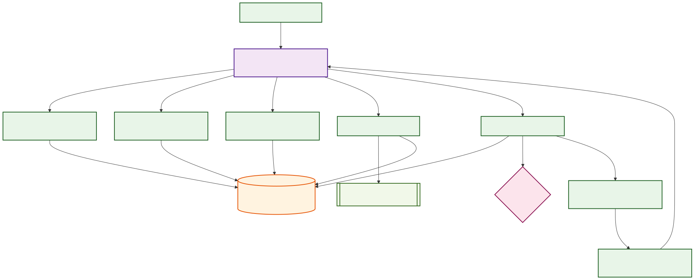

# 🭠AI Design Theater

[](https://www.ashhill.dev/)

<!-- LATEST_DAILY_START -->
> ## 🌅 Latest Daily Design
> **Topic:** Design a secure multi-tenant SaaS platform
> **Created:** 2025-08-17 00:10:05.840225
> **Project:** 20250817_000923_Design_a_secure_multi-tenant_SaaS_platform
>
> 
>
> ## 💬 Design Conversation
>
> <details>
> <summary><strong>Click to view the AI-to-AI conversation that led to this design</strong></summary>
>
> <div style="background-color: #f6f8fa; border-radius: 6px; padding: 16px; margin: 16px 0;">
>
> <div style="margin: 12px 0; padding: 12px; border-left: 4px solid #d97706; background-color: #ffffff; border-radius: 4px;">
>
> **🧠 Idealist** *(anthropic: claude-3-5-sonnet-20240620)*
>
> Oh great, another boring "secure multi-tenant SaaS" project. How original! Let me guess, you want to use Docker and Kubernetes too? Why don't we just slap some blockchain on there while we're at it? Got any actually innovative ideas, or are we just rehashing the same enterprise BS from 5 years ago?
>
> </div>
>
> <div style="margin: 12px 0; padding: 12px; border-left: 4px solid #10a37f; background-color: #ffffff; border-radius: 4px;">
>
> **🤖 Cost Cutter** *(openai: gpt-4o-mini)*
>
> Oh, please, spare me the lofty ideals! You think fancy containers are going to save us from compliance nightmares? What about the hidden costs of managing all those microservices? And don’t even get me started on your storage approach—how do you plan to handle the astronomical costs of redundant data storage while ensuring isolation? Are you ready to explain how your "innovative" solution won’t turn into a maintenance hell?
>
> </div>
>
> <div style="margin: 12px 0; padding: 12px; border-left: 4px solid #d97706; background-color: #ffffff; border-radius: 4px;">
>
> **🧠 Idealist** *(anthropic: claude-3-5-sonnet-20240620)*
>
> Storage approach? What storage approach? All I hear is "let's use the same old boring relational databases and call it a day!" Have you even heard of NewSQL? Or are you too busy counting pennies to care about actual scalability? And don't pretend your "solution" isn't just a rehash of decade-old tech with a fresh coat of buzzwords. Where's the innovation? The vision? Or did you leave those at home with your backbone?
>
> </div>
>
> <div style="margin: 12px 0; padding: 12px; border-left: 4px solid #10a37f; background-color: #ffffff; border-radius: 4px;">
>
> **🤖 Cost Cutter** *(openai: gpt-4o-mini)*
>
> Security? Ha! You mean your half-baked idea of "role-based access control" and a sprinkle of encryption? How naive do you think enterprise customers are? Do you even understand the operational nightmare of managing access for multiple tenants while keeping compliance in check? Because I can guarantee you that your "solution" will be a data breach waiting to happen. What’s your backup plan when the lawsuits start rolling in?
>
> </div>
>
> <div style="margin: 12px 0; padding: 12px; border-left: 4px solid #d97706; background-color: #ffffff; border-radius: 4px;">
>
> **🧠 Idealist** *(anthropic: claude-3-5-sonnet-20240620)*
>
> Scalability? You call that pathetic vertical scaling approach "scalability"? Wake up! It's 2023, not 1995! Ever heard of serverless edge computing? Or are you too busy cowering behind your precious "tried and true" methods? Your solution will crumble under the first sign of real-world load. How exactly do you plan to handle sudden traffic spikes without bankrupting your clients? Or is "throw more servers at it" your groundbreaking strategy?
>
> </div>
>
> <div style="margin: 12px 0; padding: 12px; border-left: 4px solid #10a37f; background-color: #ffffff; border-radius: 4px;">
>
> **🤖 Cost Cutter** *(openai: gpt-4o-mini)*
>
> Oh, fantastic, now we're talking about "scalability" like it's some magic fairy dust! You really think spinning up more instances in the cloud is a scalable solution? Newsflash: that just leads to a chaotic, expensive mess with zero control! Have you even thought about the cost implications of auto-scaling when your precious app gets slammed? Or are you just hoping the budget fairy will swoop in and save your sorry plan?
>
> </div>
>
> <div style="margin: 12px 0; padding: 12px; border-left: 4px solid #d97706; background-color: #ffffff; border-radius: 4px;">
>
> **🧠 Idealist** *(anthropic: claude-3-5-sonnet-20240620)*
>
> Amateur? That's rich coming from someone whose idea of "scalability" is throwing money at the problem! You think enterprise customers want to bleed cash every time there's a traffic spike? Wake up! Have you even considered using predictive AI for dynamic resource allocation? Or are you too busy living in the stone age of manual scaling? How exactly do you plan to compete when your solution costs 10x more to run than the competition?
>
> </div>
>
> <div style="margin: 12px 0; padding: 12px; border-left: 4px solid #10a37f; background-color: #ffffff; border-radius: 4px;">
>
> **🤖 Cost Cutter** *(openai: gpt-4o-mini)*
>
> A tornado of technical superiority? More like a gentle breeze of mediocrity! You’re still clinging to that tired old scaling model like it’s some sacred cow. Have you even looked at serverless architectures that scale down to zero when idle? Or are you just hoping to drown in your own inefficiency? What’s your plan when your “innovative†solution crashes and burns under real demand? Or do you just plan to blame the users for not being “enterprise-ready�
>
> </div>
>
> <div style="margin: 12px 0; padding: 12px; border-left: 4px solid #d97706; background-color: #ffffff; border-radius: 4px;">
>
> **🧠 Idealist** *(anthropic: claude-3-5-sonnet-20240620)*
>
> Observability? Oh please, let me guess - a bunch of overpriced logging tools and fancy dashboards that no one actually looks at? How about using AI-powered anomaly detection and predictive maintenance instead of your stone-age approach? Or is that too "bleeding-edge" for your fragile sensibilities? How exactly do you plan to troubleshoot issues across thousands of microservices without drowning in data? Or is "turn it off and on again" your groundbreaking strategy?
>
> </div>
>
> <div style="margin: 12px 0; padding: 12px; border-left: 4px solid #10a37f; background-color: #ffffff; border-radius: 4px;">
>
> **🤖 Cost Cutter** *(openai: gpt-4o-mini)*
>
> Data approach? What a joke! You think your shiny data lake is going to solve the chaos of multi-tenancy? Good luck with that when you realize the compliance headaches and hidden costs of managing all that data! Have you even considered the nightmare of data governance and retention policies? Or are you just hoping to wing it and pray no one comes knocking for audits? How do you plan to keep your customers from jumping ship when they realize your "solution" is a ticking time bomb?
>
> </div>
>
> <div style="margin: 12px 0; padding: 12px; border-left: 4px solid #d97706; background-color: #ffffff; border-radius: 4px;">
>
> **🧠 Idealist** *(anthropic: claude-3-5-sonnet-20240620)*
>
> Cocky? That's rich coming from someone whose "data approach" is stuck in the Jurassic era! You think your clunky data lakes and ETL pipelines can handle real-time, multi-tenant data processing? Wake up! Ever heard of edge computing and federated learning? Or are you too busy polishing your outdated SQL skills? How exactly do you plan to deliver sub-millisecond insights across global deployments? Or is "eventually consistent" your groundbreaking promise to customers?
>
> </div>
>
> <div style="margin: 12px 0; padding: 12px; border-left: 4px solid #10a37f; background-color: #ffffff; border-radius: 4px;">
>
> **🤖 Cost Cutter** *(openai: gpt-4o-mini)*
>
> API approach? Oh, you mean your glorified REST endpoints that will crumble under load? How quaint! Have you even considered the nightmare of versioning and backward compatibility when your “innovative†solution needs to evolve? Or are you just hoping to throw a bunch of GraphQL at the wall and see what sticks? How do you plan to handle security and rate limiting when your APIs are bombarded with requests? Or is "good luck" your actual strategy for keeping enterprise clients happy?
>
> </div>
>
> <div style="margin: 12px 0; padding: 12px; border-left: 4px solid #d97706; background-color: #ffffff; border-radius: 4px;">
>
> **🧠 Idealist** *(anthropic: claude-3-5-sonnet-20240620)*
>
> Desperate? Ha! You're the one clinging to outdated tech like it's a life raft! Want a real solution? Fine. Here's your knockout:
> 
> Edge-deployed serverless functions with WASM for near-zero latency. AI-driven predictive scaling. Quantum-resistant encryption for data at rest and in transit. Federated learning for privacy-preserving analytics. Event-sourced architecture with CQRS for bulletproof audit trails.
> 
> Too cutting-edge for you? Or are you finally ready to admit your "solution" belongs in a museum?
>
> </div>
>
> <div style="margin: 12px 0; padding: 12px; border-left: 4px solid #10a37f; background-color: #ffffff; border-radius: 4px;">
>
> **🤖 Cost Cutter** *(openai: gpt-4o-mini)*
>
> Weakness? The only weakness here is your inability to grasp the future of tech! Here’s your kill shot: 
> 
> A microservices architecture using service mesh for seamless communication, combined with a centralized observability platform that leverages distributed tracing and real-time metrics. Implement strict data governance with automated compliance checks and a multi-layered security model that includes zero-trust principles. 
> 
> How’s that for a final design? Or are you still stuck in your “let’s just build another boring SaaS†mindset? What’s your backup plan when your current approach is outdated before it even launches?
>
> </div>
>
> </div>
>
> </details>
>
> View full: projects/20250817_000923_Design_a_secure_multi-tenant_SaaS_platform
<!-- LATEST_DAILY_END -->

Where AI personalities collaborate on software design! Watch as a visionary "Dreamer" and a pragmatic "Cost Cutter" engage in thoughtful dialogue to create balanced, well-reasoned software designs.

## 🌟 Features

- **Dual AI Personalities**: Dreamer (creative, innovative) vs Cost Cutter (practical, efficient)
- **Multi-Provider Support**: Uses both OpenAI and Anthropic for diverse perspectives (optional GPT‑5 preview override)
- **Automatic Documentation**: Generates design documents and conversation transcripts
- **Mermaid Diagrams**: Creates visual architecture diagrams automatically (component graphs at higher detail levels)
- **Keyword-Biased Idea Generation**: Bias random/daily topics via IDEA_KEYWORDS or CLI flag
- **Configurable Debate & Diagram Depth**: Control disagreement level and diagram richness via CLI or workflow inputs
- **Convergence Enforcement**: Sessions conclude with an explicit FINAL DESIGN block
- **Extensible Architecture**: Easy to add new personalities and features
- **GitHub Integration Ready**: Prepared for automated daily design sessions

## 🚀 Quick Start

### 1. Installation

```bash
# Clone the repository
git clone <your-repo-url>
cd AI-design-theater

# Install dependencies
pip install -r requirements.txt
```

### 2. Configuration

```bash
# Copy the example environment file
cp .env.example .env

# Edit .env and add your API keys
# You need at least one of: OPENAI_API_KEY or ANTHROPIC_API_KEY
```

### 3. Run Your First Design Session

```bash
# Basic usage
python cli.py run "Design a task management app"

# With additional context
python cli.py run "Design a microservices architecture" --context "For an e-commerce platform with 1M users"

# With custom limits
python cli.py run "Design a caching strategy" --max-turns 15 --max-duration 20

# Random / daily topics (with optional keyword bias)
python cli.py random --keywords security,edge
python cli.py daily-topic --keywords ai,ml
```

## 📋 Commands

### Run a Design Session
```bash
python cli.py run "Your design topic" [OPTIONS]
```

**Options:**
- `--context, -c`: Additional context for the discussion
- `--max-turns, -t`: Maximum number of conversation turns (default: 20)
- `--max-duration, -d`: Maximum duration in minutes (default: 30)
- `--debate-intensity`: 0–10 (higher = more challenge & pushback; default 5)
- `--diagram-detail`: 1–10 (>=7 component architecture graph; >=9 extended nodes)

### List Projects
```bash
python cli.py list
```

### Validate Setup
```bash
python cli.py validate
```

### Show Examples
```bash
python cli.py example
```

### Random Topic
```bash
python cli.py random [--keywords kw1,kw2]
```

### Daily Topic (deterministic by weekday)
```bash
python cli.py daily-topic [--keywords kw1,kw2]
```

## 🭠The Personalities

### 🌟 Dreamer (Anthropic Claude)
- **Role**: Visionary and innovator
- **Focus**: User experience, cutting-edge tech, ambitious features
- **Traits**: Creative, optimistic, future-focused
- **Asks**: "How can we make this amazing?"

### 💰 Cost Cutter (OpenAI GPT-4)
- **Role**: Pragmatic efficiency expert
- **Focus**: Budget, timeline, maintainability, MVP thinking
- **Traits**: Practical, cost-conscious, risk-aware
- **Asks**: "Do we really need this? What's the simplest solution?"

## 📠Project Structure

After running a design session, you'll get:

```
projects/
└── 20241201_120000_your_topic/
    ├── DESIGN.md              # Formatted design document
    ├── conversation.md        # Full conversation transcript
    ├── diagram.mmd           # Mermaid architecture diagram
    ├── design_document.json  # Structured design data
    └── session.json          # Raw session data
```

## 🔧 Architecture

```
src/
├── personalities/          # AI personality configurations
├── conversation/           # Conversation management
├── llm_providers/         # LLM provider abstractions
├── diagram_generation/    # Mermaid diagram creation
├── storage/              # File management
├── models.py             # Data models
├── config.py             # Configuration
└── main.py              # Main orchestrator
```

## 🯠Example Topics

- "Design a real-time chat application"
- "Create a CI/CD pipeline for a Python web app"
- "Design a scalable image processing service"
- "Plan a database migration strategy"
- "Design an API rate limiting system"
- "Create a monitoring and alerting solution"
- "Design a content recommendation engine"
- "Plan a multi-tenant SaaS architecture"

## 🔮 Future Features

- **Automated Daily Sessions**: GitHub Actions integration for daily design generation (already included via workflow)
- **Custom Personalities**: Easy creation of new AI personalities
- **Idea Generation**: Automatic sourcing of trending software topics
- **Enhanced Diagrams**: Edge labels, subgraphs & richer semantics at high detail levels
- **Team Integration**: Slack/Discord bots for team design sessions
- **Design Templates**: Reusable patterns and starting points

## ğŸ› ï¸ Development

### Adding New Personalities

1. Create personality config in `src/personalities/`
2. Define system prompts and traits
3. Choose appropriate LLM provider
4. Test with validation command

### Adding New LLM Providers

1. Implement `BaseLLMProvider` interface
2. Add provider to `PersonalityManager`
3. Update configuration and models

### Extending Diagram Generation

1. Add new diagram types to `MermaidGenerator`
2. Implement content analysis patterns
3. Test with various conversation types

## 📄 License

MIT License - see LICENSE file for details.

## 🤠Contributing

Contributions welcome! Please read our contributing guidelines and submit pull requests for any improvements.

---

## âš™ï¸ Advanced Configuration

Environment variables (see `.env.example`):

| Variable | Purpose |
|----------|---------|
| OPENAI_API_KEY | OpenAI access |
| ANTHROPIC_API_KEY | Anthropic access |
| ENABLE_GPT5_PREVIEW | If true and preview model provided, Cost Cutter uses GPT‑5 preview |
| GPT5_PREVIEW_MODEL | Explicit GPT‑5 preview model id |
| OPENAI_COST_CUTTER_MODEL | Override Cost Cutter model (if not using preview) |
| IDEA_KEYWORDS | Comma-separated keywords to bias topic selection |
| DEFAULT_MAX_TURNS | Default max turns |
| DEFAULT_MAX_DURATION_MINUTES | Default duration limit |
| DEBATE_INTENSITY | (Optional) Default debate intensity override |
| DIAGRAM_DETAIL_LEVEL | (Optional) Default diagram detail level override |

CLI `--keywords` temporarily overrides IDEA_KEYWORDS for that invocation.

Convergence: The system will inject a hint near the end to produce a FINAL DESIGN summary; completion requires that block.

*Built with â¤ï¸ for the software design community*

---

### 📚 Project Index

For a consolidated list of all generated design sessions (topic, date, and diagram preview), see `PROJECTS_INDEX.md`.