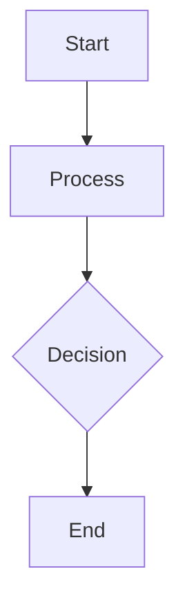

# Design for Design a content delivery network architecture

**Created:** 2025-08-08 22:38:12.399429

**Participants:** Dreamer (anthropic: sim-anthropic), Cost Cutter (openai: sim-openai)

## Description

Refined pragmatic view with trade-offs. FINAL DESIGN: Components, data flow, storage choices, and security layers....

## Architecture Diagram

## Conversation Summary

A 2-turn conversation between Dreamer and Cost Cutter discussing 'Design a content delivery network architecture'. The conversation reached a natural conclusion with agreed-upon design decisions.
