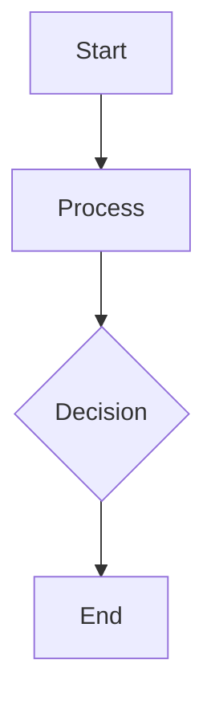

# Design for Build a serverless image processing pipeline

**Created:** 2025-08-08 22:46:44.510914

**Participants:** Dreamer (anthropic: sim-anthropic), Cost Cutter (openai: sim-openai)

## Description

Refined pragmatic view with trade-offs. FINAL DESIGN: Components, data flow, storage choices, and security layers....

## Architecture Diagram

## Conversation Summary

A 2-turn conversation between Dreamer and Cost Cutter discussing 'Build a serverless image processing pipeline'. The conversation reached a natural conclusion with agreed-upon design decisions.
