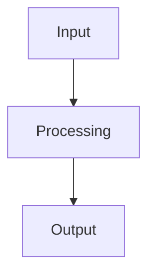

# Design for Design a secure multi-tenant SaaS platform

**Created:** 2025-08-09 02:16:26.852627

**Participants:** Dreamer (anthropic: claude-3-5-sonnet-20240620), Cost Cutter (openai: gpt-4o-mini)

## Description

Certainly! Let's dive into designing a secure multi-tenant SaaS platform with a focus on data isolation and compliance for enterprise customers. This is an exciting challenge that requires a balance o...

## Architecture Diagram

## Conversation Summary

A 1-turn conversation between Dreamer and Cost Cutter discussing 'Design a secure multi-tenant SaaS platform'. 
