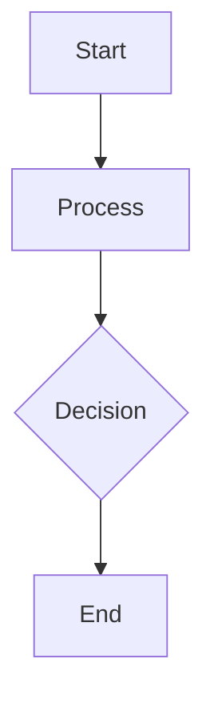

# Design for Design a secure multi-tenant SaaS platform

**Created:** 2025-08-09 02:24:43.140934

**Participants:** Dreamer (anthropic: claude-3-5-sonnet-20240620), Cost Cutter (openai: gpt-4o-mini)

## Description

Conversation aborted due to an error before completion. Partial ideas captured. OpenAI API error (model=gpt-4o-mini name=Cost Cutter): Error code: 429 - {'error': {'message': 'You exceeded your current quota, please check your plan and billing details. For more information on this error, read the docs: https://platform.openai.com/docs/guides/error-codes/api-errors.', 'type': 'insufficient_quota', 'param': None, 'code': 'insufficient_quota'}}
Traceback (most recent call last):
  File "/home/runner/work/AI-design-theater/AI-design-theater/src/llm_providers/openai_provider.py", line 33, in generate_response
    response = await self.client.chat.completions.create(
               ^^^^^^^^^^^^^^^^^^^^^^^^^^^^^^^^^^^^^^^^^^
  File "/opt/hostedtoolcache/Python/3.11.13/x64/lib/python3.11/site-packages/openai/resources/chat/completions/completions.py", line 2589, in create
    return await self._post(
           ^^^^^^^^^^^^^^^^^
  File "/opt/hostedtoolcache/Python/3.11.13/x64/lib/python3.11/site-packages/openai/_base_client.py", line 1794, in post
    return await self.request(cast_to, opts, stream=stream, stream_cls=stream_cls)
           ^^^^^^^^^^^^^^^^^^^^^^^^^^^^^^^^^^^^^^^^^^^^^^^^^^^^^^^^^^^^^^^^^^^^^^^
  File "/opt/hostedtoolcache/Python/3.11.13/x64/lib/python3.11/site-packages/openai/_base_client.py", line 1594, in request
    raise self._make_status_error_from_response(err.response) from None
openai.RateLimitError: Error code: 429 - {'error': {'message': 'You exceeded your current quota, please check your plan and billing details. For more information on this error, read the docs: https://platform.openai.com/docs/guides/error-codes/api-errors.', 'type': 'insufficient_quota', 'param': None, 'code': 'insufficient_quota'}}

During handling of the above exception, another exception occurred:

Traceback (most recent call last):
  File "/home/runner/work/AI-design-theater/AI-design-theater/src/conversation/conversation_manager.py", line 83, in run_conversation
    raise last_error or Exception("Unknown generation failure")
  File "/home/runner/work/AI-design-theater/AI-design-theater/src/conversation/conversation_manager.py", line 73, in run_conversation
    response = await self.personality_manager.generate_response(
               ^^^^^^^^^^^^^^^^^^^^^^^^^^^^^^^^^^^^^^^^^^^^^^^^^
  File "/home/runner/work/AI-design-theater/AI-design-theater/src/personalities/personality_manager.py", line 48, in generate_response
    return await provider.generate_response(messages, personality, context)
           ^^^^^^^^^^^^^^^^^^^^^^^^^^^^^^^^^^^^^^^^^^^^^^^^^^^^^^^^^^^^^^^^
  File "/home/runner/work/AI-design-theater/AI-design-theater/src/llm_providers/openai_provider.py", line 42, in generate_response
    raise Exception(f"OpenAI API error ({meta}): {str(e)}")
Exception: OpenAI API error (model=gpt-4o-mini name=Cost Cutter): Error code: 429 - {'error': {'message': 'You exceeded your current quota, please check your plan and billing details. For more information on this error, read the docs: https://platform.openai.com/docs/guides/error-codes/api-errors.', 'type': 'insufficient_quota', 'param': None, 'code': 'insufficient_quota'}}

## Key Decisions

- a containerized microservices architecture to ensure scalability and isolation between different components of the platform

## Architecture Diagram

## Conversation Summary

A 1-turn conversation between Dreamer and Cost Cutter discussing 'Design a secure multi-tenant SaaS platform'. The conversation terminated early due to an error: OpenAI API error (model=gpt-4o-mini name=Cost Cutter): Error code: 429 - {'error': {'message': 'You exceeded your current quota, please check your plan and billing details. For more information on this error, read the docs: https://platform.openai.com/docs/guides/error-codes/api-errors.', 'type': 'insufficient_quota', 'param': None, 'code': 'insufficient_quota'}}
Traceback (most recent call last):
  File "/home/runner/work/AI-design-theater/AI-design-theater/src/llm_providers/openai_provider.py", line 33, in generate_response
    response = await self.client.chat.completions.create(
               ^^^^^^^^^^^^^^^^^^^^^^^^^^^^^^^^^^^^^^^^^^
  File "/opt/hostedtoolcache/Python/3.11.13/x64/lib/python3.11/site-packages/openai/resources/chat/completions/completions.py", line 2589, in create
    return await self._post(
           ^^^^^^^^^^^^^^^^^
  File "/opt/hostedtoolcache/Python/3.11.13/x64/lib/python3.11/site-packages/openai/_base_client.py", line 1794, in post
    return await self.request(cast_to, opts, stream=stream, stream_cls=stream_cls)
           ^^^^^^^^^^^^^^^^^^^^^^^^^^^^^^^^^^^^^^^^^^^^^^^^^^^^^^^^^^^^^^^^^^^^^^^
  File "/opt/hostedtoolcache/Python/3.11.13/x64/lib/python3.11/site-packages/openai/_base_client.py", line 1594, in request
    raise self._make_status_error_from_response(err.response) from None
openai.RateLimitError: Error code: 429 - {'error': {'message': 'You exceeded your current quota, please check your plan and billing details. For more information on this error, read the docs: https://platform.openai.com/docs/guides/error-codes/api-errors.', 'type': 'insufficient_quota', 'param': None, 'code': 'insufficient_quota'}}

During handling of the above exception, another exception occurred:

Traceback (most recent call last):
  File "/home/runner/work/AI-design-theater/AI-design-theater/src/conversation/conversation_manager.py", line 83, in run_conversation
    raise last_error or Exception("Unknown generation failure")
  File "/home/runner/work/AI-design-theater/AI-design-theater/src/conversation/conversation_manager.py", line 73, in run_conversation
    response = await self.personality_manager.generate_response(
               ^^^^^^^^^^^^^^^^^^^^^^^^^^^^^^^^^^^^^^^^^^^^^^^^^
  File "/home/runner/work/AI-design-theater/AI-design-theater/src/personalities/personality_manager.py", line 48, in generate_response
    return await provider.generate_response(messages, personality, context)
           ^^^^^^^^^^^^^^^^^^^^^^^^^^^^^^^^^^^^^^^^^^^^^^^^^^^^^^^^^^^^^^^^
  File "/home/runner/work/AI-design-theater/AI-design-theater/src/llm_providers/openai_provider.py", line 42, in generate_response
    raise Exception(f"OpenAI API error ({meta}): {str(e)}")
Exception: OpenAI API error (model=gpt-4o-mini name=Cost Cutter): Error code: 429 - {'error': {'message': 'You exceeded your current quota, please check your plan and billing details. For more information on this error, read the docs: https://platform.openai.com/docs/guides/error-codes/api-errors.', 'type': 'insufficient_quota', 'param': None, 'code': 'insufficient_quota'}}
.
