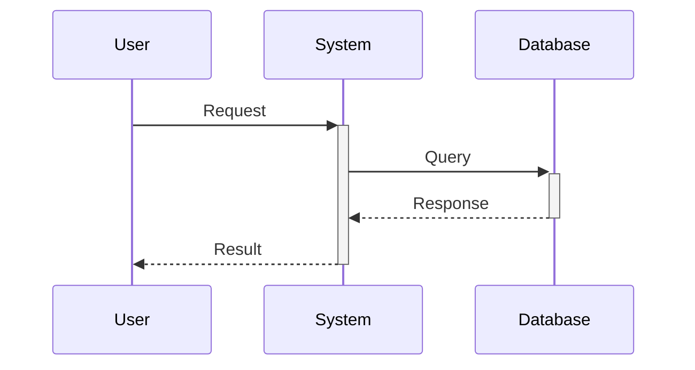

# Design for Design a secure multi-tenant SaaS platform

**Created:** 2025-08-09 03:50:13.672931

**Participants:** Dreamer (anthropic: claude-3-5-sonnet-20240620), Cost Cutter (openai: gpt-4o-mini)

## Description

Certainly! Let's start outlining an initial architectural approach for a secure multi-tenant SaaS platform that ensures data isolation and compliance for enterprise customers. Here's a high-level over...

## Key Decisions

- I appreciate the suggestion of a geo-distributed architecture with multi-region deployment. This approach effectively addresses data residency requirements while potentially improving performance for global users
- Use a smart routing layer to direct requests to the appropriate region based on data residency rules and performance optimization
- Data Mesh Architecture:
- Use a central policy engine to manage and update edge functions across regions
- Use AI-driven predictive algorithms to optimize data placement and replication based on usage patterns and compliance requirements
- To move towards a final design, let's consider: How can we incorporate a robust disaster recovery and business continuity plan into this globally distributed architecture without significantly increasing complexity or costs? This is crucial for ensuring high availability and data integrity for enterprise customers

## Trade-offs

- Certainly! Let's start outlining an initial architectural approach for a secure multi-tenant SaaS platform that ensures data isolation and compliance for enterprise customers. Here
- I appreciate the innovative approach with the blockchain-based audit trail. It's a creative solution that could indeed provide a tamper-proof record for auditing and compliance, wh

## Implementation Notes

- Certainly! Let's start outlining an initial architectural approach for a secure multi-tenant SaaS platform that ensures data isolation and compliance for enterprise customers. Here

## Architecture Diagram

## Conversation Summary

A 4-turn conversation between Dreamer and Cost Cutter discussing 'Design a secure multi-tenant SaaS platform'. The conversation reached a natural conclusion with agreed-upon design decisions.
