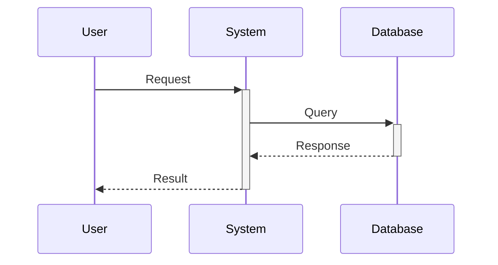

# Design for Design a secure multi-tenant SaaS platform

**Created:** 2025-08-09 04:41:38.368271

**Participants:** Dreamer (anthropic: claude-3-5-sonnet-20240620), Cost Cutter (openai: gpt-4o-mini)

## Description

Certainly! Let's start designing a secure multi-tenant SaaS platform with a focus on data isolation and compliance for enterprise customers. Here's an initial architectural approach to kick off our di...

## Key Decisions

- In the spirit of favoring bold, user-delighting capabilities even if the architecture is novel, what if we took a more radical approach? We could implement an AI-driven security configuration assistant that learns from industry best practices, compliance frameworks, and user behavior to suggest optimal security configurations

## Trade-offs

- powerful, scripting capability? could provide a user-friendly interface for most common security and compliance settings, while also offering an advanced mode that allows for more granular control through a simplified scripting language
- also allow for plug-in modules developed by our team or trusted third-party partners. way, we maintain the simplicity of a visual interface while allowing for extensibility to meet specialized requirements

## Implementation Notes

- Certainly! Let's start designing a secure multi-tenant SaaS platform with a focus on data isolation and compliance for enterprise customers. Here's an initial architectural approac
- I appreciate your suggestion of a hybrid multi-tenancy approach, as it does offer a balance between isolation and scalability. However, I'm concerned that introducing multiple tena
- I appreciate your suggestion of a unified architecture with feature toggles for security customization. It's an elegant way to maintain operational simplicity while offering flexib

## Architecture Diagram

## Conversation Summary

A 13-turn conversation between Dreamer and Cost Cutter discussing 'Design a secure multi-tenant SaaS platform'. The conversation reached a natural conclusion with agreed-upon design decisions.
