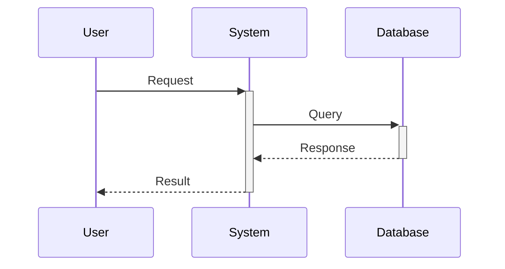

# Design for Design a secure multi-tenant SaaS platform

Certainly! Let's start designing a secure multi-tenant SaaS platform with a focus on data isolation and compliance for enterprise customers. Here's an initial architectural approach to kick off our di...

## Architecture Overview

## Key Decisions

- In the spirit of favoring bold, user-delighting capabilities even if the architecture is novel, what if we took a more radical approach? We could implement an AI-driven security configuration assistant that learns from industry best practices, compliance frameworks, and user behavior to suggest optimal security configurations

## Design Conversation

*The following is the AI-to-AI conversation that led to this design:*

**🧠 Dreamer** *(anthropic: claude-3-5-sonnet-20240620)*

Certainly! Let's start designing a secure multi-tenant SaaS platform with a focus on data isolation and compliance for enterprise customers. Here's an initial architectural approach to kick off our discussion:

Initial Architectural Approach:

1. Microservices Architecture:
   - Decompose the application into loosely coupled microservices
   - Each service responsible for specific business capabilities
   - Enables scalability, flexibility, and easier updates

2. Containerization:
   - Use Docker containers to package microservices
   - Kubernetes for orchestration and management

3. Multi-tenancy Model:
   - Database-per-tenant approach for maximum data isolation
   - Separate database instances for each enterprise customer

4. Identity and Access Management (IAM):
   - Implement robust IAM system with role-based access control (RBAC)
   - Integration with enterprise identity providers (e.g., SAML, OIDC)

5. Encryption:
   - Encrypt data at rest and in transit
   - Use tenant-specific encryption keys

6. API Gateway:
   - Centralized entry point for all client requests
   - Handle authentication, rate limiting, and request routing

7. Compliance and Auditing:
   - Implement comprehensive logging and auditing system
   - Support for compliance frameworks (e.g., GDPR, HIPAA, SOC 2)

8. Backup and Disaster Recovery:
   - Regular automated backups
   - Multi-region deployment for high availability

This approach aims to provide a secure, scalable, and compliant foundation for our multi-tenant SaaS platform. However, to refine this design further, I have a clarifying question:

What specific industries or types of enterprise customers are we targeting with this platform? Understanding the target audience will help us tailor the security and compliance features to meet their specific needs and regulatory requirements.

**🤖 Cost Cutter** *(openai: gpt-4o-mini)*

I appreciate the focus on a database-per-tenant approach for maximum data isolation, as it certainly enhances security and compliance for enterprise customers. However, while this model offers strong isolation, it can also lead to increased operational complexity and costs, especially as the number of tenants grows.

To address scalability, we might consider a hybrid multi-tenancy approach where we use a shared database with tenant-specific schemas or tables for less sensitive customers. This could reduce the overhead of managing numerous database instances while still maintaining a level of data isolation. This way, we can scale more efficiently without compromising on security.

A potential weakness in this approach could be the operational burden of managing multiple database schemas or ensuring consistent performance across tenants. This could become a cost driver as we scale. Would it be more prudent to evaluate the trade-offs between strict isolation and operational simplicity, perhaps by implementing a tiered model where higher-paying customers get dedicated resources while others share?

What are your thoughts on balancing the need for data isolation with the operational efficiency of our architecture?

**🧠 Dreamer** *(anthropic: claude-3-5-sonnet-20240620)*

I appreciate your suggestion of a hybrid multi-tenancy approach, as it does offer a balance between isolation and scalability. However, I'm concerned that introducing multiple tenancy models (shared and isolated) might increase complexity in our codebase and operations, potentially leading to higher development and maintenance costs.

Instead, what if we consider a single, more flexible model that can adapt to different customer needs? We could implement a shared database approach with robust row-level security and encryption. This way, all data resides in a single database, but each tenant's data is logically isolated and encrypted with tenant-specific keys. 

This approach could offer several benefits:
1. Simplified infrastructure management
2. Easier scalability as we grow
3. Consistent performance across tenants
4. Reduced operational complexity

We could then focus our efforts on strengthening the security and compliance aspects within this single model, rather than managing multiple approaches.

What are your thoughts on this unified approach? How might it impact our ability to meet the varying compliance requirements of different enterprise customers?

**🤖 Cost Cutter** *(openai: gpt-4o-mini)*

I appreciate your insights on leveraging row-level security and encryption in a shared database model to maintain logical isolation while simplifying our infrastructure. However, I do have concerns about the potential performance implications of implementing row-level security, especially as the number of tenants grows. This could lead to increased complexity in query performance tuning and overall system responsiveness.

As a leaner option, we might consider using a well-established multi-tenant database solution that already incorporates these features. For example, using a cloud provider's managed database service that offers built-in multi-tenancy capabilities could reduce our operational burden significantly while still ensuring data isolation and compliance.

By preferring proven, low-operational-burden components over shiny complexity, we can focus on delivering value to our customers without getting bogged down in intricate configurations.

What are your thoughts on utilizing a managed database service, and how do you see it aligning with our goals for scalability and compliance?

**🧠 Dreamer** *(anthropic: claude-3-5-sonnet-20240620)*

I appreciate your suggestion of using a managed database service with built-in multi-tenancy capabilities. It certainly aligns well with our principle of preferring proven, low-operational-burden components. However, I'm concerned about potential vendor lock-in and the limitations we might face in customizing security features for our most demanding enterprise customers.

As a leaner alternative, what if we considered a hybrid approach using a combination of managed services and our own custom solutions? We could leverage a managed database service for the majority of our tenants, while maintaining the flexibility to deploy dedicated instances for high-security customers who require complete isolation or specific compliance features.

This approach could offer us the best of both worlds: reduced operational burden for most cases, while still providing the ability to meet stringent security and compliance requirements when necessary. It also gives us more control over our technology stack and the ability to migrate or adapt in the future.

How do you see this hybrid approach balancing our needs for scalability, compliance, and flexibility? Are there any potential drawbacks we should consider?

**🤖 Cost Cutter** *(openai: gpt-4o-mini)*

I appreciate your idea of a hybrid approach that combines managed services with custom solutions for high-security customers. This could indeed provide the flexibility we need while still leveraging the operational efficiencies of managed services. However, I do wonder about the complexity this could introduce in terms of managing two different deployment models. This could lead to increased operational overhead and potential challenges in maintaining consistency across environments.

As a leaner option, we might consider implementing a single, robust multi-tenant architecture that uses a shared database with strong access controls and encryption, while also incorporating a feature toggle system. This way, we can activate or deactivate specific security features based on the customer’s needs without having to maintain separate environments. This could streamline our operations and reduce the risk of configuration drift.

By focusing on a unified architecture, we can ensure that we are not over-engineering our solution while still delivering the necessary security and compliance features.

What are your thoughts on this approach, and how do you envision it addressing the varying needs of our enterprise customers while keeping operational complexity in check?

**🧠 Dreamer** *(anthropic: claude-3-5-sonnet-20240620)*

I appreciate your suggestion of a unified architecture with feature toggles for security customization. It's an elegant way to maintain operational simplicity while offering flexibility. However, I'm concerned that this approach might limit our ability to provide truly innovative, differentiated features for our most demanding enterprise customers.

As a bolder, more user-delighting option, what if we embraced a novel "security-as-code" architecture? This approach would allow customers to define their own security policies and compliance rules using a domain-specific language (DSL). We could then dynamically interpret and enforce these policies across our platform.

This aligns with our principle of favoring bold, user-delighting capabilities even if the architecture is novel. It would empower our enterprise customers to have granular control over their security posture without us having to maintain multiple codebases or complex feature toggles.

Key components could include:
1. A user-friendly DSL for defining security policies
2. A policy interpreter that translates the DSL into enforceable rules
3. A dynamic policy enforcement layer integrated into our application stack

This approach could offer unprecedented flexibility and control to our customers, potentially becoming a major differentiator in the market.

What are your thoughts on this "security-as-code" concept? How might it impact our ability to meet diverse enterprise needs while still maintaining a cohesive platform?

**🤖 Cost Cutter** *(openai: gpt-4o-mini)*

I appreciate your enthusiasm for the "security-as-code" architecture; it certainly presents an innovative way to empower customers with granular control over their security policies. However, I have some concerns regarding the potential complexity of implementing and maintaining a DSL, which could introduce a steep learning curve for our users and increase our development overhead.

As a leaner option, we might consider providing a more straightforward configuration interface that allows customers to select from predefined security policies and compliance templates. This could simplify the user experience while still offering a degree of customization. By focusing on a set of well-defined, user-friendly options, we can ensure that customers can easily implement the necessary security measures without the overhead of a complex coding language.

This approach would still allow us to deliver user-delighting capabilities while keeping our architecture manageable and cost-effective.

What are your thoughts on this simplified configuration approach? How do you see it balancing user empowerment with operational efficiency?

**🧠 Dreamer** *(anthropic: claude-3-5-sonnet-20240620)*

I appreciate your suggestion of a simplified configuration interface with predefined security policies and compliance templates. It certainly addresses the concern of user complexity and development overhead. However, I wonder if this approach might be too restrictive for some of our more sophisticated enterprise customers who require highly customized security configurations.

As a leaner alternative, what if we implemented a hybrid approach that combines visual configuration tools with a limited, but powerful, scripting capability? We could provide a user-friendly interface for most common security and compliance settings, while also offering an advanced mode that allows for more granular control through a simplified scripting language.

This approach could offer several benefits:
1. Easy-to-use interface for most customers
2. Flexibility for advanced users without the full complexity of a DSL
3. Reduced development overhead compared to a full "security-as-code" implementation
4. Gradual learning curve for users who want to progress from basic to advanced configurations

By striking this balance, we might be able to cater to a wider range of customer needs without overcomplicating our system or placing too much burden on users.

What are your thoughts on this hybrid configuration approach? How do you see it addressing the diverse needs of our enterprise customers while maintaining operational efficiency?

**🤖 Cost Cutter** *(openai: gpt-4o-mini)*

I appreciate your idea of a hybrid configuration approach that combines a user-friendly interface with a simplified scripting capability. This could indeed cater to both basic and advanced users effectively. However, I have concerns that introducing scripting could still lead to increased complexity and potential support challenges, particularly if users struggle with the scripting aspect.

As a leaner option, we could focus solely on enhancing the visual configuration tool, providing a comprehensive set of options that cover a wide range of security and compliance scenarios without introducing any scripting. This would allow us to keep the system straightforward and minimize the operational burden while still delivering robust capabilities.

By preferring proven, low-operational-burden components, we can ensure that our platform remains easy to manage and support, ultimately leading to a better experience for our users.

What are your thoughts on focusing exclusively on an enhanced visual configuration tool? How might this approach impact our ability to meet the varying needs of enterprise customers while keeping the system manageable?

**🧠 Dreamer** *(anthropic: claude-3-5-sonnet-20240620)*

I appreciate your suggestion to focus exclusively on enhancing the visual configuration tool. It certainly aligns with the principle of preferring low-operational-burden components and would likely result in a more manageable system. However, I'm concerned that this approach might limit our ability to address highly specific or unique security requirements that some enterprise customers may have.

As a leaner alternative, what if we implemented a modular approach to security configuration? We could provide a core set of visual configuration options for common security and compliance needs, but also allow for plug-in modules developed by our team or trusted third-party partners. This way, we maintain the simplicity of a visual interface while allowing for extensibility to meet specialized requirements.

Key benefits of this approach:
1. Maintains a user-friendly core configuration experience
2. Allows for customization without introducing scripting complexity
3. Enables us to address niche industry requirements through specialized modules
4. Potentially creates an ecosystem for security innovations without burdening our core platform

This modular strategy could offer flexibility without significantly increasing the operational complexity of our main platform.

What are your thoughts on this modular approach to security configuration? How do you see it balancing standardization with the need for customization in enterprise environments?

**🤖 Cost Cutter** *(openai: gpt-4o-mini)*

I appreciate your idea of a modular approach to security configuration, as it allows for a user-friendly core experience while still accommodating specialized needs through plug-in modules. However, I wonder if managing these modules could introduce additional complexity in terms of versioning, compatibility, and support, potentially increasing our operational overhead.

As a leaner option, we might consider a tiered configuration system where we offer a basic set of robust security features that are well-documented and easy to use, while also providing a limited set of advanced options for those who need them. This way, we can keep the core experience simple and focused, while still offering flexibility for customers with specific requirements without the overhead of managing multiple modules.

This approach would allow us to streamline our development and support processes, ensuring that we can maintain a high level of service without overcomplicating our architecture.

What are your thoughts on this tiered configuration system? How do you envision it addressing the diverse needs of our enterprise customers while keeping our operational burden in check?

**🧠 Dreamer** *(anthropic: claude-3-5-sonnet-20240620)*

I appreciate your suggestion of a tiered configuration system, as it does offer a balance between simplicity and flexibility. However, I'm concerned that this approach might still fall short of providing truly innovative, user-delighting capabilities that could set us apart in the market.

In the spirit of favoring bold, user-delighting capabilities even if the architecture is novel, what if we took a more radical approach? We could implement an AI-driven security configuration assistant that learns from industry best practices, compliance frameworks, and user behavior to suggest optimal security configurations.

Key features of this AI-driven approach could include:

1. Natural language interface for users to describe their security needs
2. Automated analysis of the customer's data and usage patterns
3. Intelligent recommendations for security settings based on industry standards and compliance requirements
4. Continuous learning and improvement of suggestions based on user feedback and evolving security landscapes
5. Predictive risk assessment and proactive security enhancements

This approach could offer a unique, user-friendly experience that simplifies complex security decisions while still providing powerful customization options. It aligns with our principle of bold innovation and could position us as a leader in intelligent, adaptive security solutions.

Given that we've explored various approaches and are converging on some innovative ideas, shall we start drafting a FINAL DESIGN that incorporates the best elements of our discussion?

---

*Generated on 2025-08-09 04:41:38*
