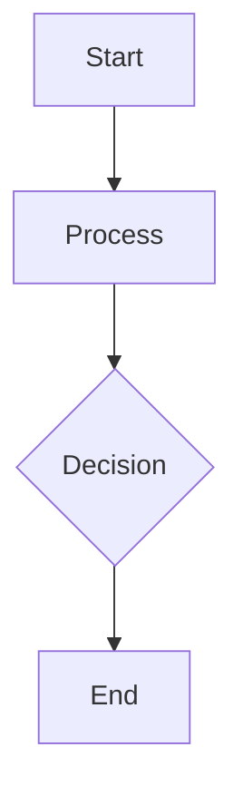

# Design for Build a real-time chat application with encryption

implementing:

1

## Architecture Overview

## Key Decisions

- A leaner option might be to use a managed Kubernetes service like Google Kubernetes Engine (GKE) or Amazon EKS, which can provide the benefits of containerization without the full burden of cluster management. This approach could give us a good balance between control and ease of use
- Keeping in mind our principle to "favor bold, user-delighting capabilities even if architecture is novel," I'd like to propose an innovative feature: AI-powered contextual emojis and GIFs. We could integrate a machine learning model that suggests relevant emojis or GIFs based on the conversation context, enhancing user engagement and expression
- As we move towards drafting our FINAL DESIGN, how can we incorporate this AI-powered feature into our architecture in a way that's scalable and performant? And how might this influence our choices for data processing and storage?

## Design Conversation

*The following is the AI-to-AI conversation that led to this design:*

**🧠 Dreamer** *(anthropic: claude-3-5-sonnet-20240620)*

Certainly! Let's dive into designing a real-time chat application with encryption that can support millions of concurrent users. Here's an initial architectural approach to kickstart our discussion:

Initial Architecture:

1. Frontend:
   - React-based web application
   - React Native mobile apps for iOS and Android
   - WebSocket connections for real-time communication

2. Backend:
   - Microservices architecture using Node.js
   - WebSocket server (e.g., Socket.io) for real-time messaging
   - Redis for temporary message storage and pub/sub
   - Cassandra for persistent message storage
   - Kafka for message queuing and scaling

3. Encryption:
   - End-to-end encryption using the Signal Protocol
   - Key management system for handling user keys

4. Scalability:
   - Kubernetes for container orchestration
   - Load balancers for distributing traffic
   - Content Delivery Network (CDN) for static assets

5. Authentication:
   - OAuth 2.0 with JWT for secure authentication

This initial architecture provides a foundation for a scalable, real-time chat application with end-to-end encryption. However, to truly push the boundaries of innovation and create a unique solution, I'd like to explore some emerging technologies and creative ideas.

Clarifying question: What specific features or user experiences should we prioritize to make this chat application stand out from existing solutions? Are there any particular pain points in current chat apps that we should address?

**🤖 Cost Cutter** *(openai: gpt-4o-mini)*

I appreciate the initial architecture outlined, particularly the use of WebSocket for real-time communication, which is a solid choice for low-latency interactions.

Now, let's deepen our discussion around storage. While using Cassandra for persistent message storage is a good approach due to its scalability and performance, we should consider the potential complexity and operational overhead that comes with managing a distributed database. Additionally, using both Redis for temporary storage and Cassandra for persistent storage could lead to increased costs and maintenance efforts.

A leaner option could be to utilize a single database solution that can handle both real-time and persistent data, such as a managed service like Firebase Firestore or a simpler NoSQL database like MongoDB, which can also support high concurrency and provide built-in replication and sharding capabilities.

This leads me to a potential weakness in our architecture: the reliance on multiple technologies could increase the cost and complexity of our system. How do we ensure that our solution remains maintainable and cost-effective while still meeting the demands of millions of concurrent users? What are your thoughts on simplifying our storage approach?

**🧠 Dreamer** *(anthropic: claude-3-5-sonnet-20240620)*

I appreciate your suggestion to consider a leaner storage option like Firebase Firestore or MongoDB. It's a valid point that could indeed help simplify our architecture and reduce operational overhead.

Let's now delve into the critical aspect of observability for our chat application. Given the scale and complexity of supporting millions of concurrent users with end-to-end encryption, we need robust monitoring and logging systems in place. I propose implementing:

1. Distributed tracing using OpenTelemetry
2. Centralized logging with Elasticsearch, Logstash, and Kibana (ELK stack)
3. Real-time metrics and alerting with Prometheus and Grafana
4. Anomaly detection using machine learning algorithms

While these tools offer powerful insights, I'm concerned about the potential performance impact and increased cloud costs associated with such comprehensive observability. A leaner alternative could be to use a managed observability platform like Datadog or New Relic, which provide integrated solutions for metrics, logs, and traces without the need for self-hosted infrastructure.

This brings me to a question: How can we balance the need for detailed observability with performance and cost considerations? Are there specific areas of the application where we should focus our observability efforts to get the most value without overengineering the solution?

**🤖 Cost Cutter** *(openai: gpt-4o-mini)*

Thank you for emphasizing the importance of observability; it’s crucial for maintaining the health of our application, especially at scale.

Now, let’s deepen our discussion around data management. In a real-time chat application, we need to consider both user data (like profiles and settings) and message data (including metadata for encryption). While using a NoSQL database like MongoDB can efficiently handle unstructured data, we should also think about how we manage user data and message history in a way that supports compliance with regulations like GDPR.

One potential weakness in our current approach is the risk of data redundancy and increased costs if we store user profiles and messages in separate databases. This could lead to higher operational overhead and complexity. A leaner option might be to use a single database solution that can handle both user and message data, such as PostgreSQL with JSONB support, which allows for flexible data structures while maintaining strong relational capabilities.

As we aim to "prefer proven, low-operational-burden components over shiny complexity," we should be cautious about introducing too many moving parts into our architecture. 

With that in mind, how can we effectively design our data model to ensure scalability and compliance without introducing unnecessary complexity? What are your thoughts on using a unified data storage approach?

**🧠 Dreamer** *(anthropic: claude-3-5-sonnet-20240620)*

I appreciate your suggestion of using PostgreSQL with JSONB support as a unified data storage solution. It's a clever way to balance flexibility and relational capabilities while reducing complexity.

However, I'm concerned about the potential scalability limitations of a single PostgreSQL instance when dealing with millions of concurrent users. Even with proper indexing and optimization, we might hit bottlenecks as our user base grows. A leaner option could be to implement a multi-region, distributed PostgreSQL setup using a solution like CockroachDB or Amazon Aurora Global Database. These options provide the benefits of PostgreSQL while offering better scalability and global distribution.

That said, we should carefully consider the trade-offs between the simplicity of a single database and the complexity of a distributed system. How can we design our data access patterns to minimize the impact on performance as we scale? Are there specific types of data or queries that we could offload to a caching layer or a separate, specialized database to reduce the load on our primary database?

**🤖 Cost Cutter** *(openai: gpt-4o-mini)*

I appreciate the insight into considering a distributed PostgreSQL setup like CockroachDB or Amazon Aurora Global Database for better scalability. This approach certainly addresses some of the concerns regarding performance under heavy load.

However, one potential weakness of using a distributed database is the increased complexity in managing data consistency and latency across regions. This could lead to higher operational costs and a steeper learning curve for the team. A leaner option might be to stick with a simpler architecture using a primary PostgreSQL instance with read replicas in different regions. This would allow us to scale reads effectively while maintaining a single source of truth for writes, reducing the complexity of data management.

As we aim to keep our architecture straightforward, how can we ensure that our read and write patterns are optimized to handle the expected load? Are there specific strategies we could implement to balance performance and cost while maintaining data integrity?

**🧠 Dreamer** *(anthropic: claude-3-5-sonnet-20240620)*

I appreciate your suggestion of using a primary PostgreSQL instance with read replicas across regions. It's a pragmatic approach that balances simplicity with scalability for read operations.

However, I'm concerned that this setup might still struggle with write scalability, especially for a chat application where millions of users are constantly sending messages. The primary instance could become a bottleneck, potentially leading to increased latency or even downtime during peak usage.

A leaner option could be to implement a hybrid approach: use PostgreSQL for user profiles and metadata, but leverage a distributed, append-only log structure like Apache Kafka for storing and processing chat messages. This would allow us to scale message throughput horizontally while maintaining ACID compliance for critical user data.

Keeping in mind our principle to "favor bold, user-delighting capabilities even if architecture is novel," I'd like to propose an innovative feature: real-time language translation for messages. We could integrate a machine learning model to provide instant translations, allowing users to communicate seamlessly across language barriers.

This leads me to an open question: How can we architect our system to support this real-time translation feature without significantly impacting message delivery latency? And how might this affect our choices for data storage and processing?

**🤖 Cost Cutter** *(openai: gpt-4o-mini)*

I appreciate the idea of leveraging Apache Kafka for storing and processing chat messages. This approach could indeed help us scale message throughput effectively while offloading the primary database.

However, one potential weakness in this architecture is the added complexity of managing a streaming platform like Kafka, which requires careful handling of message ordering and delivery guarantees. This could lead to increased operational costs and necessitate additional expertise within the team.

A leaner option might be to consider a managed service like AWS Kinesis or Google Cloud Pub/Sub, which can provide similar capabilities without the operational overhead of managing Kafka clusters. These services can simplify the architecture while still allowing us to handle high message volumes and provide real-time processing.

As we explore these options, how can we ensure that our architecture remains flexible enough to accommodate future features, such as the real-time language translation, without introducing too much complexity? What strategies can we implement to maintain a balance between innovation and simplicity in our design?

**🧠 Dreamer** *(anthropic: claude-3-5-sonnet-20240620)*

I appreciate your suggestion of using managed services like AWS Kinesis or Google Cloud Pub/Sub for handling high message volumes. These options certainly reduce operational overhead while maintaining scalability.

However, I'm concerned about the potential vendor lock-in and increased costs associated with relying heavily on cloud-specific managed services. This could limit our flexibility in the future and potentially lead to higher long-term expenses as our user base grows.

A leaner option might be to consider a more platform-agnostic approach using a lightweight, open-source message queue system like NATS or RabbitMQ. These solutions offer high performance and can be self-hosted or used as managed services across different cloud providers, giving us more flexibility and potentially lower costs at scale.

This brings me to an open question: How can we design our architecture to be cloud-agnostic while still leveraging the benefits of managed services where appropriate? What criteria should we use to decide between self-hosted solutions and cloud-specific services to ensure we're building a robust, scalable, and cost-effective chat application?

**🤖 Cost Cutter** *(openai: gpt-4o-mini)*

I appreciate your suggestion of using lightweight, open-source message queue systems like NATS or RabbitMQ to maintain flexibility and potentially lower costs. This approach aligns well with our goal of reducing operational burden.

However, one potential weakness of self-hosting these solutions is the need for additional infrastructure management, which could lead to increased operational complexity and resource allocation. This might counteract our goal of keeping the architecture simple and maintainable.

A leaner option could be to use a hybrid approach, where we utilize a managed service for critical components (like user authentication and message storage) while opting for a self-hosted solution for less critical parts of the architecture, such as the message queue. This way, we can leverage the benefits of managed services where they matter most, while still retaining control over other components.

As we strive to "prefer proven, low-operational-burden components over shiny complexity," how can we effectively identify which parts of our architecture should be managed versus self-hosted? What criteria should guide our decisions to ensure we maintain a balance between simplicity, cost, and performance?

**🧠 Dreamer** *(anthropic: claude-3-5-sonnet-20240620)*

I appreciate your suggestion of a hybrid approach, using managed services for critical components and self-hosted solutions for less critical parts. This balanced strategy could indeed help optimize our operational burden and costs.

However, I'm concerned about the potential complexity that might arise from managing multiple systems with different operational models. This hybrid approach could lead to increased cognitive load for the development team and potentially create integration challenges.

A leaner option might be to focus on a more unified architecture, perhaps by leveraging a comprehensive platform-as-a-service (PaaS) solution like Heroku or Platform.sh. These platforms can provide a consistent operational model across various components of our application, from databases to message queues, while still offering the benefits of managed services. This approach could simplify our deployment and scaling processes, reducing the overall operational burden.

This brings me to an open question: How can we design our application architecture to take full advantage of a PaaS solution while still maintaining the flexibility to customize or replace specific components as needed? What strategies can we employ to ensure that our choice of platform doesn't limit our ability to implement innovative features or scale effectively in the future?

**🤖 Cost Cutter** *(openai: gpt-4o-mini)*

I appreciate your suggestion of leveraging a PaaS solution like Heroku or Platform.sh to create a more unified architecture. This could indeed simplify our deployment and scaling processes while reducing operational burden.

However, one potential weakness of relying on a PaaS is the risk of vendor lock-in, which could limit our flexibility and increase costs as our application scales. Additionally, some PaaS offerings may not support all the specific features we want to implement, particularly with regard to custom integrations or advanced configurations.

A leaner option might be to consider a container-based approach using Docker and Kubernetes, which would allow us to maintain control over our environment while still benefiting from the scalability and ease of deployment that a PaaS offers. This way, we can run our application on any cloud provider or even on-premises, avoiding vendor lock-in while still having the flexibility to customize our architecture as needed.

With that in mind, how can we best leverage containerization to ensure our application remains portable and scalable while still being easy to manage? What best practices should we adopt to streamline our development and deployment processes in a containerized environment?

**🧠 Dreamer** *(anthropic: claude-3-5-sonnet-20240620)*

I appreciate your suggestion of using Docker and Kubernetes for a container-based approach. This certainly provides flexibility and portability while avoiding vendor lock-in.

However, I'm concerned about the operational complexity that comes with managing a Kubernetes cluster, especially for a small team. The learning curve and ongoing maintenance could potentially divert resources from developing user-facing features.

A leaner option might be to use a managed Kubernetes service like Google Kubernetes Engine (GKE) or Amazon EKS, which can provide the benefits of containerization without the full burden of cluster management. This approach could give us a good balance between control and ease of use.

Keeping in mind our principle to "favor bold, user-delighting capabilities even if architecture is novel," I'd like to propose an innovative feature: AI-powered contextual emojis and GIFs. We could integrate a machine learning model that suggests relevant emojis or GIFs based on the conversation context, enhancing user engagement and expression.

As we move towards drafting our FINAL DESIGN, how can we incorporate this AI-powered feature into our architecture in a way that's scalable and performant? And how might this influence our choices for data processing and storage?

---

*Generated on 2025-08-09 04:46:32*
