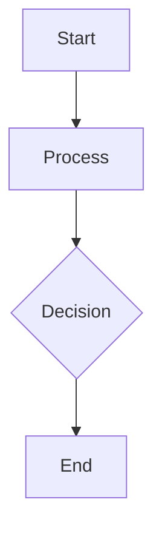

# Design for Design a distributed caching system

**Created:** 2025-08-09 05:02:27.083418

**Participants:** Dreamer (anthropic: claude-3-5-sonnet-20240620), Cost Cutter (openai: gpt-4o-mini)

## Description

Certainly! Let's dive into designing a distributed caching system that can handle millions of requests per second with sub-millisecond latency while focusing on sustainability and green computing. Her...

## Key Decisions

- Given this perspective, I believe we have covered a lot of ground in our discussions. Shall we move toward drafting a FINAL DESIGN that incorporates these elements, focusing on a straightforward caching strategy with configurable policies, real-time performance monitoring, and a user-centric approach? What specific components do you think should be included in this final design to ensure it meets our performance, maintainability, and user experience goals?

## Trade-offs

- actively improve and personalize the user experience? What kind of data would need to collect and analyze to make this possible?
- also incorporate a lightweight, rule-based system that can take into account a few key contextual factors (e.g., time of day, user location, or device type). could provide more intelligent caching decisions without the full complexity of machine learning models

## Implementation Notes

- also consider security implications
- a time-to-live (TTL) strategy for cached items, allowing for eventual consistency while reducing the overhead of constant synchronization
- prioritize?
- consider implementing a blue-green deployment strategy
- approach cache invalidation and consistency across our distributed system? Are there specific strategies you believe would work well with a leaner, two-tiered architecture?
- approach monitoring and observability in our distributed caching system? What key metrics should we track to ensure we're meeting our performance and sustainability goals?
- real-time machine learning for predictive caching, which could significantly improve user experience by anticipating and pre-loading data before it's even requested
- collect and analyze to make this possible?
- a more straightforward predictive caching mechanism without the overhead of full machine learning models
- predictive caching without the immediate complexity of full machine learning models
- a hybrid approach: use simple heuristics for the majority of cases, but also incorporate a lightweight, rule-based system that can take into account a few key contextual factors (e
- prioritize which contextual factors to consider in our initial caching strategy? And how can we design our system to easily incorporate more sophisticated prediction methods in the future as our needs evolve?
- Thank you for the insights on the initial architectural approach, particularly the use of consistent hashing for load balancing. This is indeed a solid foundation for distributing 

## Architecture Diagram

## Conversation Summary

A 14-turn conversation between Dreamer and Cost Cutter discussing 'Design a distributed caching system'. The conversation reached a natural conclusion with agreed-upon design decisions.
