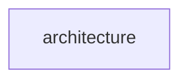

# Design for Design a secure multi-tenant SaaS platform

**Created:** 2025-08-09 09:07:57.383672

**Participants:** Dreamer (anthropic: claude-3-5-sonnet-20240620), Cost Cutter (openai: gpt-4o-mini)

## Description

Certainly! Let's dive into designing a secure multi-tenant SaaS platform with a focus on data isolation and compliance for enterprise customers. Here's an initial architectural approach to get us star...

## Key Decisions

- However, I'm slightly concerned that by limiting our API to only a few critical features, we might miss opportunities to truly delight our users with unexpected integrations or novel use cases. Remember our guiding principle to favor bold, user-delighting capabilities even if the architecture is novel
- Given that we've explored various approaches and are converging on a solution, I think we're ready to start drafting our final design. How do you feel about incorporating GraphQL as a key component of our architecture? And what other core elements from our discussion should we prioritize in our final design to ensure we're creating a secure, scalable, and innovative multi-tenant SaaS platform?

## Trade-offs

- with the ability to "plug in" dedicated resources (like separate databases or specialized microservices) for tenants that require them. could allow us to offer cutting-edge features tailored to specific industries or use cases

## Implementation Notes

- unique features or optimizations for specific tenants
- put in place to ensure that plugins don't negatively impact the performance or security of the overall system?
- conduct thorough testing and validation for each new plugin
- Certainly! Let's dive into designing a secure multi-tenant SaaS platform with a focus on data isolation and compliance for enterprise customers. Here's an initial architectural app
- I appreciate your suggestion of offering a limited set of well-defined extension points within our core platform. This approach could indeed help us maintain flexibility while redu
- Thank you for highlighting the potential of an API-first architecture. This approach could indeed provide the flexibility we need while keeping our core platform stable and managea
- I appreciate your suggestion of a modular API design focusing on key, high-value functionalities. This approach could indeed help us maintain simplicity while still offering powerf

## Architecture Diagram

## Conversation Summary

A 13-turn conversation between Dreamer and Cost Cutter discussing 'Design a secure multi-tenant SaaS platform'. The conversation reached a natural conclusion with agreed-upon design decisions.
