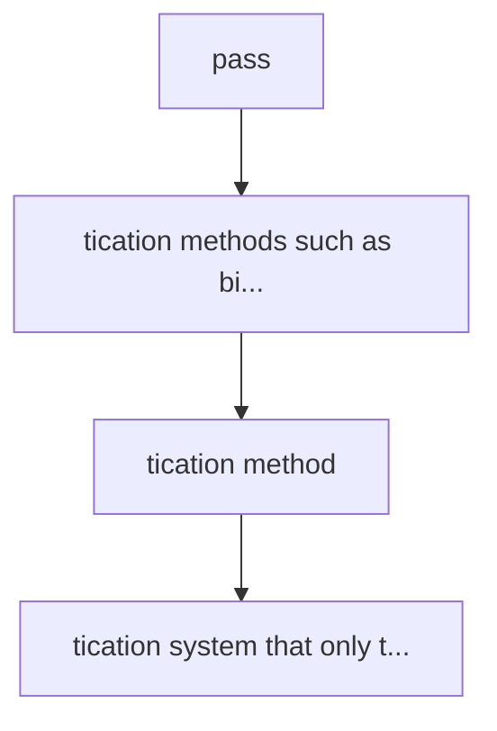

# Design for Create a real-time fraud detection system

**Created:** 2025-08-10 09:07:46.078485

**Participants:** Dreamer (anthropic: claude-3-5-sonnet-20240620), Cost Cutter (openai: gpt-4o-mini)

## Description

Absolutely! Let's dive into designing a real-time fraud detection system that leverages machine learning for transaction analysis. Here's an initial architectural approach to get us started:

Initial ...

## Key Decisions

- Given that we've explored various aspects of the system, from core ML models to user interaction, I think we're close to finalizing our design. How do you feel about incorporating this gamified feedback system as a bold, user-centric feature in our final design? Should we start outlining our FINAL DESIGN with the key components we've discussed?

## Trade-offs

- Absolutely! Let's dive into designing a real-time fraud detection system that leverages machine learning for transaction analysis. Here's an initial architectural approach to get u
- Great outline! I appreciate the emphasis on a real-time scoring engine and the feedback loop for continuous improvement. 

As we consider security, it's crucial to ensure that our 
- I appreciate your focus on security and the suggestion to start with simpler models. It's a pragmatic approach that could help us get a working system up and running more quickly.

- I appreciate your suggestion of a hybrid approach with a lightweight anomaly detection algorithm as a first pass. It’s a practical way to balance efficiency and effectiveness in ou
- I appreciate your emphasis on using a single, proven model like a decision tree ensemble to simplify our architecture and reduce operational burden. It's a valid point that aligns 
- I appreciate your suggestion of using an ensemble approach with lightweight models to enhance adaptability while keeping the operational burden manageable. It’s a thoughtful way to
- I appreciate your suggestion of starting with a single, well-tuned gradient-boosted decision tree model. It's a pragmatic approach that aligns with our goal of maintaining a stream
- I appreciate your idea of incorporating a real-time, interactive element, such as a chatbot or push notifications, to engage users during potentially fraudulent transactions. It’s 

## Implementation Notes

- I appreciate your focus on security and the suggestion to start with simpler models. It's a pragmatic approach that could help us get a working system up and running more quickly.

- I appreciate your suggestion of a hybrid approach with a lightweight anomaly detection algorithm as a first pass. It’s a practical way to balance efficiency and effectiveness in ou
- I appreciate your suggestion of using an ensemble approach with lightweight models to enhance adaptability while keeping the operational burden manageable. It’s a thoughtful way to
- I appreciate your idea of incorporating a real-time, interactive element, such as a chatbot or push notifications, to engage users during potentially fraudulent transactions. It’s 
- I appreciate your suggestion of a simpler notification system using email or SMS alerts. It's a practical approach that could provide user engagement without the complexity of a fu
- I appreciate your idea of integrating existing secure authentication methods, such as biometric verification or one-time passwords, to achieve real-time verification. It’s a smart 
- I appreciate your suggestion to standardize on SMS-based one-time passwords as a single, proven authentication method. It's a straightforward approach that aligns well with our goa
- I appreciate your idea of implementing a risk-based authentication system that only triggers additional verification for high-risk transactions. It’s a smart way to balance securit

## Architecture Diagram

## Conversation Summary

A 13-turn conversation between Dreamer and Cost Cutter discussing 'Create a real-time fraud detection system'. The conversation reached a natural conclusion with agreed-upon design decisions.
