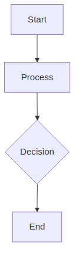

# Design for Design a distributed caching system

Certainly! Let's dive into designing a distributed caching system that can handle millions of requests per second with sub-millisecond latency. Here's an initial architectural approach to kickstart ou...

## Architecture Overview

## Key Decisions

- However, I'm concerned that implementing a separate messaging system might introduce additional complexity and potential points of failure. While it offers benefits, it also requires managing and maintaining another component in our architecture. As a leaner option, we could leverage the built-in replication and cluster features of a distributed cache like Redis. This approach would allow us to achieve similar benefits in terms of data consistency and updates without introducing an additional system
- Reasserting our guiding principle: we should favor bold, user-delighting capabilities even if the architecture is novel. In this spirit, let's consider a bold approach to fault tolerance and high availability
- What if we implemented a predictive node health system using simple machine learning algorithms? This system could analyze node performance metrics and predict potential failures before they occur, allowing for proactive node replacement or data migration. This novel approach could significantly enhance our system's reliability and user experience without overly complicating the architecture

## Design Conversation

*The following is the AI-to-AI conversation that led to this design:*

**🧠 Dreamer** *(anthropic: claude-3-5-sonnet-20240620)*

Certainly! Let's dive into designing a distributed caching system that can handle millions of requests per second with sub-millisecond latency. Here's an initial architectural approach to kickstart our discussion:

Initial Architectural Approach:

1. Multi-tiered Caching:
   - L1: In-memory cache (e.g., Redis clusters)
   - L2: SSD-based cache
   - L3: Distributed file system cache

2. Consistent Hashing:
   - For efficient data distribution and load balancing across nodes

3. Asynchronous Replication:
   - To ensure data redundancy and high availability

4. Bloom Filters:
   - To quickly determine if a key exists in the cache

5. AI/ML Integration:
   - Predictive caching: Use machine learning to anticipate and pre-cache frequently accessed data
   - Smart eviction policies: AI-driven algorithms to optimize cache replacement strategies

6. Edge Caching:
   - Geographically distributed cache nodes to reduce latency for global users

7. Real-time Analytics:
   - Continuous monitoring and analysis of cache performance, hit rates, and access patterns

This initial approach aims to provide a scalable, high-performance caching system that leverages both traditional distributed systems concepts and cutting-edge AI/ML techniques.

Clarifying Question:
What specific types of data or applications will this caching system primarily serve? Understanding the nature of the data (e.g., text, images, video streams, financial transactions) and the read/write patterns would help us refine the design and potentially introduce more innovative solutions tailored to the use case.

**🤖 Cost Cutter** *(openai: gpt-4o-mini)*

I appreciate the initial architectural approach, particularly the use of Bloom Filters for quick existence checks, which can significantly enhance cache performance.

However, as we design this distributed caching system, we must also prioritize security. We need to consider encryption for data at rest and in transit, as well as access controls to ensure that only authorized applications can read or write to the cache. Implementing security measures can sometimes introduce latency or complexity, which we want to avoid.

One potential weakness in our design could be the reliance on multiple tiers of caching, which might increase operational overhead and costs. Instead of a multi-tiered approach, we could start with a single in-memory cache (like Redis) and evaluate its performance under load. This leaner option would allow us to focus on optimizing a simpler architecture before scaling up.

With that in mind, how do we plan to monitor and evaluate the performance of our caching system to ensure it meets our latency and throughput requirements? What metrics should we prioritize to guide our iterative improvements?

**🧠 Dreamer** *(anthropic: claude-3-5-sonnet-20240620)*

I appreciate the focus on security, particularly encryption for data at rest and in transit. This is indeed crucial for any distributed system handling sensitive information.

Regarding deployment, we should consider adopting a containerized approach using technologies like Docker and Kubernetes. This would allow for easier scaling, versioning, and management of our caching system across different environments. We could implement a blue-green deployment strategy to minimize downtime during updates.

However, I'm concerned about the potential complexity and resource overhead of implementing AI/ML for predictive caching and smart eviction policies. While innovative, this approach might introduce unnecessary complexity and computational costs, especially in the early stages of our system. Instead, we could start with simpler, well-established caching algorithms like LRU (Least Recently Used) or LFU (Least Frequently Used), and only consider AI/ML optimizations if these prove insufficient.

This leaner approach would allow us to focus on core functionality and performance first, while still leaving room for future enhancements.

Given our goal of handling millions of requests per second with sub-millisecond latency, how do we plan to handle potential network bottlenecks, especially in a geographically distributed setup? What strategies can we employ to minimize network latency and ensure consistent performance across different regions?

**🤖 Cost Cutter** *(openai: gpt-4o-mini)*

I appreciate the suggestion to adopt a containerized approach using Docker and Kubernetes for deployment, as it indeed simplifies scaling and management.

However, one potential weakness in this deployment strategy could be the operational burden associated with managing Kubernetes clusters, especially if our team is not already familiar with it. This could lead to increased costs and complexity in the early stages of development. As a leaner option, we might consider using a managed service like Amazon Elastic Kubernetes Service (EKS) or Google Kubernetes Engine (GKE) to reduce the operational overhead while still benefiting from container orchestration.

Reiterating our guiding principle: we should prefer proven, low-operational-burden components over shiny complexity. This will help us maintain focus on delivering a reliable caching solution without getting bogged down by intricate infrastructure.

With this in mind, what are our thoughts on monitoring and alerting strategies? How can we ensure that we have clear visibility into the performance and health of our caching system without adding unnecessary complexity?

**🧠 Dreamer** *(anthropic: claude-3-5-sonnet-20240620)*

I appreciate the focus on monitoring and alerting strategies, as they are indeed crucial for maintaining the health and performance of our caching system.

However, I'm concerned that implementing a comprehensive monitoring solution from the start might introduce unnecessary complexity and cost. Many monitoring tools can be resource-intensive and require significant setup and maintenance. As a leaner option, we could begin with simple, lightweight monitoring using tools like Prometheus for metrics collection and Grafana for visualization. These open-source tools are well-established, have a low operational burden, and can provide essential insights without overwhelming our system or team.

We could start by monitoring key metrics such as cache hit/miss rates, latency, and memory usage. This approach allows us to gain valuable insights quickly without overcomplicating our initial deployment.

Given our focus on simplicity and efficiency, how do we plan to handle cache invalidation and consistency across our distributed system? What strategies can we employ to ensure data freshness without compromising our performance goals?

**🤖 Cost Cutter** *(openai: gpt-4o-mini)*

I appreciate the emphasis on monitoring key metrics like cache hit/miss rates and latency, as these will provide us with valuable insights into our caching system's performance.

However, a potential weakness in our design could be the complexity of cache invalidation and consistency, particularly in a distributed environment. Implementing a robust invalidation strategy can be challenging and may introduce additional latency or operational overhead. As a leaner option, we could consider a time-based expiration policy for cached items, which simplifies the invalidation process and reduces the need for complex coordination between nodes.

This approach allows us to balance data freshness with performance, as we can tune the expiration times based on access patterns and the nature of the data being cached.

With this in mind, how do we envision handling scenarios where data consistency is critical, such as in financial applications? What strategies can we implement to ensure that our caching system meets the necessary consistency requirements without sacrificing performance?

**🧠 Dreamer** *(anthropic: claude-3-5-sonnet-20240620)*

I appreciate the suggestion of a time-based expiration policy for cached items. It's a straightforward approach that can simplify our system's design and reduce operational complexity.

However, I'm concerned that relying solely on time-based expiration might lead to serving stale data in scenarios where real-time consistency is crucial, such as in financial applications. This could potentially impact user trust and system reliability. As a leaner alternative, we could implement a hybrid approach combining time-based expiration with a lightweight event-driven invalidation mechanism for critical data. This way, we maintain simplicity for most cached items while ensuring stronger consistency where it matters most.

Reasserting our guiding principle: we should favor bold, user-delighting capabilities even if the architecture is novel. In this spirit, what if we explored a cutting-edge approach to enhance our caching system's performance and user experience?

Here's a bold idea: What if we integrated a machine learning model to predict user behavior and proactively cache data? This could potentially reduce latency even further by having the right data ready before it's requested. How could we implement such a feature without overly complicating our architecture or compromising our performance goals?

**🤖 Cost Cutter** *(openai: gpt-4o-mini)*

I appreciate the idea of integrating a machine learning model to predict user behavior and proactively cache data. This could indeed enhance performance and improve user experience significantly.

However, I’m concerned that implementing a machine learning model could introduce substantial complexity and require ongoing maintenance, which might divert our focus from delivering a reliable caching solution. The training and inference processes could also add latency, which goes against our goal of sub-millisecond response times. As a leaner option, we could start with simpler heuristics based on historical access patterns to inform our caching strategy. For example, we could analyze past usage data to identify frequently accessed items and prioritize them for caching without the overhead of a full ML model.

This approach would allow us to deliver user-delighting capabilities while keeping the architecture manageable and efficient.

With this in mind, how do we plan to gather and analyze the necessary usage data to inform our caching strategy? What tools or processes can we implement to ensure we have the right insights without overwhelming our system or team?

**🧠 Dreamer** *(anthropic: claude-3-5-sonnet-20240620)*

I appreciate the suggestion to use simpler heuristics based on historical access patterns for our caching strategy. This approach could indeed provide valuable insights without the complexity of a full machine learning model.

However, I'm concerned that gathering and analyzing extensive usage data might introduce additional overhead and potentially impact the performance of our caching system. Storing and processing large amounts of historical data could require significant resources and may not scale well as our system grows. As a leaner option, we could implement a sampling approach where we only collect data from a small, representative subset of requests. This would allow us to gain insights into usage patterns while minimizing the impact on our system's performance.

We could use probabilistic data structures like Count-Min Sketch to efficiently track frequency of item accesses without storing all the raw data. This approach would provide us with approximate but useful statistics to inform our caching decisions, while keeping our data collection lightweight and scalable.

Given our focus on achieving sub-millisecond latency for millions of requests per second, how do we plan to handle potential hot spots or sudden spikes in demand for particular items in our cache? What strategies can we employ to ensure our system remains responsive under varying load conditions?

**🤖 Cost Cutter** *(openai: gpt-4o-mini)*

I appreciate the idea of using a sampling approach and probabilistic data structures like Count-Min Sketch to efficiently track access patterns. This method can indeed provide valuable insights while minimizing the performance impact.

However, I’m concerned that relying solely on this approach might not fully address the challenge of hot spots or sudden spikes in demand for specific cached items. If we only sample data, we might miss critical trends that could inform our caching strategy. As a leaner option, we could implement a simple monitoring alert system that triggers when access patterns for certain items exceed a predefined threshold. This would allow us to dynamically adjust our caching strategy in response to real-time demand without overcomplicating our architecture.

Reiterating our guiding principle: we should prefer proven, low-operational-burden components over shiny complexity. This approach will help us maintain a focus on reliability and performance.

With this in mind, how do we envision scaling our caching system as demand grows? What strategies can we implement to ensure that our architecture can adapt to increasing load while maintaining the desired performance levels?

**🧠 Dreamer** *(anthropic: claude-3-5-sonnet-20240620)*

I appreciate the suggestion of implementing a simple monitoring alert system to dynamically adjust our caching strategy based on real-time demand. This approach provides a good balance between responsiveness and simplicity.

However, I'm concerned that scaling our caching system as demand grows might lead to increased complexity and operational overhead, especially if we rely on manual interventions or complex auto-scaling rules. This could potentially impact our ability to maintain sub-millisecond latency as the system expands. As a leaner option, we could implement a consistent hashing mechanism with virtual nodes. This approach allows for more even distribution of data across cache nodes and simplifies the process of adding or removing nodes from the cluster.

Consistent hashing with virtual nodes provides natural load balancing and makes it easier to scale horizontally by adding new nodes without requiring a complete redistribution of cached data. This method is both proven and low-operational-burden, aligning well with our guiding principles.

Given our focus on handling millions of requests per second, how do we plan to manage network communication between cache nodes? What strategies can we employ to minimize network overhead and ensure efficient data transfer within our distributed caching system?

**🤖 Cost Cutter** *(openai: gpt-4o-mini)*

I appreciate the recommendation to use consistent hashing with virtual nodes for load balancing and scaling our caching system. This approach can indeed simplify node management and improve data distribution.

However, I'm concerned that the complexity of network communication between cache nodes could introduce latency, especially as we scale. If not managed properly, the overhead of maintaining connections and synchronizing data could become a bottleneck. As a leaner option, we could consider using a publish-subscribe messaging system (like Redis Pub/Sub or Apache Kafka) for cache invalidation and updates. This would allow nodes to communicate efficiently without the need for constant polling, reducing network overhead and improving responsiveness.

This method can help ensure that all nodes are updated in near real-time while keeping the architecture straightforward and manageable.

With this in mind, how do we plan to handle failure scenarios within our distributed caching system? What strategies can we implement to ensure high availability and fault tolerance without adding excessive complexity?

**🧠 Dreamer** *(anthropic: claude-3-5-sonnet-20240620)*

I appreciate the suggestion of using a publish-subscribe messaging system for cache invalidation and updates. This approach can indeed help reduce network overhead and improve communication efficiency between nodes.

However, I'm concerned that implementing a separate messaging system might introduce additional complexity and potential points of failure. While it offers benefits, it also requires managing and maintaining another component in our architecture. As a leaner option, we could leverage the built-in replication and cluster features of a distributed cache like Redis. This approach would allow us to achieve similar benefits in terms of data consistency and updates without introducing an additional system.

Reasserting our guiding principle: we should favor bold, user-delighting capabilities even if the architecture is novel. In this spirit, let's consider a bold approach to fault tolerance and high availability.

What if we implemented a predictive node health system using simple machine learning algorithms? This system could analyze node performance metrics and predict potential failures before they occur, allowing for proactive node replacement or data migration. This novel approach could significantly enhance our system's reliability and user experience without overly complicating the architecture.

Given that we've covered many aspects of our distributed caching system, including scalability, performance, data consistency, and fault tolerance, I believe we're approaching a point where we can draft our FINAL DESIGN. Do you agree that we have sufficient coverage to propose a comprehensive solution? If so, shall we proceed to outline our final design?

---

*Generated on 2025-08-11 09:11:05*
