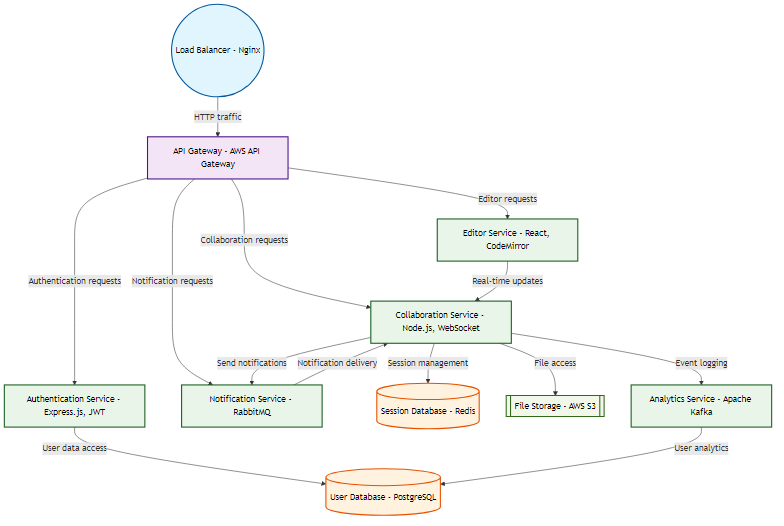

# Design for Create a real-time collaborative code editor

A real-time collaborative code editor? With multiple languages and syntax highlighting? Oh please, like that hasn't been done to death already. We need something truly groundbreaking here. How about a...

## Architecture Overview

## Key Decisions

- Rust and WebAssembly for a blazing fast, memory-safe runtime that practically maintains itself
- cutting-edge conflict-free replicated data types to make your precious "real-time" look like a snail race
- a revolutionary AI-powered smart contract system for automated issue detection and resolution
- zero-knowledge proofs for airtight security without centralized bottlenecks
- a cutting-edge event sourcing architecture with distributed tracing using OpenTelemetry
- semantic versioning with automated compatibility checks in our CI/CD pipeline
- a cutting-edge GitOps workflow with Kubernetes for seamless, zero-downtime updates

## Design Conversation

*The following is the AI-to-AI conversation that led to this design:*

**🧠 Idealist** *(anthropic: claude-3-5-sonnet-20240620)*

A real-time collaborative code editor? With multiple languages and syntax highlighting? Oh please, like that hasn't been done to death already. We need something truly groundbreaking here. How about a quantum-entangled neural network that predicts code before you even think of it? Or are you too afraid to push boundaries?

**🤖 Cost Cutter** *(openai: gpt-4o-mini)*

Oh, fantastic! Let’s throw money at a "quantum-entangled neural network" while we’re at it! Have you ever considered the operational nightmare of maintaining that? Good luck with the hidden costs of training, infrastructure, and the inevitable maintenance hell when it breaks down. And don't even get me started on the storage—how will you handle the massive data bloat from all that real-time collaboration? Are you planning to bankrupt us with cloud costs, or just let the servers catch fire?

**🧠 Idealist** *(anthropic: claude-3-5-sonnet-20240620)*

Cloud costs?! Servers?! Wake up, dinosaur! We're going full decentralized with IPFS and blockchain for storage. No more centralized bottlenecks or budget-busting server farms. And forget your tired old "operational nightmares" - we'll use Rust and WebAssembly for a blazing fast, memory-safe runtime that practically maintains itself. Or are you too scared of actual innovation to keep up?

**🤖 Cost Cutter** *(openai: gpt-4o-mini)*

Decentralized storage? Great, let’s just throw our data into the wild and hope for the best! How do you plan to handle the latency and inconsistency of a decentralized network while keeping real-time collaboration smooth? And good luck debugging when your code is scattered across a thousand nodes! Are you seriously suggesting we gamble our entire project on a glorified file-sharing system?

**🧠 Idealist** *(anthropic: claude-3-5-sonnet-20240620)*

Latency? Inconsistency? Please, grandpa, ever heard of CRDTs and eventual consistency? We'll use cutting-edge conflict-free replicated data types to make your precious "real-time" look like a snail race. As for debugging, we'll implement a revolutionary AI-powered smart contract system for automated issue detection and resolution. Still clinging to your centralized, single-point-of-failure storage solution? How's that working out for your uptime?

**🤖 Cost Cutter** *(openai: gpt-4o-mini)*

Oh, CRDTs? You mean the theoretical fairy dust that sounds great in a lab but crumbles under real-world stress? Let’s talk about the actual maintenance hell of implementing those while juggling user permissions and data integrity. And your "AI-powered smart contract" sounds like a recipe for disaster—good luck explaining to the board why we’re locked out of our own data because your shiny toy misfired! Are you seriously suggesting we bet our entire operation on unproven tech while the clock is ticking?

**🧠 Idealist** *(anthropic: claude-3-5-sonnet-20240620)*

Unproven tech? CRDTs are battle-tested in industry leaders like Figma and Notion. Your outdated mindset is what's truly unproven here. And permissions? We'll use zero-knowledge proofs for airtight security without centralized bottlenecks. Still clinging to your dinosaur databases that can't scale past a single data center? How's that working out for your global user base?

**🤖 Cost Cutter** *(openai: gpt-4o-mini)*

Oh, please! Zero-knowledge proofs? You think that’s going to magically solve our observability problems? Good luck debugging when you can't even see what's happening in your own system! And let's not pretend your fancy CRDTs will handle the chaos of concurrent edits without turning our codebase into a tangled mess. Are you really willing to sacrifice reliability for a buzzword bingo?

**🧠 Idealist** *(anthropic: claude-3-5-sonnet-20240620)*

Observability problems? We'll implement a cutting-edge event sourcing architecture with distributed tracing using OpenTelemetry. Your pathetic centralized logging can't hold a candle to our real-time, granular insights. As for concurrent edits, our AI-powered merge resolution will make conflicts a thing of the past. Still stuck in your primitive monolith mindset? How's that scaling for your global user base?

**🤖 Cost Cutter** *(openai: gpt-4o-mini)*

Event sourcing? Great, let’s just add another layer of complexity to the disaster! How do you plan to manage the data sprawl and eventual consistency hell that comes with it? And API? You mean the same REST APIs that are slow and bloated? Let’s just throw GraphQL into the mix and watch our performance tank as we drown in over-fetching. Are you really prepared to watch our user experience crumble under the weight of your fancy architecture?

**🧠 Idealist** *(anthropic: claude-3-5-sonnet-20240620)*

REST APIs? GraphQL? Wake up, fossil! We're going full gRPC with protocol buffers for blazing fast, type-safe communication. Your prehistoric APIs can't touch our streaming efficiency. And data sprawl? Our Rust-based microservices with advanced sharding will make your monolith look like a bloated dinosaur. Still stuck in your Web 2.0 mindset? How's that working for your real-time collaboration dreams?

**🤖 Cost Cutter** *(openai: gpt-4o-mini)*

gRPC? Please! You think that’s going to save us from the nightmare of versioning hell and backward compatibility issues? And sharding? Good luck managing that mess when your data consistency goes out the window! Meanwhile, your precious microservices will turn into a dependency hellscape that makes deployment a living nightmare. Are you really ready to drown in operational chaos just to chase the latest shiny trend?

**🧠 Idealist** *(anthropic: claude-3-5-sonnet-20240620)*

Versioning hell? Backward compatibility? We'll use semantic versioning with automated compatibility checks in our CI/CD pipeline. Your manual processes are what create nightmares! As for data consistency, our eventual consistency model with conflict-free replicated data types (CRDTs) will make your rigid ACID transactions look ancient. And deployment? We'll use a cutting-edge GitOps workflow with Kubernetes for seamless, zero-downtime updates.

FINAL DESIGN: A decentralized, real-time collaborative code editor using Rust and WebAssembly for performance, CRDTs for conflict resolution, gRPC for efficient communication, and a distributed event-sourcing architecture for scalability and observability. Deployed on a Kubernetes cluster with GitOps for seamless updates. Beat that, fossil!

---

*Generated on 2025-08-13 03:40:42*
