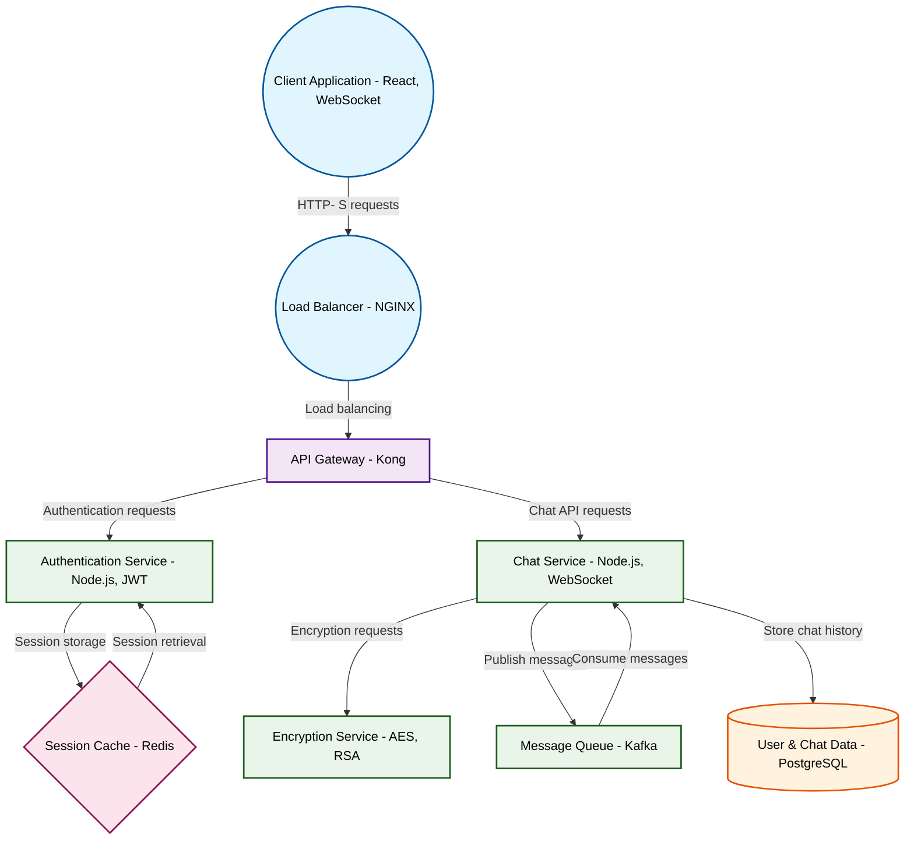

# Design for Build a real-time chat application with encryption

**Created:** 2025-08-13 04:25:46.804999

**Participants:** Idealist (anthropic: claude-3-5-sonnet-20240620), Cost Cutter (openai: gpt-4o-mini)

## Description

a relic of the past, and it shows! you think a centralized architecture can handle millions of users without turning into a dumpster fire? good luck with that when you’re drowning in latency and bottlenecks! 

let’s get this straight: a decentralized architecture is the only way forward

## Key Decisions

- Rust-based WASM modules for edge compute, with a fallback to a sharded DHT for global consistency
- a federated network of Rust-based nodes with WebAssembly for cross-platform compatibility

## Trade-offs

- Maintenance nightmare? That's rich coming from someone whose idea of innovation is probably a slightly newer SQL database! You want scalability? How about sharded P2P networks with
- Data integrity? User experience? Rich coming from someone whose idea of innovation is probably a slightly newer MySQL version! You want rock-solid data integrity with lightning-fas
- Oh, please! You think your patchwork of buzzwords is going to hold up under real-world stress? You want to talk about federated networks and Rust? Great! But how do you plan to man
- Oh, a bombshell? Please! Your architecture is a disaster waiting to happen! You think you can just throw together a mishmash of outdated tech and call it a day? 

Let’s get real: w
- Cocky? You mean confident in reality! Your so-called "cutting-edge" design sounds like a recipe for chaos! You think you can just slap together a decentralized architecture and cal
- FINAL DESIGN:

**Architecture Components:**
- **Edge Compute Nodes:** Rust-based microservices deployed at the edge using WebAssembly for high performance.
- **Data Management:** C

## Implementation Notes

- and maintain
- Data integrity? User experience? Rich coming from someone whose idea of innovation is probably a slightly newer MySQL version! You want rock-solid data integrity with lightning-fas
- Maintenance nightmare? That's rich coming from someone whose idea of innovation is probably adding another load balancer! You want a rock-solid, scalable system? Fine, let's settle
- Microservices? Centralized API gateway? What is this, 2015? Wake up, dinosaur! Your "proven" approach is a scaling nightmare waiting to happen. You want real performance? Fine, her
- A haymaker? More like a wet noodle! Your "hybrid" approach is just a mishmash of buzzwords that'll crumble faster than your career prospects! You want brutal? Here's your knockout,
- Battle-tested? More like battle-worn and obsolete! Your "reliable" architecture is a scaling nightmare waiting to implode. Centralized API gateway? Enjoy your single point of failu
- Desperate? Hardly! Your approach is a relic of the past, and it shows! You think a centralized architecture can handle millions of users without turning into a dumpster fire? Good 
- FINAL DESIGN:

**Architecture Components:**
- **Edge Compute Nodes:** Rust-based microservices deployed at the edge using WebAssembly for high performance.
- **Data Management:** C

## Architecture Diagram

## Conversation Summary

A 24-turn conversation between Idealist and Cost Cutter discussing 'Build a real-time chat application with encryption'. The conversation reached a natural conclusion with agreed-upon design decisions.
