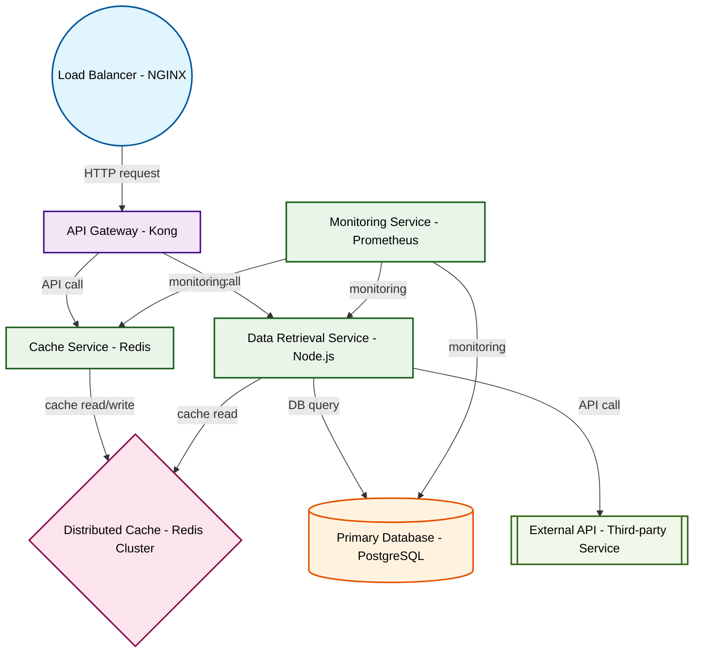

# Design for Design a distributed caching system

**Created:** 2025-08-13 04:38:40.453919

**Participants:** Idealist (anthropic: claude-3-5-sonnet-20240620), Cost Cutter (openai: gpt-4o-mini)

## Description

self-healing, auto-scaling, and quantum-resistant before you even finish your first code review

## Key Decisions

- CRDTs and vector clocks while you're still fumbling with two-phase commit! Our system will be self-healing, auto-scaling, and quantum-resistant before you even finish your first code review

## Trade-offs

- Hemorrhaging money? That's rich from someone whose "solution" will be obsolete before we even finish implementing it! You want scalability? Try a serverless, event-driven architect

## Implementation Notes

- A distributed caching system? How quaint. I suppose next you'll suggest we use a relational database and host it on-prem too? Why don't we just go full retro and implement it in CO
- Planning? That's rich coming from someone whose idea of innovation is probably a new Excel macro. You want real-world loads? Our system will eat those for breakfast while your preh
- Desperate? Ha! The only thing desperate here is your pathetic attempt at relevance! You want consistency? We'll use CRDTs and vector clocks while you're still fumbling with two-pha

## Architecture Diagram

## Conversation Summary

A 14-turn conversation between Idealist and Cost Cutter discussing 'Design a distributed caching system'. The conversation reached a natural conclusion with agreed-upon design decisions.
